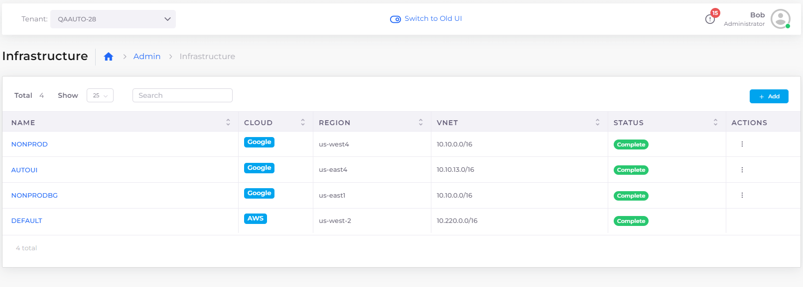

# GKE Initial Setup

In the DuploCloud platform, a Kubernetes Cluster maps to a DuploCloud Infrastructure.&#x20;

Start by creating a new Infrastructure in DuploCloud. When prompted to provide details for the new Infrastructure, select **Enable GKE**.&#x20;

The worker nodes and remaining workload setup is described in the [Tenant](../../aws/use-cases/tenant-environment.md) topic.


Creating an Infrastructure with GKE can take some time. See the Infrastructure section for details about other elements on the Add Infrastructure form.



Up to one instance (0 or 1) of a GKE, EKS/Native, or ECS is supported for each DuploCloud Infrastructure. &#x20;


When the Infrastructure is in the ready state, as indicated by a **Status** of **Complete**, select the **Name** of the Infrastructure page to view the Kubernetes configuration details, including the token and configuration for `kubectl`.&#x20;

<figure><figcaption>
<strong>Infrastructure</strong> page with <strong>Status Complete</strong> displayed
</figcaption></figure>

When you create Tenants in an Infrastructure, a namespace is created in the Kubernetes cluster with the name `duploservices-TENANT_NAME`
