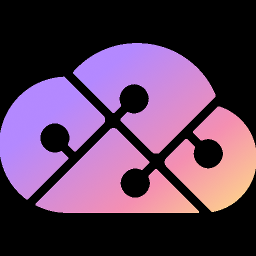
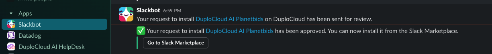

# Slack Bot Installation

## Slack App Setup

Before using the bot, a Slack app must be created and installed to your workspace.

1. Go to [api.slack.com/apps](https://api.slack.com/apps?new_app=1) to create a new app.
2. Click **Create New App** → **From a manifest**.
3. Pick your workspace and select **DuploCloud**.
4. Copy the manifest below into the JSON window, replacing `{customer-name}` with the customer's name, then click **Create**.
5. Scroll down to **Display Information** and update the logo.

   

6. Go to **Collaborators** in the left sidebar and add collaborators.
7. Go to **Install App** and request to install the app to the DuploCloud workspace.
8. In the **Basic Information** tab, scroll to **App-Level Tokens** and click **Generate Token and Scope**.
   - Name the token `slack`
   - Add the scope `connections:write`
   - Click **Generate** and save the app token
9. Return to the **Install App** tab. Once your installation request is approved, install the app and save the bot token.

   

### Slack App Manifest

Replace all instances of `{customer-name}` before creating the app.

```json
{
    "display_information": {
        "name": "DuploAI {customer-name}",
        "description": "AI HelpDesk by DuploCloud for {customer-name}",
        "background_color": "#000000",
        "long_description": "The DuploAI Slack Bot serves as the seamless gateway that brings the power of DuploAI's HelpDesk experience directly into Slack, enabling teams to leverage AI-powered DevOps assistance within their existing communication workflows."
    },
    "features": {
        "bot_user": {
            "display_name": "DuploAI {customer-name}",
            "always_online": true
        },
        "shortcuts": [
            {
                "name": "Ask DuploAI {customer-name}",
                "type": "message",
                "callback_id": "ai_shortcut_invoke",
                "description": "Invokes HelpDesk AI Agent for this message"
            }
        ]
    },
    "oauth_config": {
        "scopes": {
            "bot": [
                "app_mentions:read",
                "assistant:write",
                "channels:history",
                "channels:read",
                "chat:write",
                "commands",
                "groups:history",
                "im:history",
                "users:read",
                "files:write"
            ]
        }
    },
    "settings": {
        "event_subscriptions": {
            "bot_events": [
                "app_mention",
                "message.channels",
                "message.groups",
                "message.im"
            ]
        },
        "org_deploy_enabled": true,
        "socket_mode_enabled": true,
        "token_rotation_enabled": false
    }
}
```

### Backend Helm Installation

Once the Slack app tokens are saved, the remaining configuration is handled during the backend Helm installation. The `SLACK_APP_TOKEN` and `SLACK_BOT_TOKEN` from the steps above, along with the DuploCloud portal URL and token, are passed in as Helm values and stored in a Kubernetes secret named `slack-managed-portals`:

```yaml
slackBackend:
  image:
    tag: <version>
  envFromSecret:
    create: true
    secretName: "slack-managed-portals"
    data:
      SLACK_APP_TOKEN: "<your-slack-app-token>"
      SLACK_BOT_TOKEN: "<your-slack-bot-token>"
      DUPLO_SLACK_APP_PORTALS: |
        - duplo_host: https://your-company.duplocloud.net
          duplo_token: <your-duplocloud-token>
```
