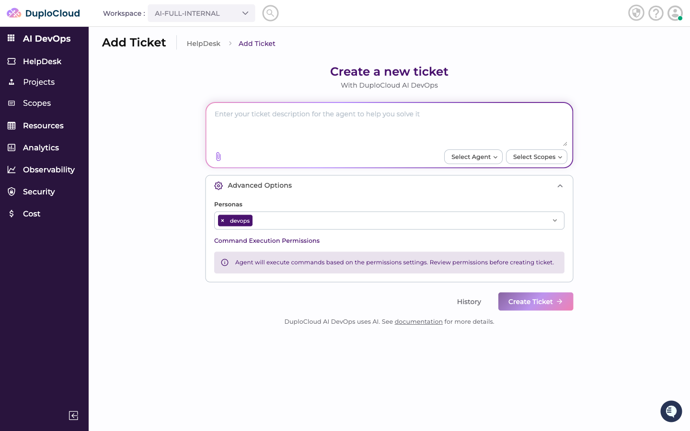
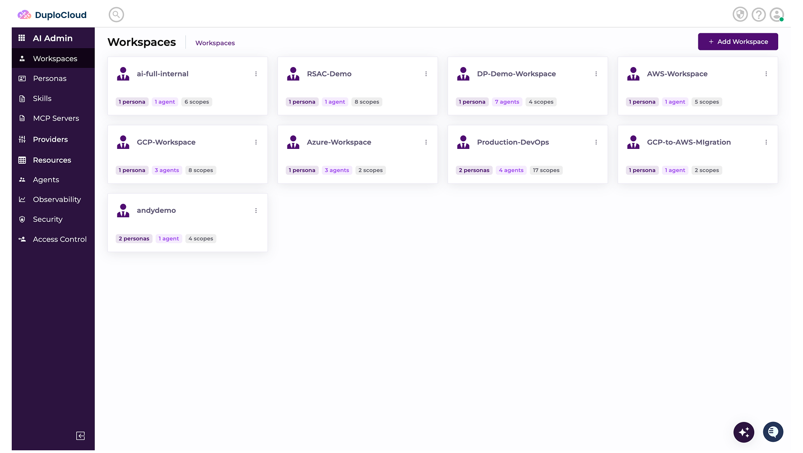
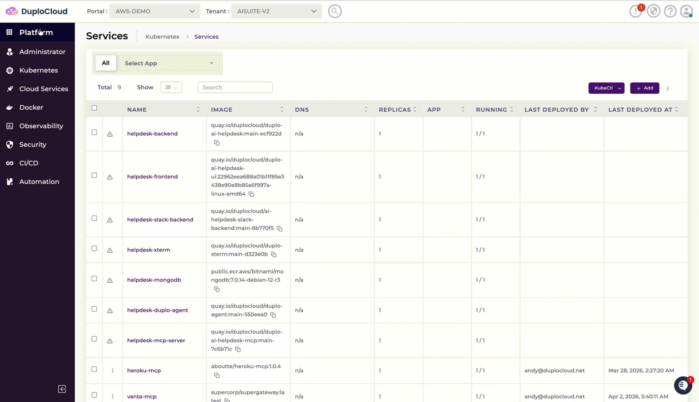

# Helpdesk V1 to V2 Upgrade Guide

Your team is moving from the original DuploCloud AI HelpDesk to something far more powerful. HelpDesk V2 is not just an update — it's a completely new AI DevOps platform that can plan, execute, and manage complex cloud operations autonomously. This guide explains what's new, what changes for your team, and how the upgrade works.

---

## What is HelpDesk V2?

HelpDesk V2 is DuploCloud's next-generation AI platform for DevOps teams. It replaces the original AI Studio and HelpDesk with a unified system built around a richer model of how AI and engineering teams work together.

For a full overview of how the platform is structured, see the [AI DevOps Policy Model](../../introduction/ai-devops-policy-model/README.md).

At its core, V2 introduces:

* **[Workspaces](../../introduction/ai-devops-policy-model/workspaces.md)** — dedicated environments where your team and AI agents collaborate, with fine-grained access controls and separation of responsibilities
* **[Providers](../../introduction/ai-devops-policy-model/providers.md)** — connections to any cloud or tool your team uses (AWS, Azure, GCP, GitHub, Jira, Linear, Slack, and more)
* **[Skills and Personas](../../introduction/ai-devops-policy-model/skills.md)** — reusable AI capabilities that define how agents behave; combine them into Personas tailored to each team or role
* **[Projects](../../introduction/ai-devops-policy-model/projects.md)** — a Spec-Driven DevOps process for large, complex work: the agent turns your requirements into a Spec, then a Plan, then executable Tasks
* **Tickets** — the familiar conversational interface for quick, focused tasks, now backed by a far more capable agent

Everything runs in your own cloud account, fully secure and entirely within your control.

---

## What's New in V2

### Autonomous AI Agent

V1 offered AI assistance for questions and suggestions. V2's agent acts. It reasons through multi-step problems, executes commands, adapts based on results, and works through complex tasks end-to-end — with you in control of every action.

### Projects and Spec-Driven DevOps

For large or complex work, V2 introduces [Projects](../../introduction/ai-devops-policy-model/projects.md). Describe what you want to accomplish in plain language. The agent turns it into a detailed Spec, creates a phased Plan, and breaks it into Tasks that can be executed in parallel. No more managing large initiatives ticket-by-ticket.

### Skills and Personas

[Skills](../../introduction/ai-devops-policy-model/skills.md) are the building blocks of what your AI agent knows how to do — Kubernetes troubleshooting, Terraform provisioning, cost optimization, security scanning, and more. Personas group skills by role (SRE, DevOps, Security) so each workspace gets exactly the right capabilities.

### Multi-Cloud and Multi-Tool Providers

V1 was limited to your DuploCloud-managed cloud account. V2 connects to any cloud account or tool — multiple AWS accounts, Azure, GCP, GitHub repositories, Jira, Linear, Slack, and custom MCP servers — all with scoped, credential-backed access that your team controls.

### Canvas and Shared Terminal

Every ticket opens a Canvas — a live collaborative workspace where you see the agent's reasoning, review suggested commands, and run your own commands in a shared terminal. The agent observes your terminal activity and provides real-time guidance. You stay in control of what gets executed.

### Workspaces

Create multiple [workspaces](../../introduction/ai-devops-policy-model/workspaces.md) for different teams or functions, each with its own provider access and persona. An L1 SRE workspace might have read-only cloud access; a platform engineering workspace might have full provisioning rights. Access is scoped at the workspace level.

To get you started, DuploCloud sets up a default **DevOps workspace** with read-only access to your cloud account and Kubernetes cluster — so your team can explore and query resources from day one.

### Reports and Artifacts

V2 agents can produce reports, generate scripts and configuration files, and save artifacts directly in the ticket's secure workspace — available for review and editing before anything is applied.

---

## What Changes

The upgrade is focused on the AI layer. Here's what stays the same and what changes for your team:

**What stays the same:**

* The **DuploCloud Core Automation Platform** you use today — your tenants, services, infrastructure, and configurations — remains completely unchanged
* Any **Add-Ons** you have enabled, such as the Advanced Observability Suite or SIEM, continue to work exactly as before

**What changes:**

* The current **AI Suite** (AI Studio and AI HelpDesk) is replaced by **HelpDesk V2** — a significantly more capable platform
* After the upgrade, your DuploCloud portal will include a **platform switcher** at the top of the interface, letting your team move between the Core Automation Platform and the new HelpDesk V2

---

## Upgrade Overview

DuploCloud handles the upgrade end-to-end:

* **Decommission V1** — remove the legacy AI Studio and HelpDesk to make way for V2
* **Update the portal** — add the platform switcher so your team can access both platforms from one login
* **Deploy HelpDesk V2** — install the new platform alongside your existing DuploCloud environment
* **Set up your environment** — configure workspaces, connect your providers, and load the first set of skills and personas so your team is ready to work on day one
* Your team gets access to the new platform and our support engineers are available anytime to answer questions, run a walkthrough, or help set up custom workflows

---

## You're in Good Hands

The upgrade is designed to be smooth and low-risk, with DuploCloud managing every step. HelpDesk V2 is already running in many customer environments — we know exactly what a clean upgrade looks like.

* **Your data stays in your account** — all tickets, configurations, and agent outputs remain in your own cloud environment
* **Grows with your team** — after go-live, we can add more providers, build custom skills, or configure additional workspaces as your use cases expand

To schedule your upgrade, reach out to your DuploCloud account team.
