# Connecting Linear to DuploCloud via MCP

This guide walks through connecting Linear to DuploCloud by registering the Linear MCP server, adding a provider, configuring credentials with your Linear API key, creating a scope, and querying Linear data through the AI agent.

---

## Step 1 — Generate a Linear API Key

In Linear, open the workspace menu (top-left) and click **Settings**.

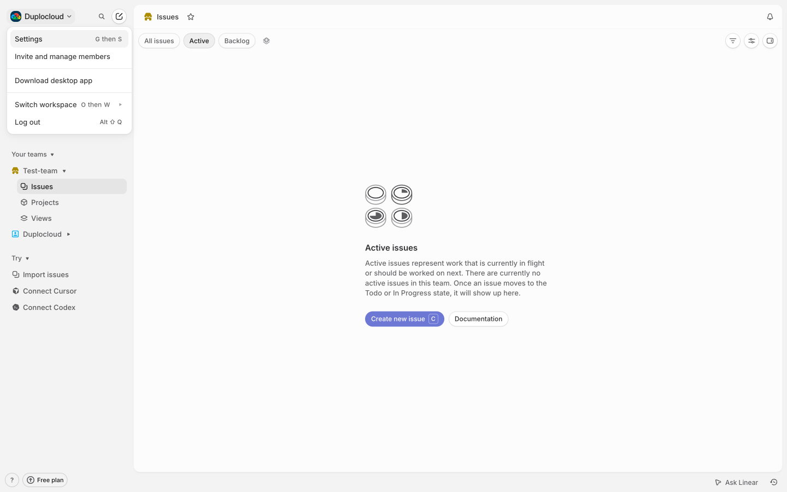

Navigate to **Security & access** in the left sidebar. Scroll down to the **Personal API keys** section and click **New API key**. Give it a name, click **Create**, and copy the generated key — it is only shown once.

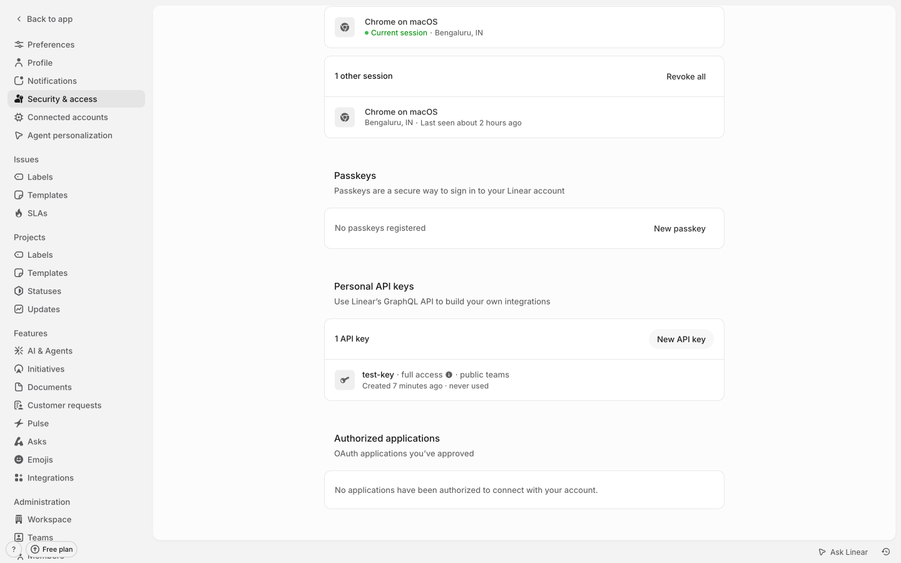

---

## Step 2 — Register the Linear MCP Server

In DuploCloud, go to **AI Admin** → **MCP Servers** and click **+ Add Server**.

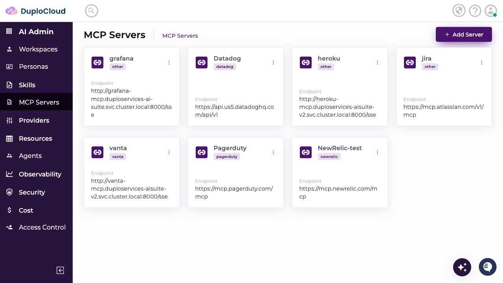

Fill in the MCP server details:

- **Name** — e.g. `Linear`
- **Provider Type** — select **Other**, then type `other` in the **Specify Provider Type** field
- **API Endpoint** — `https://mcp.linear.app/mcp`

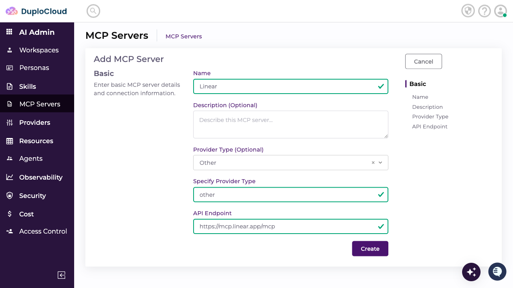

Click **Create**.

---

## Step 3 — Add a Linear Provider

Go to **AI Admin** → **Providers** → **IT** and click the **Other** tab.

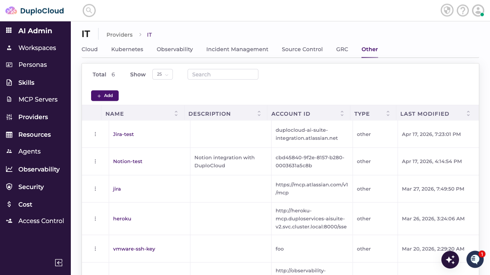

Click **+ Add** and fill in:

- **Name** — e.g. `Linear`
- **Type** — select **Other**
- **Account ID** — any identifying label; Linear does not require a specific account ID so this field can be set to any value

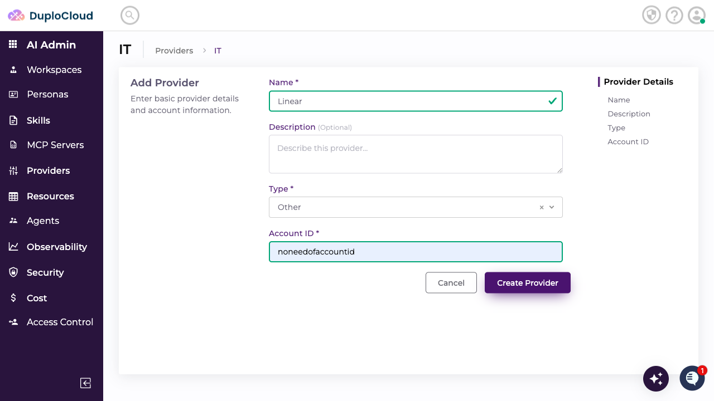

Click **Create Provider**.

---

## Step 4 — Add Credentials

The new provider opens on the **Credentials** tab. Click **+ Add** and fill in:

- **Name** — e.g. `Linear-credentials`
- **Key** — `LINEAR_API_KEY` (this is the only accepted key name for Linear credentials)
- **Value** — paste the API key copied from Linear in Step 1
- **Sensitive** — toggle on to store the key securely

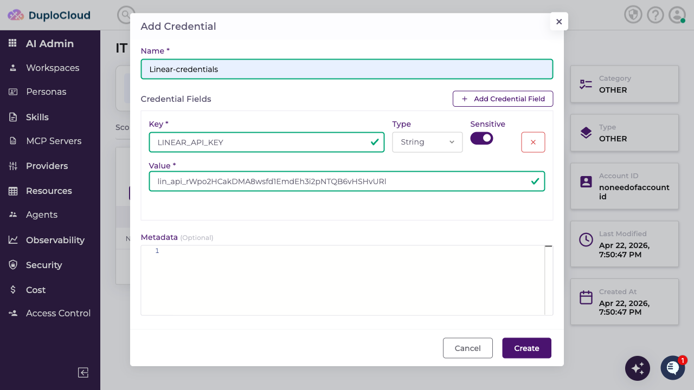

Click **Create**.

---

## Step 5 — Add a Scope

Switch to the **Scope** tab and click **+ Add**. Fill in:

- **Name** — e.g. `Linear-Test-MCP`
- **Credential** — select the credential created in Step 4
- **MCP Server** — select the Linear MCP server registered in Step 2
- **Resource Map** — add two keys:
  - `Authorization` → your Linear API key value (note: the key name is case-sensitive — use `Authorization` exactly as written)
  - `type` → `http`

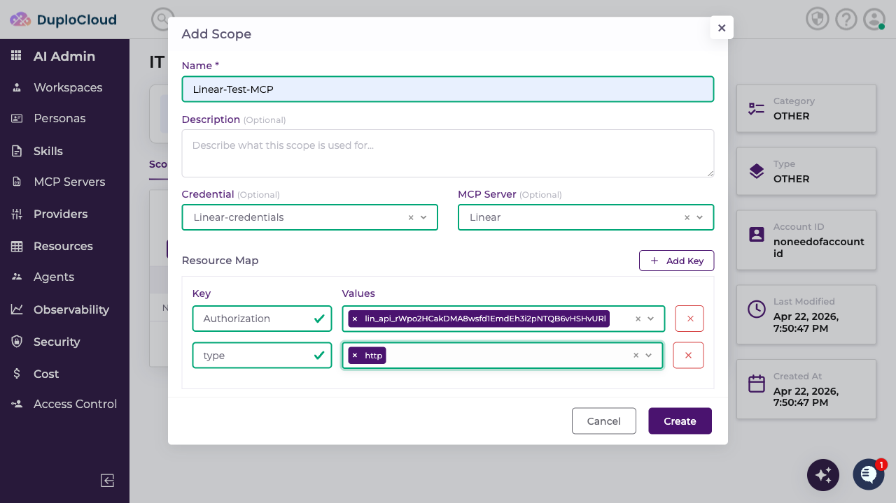

Click **Create**.

---

## Step 6 — Use Linear in a Ticket

Go to **AI DevOps** → **HelpDesk** → **Add Ticket**. Select **generic-agent** and choose your Linear scope from the scope dropdown.

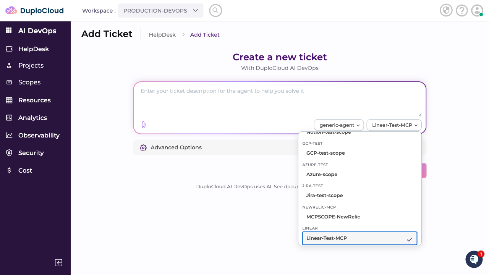

Enter your request — for example, asking the agent to list your issues.

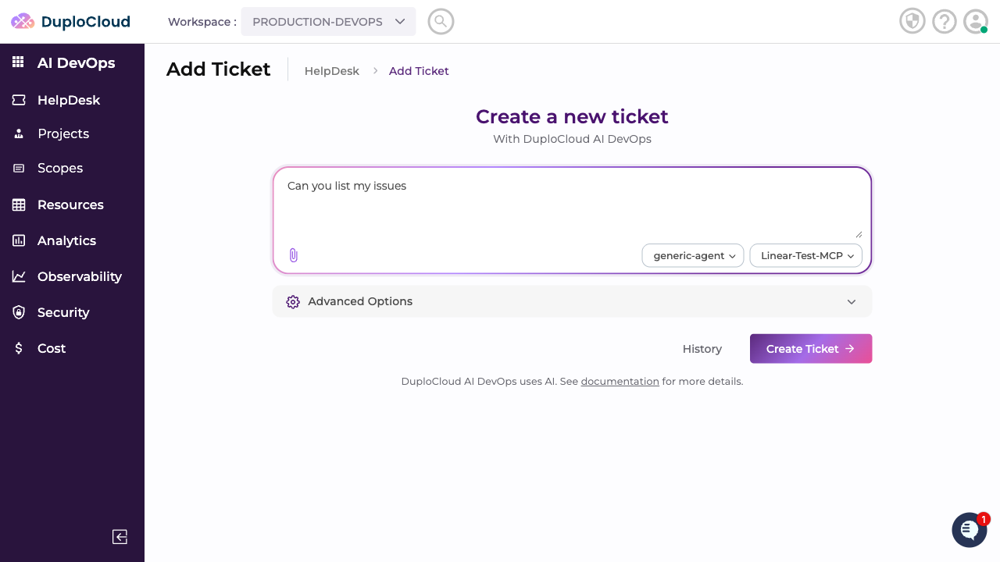

Click **Create Ticket**. The agent connects to Linear via the MCP server and returns the results.

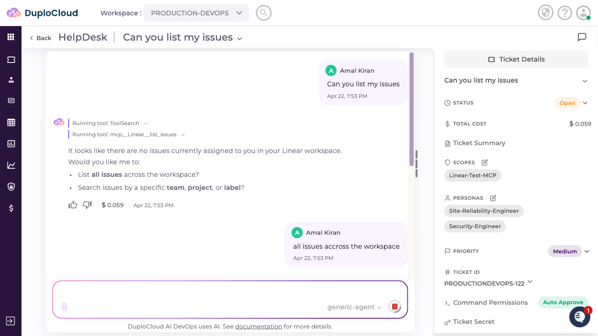

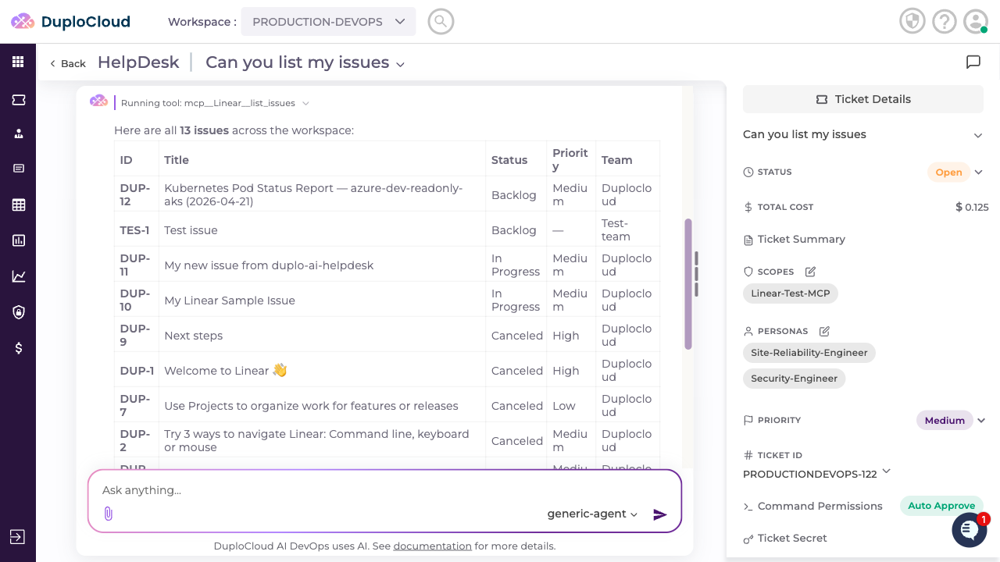
