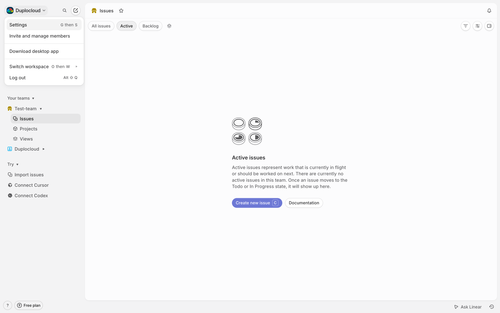
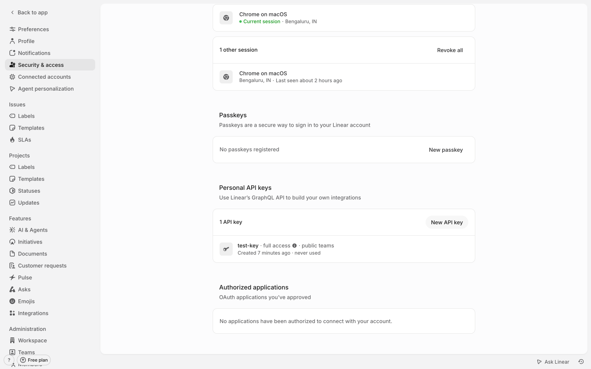
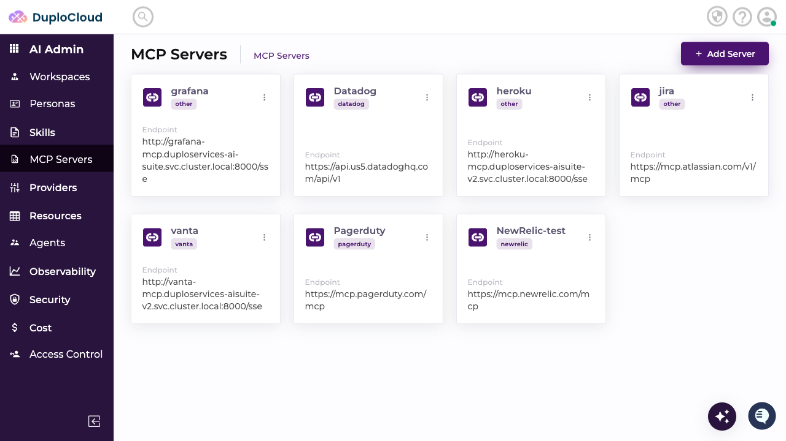
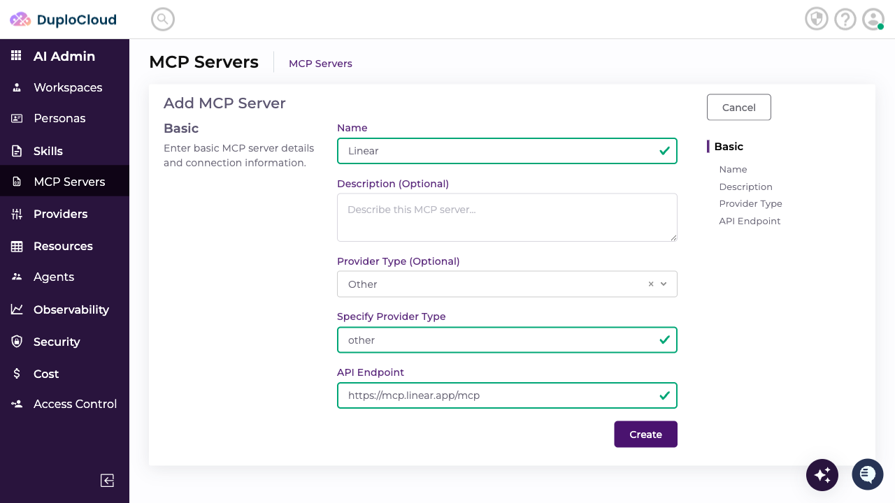
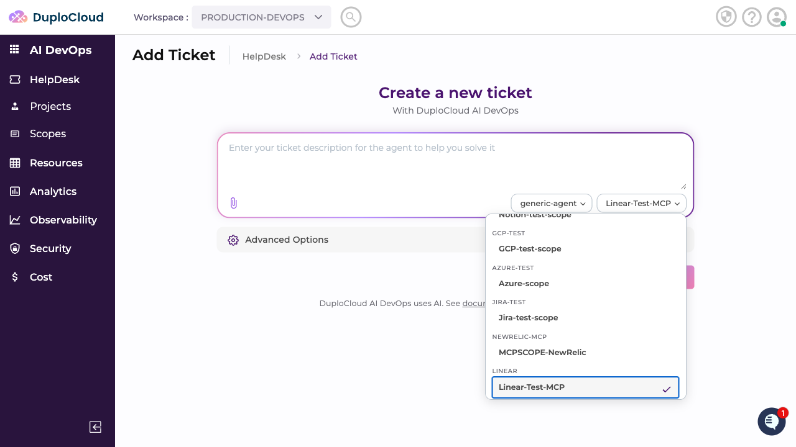
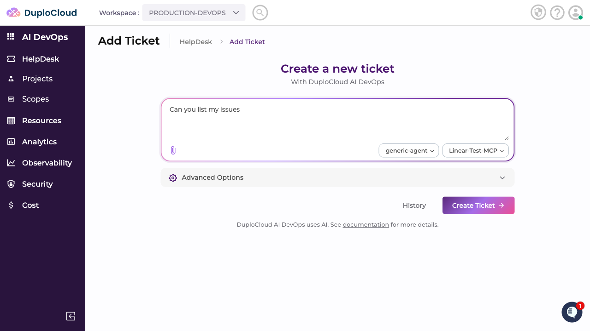

# Linear

This guide walks through connecting Linear to DuploCloud — registering the Linear MCP server, creating a provider with your Linear API key, and querying Linear data through the AI agent.

It covers the Linear-specific values you need. For the general mechanics of MCP servers, providers, credentials and scopes, see [MCP Servers](../../armor/mcp-servers/README.md).

***

## Step 1 — Generate a Linear API Key

In Linear, open the workspace menu (top-left) and click **Settings**.

Navigate to **Security & access** in the left sidebar. Scroll down to the **Personal API keys** section and click **New API key**. Give it a name, click **Create**, and copy the generated key — it is only shown once.

***

## Step 2 — Register the Linear MCP Server

In DuploCloud, go to **AI Admin → MCP Servers** and click **+ Add MCP Server**.

Fill in the **Basic** section:

* **Name** — e.g. `Linear`
* **Provider Type** — select **Other**
* **Config Type** — **HTTP/SSE**
* **API Endpoint** — `https://mcp.linear.app/mcp`
* **Transport** — `http`

Click **Create**. (The **Metadata** section is optional — see [Registering an MCP server](../../armor/mcp-servers/README.md#stage-1-register-the-mcp-server).)

***

## Step 3 — Create the Provider, Credential and Scope

Go to **AI Admin → Providers**, select the **Other** tab, and click **+ Add Provider**. The page walks through three sections in order — Provider Details, Credentials, and Scope — described in full under [Create the Provider, credential, and Scope](../../armor/mcp-servers/README.md#stage-2-create-the-provider-credential-and-scope).

Use these values for Linear:

**Provider Details**

* **Name** — e.g. `Linear`
* **Type** — **Other**
* **Account ID** — any identifying label; Linear does not require a specific account ID

**Credentials**

* **Name** — e.g. `Linear-credentials`
* **Key** — `LINEAR_API_KEY` (the only accepted key name for Linear credentials)
* **Value** — the API key copied from Linear in Step 1

**Scope**

* **Name** — e.g. `Linear-Test-MCP`
* **MCP Server** — the Linear server registered in Step 2
* **Resource Map** — add two keys:
  * `Authorization` → your Linear API key value. The key name is case-sensitive; use `Authorization` exactly as written
  * `type` → `http`

The credential created in the previous section is carried forward automatically. Click **Create**, then choose which workspaces the scope should be available to.

***

## Step 4 — Use Linear in a Ticket

Go to **AI DevOps → HelpDesk → Add Ticket** and select your Linear scope from **Select Scopes**.

Describe what you want — for example, asking the agent to list your issues.

Submit the ticket. The agent connects to Linear through the MCP server and returns the results, calling tools named `mcp__Linear__<tool>` using the credentials bound to the scope.


By default the agent asks before running any MCP tool. To let Linear's tools run without prompting on a given ticket, set that under **MCP Tool Permissions** in the ticket's Details panel — see [Controlling which tools the agent may call](../../armor/mcp-servers/README.md#controlling-which-tools-the-agent-may-call).

