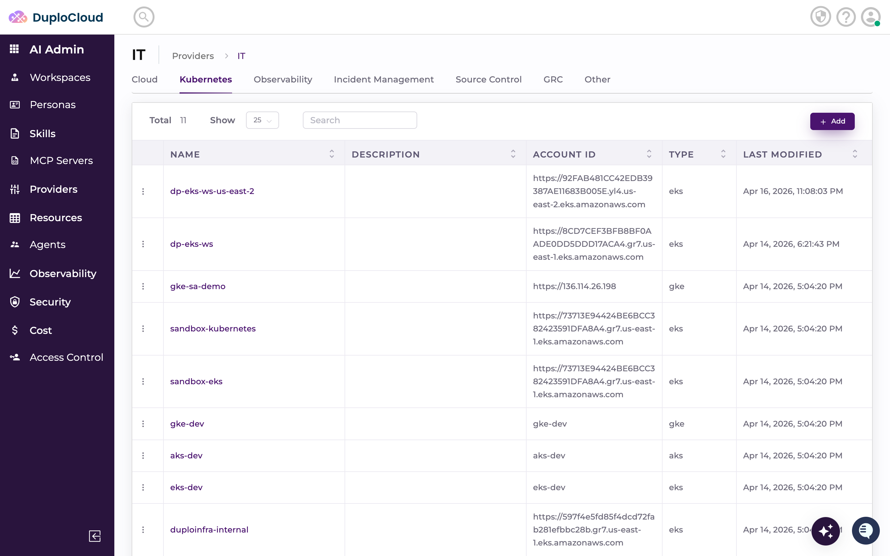
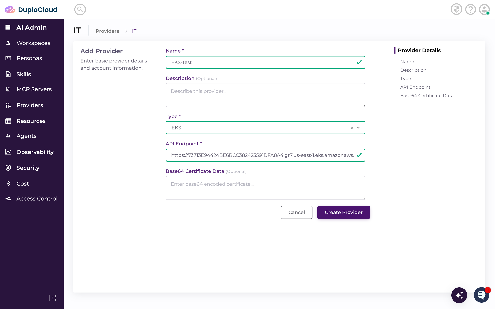
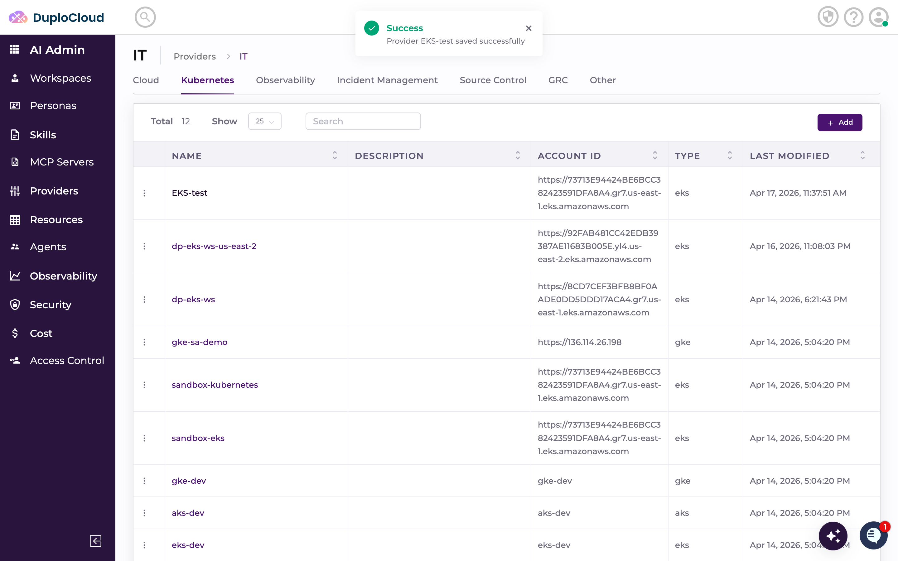
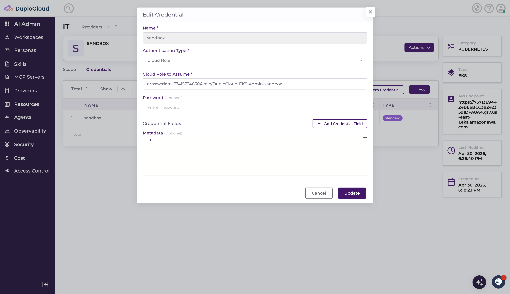
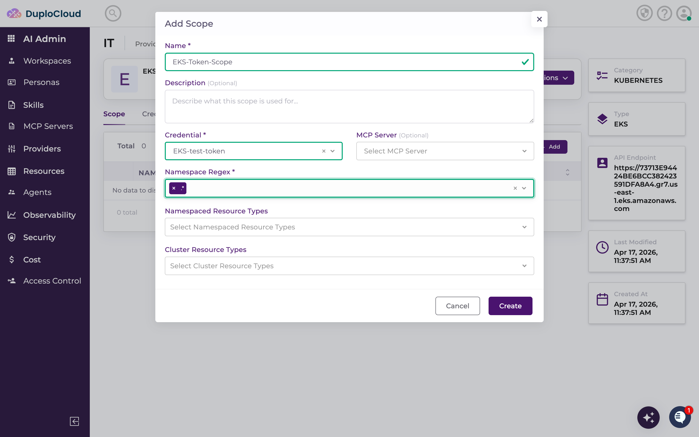
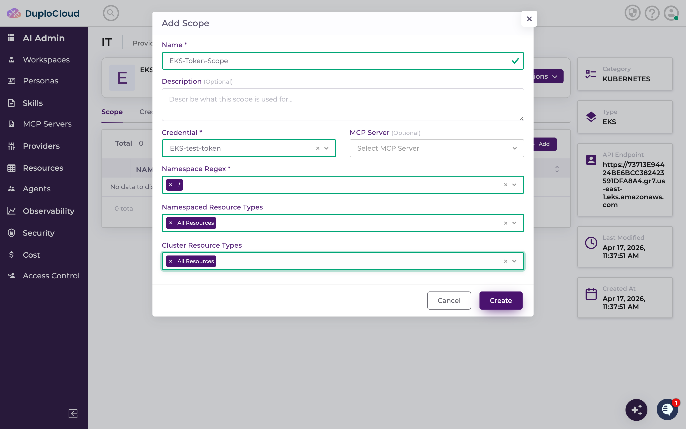
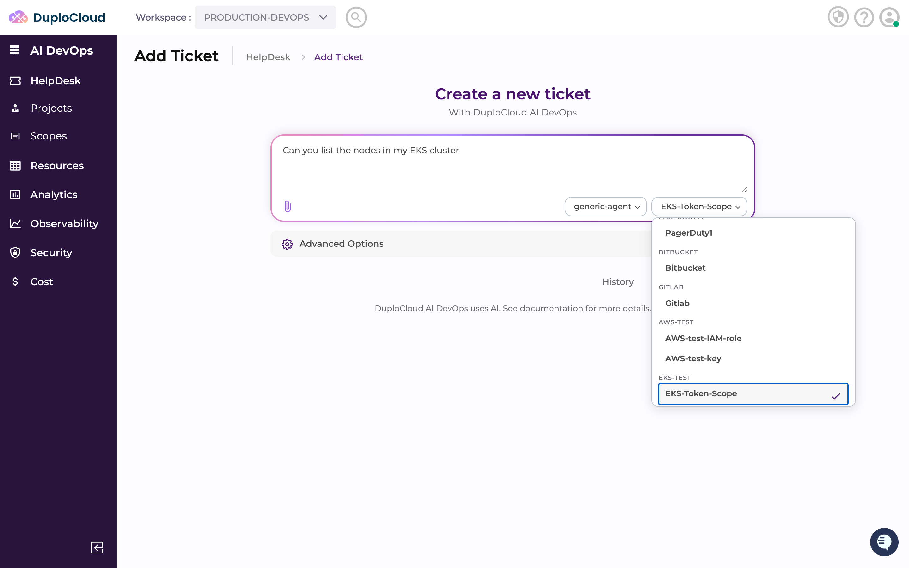
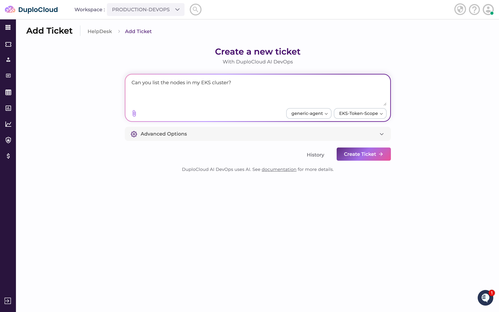
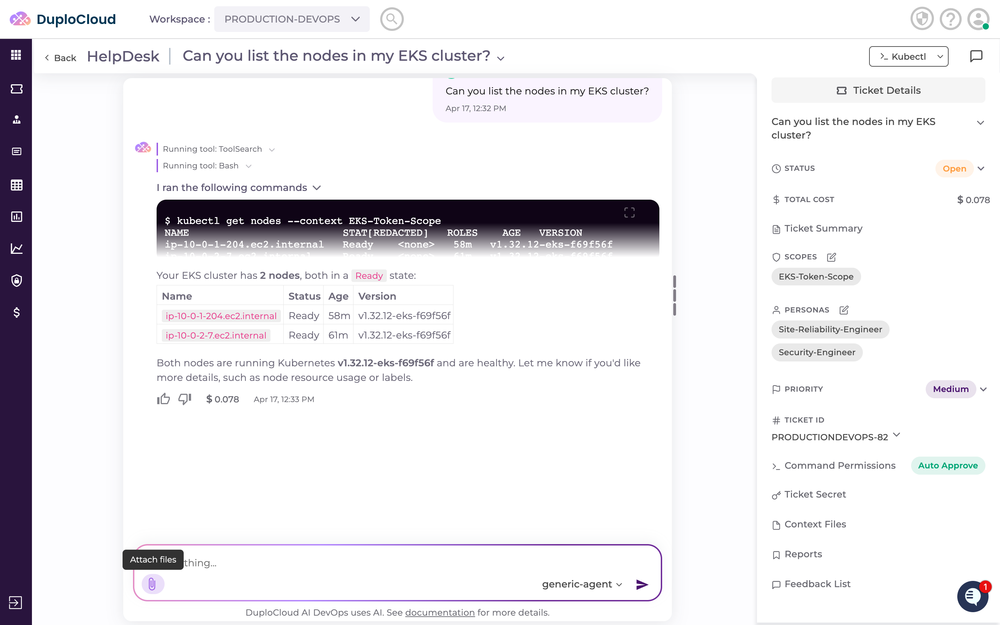
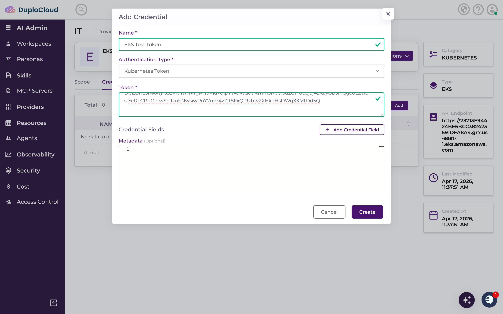

# Amazon Elastic Kubernetes Service (EKS)

The EKS provider lets DuploCloud AI agents interact with your Amazon EKS clusters — querying pods, nodes, deployments, and other Kubernetes resources. There are two ways to authenticate: using an **IAM Role** (recommended) or a **Kubernetes Service Account Token**.

> Use this [CloudFormation Template](https://us-west-2.console.aws.amazon.com/cloudformation/home?region=us-west-2#/stacks/create/review?templateURL=https://duploservices-ai-access-227120241369.s3.us-west-2.amazonaws.com/aws.yaml) to easily create the EKS credentials you can use to connect with DuploCloud. You can also [Download the CloudFormation Template](https://duploservices-ai-access-227120241369.s3.us-west-2.amazonaws.com/aws.yaml) for review. For more information, refer to [this public git repo](https://github.com/duplocloud/duplocloud-helpdesk-access).

***

## Setting Up EKS Access with CloudFormation (Recommended)

The easiest way to set up EKS access is the **DuploCloud Access CloudFormation template** — it takes 2–3 minutes and outputs an IAM Role ARN you can use directly. No manual service account or RBAC setup required.

> [Launch CloudFormation Stack](https://us-west-2.console.aws.amazon.com/cloudformation/home?region=us-west-2#/stacks/create/review?templateURL=https://duploservices-ai-access-227120241369.s3.us-west-2.amazonaws.com/aws.yaml) | [Download Template](https://duploservices-ai-access-227120241369.s3.us-west-2.amazonaws.com/aws.yaml) | [GitHub Repo](https://github.com/duplocloud/duplocloud-helpdesk-access)

**What it creates** — four IAM roles, each independently enabled or disabled:

| Role | Policy | Default |
|---|---|---|
| `DuploCloud-AWS-Admin` | `AdministratorAccess` | Off |
| `DuploCloud-AWS-ReadOnly` | `ReadOnlyAccess` | **On** |
| `DuploCloud-EKS-Admin-<ClusterName>` | `AmazonEKSClusterAdminPolicy` (via EKS Access Entry) | Off |
| `DuploCloud-EKS-ReadOnly-<ClusterName>` | `AmazonEKSViewPolicy` (via EKS Access Entry) | **On** |

**Parameters:**

| Parameter | Default | Description |
|---|---|---|
| `EnableAWSAdmin` | `false` | Creates `DuploCloud-AWS-Admin` with `AdministratorAccess` |
| `EnableAWSReadOnly` | `true` | Creates `DuploCloud-AWS-ReadOnly` with `ReadOnlyAccess` |
| `EnableEKSAdmin` | `false` | Creates `DuploCloud-EKS-Admin-<ClusterName>` with cluster admin access |
| `EnableEKSReadOnly` | `true` | Creates `DuploCloud-EKS-ReadOnly-<ClusterName>` with read-only cluster access |
| `EKSClusterName` | *(empty)* | Required if either EKS role is enabled — must match the exact cluster name |
| `HelpdeskAccountId` | *(empty)* | The AWS account ID where HelpDesk is deployed. Sets the IAM trust policy so HelpDesk can assume the created roles. Leave empty for same-account access only. |

Once the stack shows `CREATE_COMPLETE`, copy the EKS Role ARN(s) from the **Outputs** tab and use them as IAM Role credentials in the steps below.

> **Revoking access:** Delete the CloudFormation stack to remove all created roles and trust policies.

***

## Method 1 — IAM Role (Recommended)

### Step 1 — Navigate to Kubernetes Providers

Go to **AI Admin** → **Providers** → **IT**, then click the **Kubernetes** tab.



***

### Step 2 — Add an EKS Provider

Click **+ Add** and fill in the provider details:

* **Name** — a label for this cluster in DuploCloud
* **Type** — select **EKS**
* **API Endpoint** — your cluster's API endpoint URL
* **Base64 Certificate Data** — optional; paste the cluster CA certificate if your cluster requires it

To get the endpoint:

```bash
aws eks describe-cluster --name <your-cluster-name> \
  --query "cluster.endpoint" --output text
```

This returns a URL in the form `https://<id>.gr7.<region>.eks.amazonaws.com`.



Click **Create Provider**.



***

### Step 3 — Add an IAM Role Credential

The new provider opens on the **Credentials** tab. Click **+ Add** and fill in:

* **Name** — a name for this credential
* **Authentication Type** — select **IAM Role**
* **IAM Role ARN** — paste the EKS Role ARN from the CloudFormation Outputs tab (e.g. `arn:aws:iam::<account-id>:role/DuploCloud-EKS-ReadOnly-<ClusterName>`)



Click **Create**.

***

### Step 4 — Add a Scope

Switch to the **Scope** tab and click **+ Add**. Fill in:

* **Name** — a label for this scope
* **Credential** — select the IAM Role credential you just created
* **Namespace Regex** — use `*` to cover all namespaces, or restrict to a pattern (e.g. `production-.*`)
* **Namespaced Resource Types** — select **All Resources** to allow the agent to query any namespaced resource
* **Cluster Resource Types** — select **All Resources** to allow cluster-level queries (nodes, persistent volumes, etc.)





Click **Create**.

***

### Step 5 — Use EKS in a Ticket

Go to **AI DevOps** → **HelpDesk** → **Add Ticket**. Select **generic-agent** as the agent and choose your EKS scope from the scope dropdown.



Enter your request — for example, asking the agent to list nodes or check pod health.



Click **Create Ticket**. The agent connects to your EKS cluster using the IAM Role and returns the results.



***

## Method 2 — Kubernetes Service Account Token

If you prefer not to use IAM roles, you can authenticate using a static service account token generated directly in your cluster.

### Prerequisites — Generate a Service Account Token in EKS

Before configuring DuploCloud, create a dedicated service account in your EKS cluster with the permissions the AI agent needs.

#### 1. Create the service account and RBAC resources

Save the following as `duplocloud-agent-rbac.yaml` and apply it to your cluster:

```yaml
apiVersion: v1
kind: ServiceAccount
metadata:
  name: duplocloud-agent
  namespace: kube-system
---
apiVersion: rbac.authorization.k8s.io/v1
kind: ClusterRole
metadata:
  name: duplocloud-agent-role
rules:
  - apiGroups: [""]
    resources:
      - nodes
      - pods
      - services
      - endpoints
      - namespaces
      - persistentvolumes
      - persistentvolumeclaims
      - events
      - configmaps
    verbs: ["get", "list", "watch"]
  - apiGroups: ["apps"]
    resources:
      - deployments
      - daemonsets
      - statefulsets
      - replicasets
    verbs: ["get", "list", "watch"]
  - apiGroups: ["batch"]
    resources: ["jobs", "cronjobs"]
    verbs: ["get", "list", "watch"]
  - apiGroups: ["metrics.k8s.io"]
    resources: ["nodes", "pods"]
    verbs: ["get", "list"]
---
apiVersion: rbac.authorization.k8s.io/v1
kind: ClusterRoleBinding
metadata:
  name: duplocloud-agent-binding
roleRef:
  apiGroup: rbac.authorization.k8s.io
  kind: ClusterRole
  name: duplocloud-agent-role
subjects:
  - kind: ServiceAccount
    name: duplocloud-agent
    namespace: kube-system
```

```bash
kubectl apply -f duplocloud-agent-rbac.yaml
```

#### 2. Create a long-lived token secret (Kubernetes 1.24+)

```bash
kubectl apply -f - <<EOF
apiVersion: v1
kind: Secret
metadata:
  name: duplocloud-agent-token
  namespace: kube-system
  annotations:
    kubernetes.io/service-account.name: duplocloud-agent
type: kubernetes.io/service-account-token
EOF
```

#### 3. Extract the token

```bash
kubectl get secret duplocloud-agent-token -n kube-system \
  -o jsonpath='{.data.token}' | base64 --decode
```

Copy the output — you will paste it into DuploCloud in Step 3 below.

#### 4. Get the cluster API endpoint

```bash
aws eks describe-cluster --name <your-cluster-name> \
  --query "cluster.endpoint" --output text
```

This returns a URL in the form `https://<id>.gr7.<region>.eks.amazonaws.com`. You will need this in Step 2.

***

### Step 1 — Navigate to Kubernetes Providers

Go to **AI Admin** → **Providers** → **IT**, then click the **Kubernetes** tab.


***

### Step 2 — Add an EKS Provider

Click **+ Add** and fill in the provider details:

* **Name** — a label for this cluster in DuploCloud
* **Type** — select **EKS**
* **API Endpoint** — the cluster endpoint URL from the prerequisite step above
* **Base64 Certificate Data** — optional; paste the cluster CA certificate if your cluster requires it


Click **Create Provider**.


***

### Step 3 — Add a Kubernetes Token Credential

The new provider opens on the **Credentials** tab. Click **+ Add** and fill in:

* **Name** — a name for this credential
* **Authentication Type** — select **Kubernetes Token**
* **Token** — paste the service account token extracted in the prerequisite step



Click **Create**.

***

### Step 4 — Add a Scope

Switch to the **Scope** tab and click **+ Add**. Fill in:

* **Name** — a label for this scope
* **Credential** — select the token credential you just created
* **Namespace Regex** — use `*` to cover all namespaces, or restrict to a pattern (e.g. `production-.*`)
* **Namespaced Resource Types** — select **All Resources** to allow the agent to query any namespaced resource
* **Cluster Resource Types** — select **All Resources** to allow cluster-level queries (nodes, persistent volumes, etc.)


Click **Create**.

***

### Step 5 — Use EKS in a Ticket

Go to **AI DevOps** → **HelpDesk** → **Add Ticket**. Select **generic-agent** as the agent and choose your EKS scope from the scope dropdown.


Enter your request — for example, asking the agent to list nodes or check pod health.


Click **Create Ticket**. The agent connects to your EKS cluster using the token credential and returns the results.


