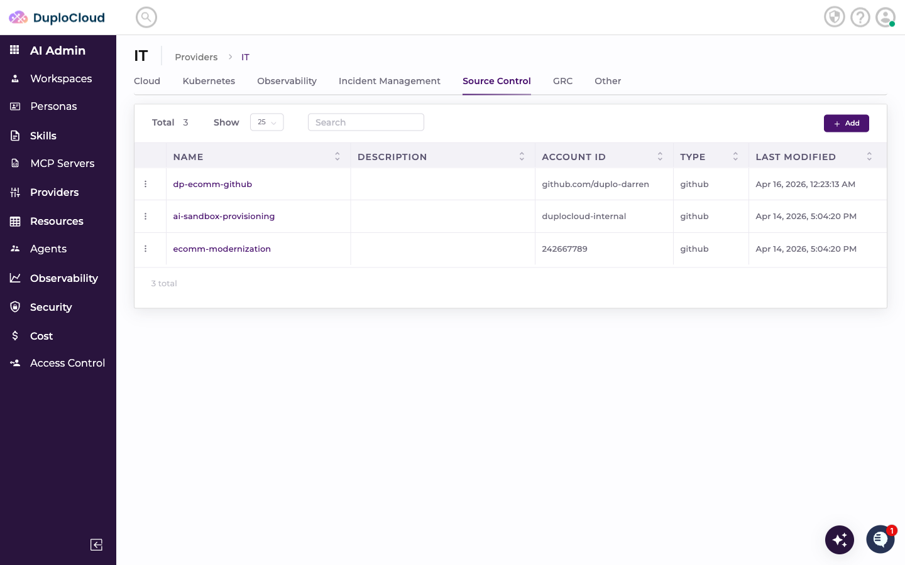
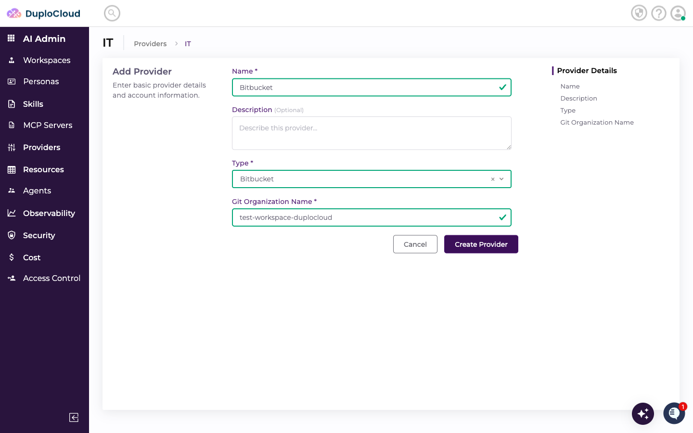
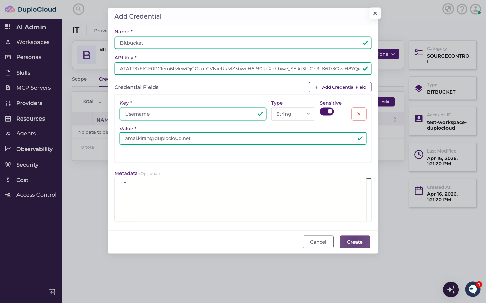
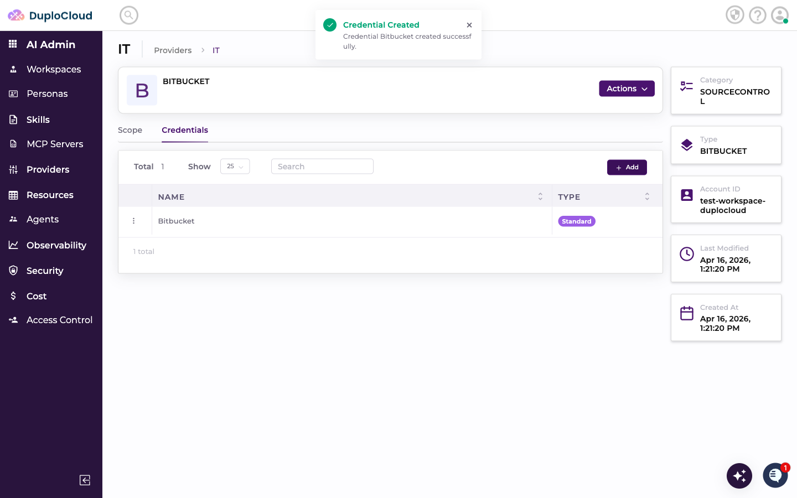
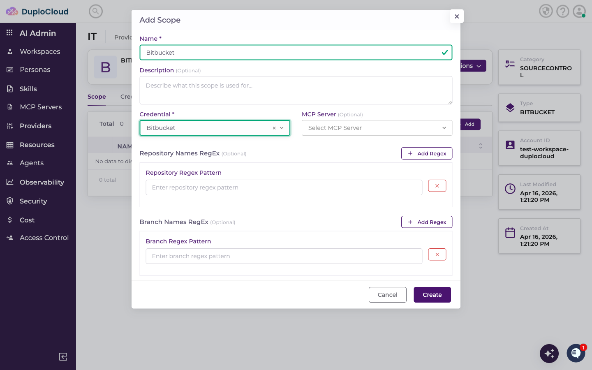
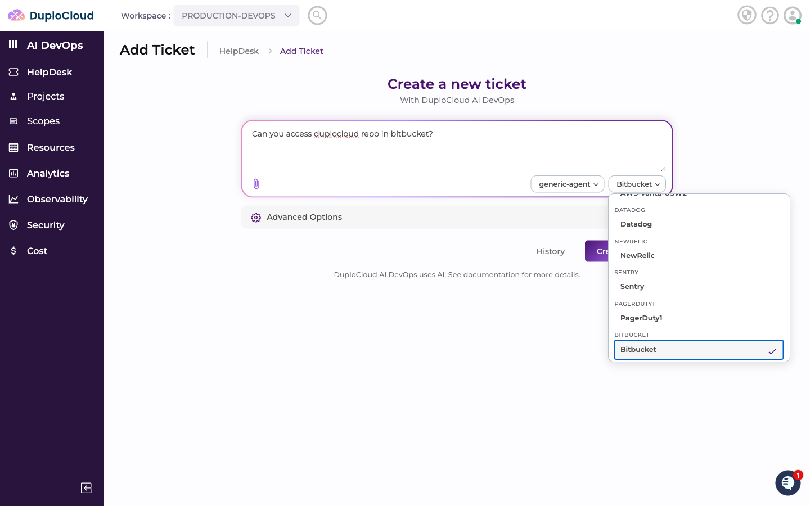
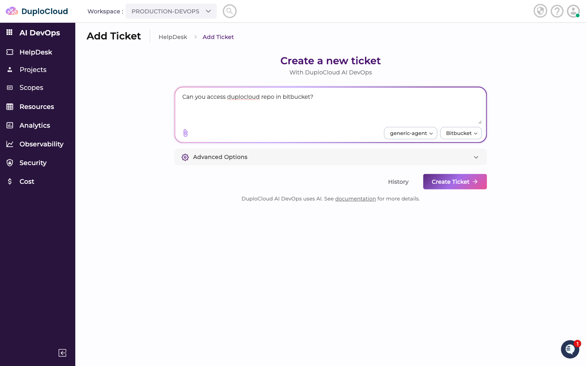
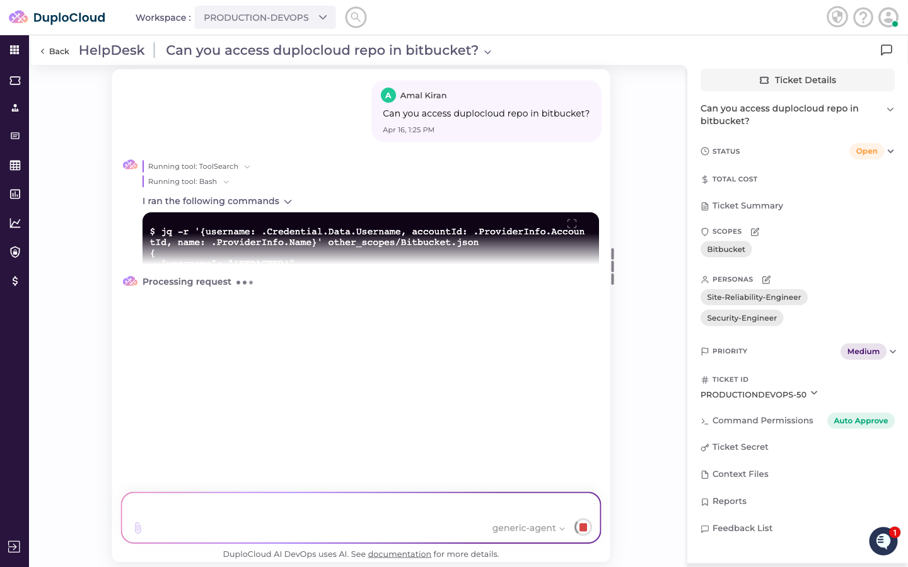
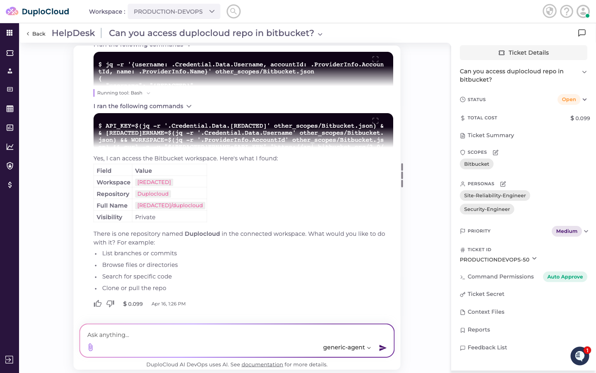

# Connecting Bitbucket to DuploCloud

This guide walks through adding Bitbucket as a Source Control provider in DuploCloud, configuring credentials, creating a scope, and querying Bitbucket repositories through the AI agent.

---

## Step 1 — Navigate to the Source Control Providers

Go to **AI Admin** → **Providers** → **IT**, then click the **Source Control** tab. This lists all source control providers connected to your account.

---

## Step 2 — Add a New Provider

Click **+ Add**. Fill in the provider details:

- **Name** — a name to identify this provider
- **Type** — select **Bitbucket**
- **Git Organization Name** — your Bitbucket workspace slug (the identifier in your Bitbucket workspace URL)

Click **Create Provider**.

---

## Step 3 — Add Credentials

The new provider opens on the **Credentials** tab. Click **+ Add** to add a credential. Fill in:

- **Name** — a name for this credential set
- **API Key** — your Bitbucket App Password or API token
- **Credential Fields:**
  - **Username** — the Bitbucket account email or username the API key belongs to

> **Where to find these values:** Create an App Password in Bitbucket under **Personal Settings → App Passwords**. The Username is the email address associated with the Bitbucket account that owns the App Password.
>
> **Important:** When creating an API token in Atlassian, you must manually select the specific permission scopes you want the bot to have. Bitbucket does not grant any permissions by default — add only the scopes your agent needs (e.g. repository read, pull request read) to follow the principle of least privilege.

Toggle **Sensitive** on for the API Key and any secret fields. Click **Create** to save.

---

## Step 4 — Add a Scope

Switch to the **Scope** tab and click **+ Add**. Fill in:

- **Name** — a label for this scope
- **Credential** — select the credential you just created
- **Repository Names RegEx** *(optional)* — a regex pattern to restrict which repositories the agent can access (e.g. `^duplocloud-.*` to limit to repos starting with `duplocloud-`)
- **Branch Names RegEx** *(optional)* — a regex pattern to restrict which branches the agent can access (e.g. `^main$` to limit to the main branch only)

Click **Create**. The scope appears in the list.

---

## Step 5 — Use Bitbucket in a Ticket

Go to **AI DevOps** → **HelpDesk** → **Add Ticket**. Select **generic-agent** as the agent and choose your Bitbucket scope from the scope dropdown.

Enter your request — for example, asking the agent to access a specific repository or list branches. Click **Create Ticket**.

---

## Step 6 — Agent Queries Bitbucket

The agent connects to Bitbucket using the scope credentials and retrieves the requested information.

The response confirms access to the workspace and returns repository details — name, full name, visibility, URL, and a plain-language summary of what was found.

