# Connecting Datadog to DuploCloud

This guide walks through adding Datadog as a provider in DuploCloud, configuring credentials, creating a scope, and querying Datadog data through the AI agent.

---

## Step 1 — Navigate to the Observability Providers

Go to **AI Admin** → **Providers** → **IT**, then click the **Observability** tab. This lists all observability providers connected to your account.

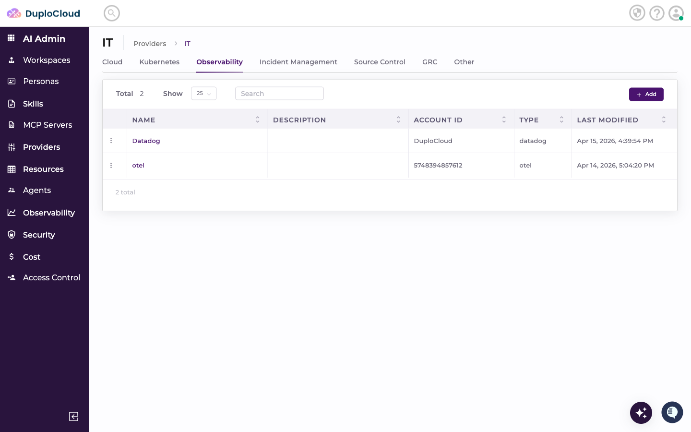

---

## Step 2 — Add a New Provider

Click **+ Add**. Fill in the provider details:

- **Name** — a name to identify this provider
- **Type** — select the provider type (e.g. Trending)
- **Account ID** — a label to identify this account within DuploCloud

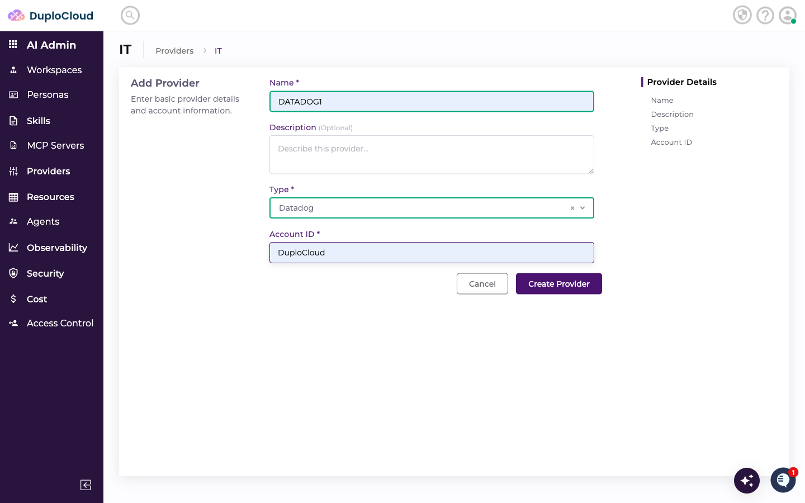

Click **Create Provider**.

---

## Step 3 — Add Credentials

The new provider opens on the **Credentials** tab. Click **+ Add** to add a credential. Fill in the credential fields:

- **api_key** — your Datadog API key
- **application_key** — your Datadog application key
- **url** — your Datadog site URL (e.g. `api.datadoghq.com`)

> **Where to find these values:** Both the API key and Application key must be created directly in Datadog under **Organization Settings → API Keys** and **Application Keys**. The site URL can be copied from your browser's address bar when logged into Datadog — use the base domain (e.g. `api.datadoghq.com` for US, `api.datadoghq.eu` for EU).

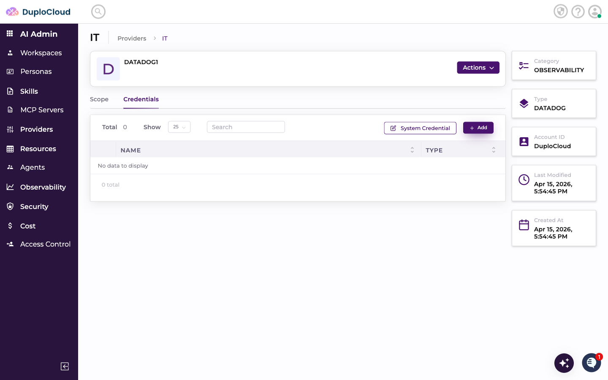

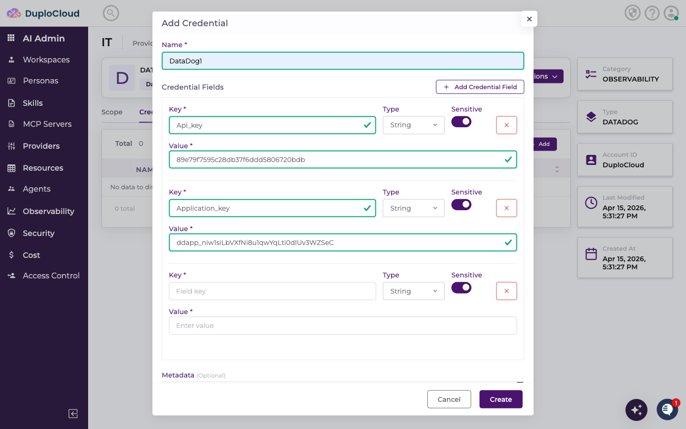

Enter your Datadog site URL in the **url** field.

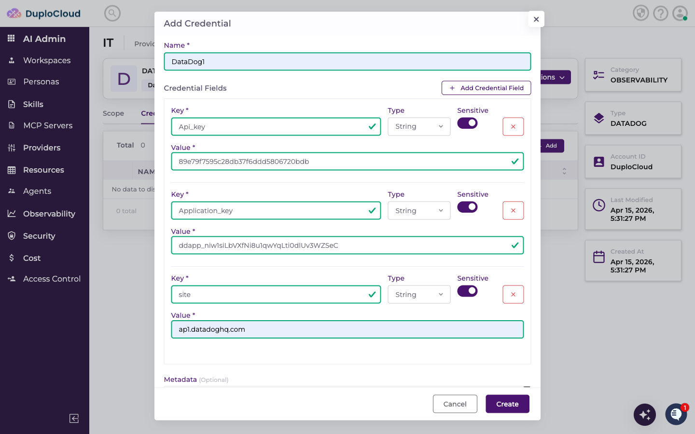

Toggle **Sensitive** on for fields containing secrets to ensure they are stored securely.

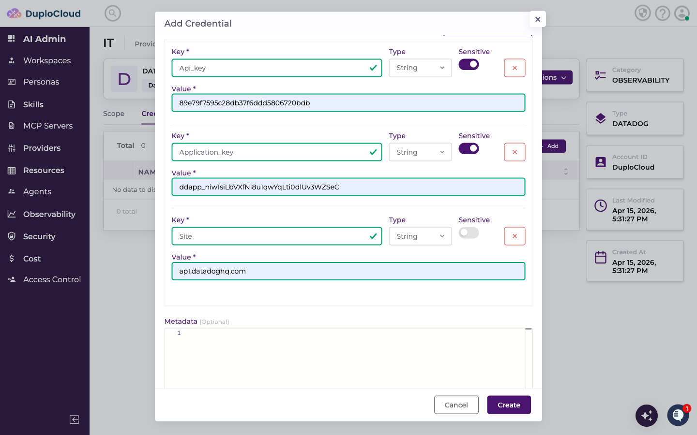

Click **Create** to save the credential.

---

## Step 4 — Add a Scope

Switch to the **Scope** tab and click **+ Add**. Fill in:

- **Name** — a label for this scope
- **Credential** — select the credential you just created
- **Description** — optional context for the agent

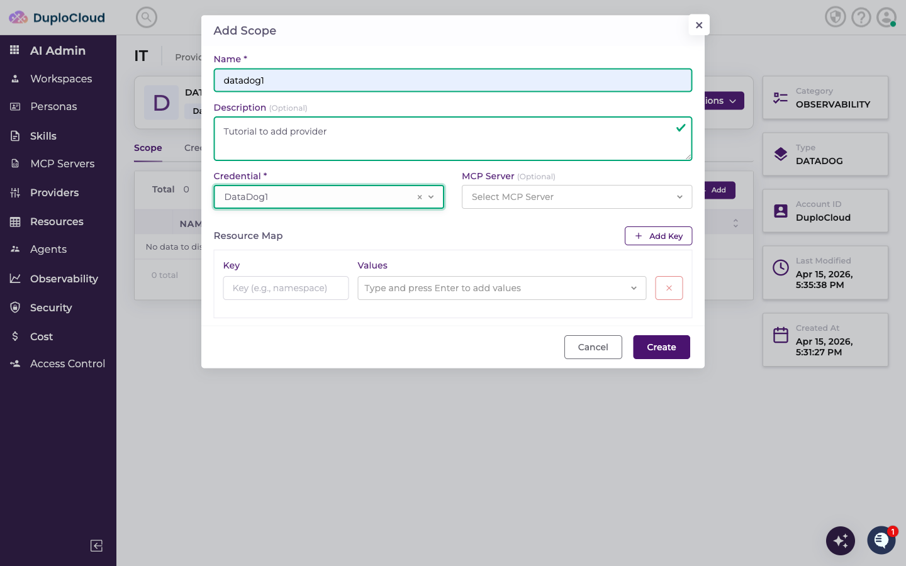

Click **Create**. The scope appears in the list.

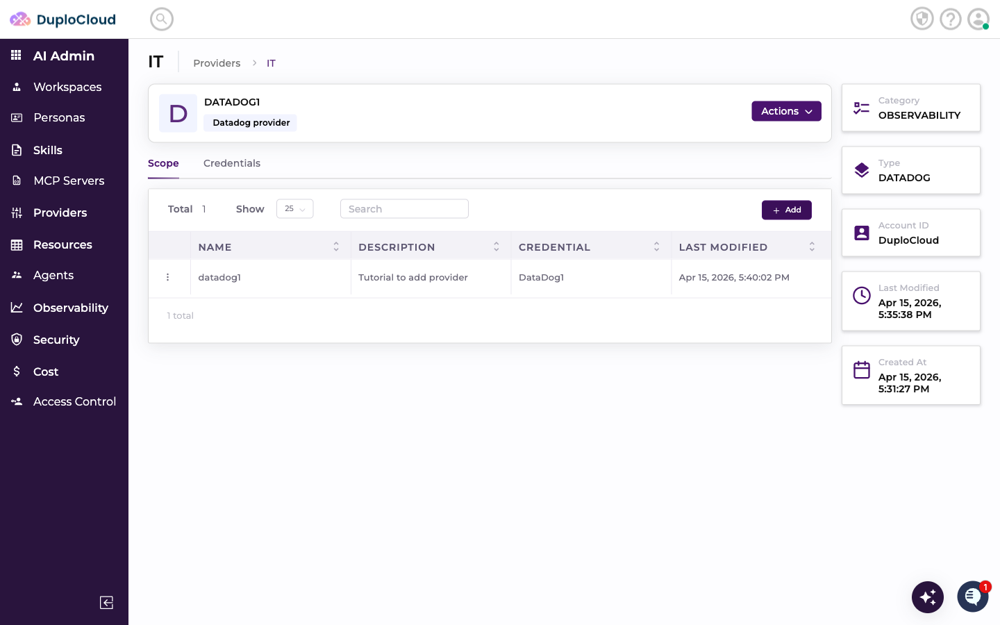

---

## Step 5 — Use Datadog in a Ticket

Go to **AI DevOps** → **HelpDesk** → **Add Ticket**. Select **generic-agent** as the agent and choose your Datadog scope from the scope dropdown.

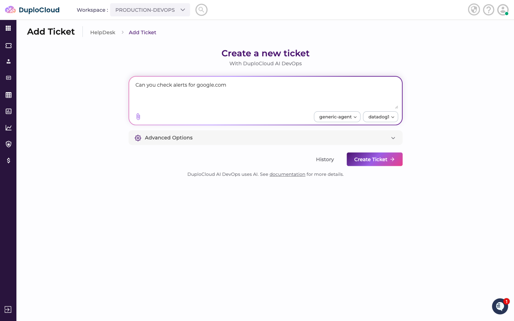

Enter your request — for example, asking the agent to check alerts or synthetic monitors for a domain.

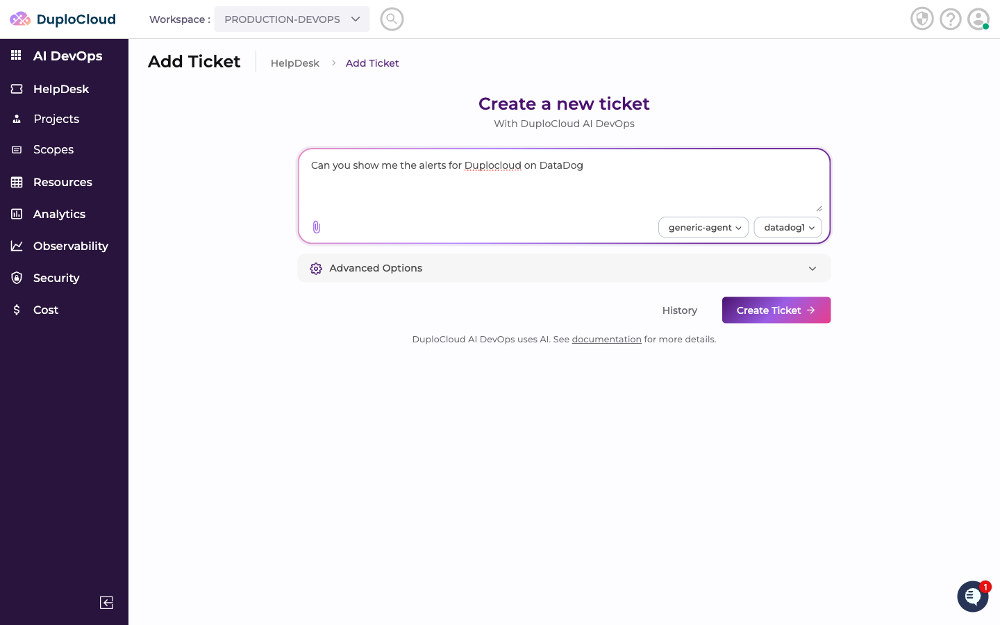

Click **Create Ticket**.

---

## Step 6 — Agent Queries Datadog

The agent processes the request, connects to Datadog using the scope credentials, and returns the results.

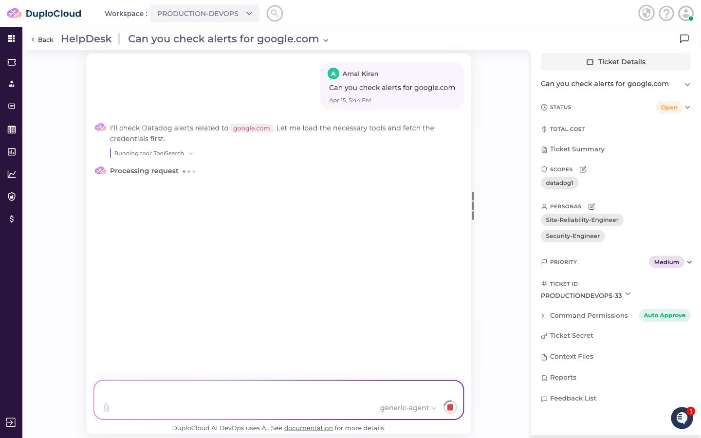

The response includes the relevant Datadog data — alert states, synthetic test results, monitor details, and a plain-language summary.

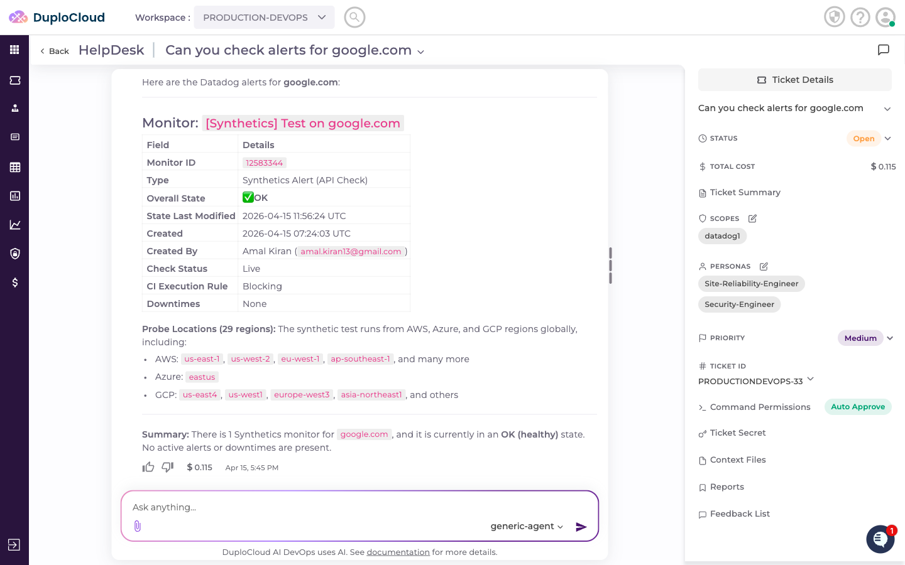
