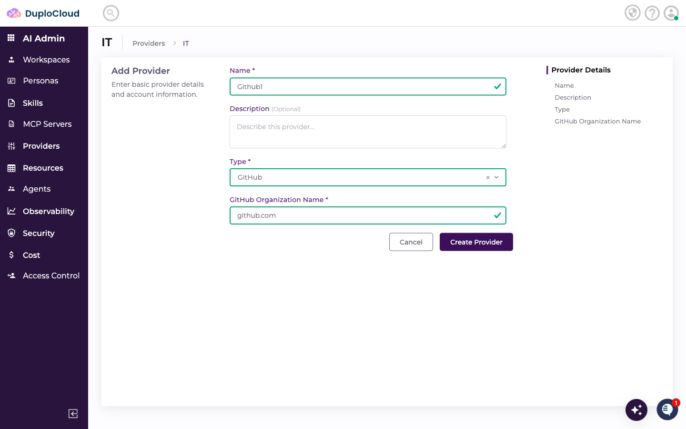
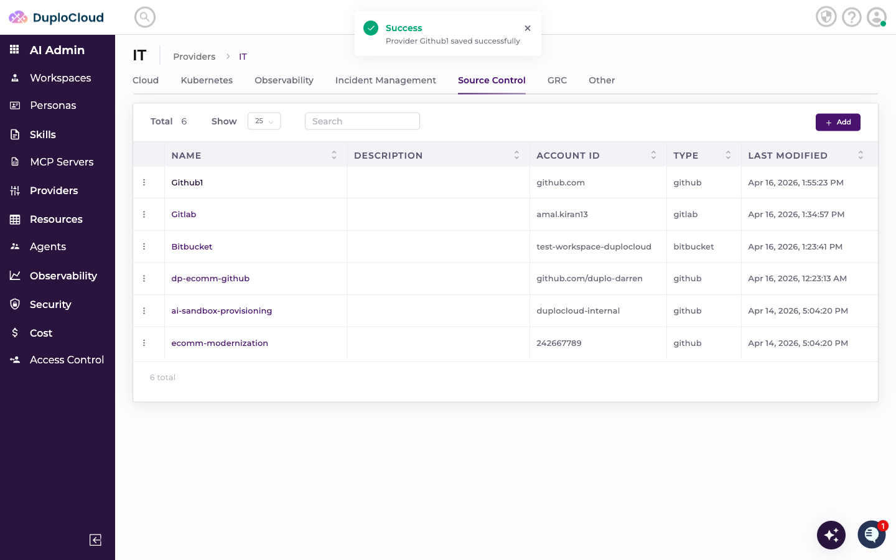
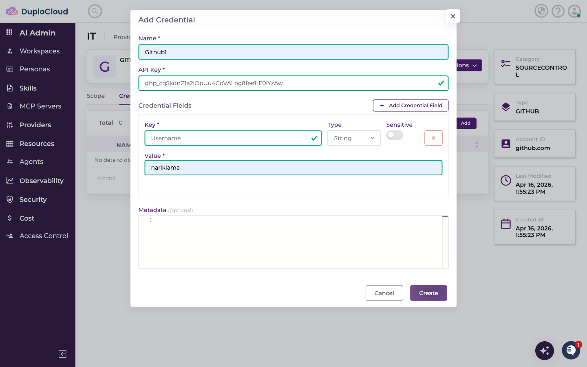
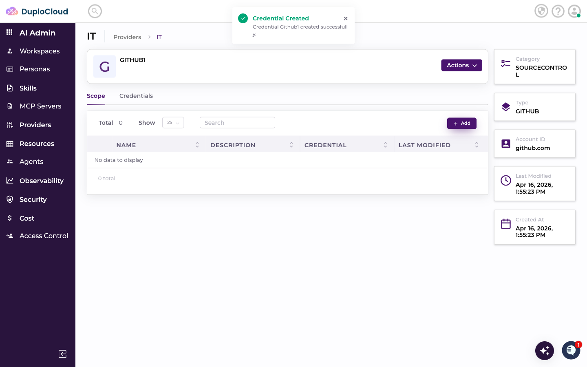
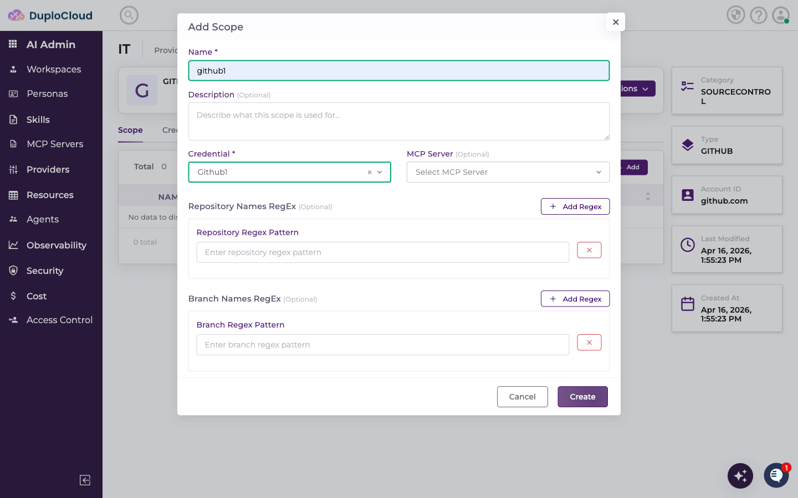
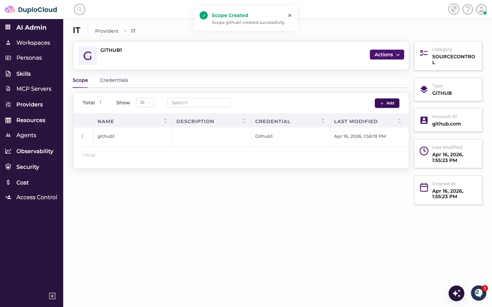
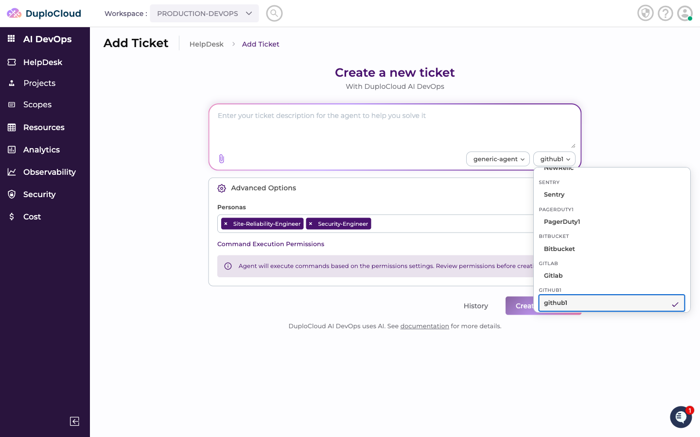
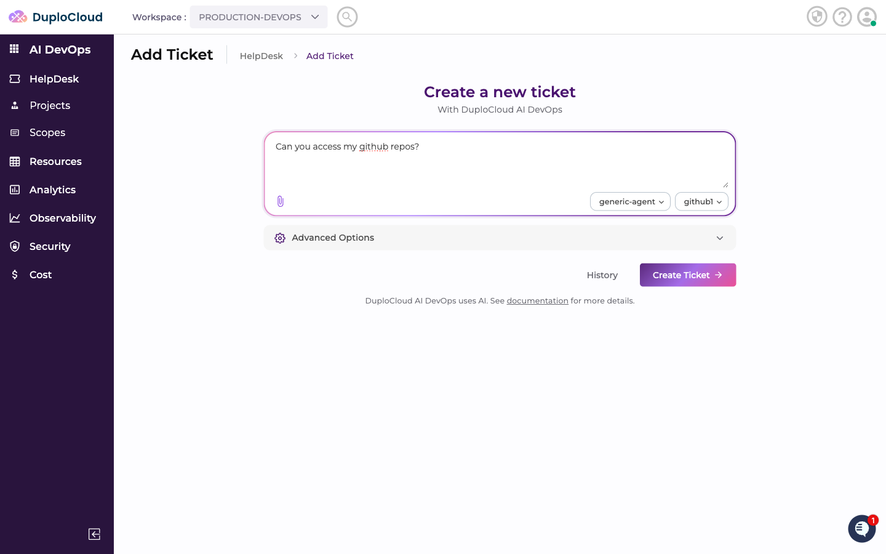
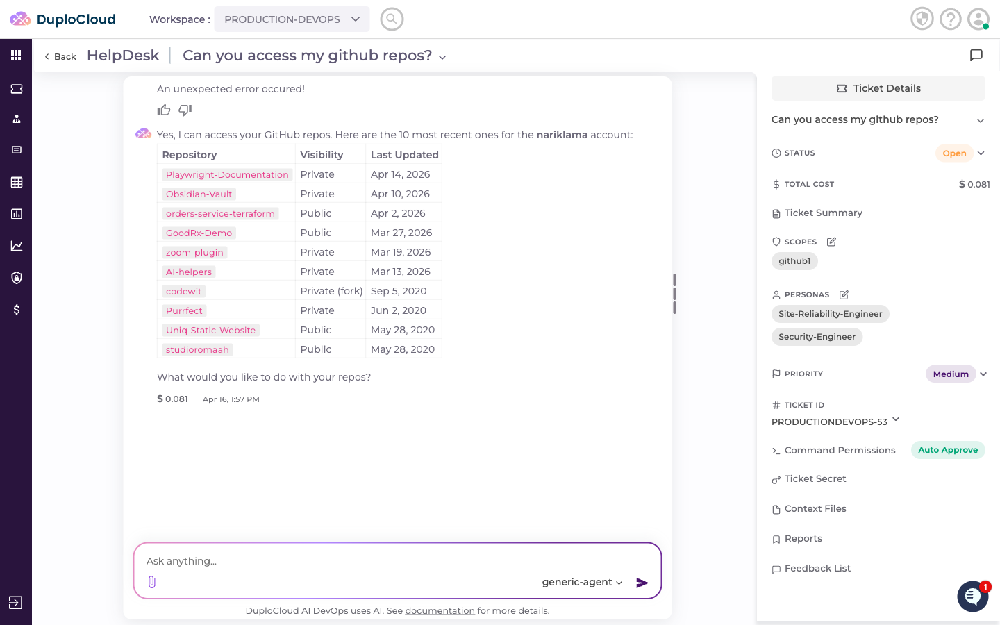

# Connecting GitHub to DuploCloud

This guide walks through adding GitHub as a Source Control provider in DuploCloud, configuring credentials, creating a scope, and querying GitHub repositories through the AI agent.

---

## Step 1 — Navigate to the Source Control Providers

Go to **AI Admin** → **Providers** → **IT**, then click the **Source Control** tab. This lists all source control providers connected to your account.

---

## Step 2 — Add a New Provider

Click **+ Add**. Fill in the provider details:

- **Name** — a name to identify this provider
- **Type** — select **GitHub**
- **GitHub Organization Name** — the hostname of your GitHub instance. For standard GitHub, this is `github.com`. If your organization uses a self-hosted GitHub Enterprise instance, enter your custom hostname instead (e.g. `github.company.com`)

Click **Create Provider**.

---

## Step 3 — Add Credentials

The new provider opens on the **Credentials** tab. Click **+ Add** to add a credential. Fill in:

- **Name** — a name for this credential set
- **API Key** — your GitHub Personal Access Token (starts with `ghp_`)
- **Credential Fields:**
  - **Username** — your GitHub username

> **Where to find these values:** Create a Personal Access Token in GitHub under **Settings → Developer settings → Personal access tokens**. Select the repository scopes your agent needs — at minimum `repo` for private repositories, or `public_repo` for public only. The username is your GitHub handle shown in your profile URL (`github.com/<username>`).

Click **Create** to save the credential.

---

## Step 4 — Add a Scope

Switch to the **Scope** tab and click **+ Add**. Fill in:

- **Name** — a label for this scope
- **Credential** — select the credential you just created
- **Repository Names RegEx** *(optional)* — a regex pattern to restrict which repositories the agent can access (e.g. `^duplocloud-.*`)
- **Branch Names RegEx** *(optional)* — a regex pattern to restrict which branches the agent can access (e.g. `^main$`)

Click **Create**. The scope appears in the list.

---

## Step 5 — Use GitHub in a Ticket

Go to **AI DevOps** → **HelpDesk** → **Add Ticket**. Select **generic-agent** as the agent and choose your GitHub scope from the scope dropdown.

Enter your request — for example, asking the agent to list your repositories. Click **Create Ticket**.

---

## Step 6 — Agent Queries GitHub

The agent connects to GitHub using the scope credentials and retrieves the requested information.

The response lists your most recent repositories with details — name, visibility (public or private), and last updated date — along with an offer to take further action on any of them.

