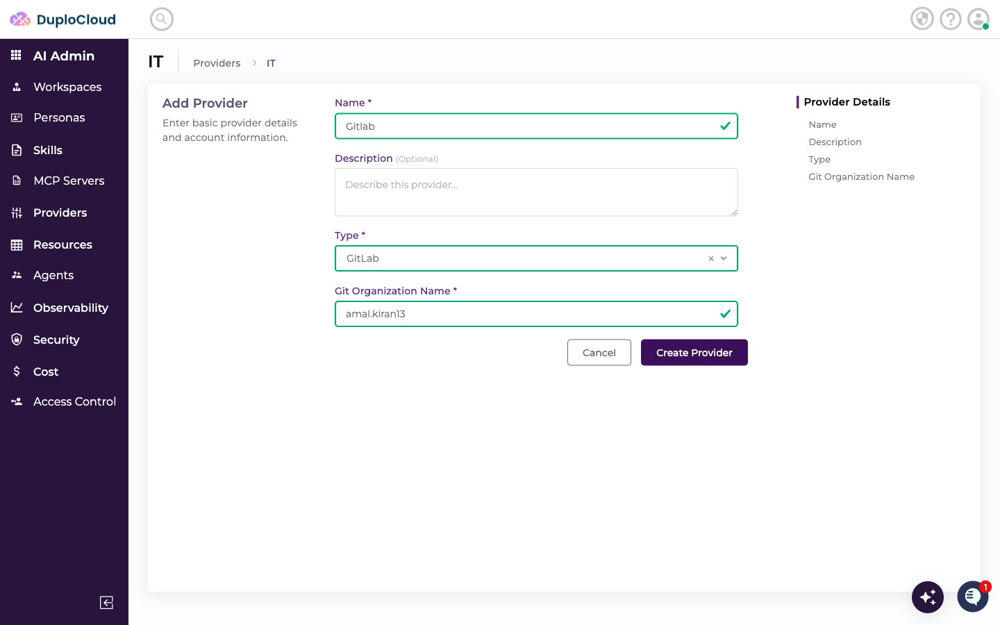
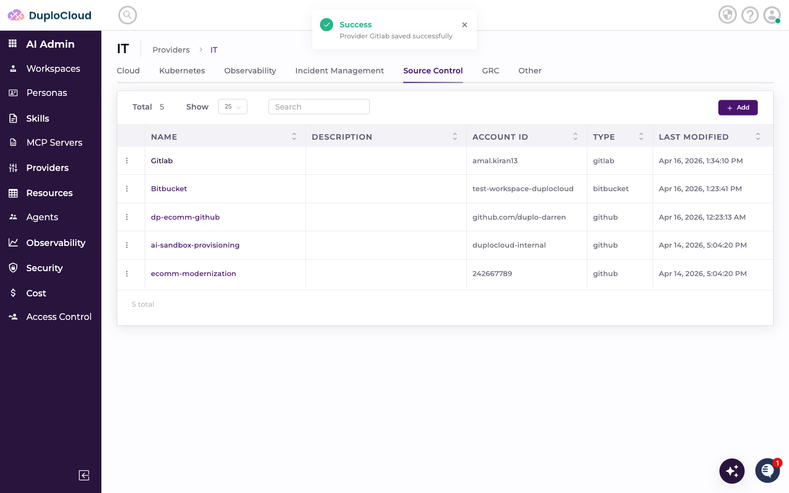
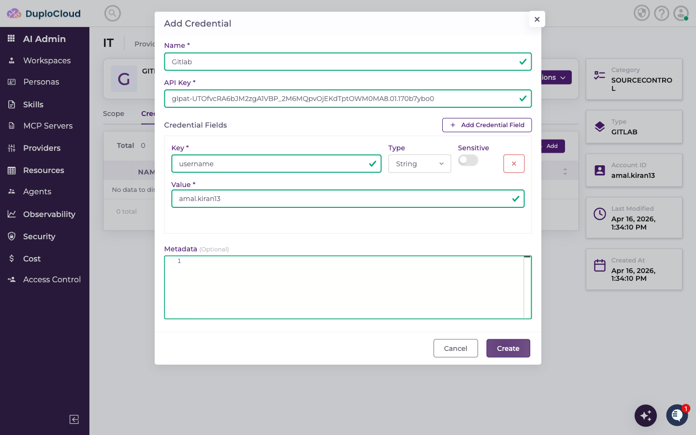
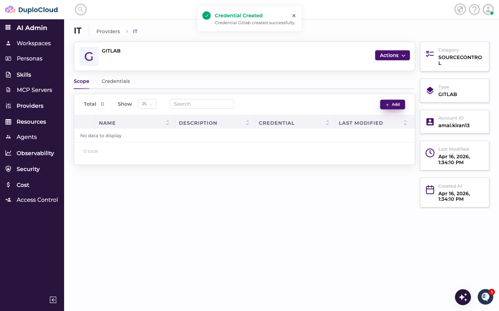
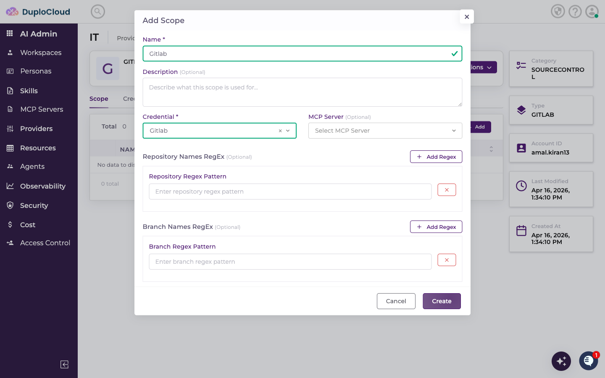
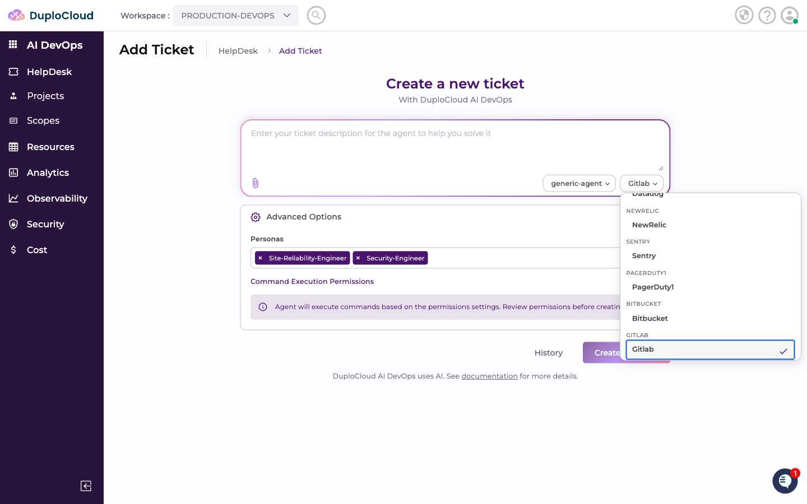
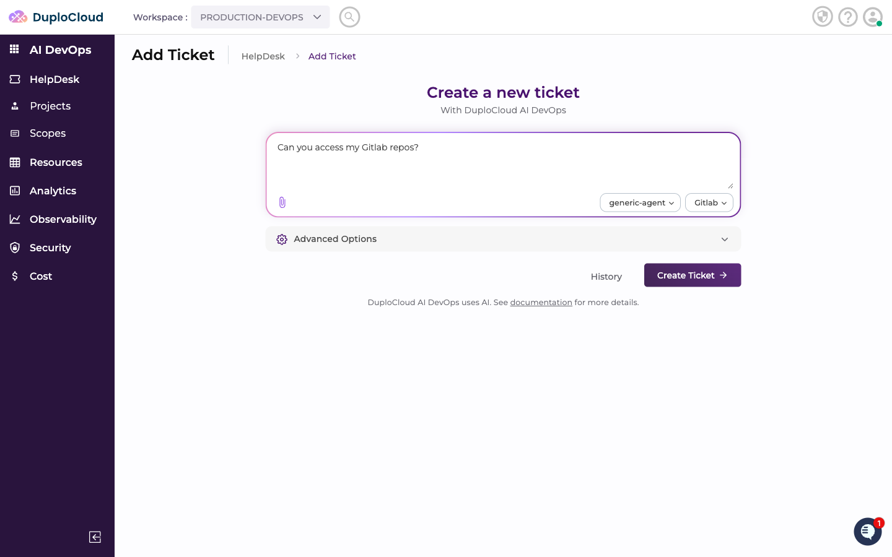
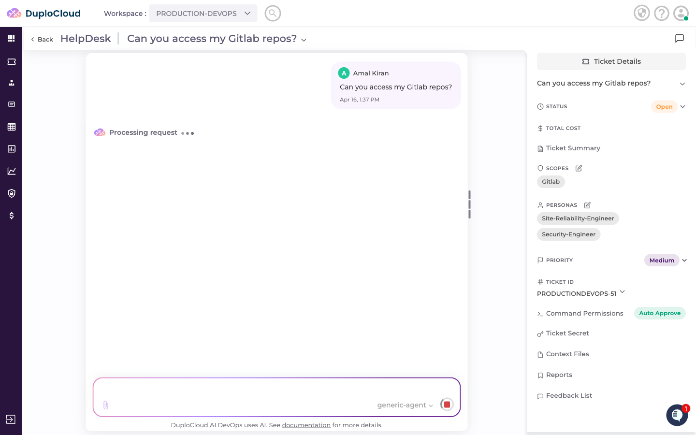
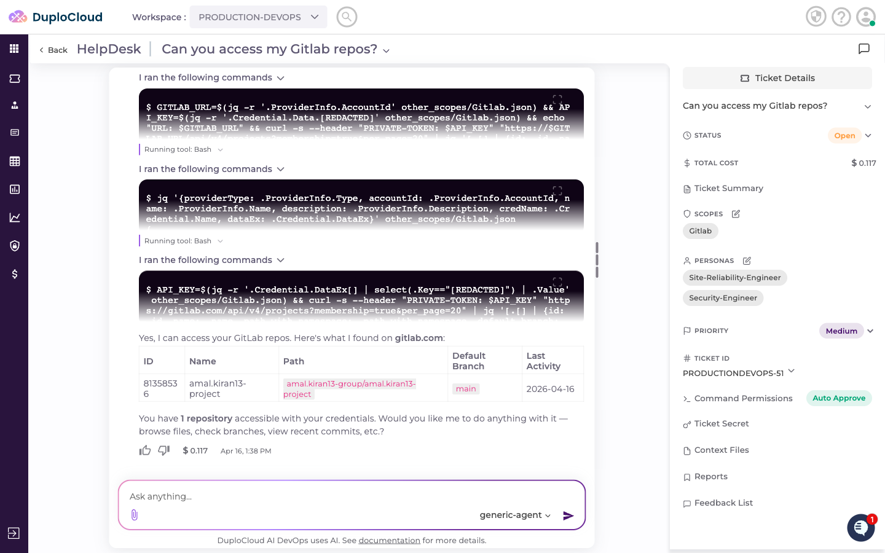

# Connecting GitLab to DuploCloud

This guide walks through adding GitLab as a Source Control provider in DuploCloud, configuring credentials, creating a scope, and querying GitLab repositories through the AI agent.

---

## Step 1 — Navigate to the Source Control Providers

Go to **AI Admin** → **Providers** → **IT**, then click the **Source Control** tab. This lists all source control providers connected to your account.

---

## Step 2 — Add a New Provider

Click **+ Add**. Fill in the provider details:

- **Name** — a name to identify this provider
- **Type** — select **GitLab**
- **Git Organization Name** — your GitLab username or group namespace (the identifier that appears in your GitLab profile or group URL)

Click **Create Provider**.

---

## Step 3 — Add Credentials

The new provider opens on the **Credentials** tab. Click **+ Add** to add a credential. Fill in:

- **Name** — a name for this credential set
- **API Key** — your GitLab Personal Access Token (starts with `glpat-`)
- **Credential Fields:**
  - **username** — your GitLab username

> **Where to find these values:** Create a Personal Access Token in GitLab under **User Settings → Access Tokens**. Select the scopes your agent needs — at minimum `read_api` for reading repositories; add `api` if the agent needs to create or modify resources. The username is the handle shown in your GitLab profile URL (`gitlab.com/<username>`).

Click **Create** to save the credential.

---

## Step 4 — Add a Scope

Switch to the **Scope** tab and click **+ Add**. Fill in:

- **Name** — a label for this scope
- **Credential** — select the credential you just created
- **Repository Names RegEx** *(optional)* — a regex pattern to restrict which repositories the agent can access (e.g. `^duplocloud-.*`)
- **Branch Names RegEx** *(optional)* — a regex pattern to restrict which branches the agent can access (e.g. `^main$`)

Click **Create**.

---

## Step 5 — Use GitLab in a Ticket

Go to **AI DevOps** → **HelpDesk** → **Add Ticket**. Select **generic-agent** as the agent and choose your GitLab scope from the scope dropdown.

Enter your request — for example, asking the agent to list your repositories or check recent activity. Click **Create Ticket**.

---

## Step 6 — Agent Queries GitLab

The agent connects to GitLab using the scope credentials and retrieves the requested information.

The response lists accessible repositories with details — ID, name, path, default branch, and last activity — along with a plain-language summary and an offer to take further action.

