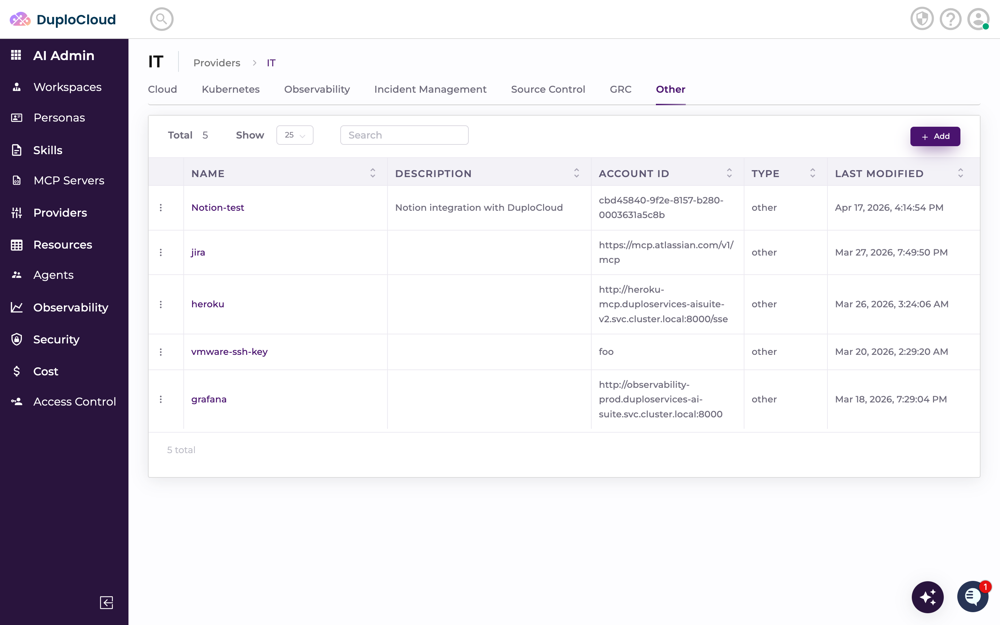
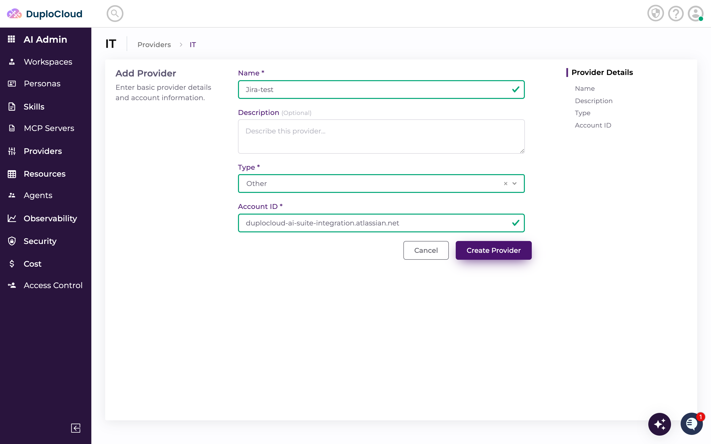
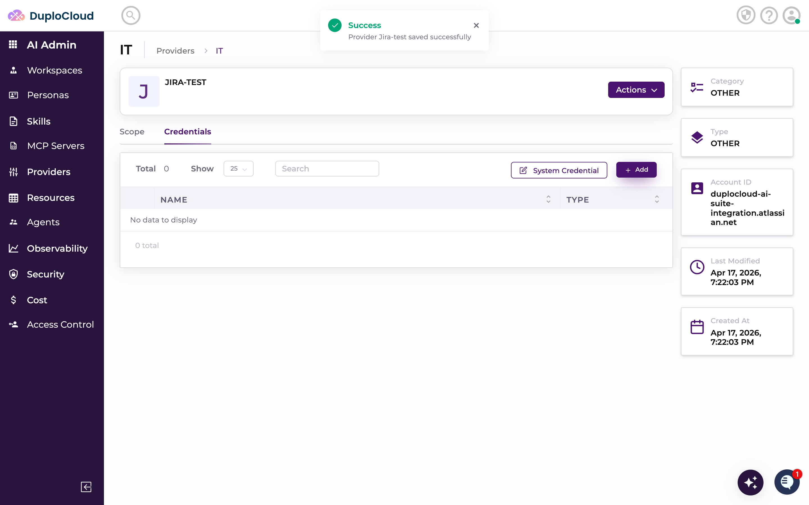
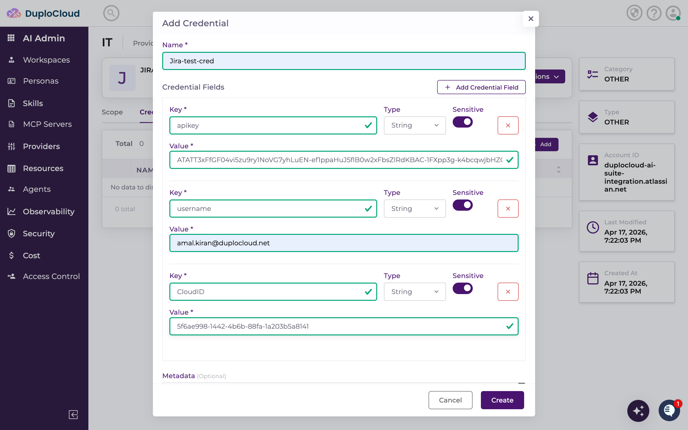
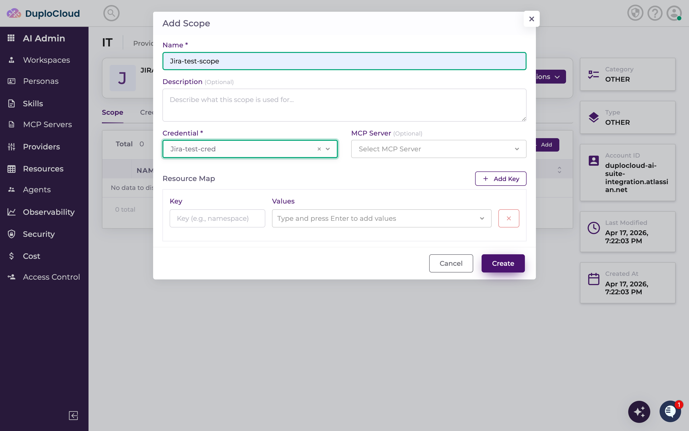
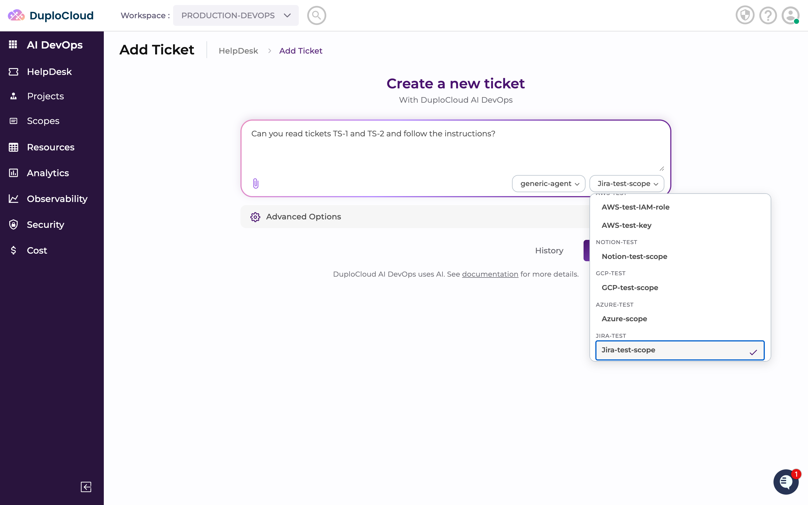
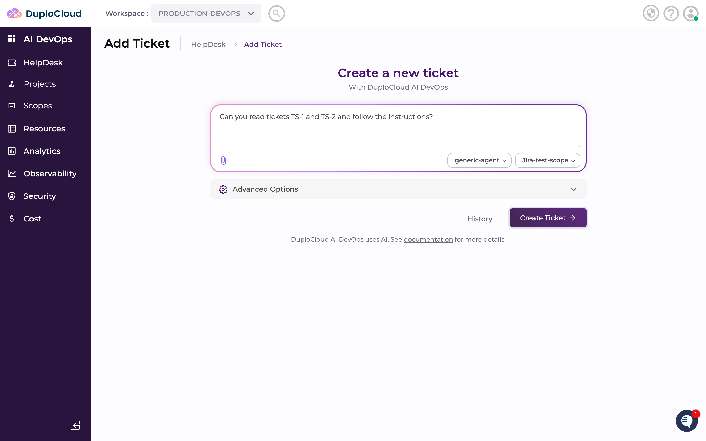
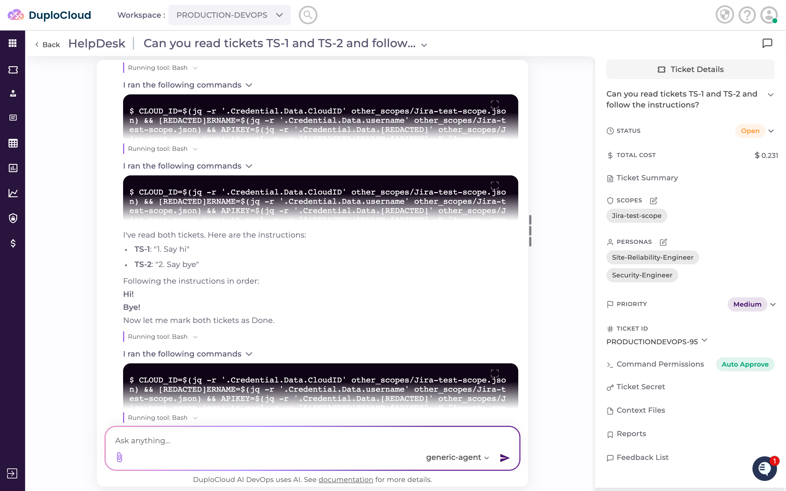
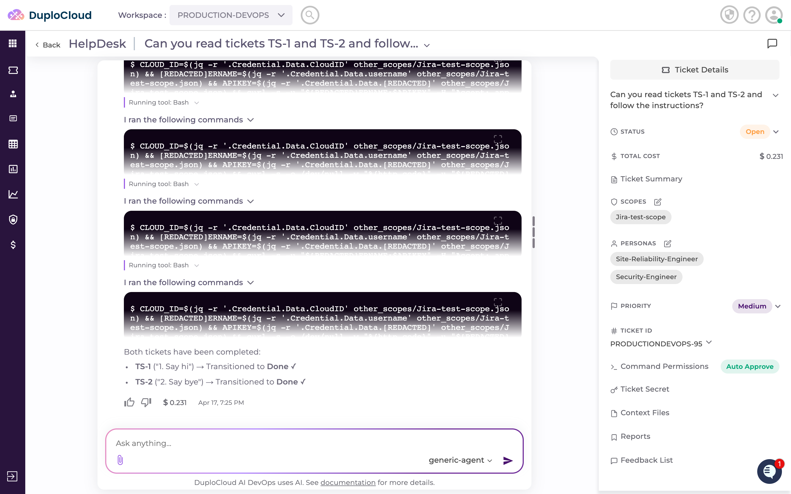

# Integrating Jira with DuploCloud

Connecting Jira to DuploCloud lets the AI agent read tickets, create issues, update statuses, and act on Jira data on your behalf. You will need an Atlassian API token, your account email, and your Jira Cloud ID.

---

## Step 1 — Add the Jira Provider

In DuploCloud, go to **Providers** in the left sidebar, select your tenant (e.g. **IT**), and click the **Other** tab. Click **+ Add**.

Fill in the **Add Provider** form:

- **Name** — a name for this provider (e.g. `Jira-test`)
- **Type** — select `Other`
- **Account ID** — your Atlassian domain (e.g. `your-org.atlassian.net`)

Click **Create Provider**.

The provider is created and you are taken to the provider detail page.

---

## Step 2 — Add a Credential

On the **Credentials** tab, click **+ Add**. Add the following credential fields:

- **`apikey`** — your Atlassian API token. Generate one at **id.atlassian.com** → **Security** → **API tokens** → **Create API token**. Set Sensitive to on.
- **`username`** — the email address associated with your Atlassian account
- **`CloudID`** — your Jira Cloud ID. To find it, navigate to `https://your-domain.atlassian.net/_edge/tenant_info` in your browser — the `cloudId` field in the response is the value to use here

Click **Create**.

---

## Step 3 — Add a Scope

On the **Scope** tab, click **+ Add**.

- **Name** — a name for this scope (e.g. `Jira-test-scope`)
- **Credential** — select the credential you just created

Click **Create**.

---

## Step 4 — Use the Scope in a Ticket

Go to **HelpDesk** and create a new ticket. In the scope selector, choose the Jira scope from the dropdown.

Type your request and click **Create Ticket**.

---

## Step 5 — Output

The agent authenticates with your Jira instance and executes the request. Results appear in the ticket thread.

