# Setting Up an Azure Cloud Provider

The Azure Cloud Provider lets DuploCloud AI agents interact with your Azure subscription — querying resources, running `az` commands, and managing infrastructure on your behalf. Setup involves registering an application in Azure, creating a client secret, and assigning the application a role on your subscription.

---

## Part 1 — Azure Portal Setup

### Step 1 — Copy Your Subscription ID

In the Azure Portal, search for **Subscriptions** and open the page. Copy the **Subscription ID** for the subscription you want the agent to access — you will need this when creating the provider in DuploCloud.

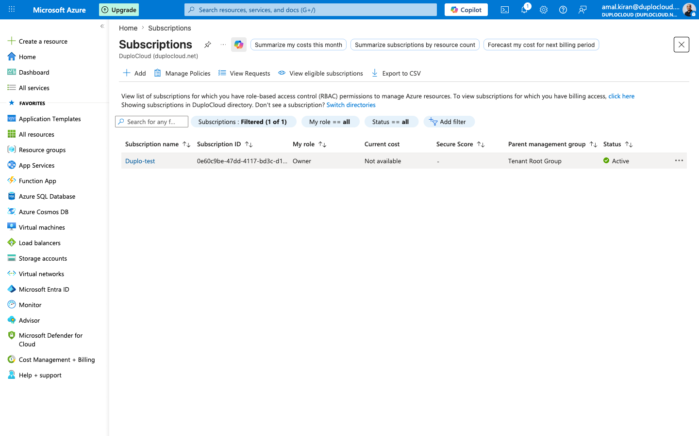

---

### Step 2 — Register an Application

Go to **Microsoft Entra ID** → **App registrations** → **+ New registration**. Give the application a name (e.g. `duplo-test-app`) and click **Register**.

Once created, the application overview page shows two values you will need:

- **Application (client) ID** — used as the `Application Id` in DuploCloud
- **Directory (tenant) ID** — used as the `Tenant Id` in DuploCloud

Copy both values.

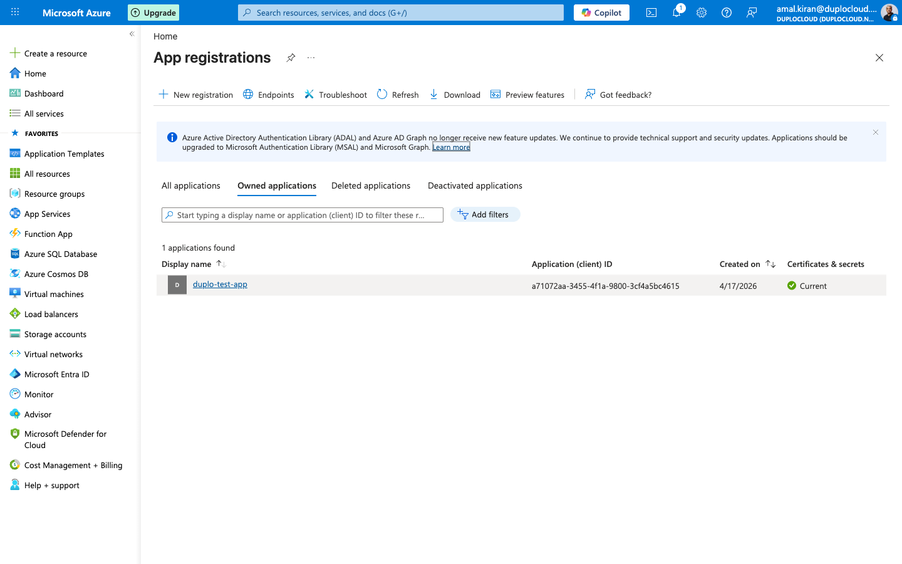

---

### Step 3 — Create a Client Secret

Inside your app registration, go to **Certificates & secrets** → **Client secrets** → **+ New client secret**. Give it a description and set an expiry, then click **Add**.

> **Important:** When the secret is created, Azure shows the secret **Value** only once. Copy the **Value** column immediately — this is what goes in the **Application Password** field in DuploCloud, not the secret name or ID.

---

### Step 4 — Assign a Role to the Application

Go back to **Subscriptions**, open your subscription, and click **Access control (IAM)**.

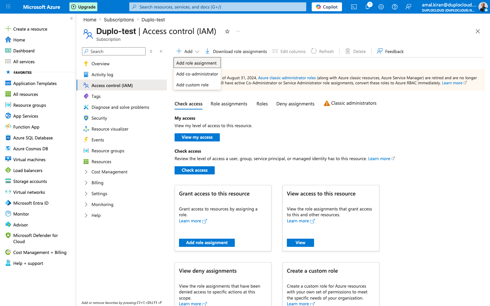

Click **+ Add** → **Add role assignment**. On the **Role** tab, select the role you want to grant (e.g. **Reader** for read-only access). Click **Next** to go to the **Members** tab.

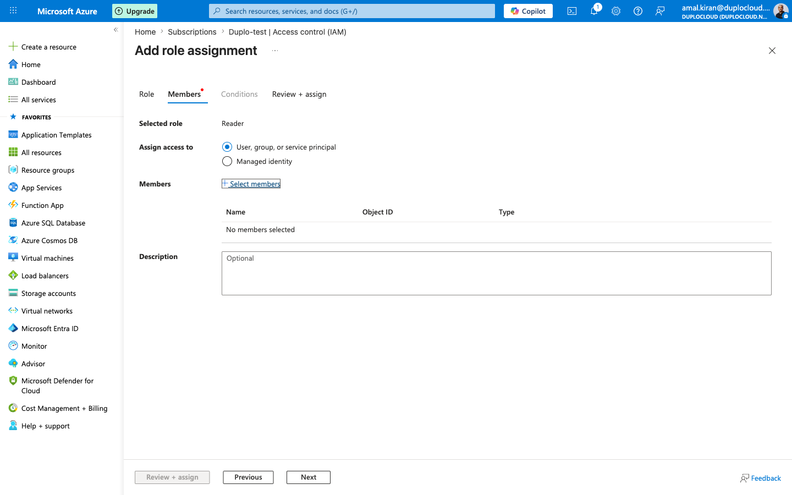

Click **+ Select members**, search for the application you registered, select it, and click **Select**. Then click **Review + assign** to complete the assignment.

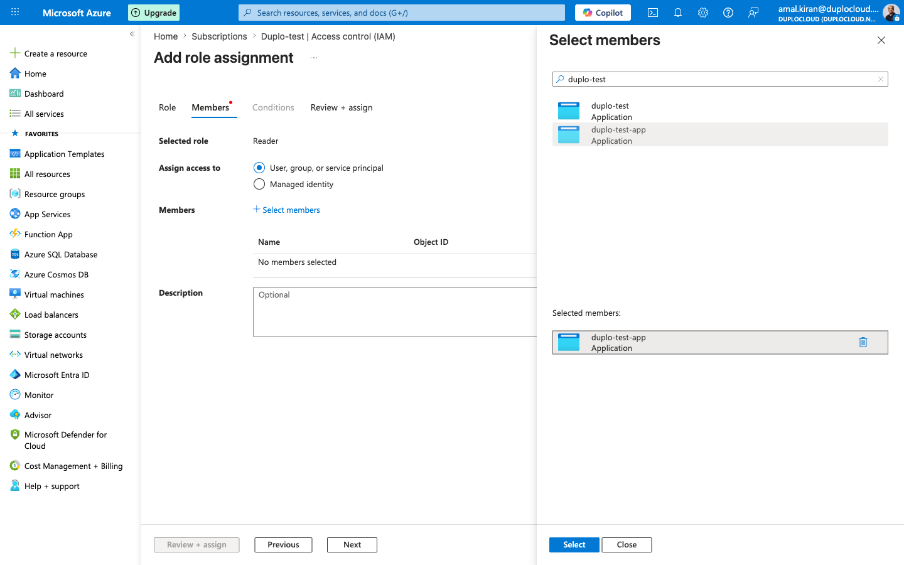

---

## Part 2 — DuploCloud Setup

### Step 5 — Add the Azure Provider

In DuploCloud, go to **Providers** in the left sidebar, select your tenant (e.g. **IT**), and click the **Cloud** tab. Click **+ Add**.

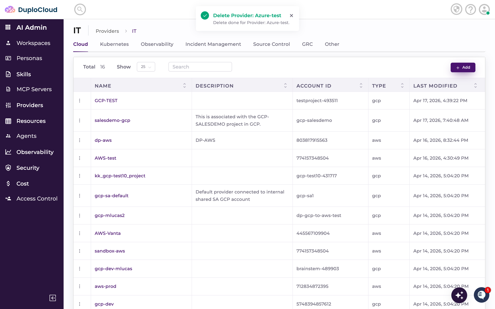

Fill in the **Add Provider** form:

- **Name** — a name for this provider (e.g. `Azure-test`)
- **Type** — select `Azure`
- **Subscription ID** — the Subscription ID copied from Step 1

Click **Create Provider**.

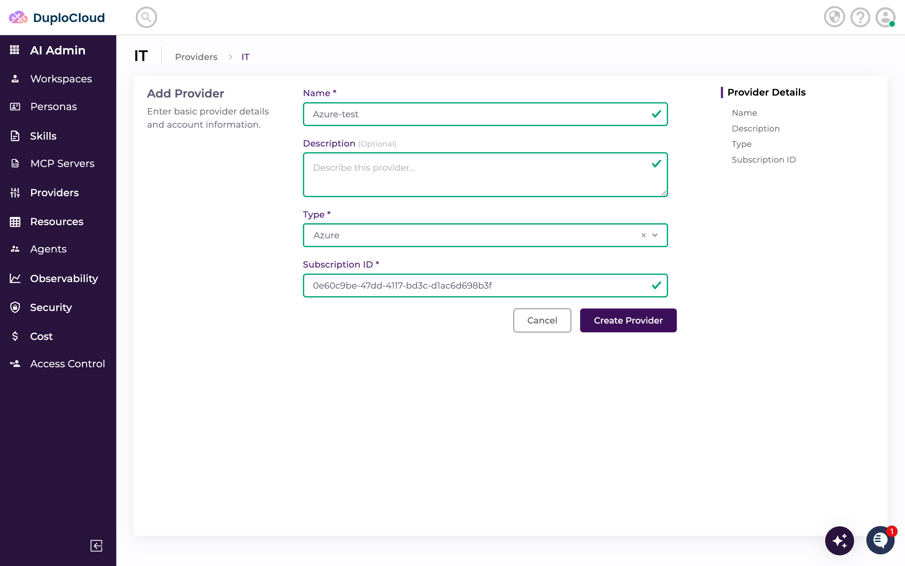

---

### Step 6 — Add a Credential

Click on your new provider to open it, then go to the **Credentials** tab and click **+ Add**.

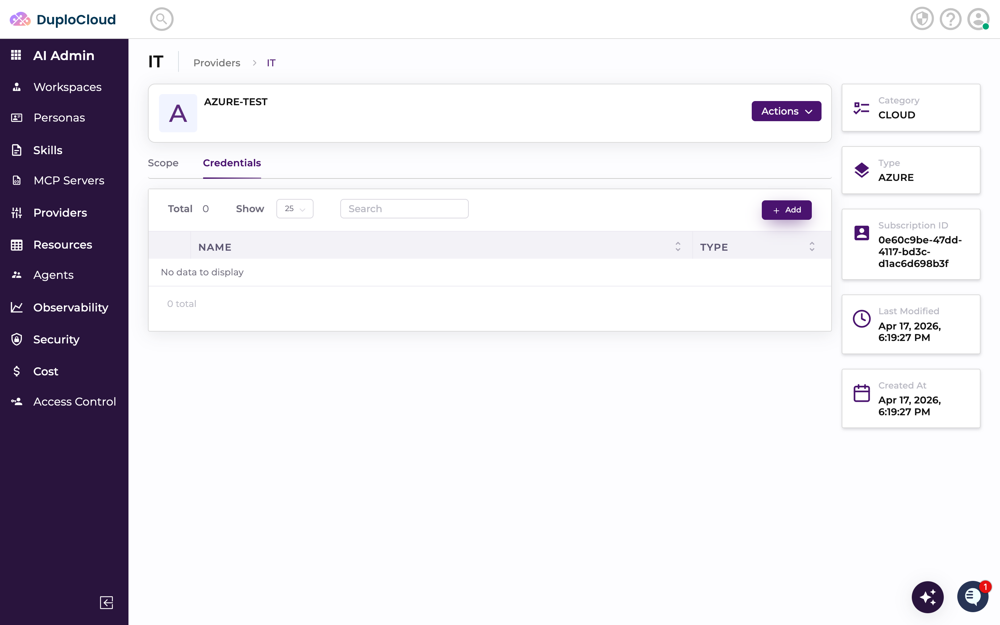

Fill in the **Add Credential** form:

- **Name** — a name for this credential (e.g. `Azure-Test-Cred`)
- **Authentication Type** — select `Service Principal`
- **Application Id** — the Application (client) ID from Step 2
- **Application Password** — the client secret **Value** copied from Step 3
- **Tenant Id** — the Directory (tenant) ID from Step 2

Click **Create**.

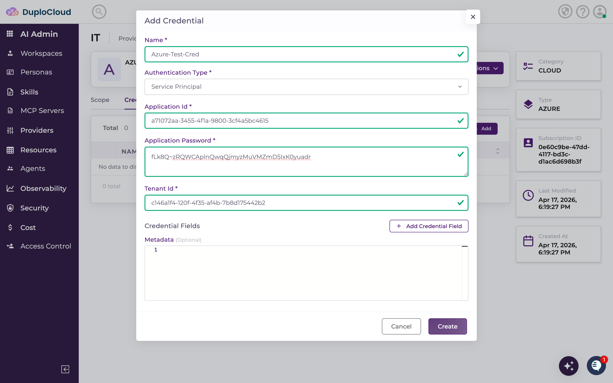

---

### Step 7 — Add a Scope

On the **Scope** tab, click **+ Add**.

- **Name** — a name for this scope (e.g. `Azure-scope`)
- **Credential** — select the credential you just created

Click **Create**. The scope appears in the list.

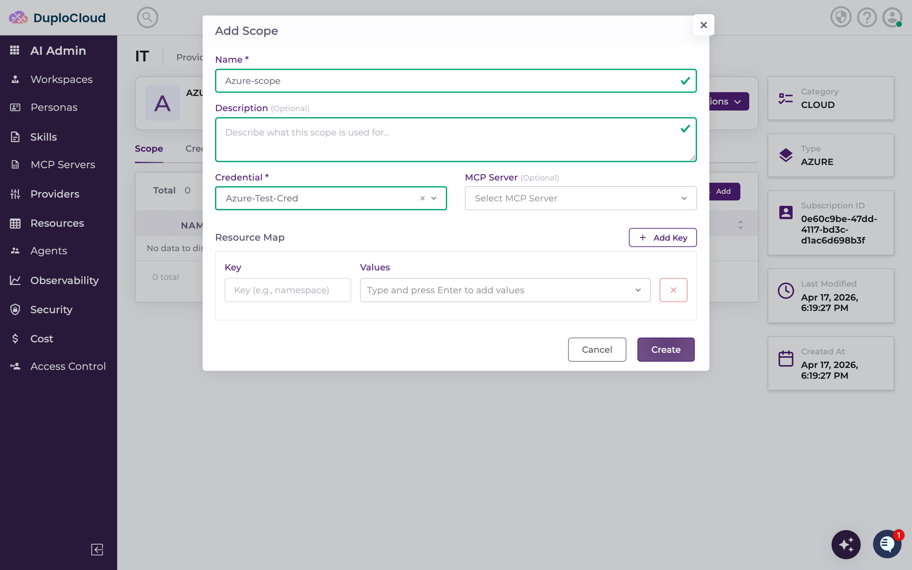

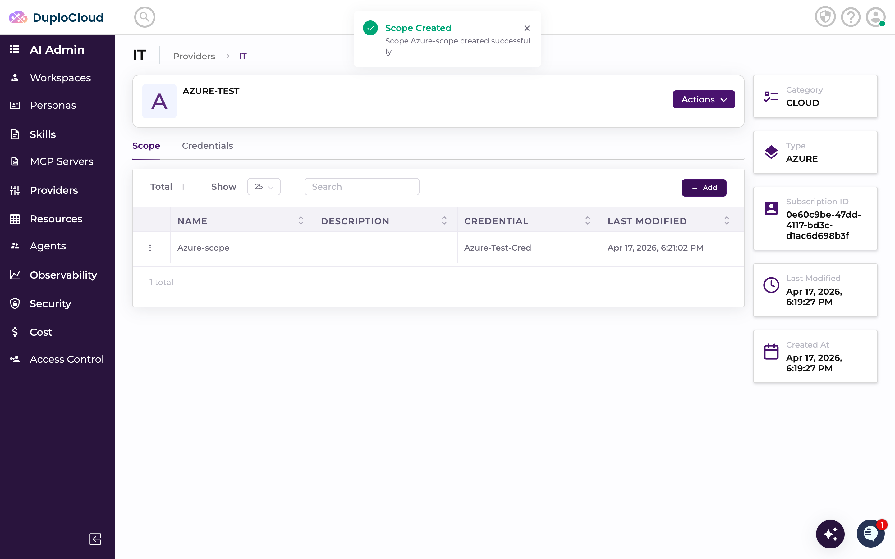

---

### Step 8 — Use the Scope in a Ticket

Go to **HelpDesk** and create a new ticket. In the scope selector choose your Azure scope, type your request, and click **Create Ticket**.

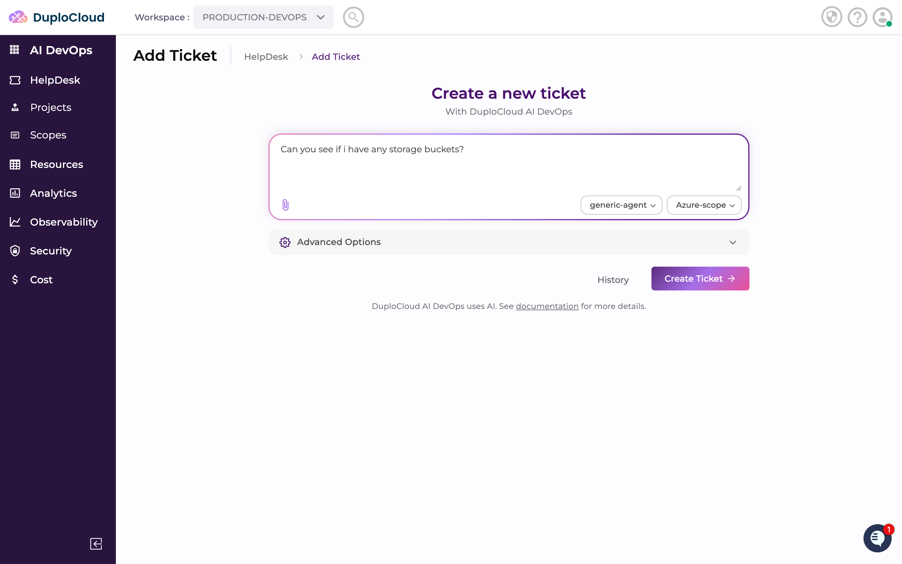

The agent authenticates using the service principal and executes the request. Results appear in the ticket thread.

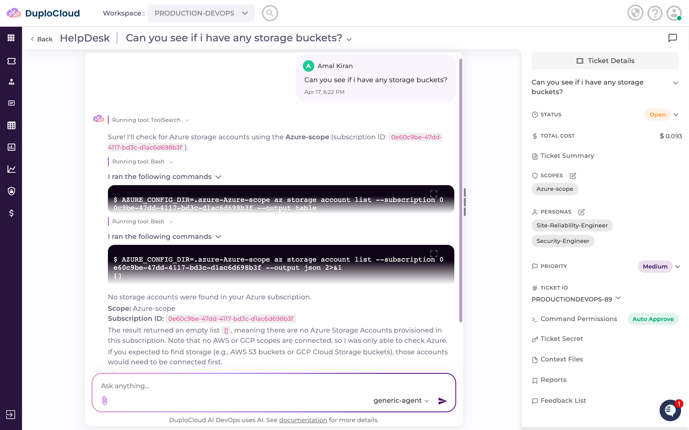
