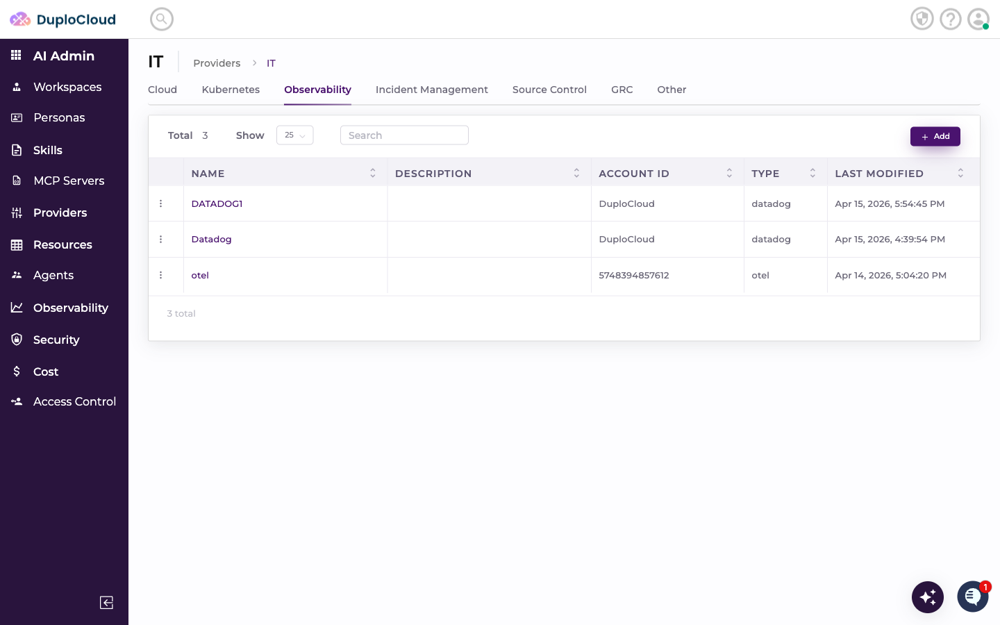
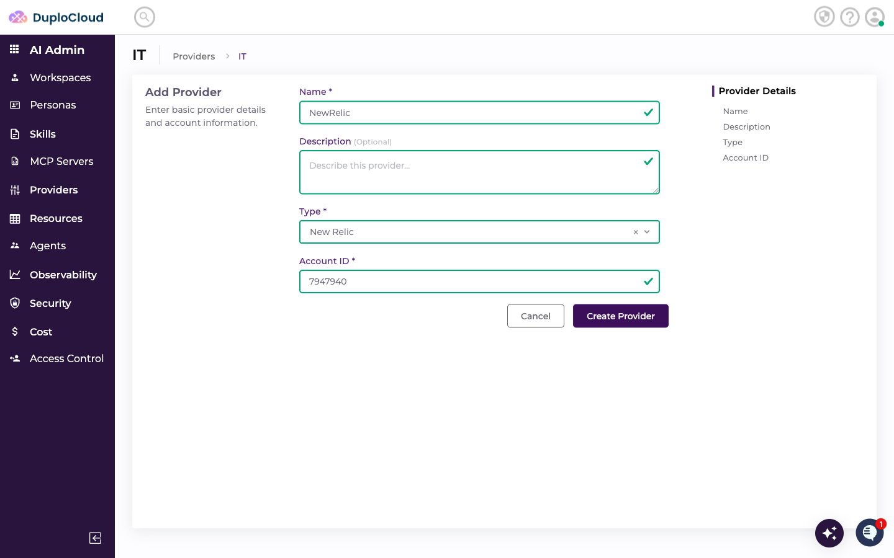
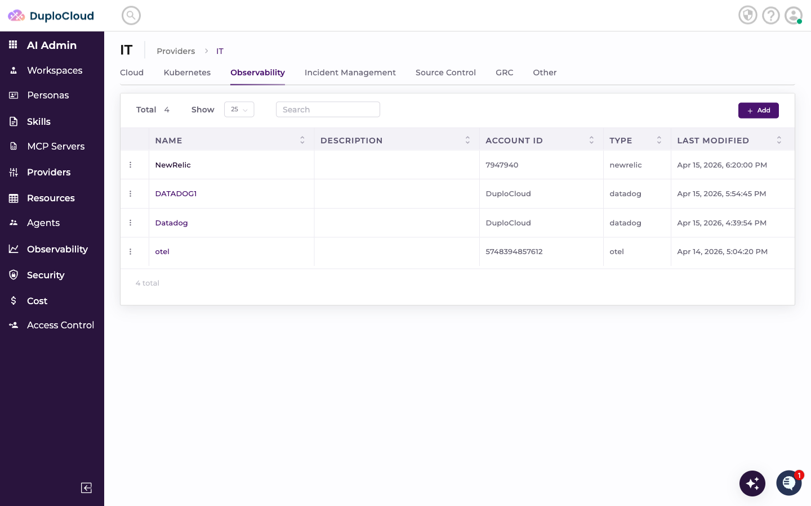
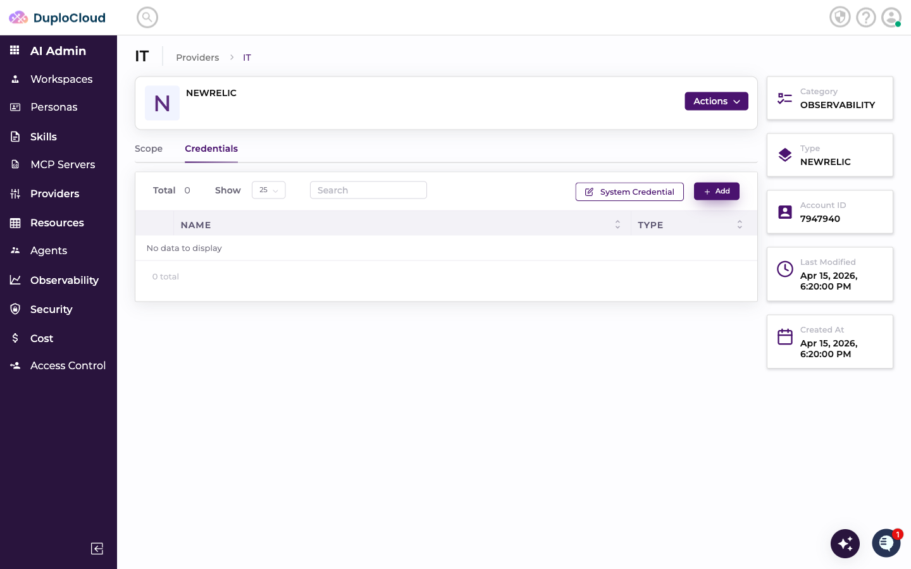
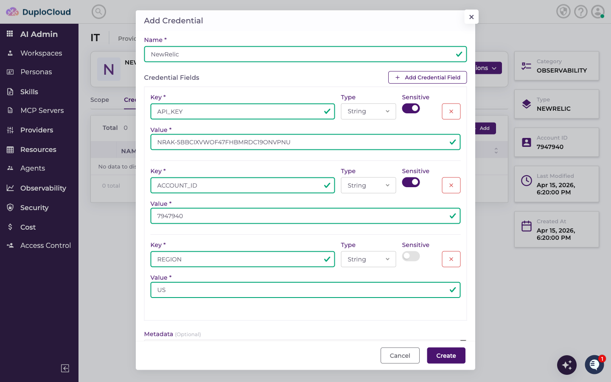
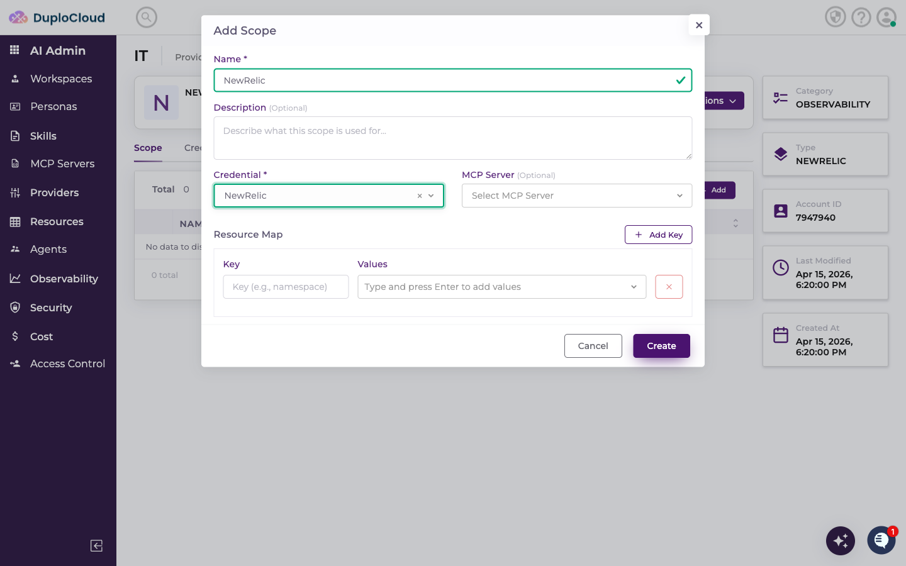
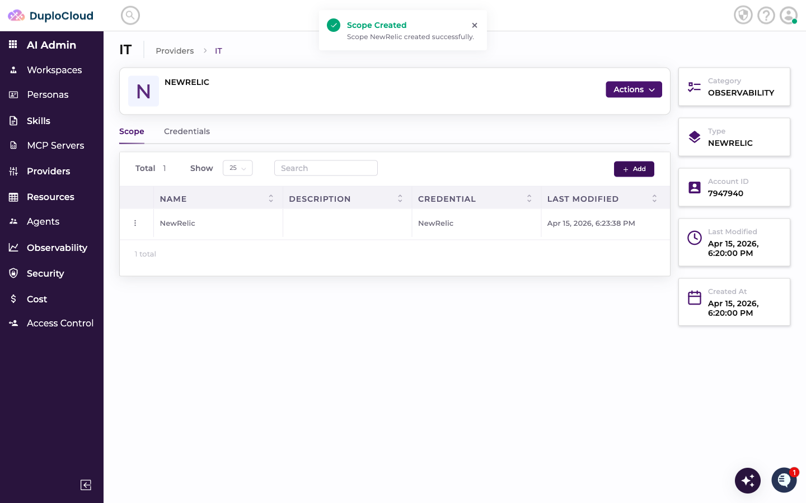
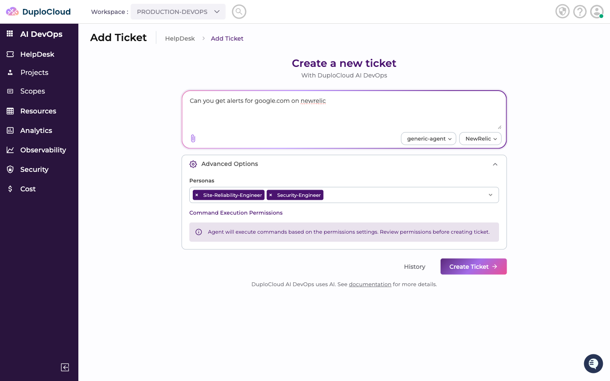
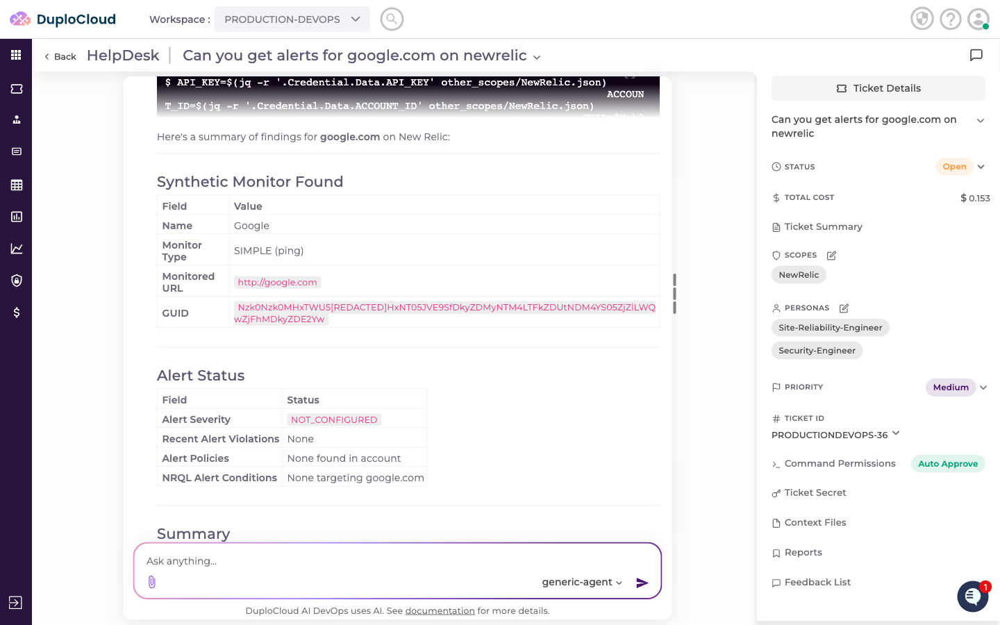
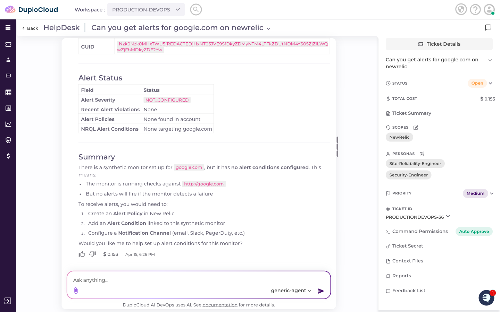

# Connecting New Relic to DuploCloud

This guide walks through adding New Relic as a provider in DuploCloud, configuring credentials, creating a scope, and querying New Relic data through the AI agent.

---

## Step 1 — Navigate to the Observability Providers

Go to **AI Admin** → **Providers** → **IT**, then click the **Observability** tab.

---

## Step 2 — Add a New Provider

Click **+ Add**. Fill in the provider details:

- **Name** — a name to identify this provider
- **Type** — select **New Relic**
- **Account ID** — a label to identify this account within DuploCloud

Click **Create Provider**. The new provider appears in the Observability list.

---

## Step 3 — Add Credentials

The new provider opens on the **Credentials** tab. Click **+ Add** to add a credential. Fill in the credential fields:

- **API_KEY** — your New Relic User API key
- **ACCOUNT_ID** — your New Relic account ID
- **REGION** — `US` or `EU` depending on your New Relic account region

> **Where to find these values:** Your API key can be created in New Relic under **Account Settings → API Keys**. Your Account ID is the numeric ID visible in the URL when logged into New Relic (`one.newrelic.com/accounts/XXXXXXX`). The region is shown on your New Relic login page.

Click **Create** to save the credential.

---

## Step 4 — Add a Scope

Switch to the **Scope** tab and click **+ Add**. Fill in:

- **Name** — a label for this scope
- **Credential** — select the credential you just created
- **Description** — optional context for the agent

Click **Create**. The scope appears in the list.

---

## Step 5 — Use New Relic in a Ticket

Go to **AI DevOps** → **HelpDesk** → **Add Ticket**. Select **observability-agent** as the agent and choose your New Relic scope from the scope dropdown.

Enter your request — for example, asking the agent to check alerts or synthetic monitors for a domain. Click **Create Ticket**.

---

## Step 6 — Agent Queries New Relic

The agent connects to New Relic using the scope credentials, looks up synthetic monitors, alert conditions, and recent violations, and returns a plain-language summary.

