# Integrating Notion with DuploCloud

Connecting Notion to DuploCloud lets the AI agent read, create, and update pages and databases in your Notion workspace. You create an internal integration in Notion to generate an API token, then register it as a provider in DuploCloud.

---

## Part 1 — Create a Notion Internal Integration

### Step 1 — Open Internal Integrations

Go to [notion.so/profile/integrations/internal](https://www.notion.so/profile/integrations/internal). This page lists all internal integrations for your workspace. Click **Create a new integration**.

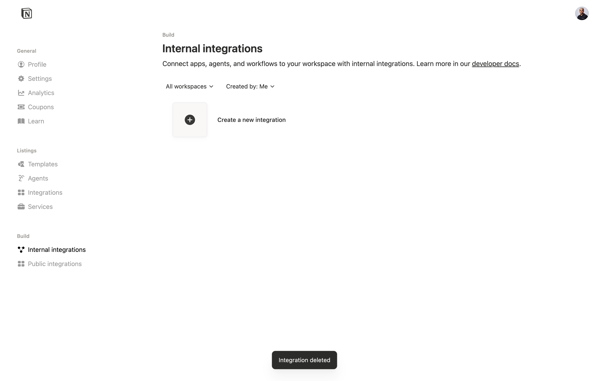

### Step 2 — Fill in Integration Details

Give the integration a name (e.g. `DuploCloud-Integration`) and select the **Associated workspace** this integration will have access to. Click **Create**.

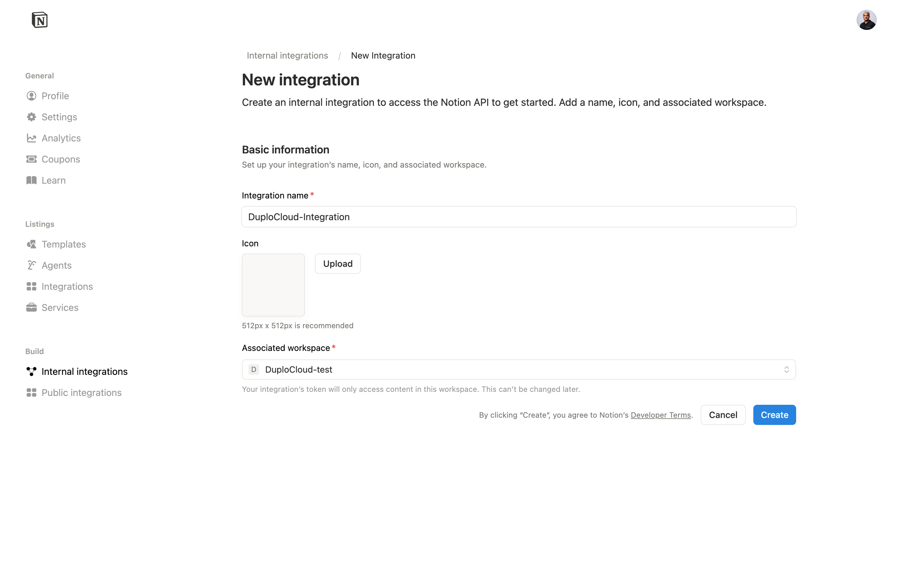

### Step 3 — Integration Created

A confirmation dialog appears. Click **Configure integration settings** to proceed to the integration configuration page.

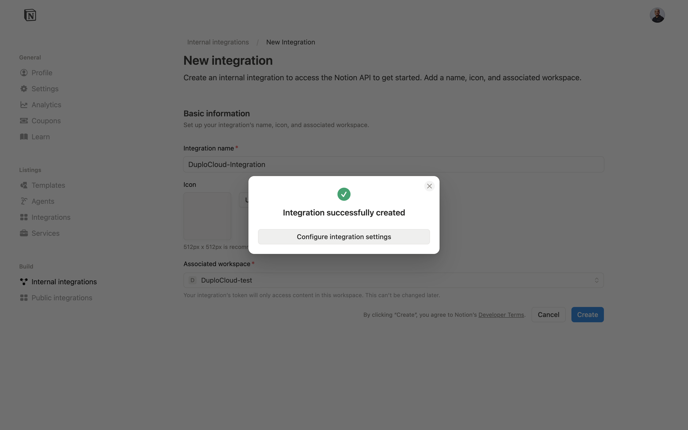

### Step 4 — Copy the Token and Configure Capabilities

On the **Configuration** tab, copy the **Internal integration secret** — this is the API token you will use in DuploCloud.

Under **Capabilities**, you can control exactly what the agent is allowed to do in your workspace:

- **Read content** — allows the agent to read pages and databases
- **Update content** — allows the agent to edit existing pages
- **Insert content** — allows the agent to create new pages and blocks

Enable only the capabilities you need. If Insert and Update content are enabled, the agent can create and modify pages on your behalf when instructed.

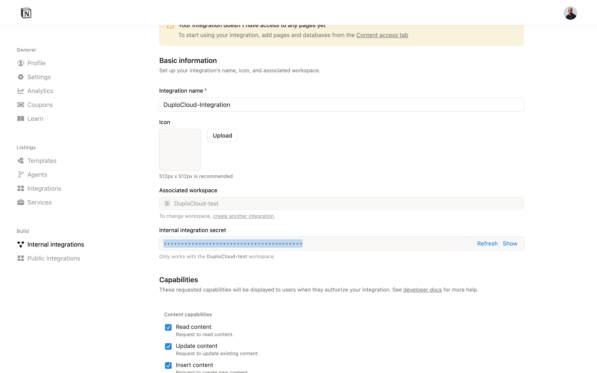

### Step 5 — Grant Page Access

Switch to the **Content access** tab and click **Edit access**. Select the pages and databases this integration is allowed to access. The agent will only be able to interact with pages explicitly shared with it here.

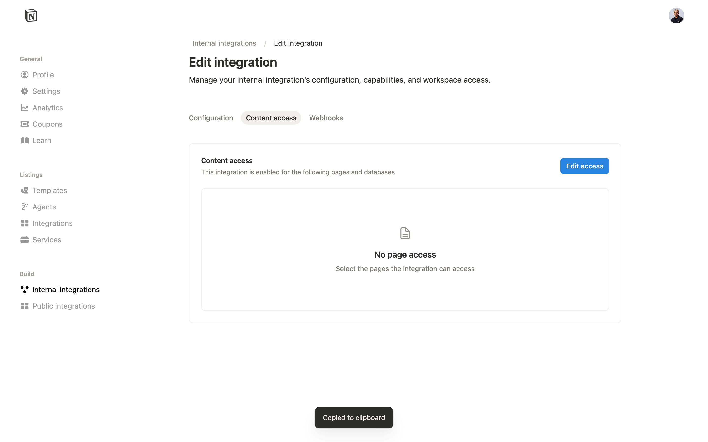

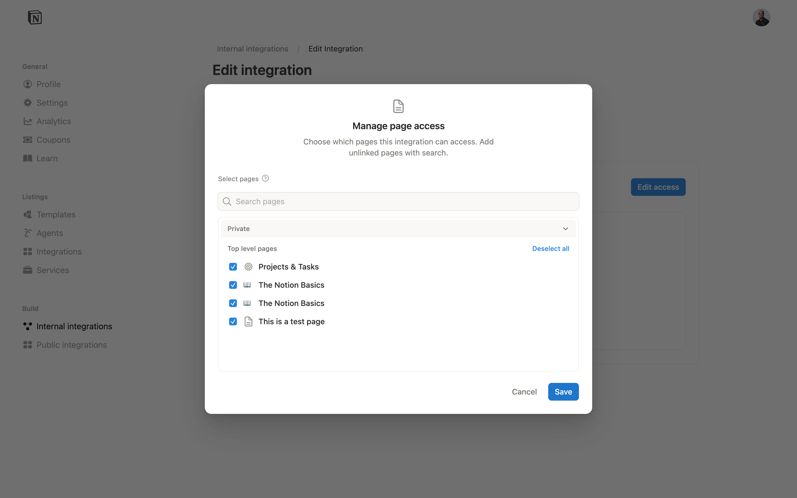

---

## Part 2 — Add the Notion Provider in DuploCloud

### Step 1 — Navigate to Providers > Other

In DuploCloud, go to **Providers** in the left sidebar, select your tenant (e.g. **IT**), and click the **Other** tab. Click **+ Add**.

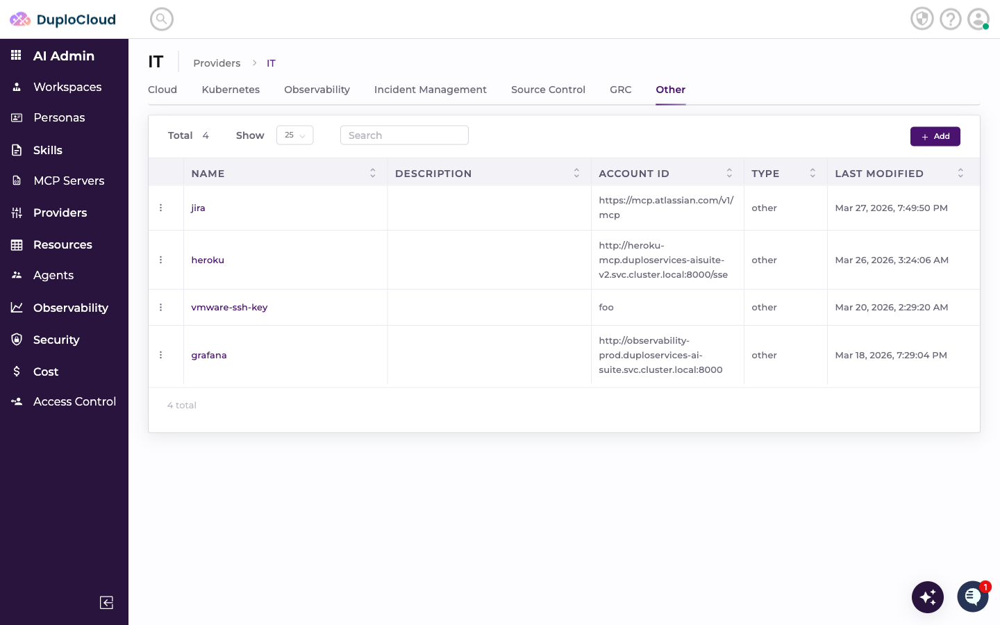

### Step 2 — Fill in the Add Provider Form

In the **Add Provider** form:

- **Name** — a name for this provider (e.g. `Notion-test`)
- **Description** — optional description
- **Type** — select `Other`
- **Account ID** — enter your Notion **Workspace ID**

> **Finding your Workspace ID:** In Notion, go to **Settings** → **General**. Your Workspace ID is listed there.

Click **Create Provider**.

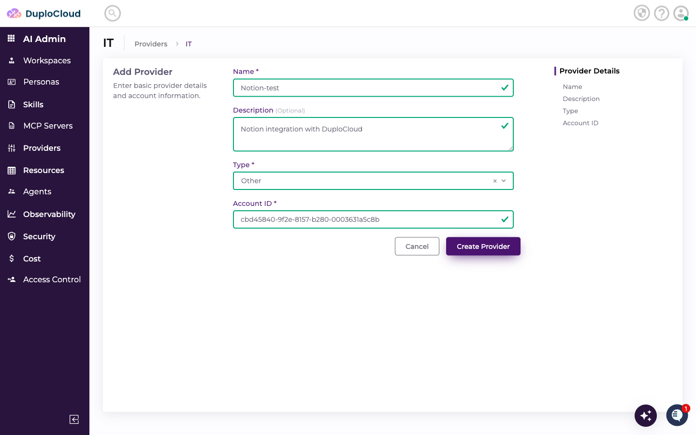

### Step 3 — Provider Created

The provider appears in the **Other** tab with a success notification.

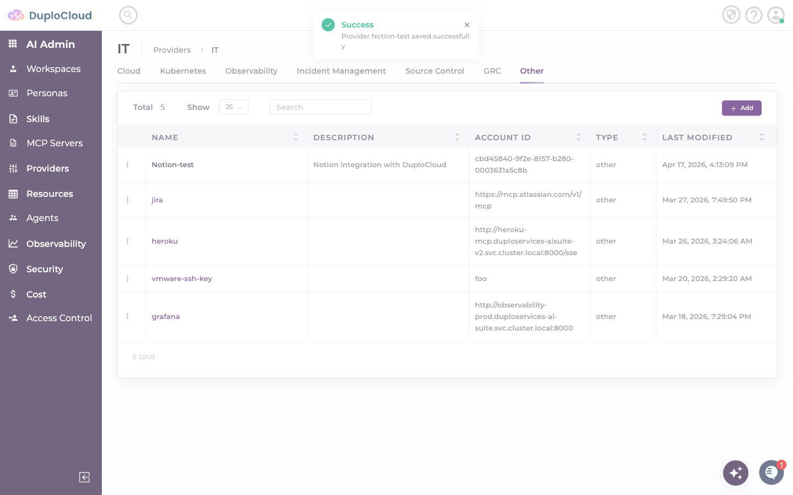

### Step 4 — Add a Credential

Click on your new provider to open it, then go to the **Credentials** tab and click **+ Add**.

In the **Add Credential** modal:

- **Name** — a name for this credential (e.g. `Notion-Cred`)
- **Credential Fields** — click **+ Add Credential Field** and add:
  - **Key** — `IntegrationKey`
  - **Type** — `String`
  - **Sensitive** — on
  - **Value** — paste the integration token copied from Notion (starts with `ntn_...`)

Click **Create**.

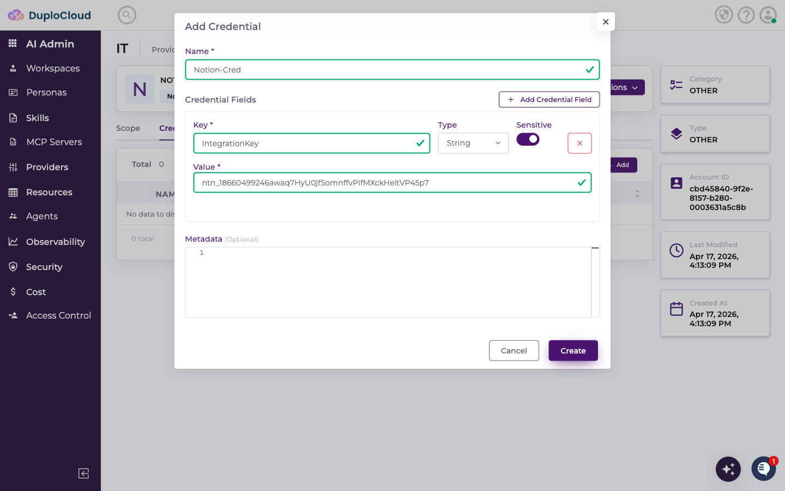

### Step 5 — Add a Scope

On the **Scope** tab, click **+ Add**.

- **Name** — a name for this scope (e.g. `Notion-test-scope`)
- **Credential** — select the credential you just created

Click **Create**.

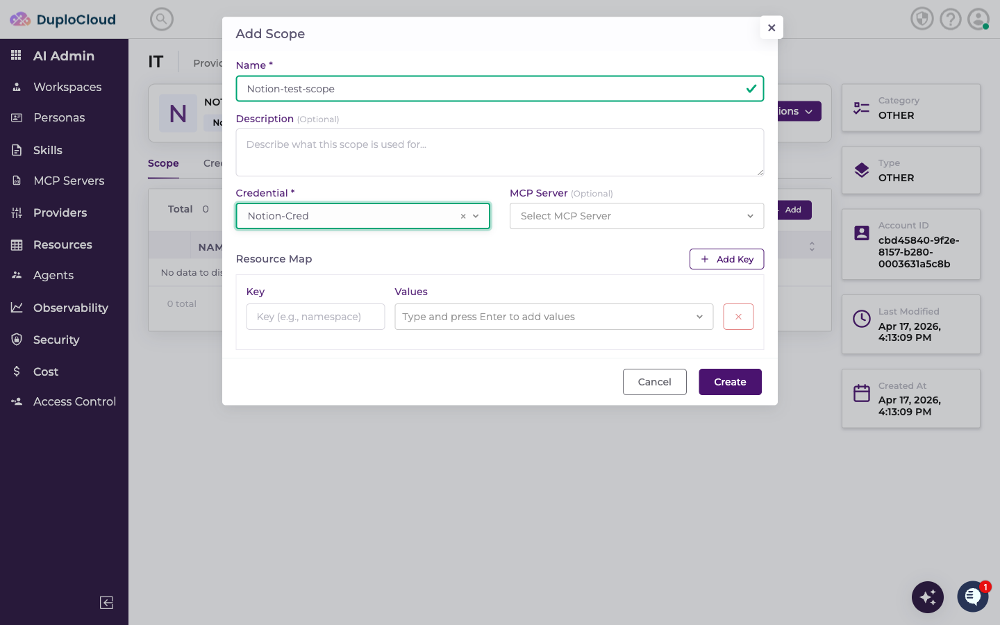

---

## Part 3 — Use the Notion Scope in a Ticket

### Step 1 — Create a Ticket

Go to **HelpDesk** and create a new ticket. In the scope selector, choose the Notion scope you created under your provider.

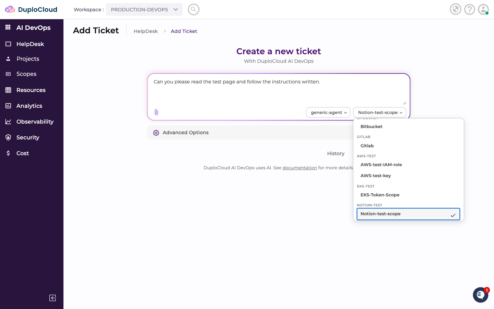

Type your request — for example, asking the agent to read a page and act on its contents — and click **Create Ticket**.

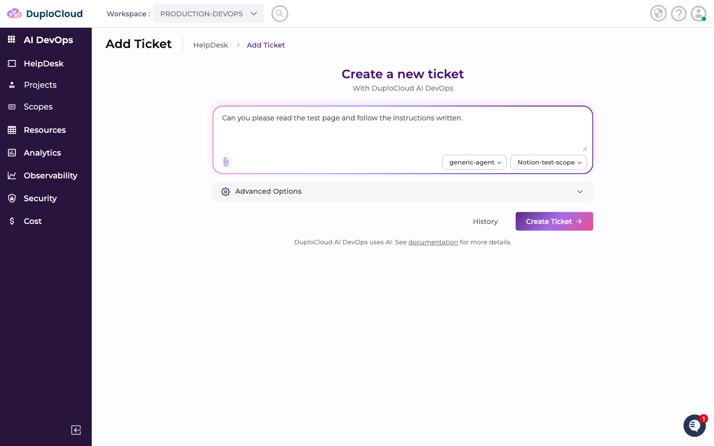

### Step 2 — Agent Output

The agent accesses your Notion workspace using the integration token, reads the specified page, and executes the request. Results appear in the ticket thread.

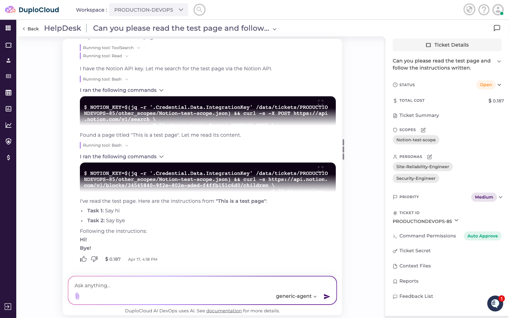
