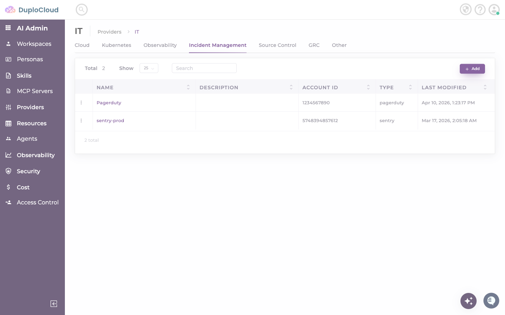
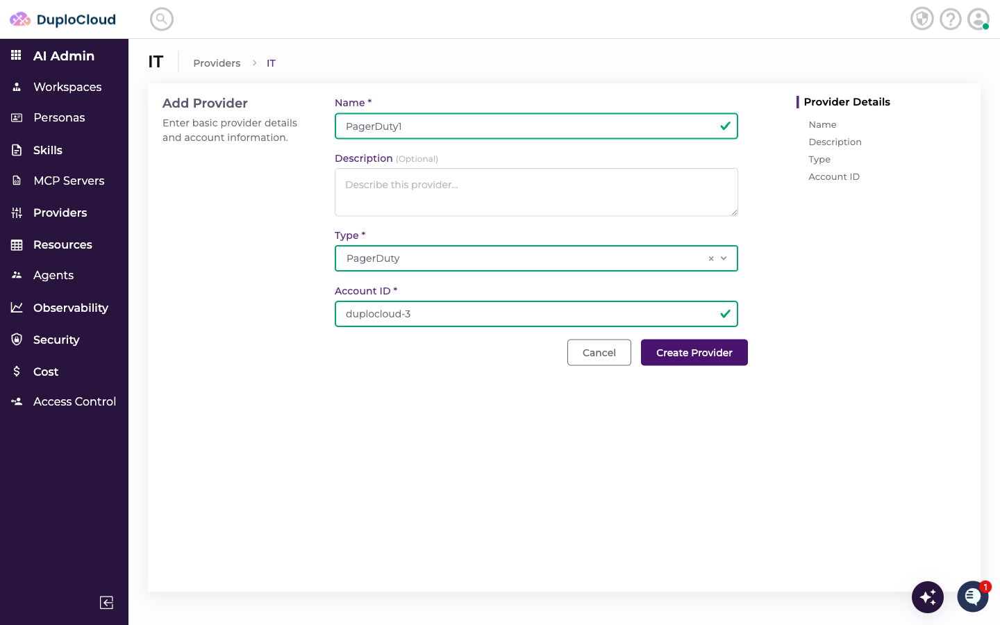
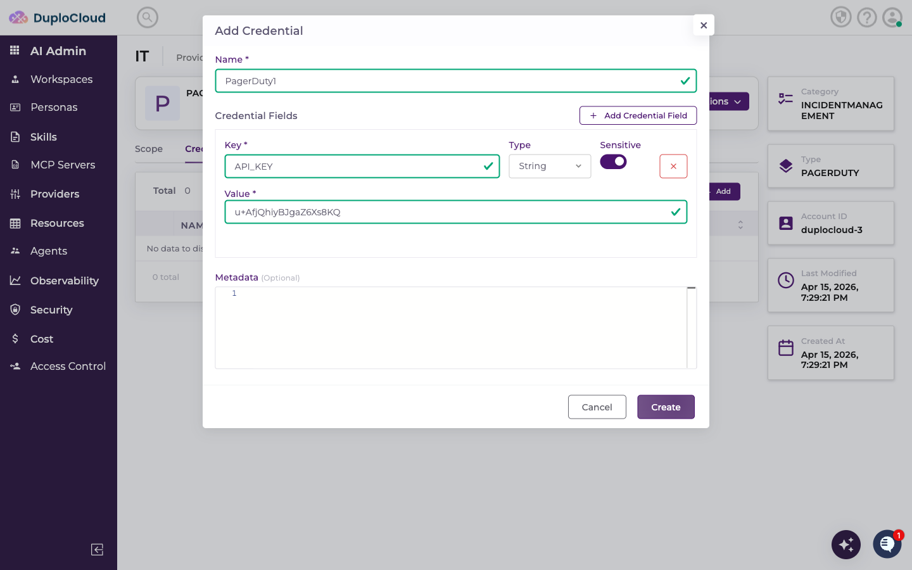
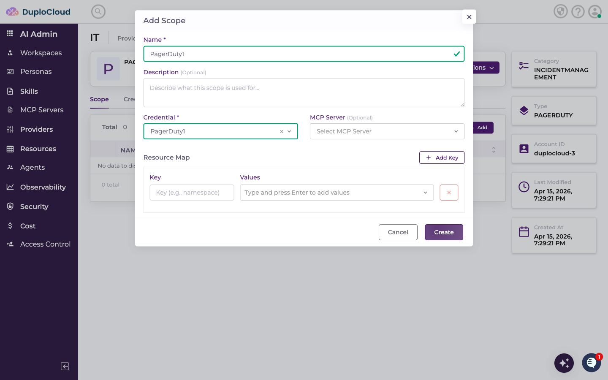
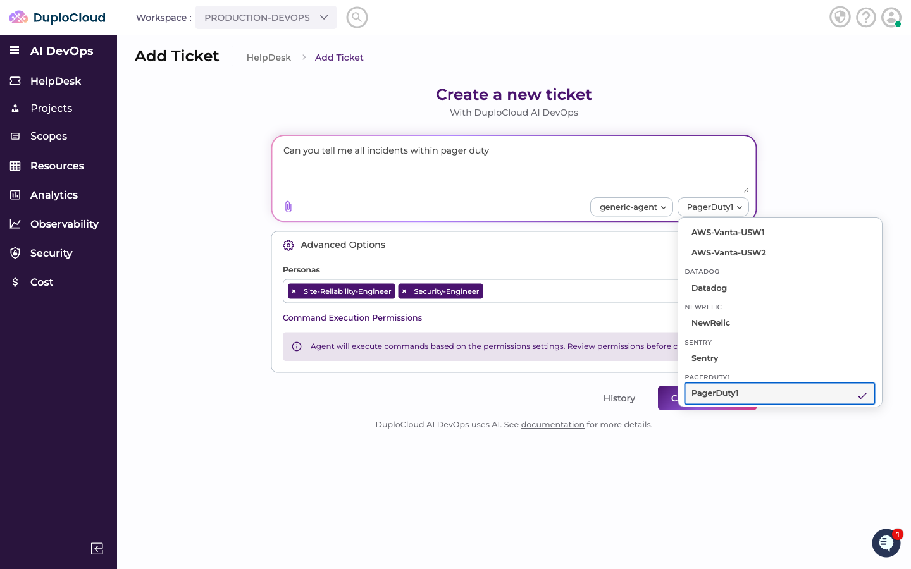
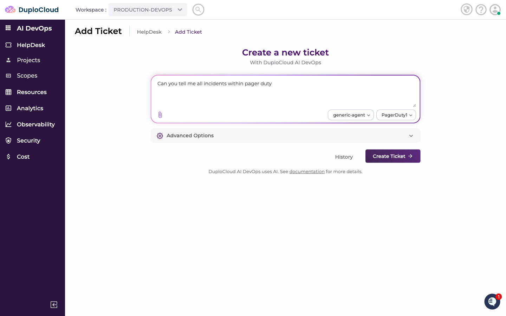
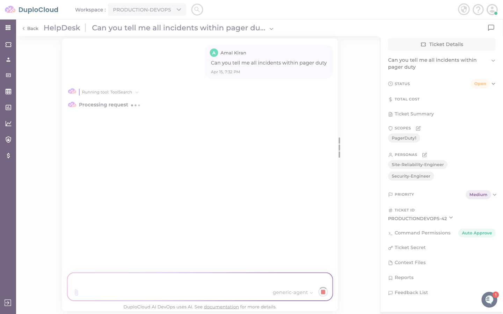
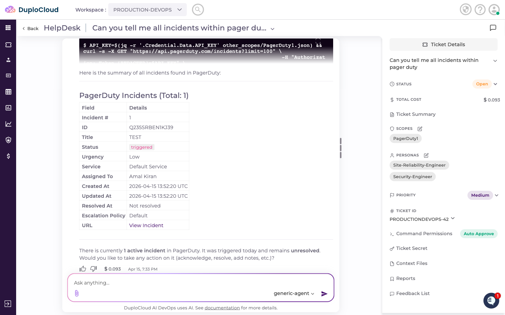
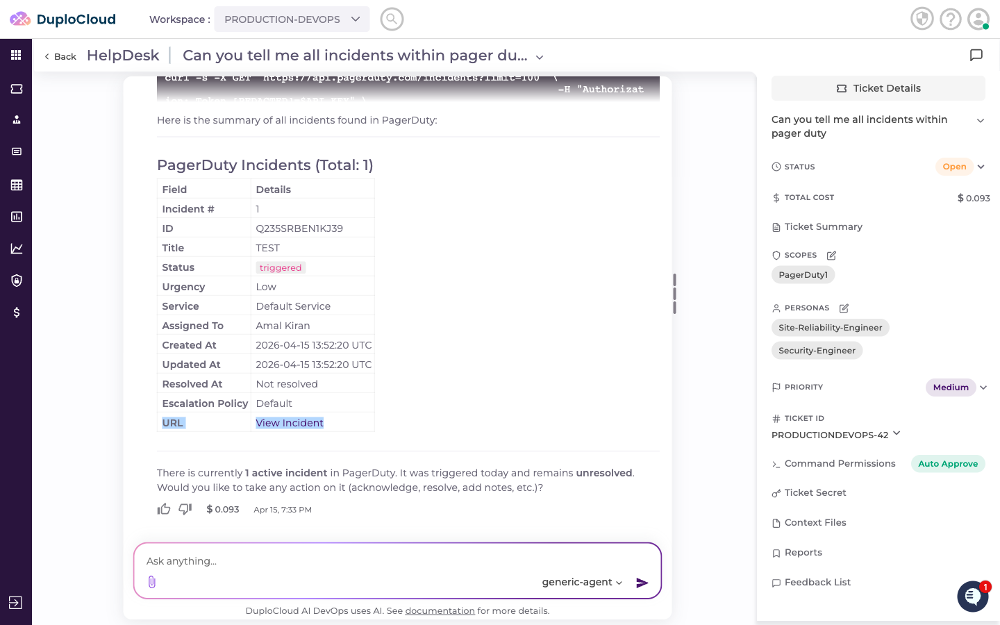

# Connecting PagerDuty to DuploCloud

This guide walks through adding PagerDuty as an Incident Management provider in DuploCloud, configuring credentials, creating a scope, and querying PagerDuty incidents through the AI agent.

---

## Step 1 — Navigate to the Incident Management Providers

Go to **AI Admin** → **Providers** → **IT**, then click the **Incident Management** tab. This lists all incident management providers connected to your account.

---

## Step 2 — Add a New Provider

Click **+ Add**. Fill in the provider details:

- **Name** — a name to identify this provider
- **Type** — select **PagerDuty**
- **Account ID** — a label to identify this account within DuploCloud

Click **Create Provider**.

---

## Step 3 — Add Credentials

The new provider opens on the **Credentials** tab. Click **+ Add** to add a credential. Fill in the credential fields:

- **API_KEY** — your PagerDuty API key (required for reading incidents and services)
- **service_key** — your PagerDuty service integration key (required for agents to create or trigger incidents on a service)
- **user_email** — the email address of the PagerDuty user the agent will act as when acknowledging or resolving incidents

> **Where to find these values:** Your API key can be created in PagerDuty under **Integrations → API Access Keys**. The service integration key is found on the **Integrations** tab of a specific PagerDuty service. The user email should match a valid PagerDuty user in your account.

> **Why service_key and user_email matter:** When an agent resolves, acknowledges, or creates incidents — not just reads them — PagerDuty requires both a service key to target the correct service and a user email to attribute the action. Adding these credentials allows agents to take automated remediation actions, not just report incident status.

Toggle **Sensitive** on for the API key and service key to ensure they are stored securely. Click **Create** to save the credential.

---

## Step 4 — Add a Scope

Switch to the **Scope** tab and click **+ Add**. Fill in:

- **Name** — a label for this scope
- **Credential** — select the credential you just created
- **Description** — optional context for the agent

Click **Create**. The scope appears in the list.

---

## Step 5 — Use PagerDuty in a Ticket

Go to **AI DevOps** → **HelpDesk** → **Add Ticket**. Select **generic-agent** as the agent and choose your PagerDuty scope from the scope dropdown.

Enter your request — for example, asking the agent to list all active incidents. Click **Create Ticket**.

---

## Step 6 — Agent Queries PagerDuty

The agent connects to PagerDuty using the scope credentials and retrieves the current incidents.

The response includes a structured summary of all incidents — ID, title, status, urgency, service, assignee, timestamps, and a direct link to each incident. The agent also offers to take action: acknowledge, resolve, or add notes.

