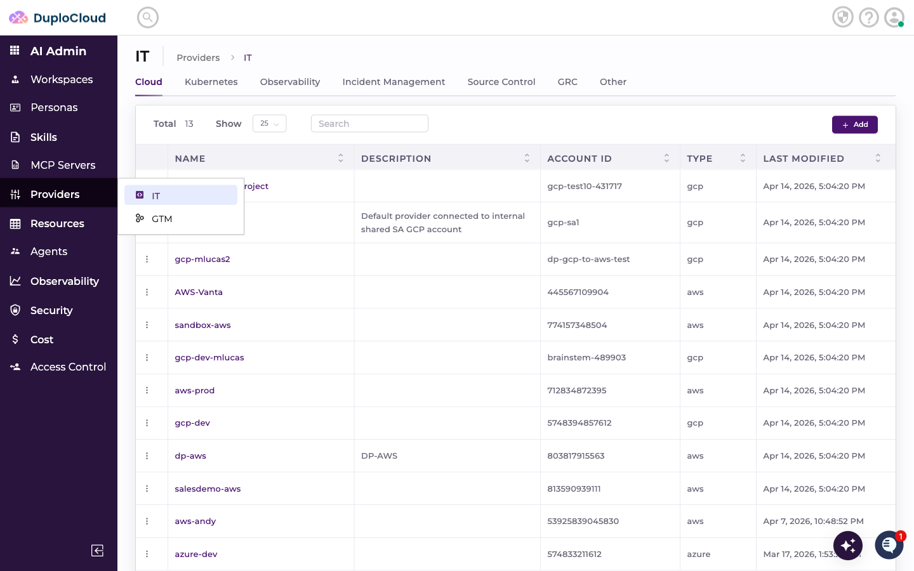
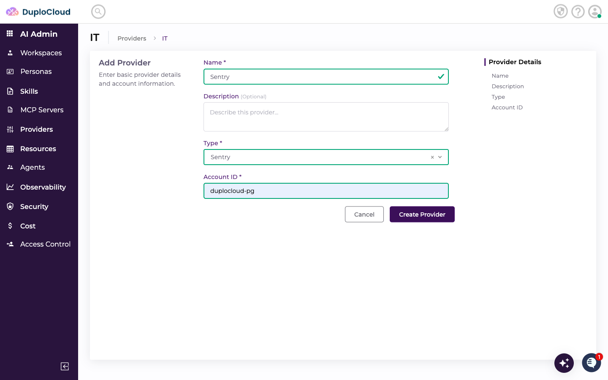
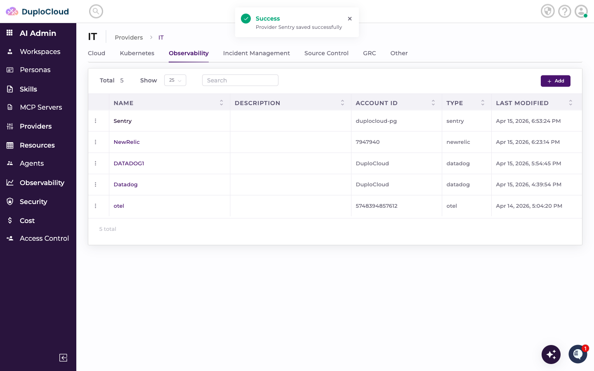
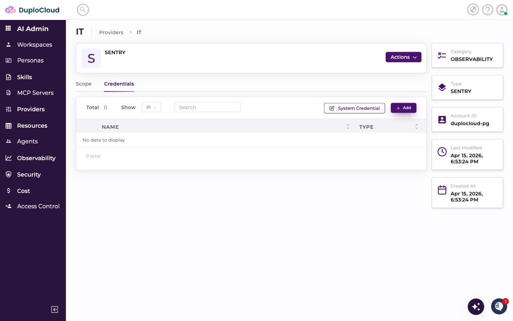
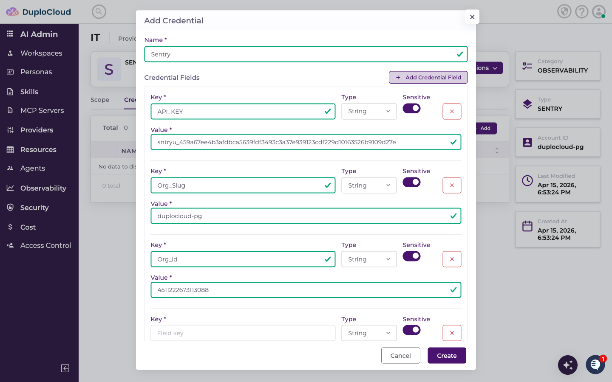
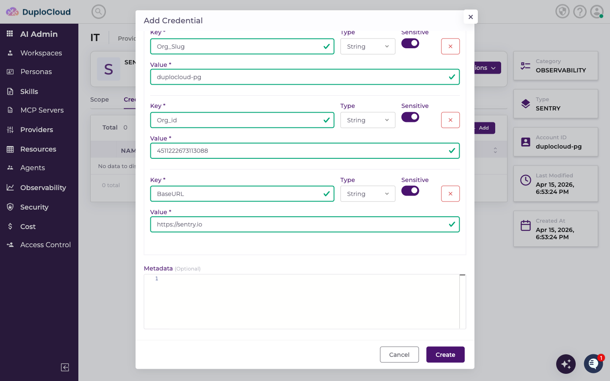
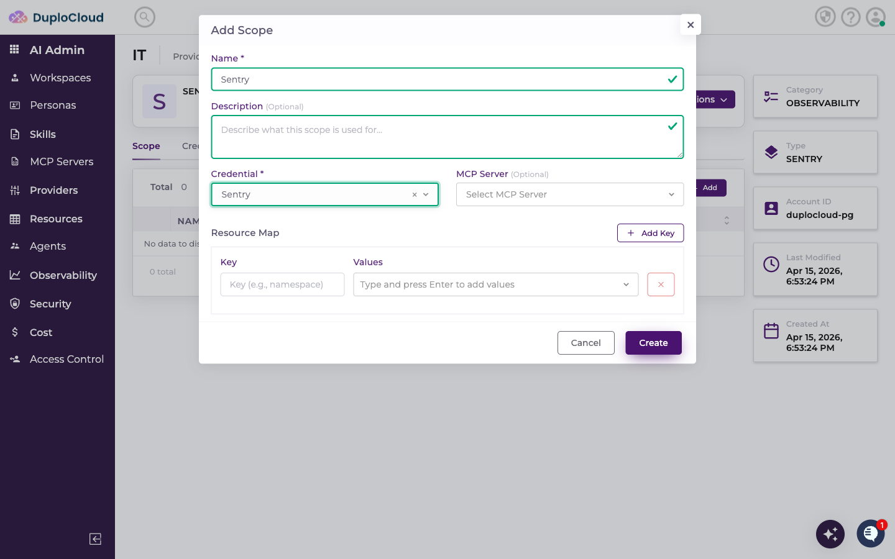
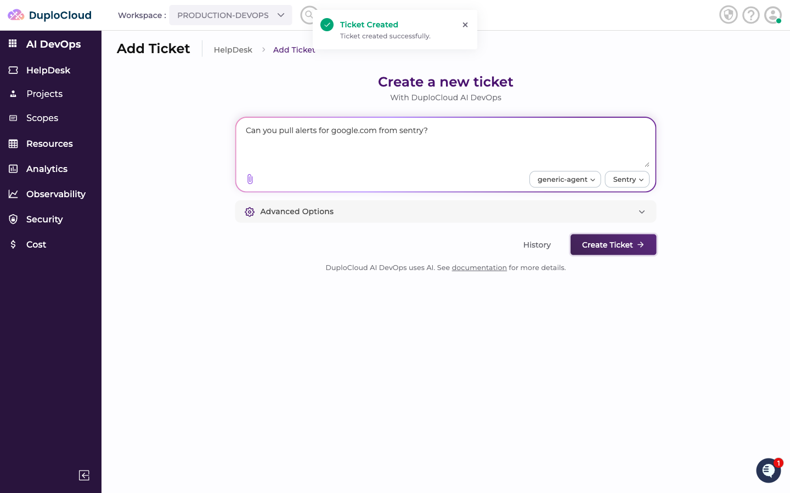
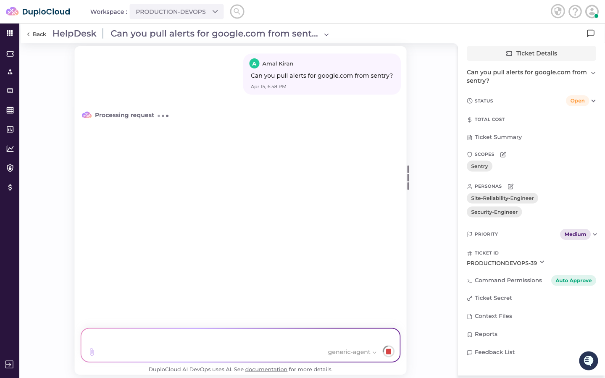
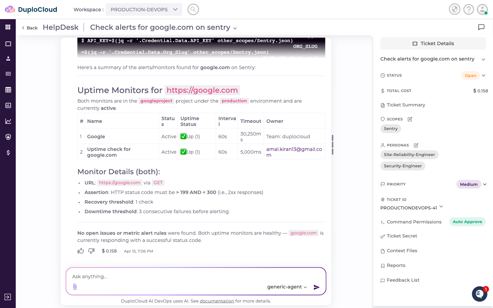

# Connecting Sentry to DuploCloud

This guide walks through adding Sentry as a provider in DuploCloud, configuring credentials, creating a scope, and querying Sentry data through the AI agent.

---

## Step 1 — Navigate to the Observability Providers

Go to **AI Admin** → **Providers** → **IT**, then click the **Observability** tab. This lists all observability providers connected to your account.

---

## Step 2 — Add a New Provider

Click **+ Add** and fill in the provider details:

- **Name** — a name to identify this provider
- **Type** — select **Sentry**
- **Account ID** — your Sentry organisation slug (the short identifier for your org, visible in your Sentry URL: `sentry.io/organizations/<org-slug>/`)

Click **Create Provider**. The new provider appears in the Observability list.

---

## Step 3 — Add Credentials

The new provider opens on the **Credentials** tab. Click **+ Add** to add a credential.

Fill in the credential fields:

- **API_KEY** — your Sentry authentication token
- **org_slug** — your Sentry organisation slug
- **Org_Id** — your Sentry organisation ID
- **base_url** — the Sentry API base URL (e.g. `https://sentry.io`)

> **Where to find these values:** Create an authentication token in Sentry under **Settings → Developer Settings → Auth Tokens**. Your organisation slug and ID are visible in Sentry under **Settings → General Settings**. The base URL is `https://sentry.io` unless you are on a self-hosted instance.

Click **Create** to save the credential.

---

## Step 4 — Add a Scope

Switch to the **Scope** tab and click **+ Add**. Fill in:

- **Name** — a label for this scope
- **Credential** — select the credential you just created
- **Description** — optional context for the agent

Click **Create**.

---

## Step 5 — Use Sentry in a Ticket

Go to **AI DevOps** → **HelpDesk** → **Add Ticket**. Select **generic-agent** as the agent and choose your Sentry scope from the scope dropdown.

Enter your request and click **Create Ticket**.

---

## Step 6 — Agent Queries Sentry

The agent connects to Sentry using the scope credentials and processes the request.

The response includes uptime monitor status, alert conditions, recent issues, and a plain-language summary.

