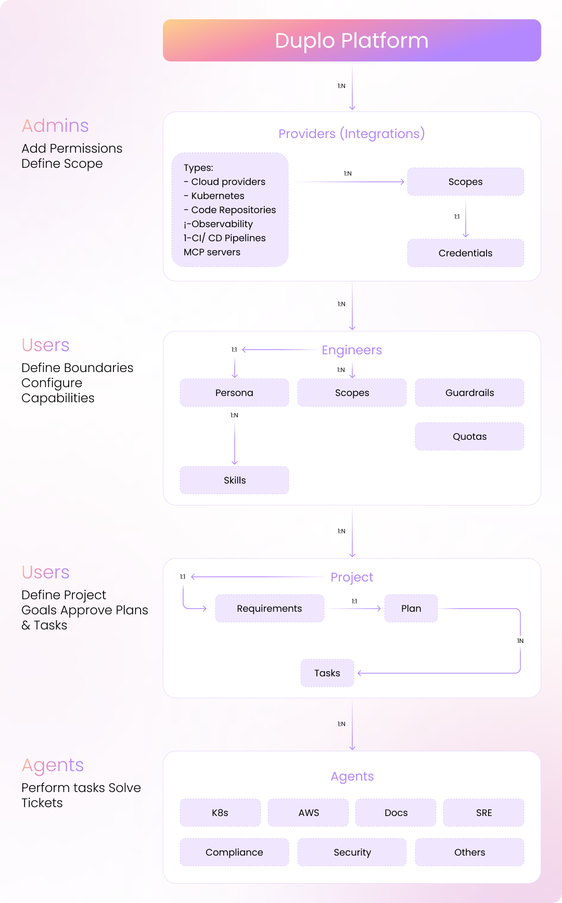

# AI Devops Policy Model

The DuploCloud AI DevOps Policy Model lays down the foundational building blocks of the system that orchestrates large and complex DevOps projects seamlessly—just as a human engineer would.&#x20;

This diagram illustrates a hierarchical AI DevOps platform architecture. Administrators define permissions and integrations, Engineers are configured with capabilities and boundaries, Projects break down requirements into executable plans and tasks, and specialized Agents carry out the actual work through multi-agent orchestration in a ticket-based workflow.

<figure><picture><source srcset="../../.gitbook/assets/duplocloud-diagram-2-dark.png" media="(prefers-color-scheme: dark)"></picture><figcaption></figcaption></figure>

## Core Concepts

Below are brief introductions to the core concepts of the AI DevOps Policy Model, which will be explained in detail in subsequent sections.

### 1. Engineer

The Engineer is the primary entity representing an AI DevOps Engineer. Each Engineer has a unique name within your organization, is defined by a set of key attributes that govern its behavior and capabilities, and contains a container of Skills called a Persona. The Engineer operates within defined access boundaries called Scope, with specific exceptions managed through Guardrails. As it works, the Engineer builds a Knowledge Base of learned information about the environment. Resource usage is controlled through Quota settings, and the Engineer's performance is tracked through Health Metrics, which include analytics and cost data.

### 2. Skill

A Skill is an instruction or prompt that tells an agent how to behave or what capabilities it has. Skills represent the atomic unit of capability within the system. Examples include Kubernetes troubleshooting skills, Terraform provisioning skills, cost optimization skills, and custom skills tailored specifically to an organization's workflows or requirements.&#x20;

### 3. Persona

A Persona serves as a logical container that organizes multiple Skills together. Personas help customers organize capabilities by role or function, making it easier to manage and deploy different sets of abilities. For instance, an SRE Persona might combine troubleshooting, monitoring, and incident response skills. Similarly, a Provisioning Persona could bundle Terraform skills with Kubernetes deployment skills, while a Security Persona might group compliance skills with security scanning skills.

### 4. Provider

A Provider is a system that an Engineer can access, including cloud platforms (AWS, Azure, GCP), repositories, MCP Servers, and more. Each Provider is associated with a specific account or namespace and requires a credential reference for authentication. Credentials can be stored in DuploCloud or referenced externally, enabling just-in-time, scoped access to resources without exposing sensitive authentication data.

### **5. Scope**

Scope defines what an Engineer can access within each Provider. Each Scope entry specifies a Provider and associated Credential, and includes granular access controls through regions, resource types, tags, or custom resource maps (key-value pairs for filtering specific resources like namespaces). Scope can also include MCP Servers for extended system access.

### 6. Guardrails

Guardrails define exceptions within a Scope, specifying what an Engineer cannot access or perform. These restrictions can target specific resources to exclude—such as a production database instances—specific operations that should be restricted, or entire environments that should be avoided. Guardrails provide fine-grained control over the Engineer's permissions within its broader Scope.

### 7. Quota and Quality of Service

Quota and Quality of Service (QoS) settings control resource limits for the Engineer. These controls can include maximum concurrent projects, token limits, and cloud resource provisioning limits. The system is designed to accommodate additional options in future versions as requirements evolve.

### 8. Knowledge Base

The Knowledge Base represents the Engineer's learned understanding of the environment. It captures architecture and topology information, relationships between systems, codebase structure, and historical context from completed work. This knowledge is stored both as files in customer repositories in markdown format and in a vector database within DuploCloud, enabling efficient retrieval and reference during operations.

## Workflow concepts

Below are some of the workflow concepts in the AI DevOps Policy Model:&#x20;

### 1. Project

A Project is a logical entity representing planned work. Each Project contains a Title and Summary. The heart of a Project are its requirements, which can be defined in plain English.

### 2. Requirements

Requirements are a user-generated document that enumerates a Project’s goals and objectives in natural language. Every Project includes associated user requirements, which may also specify how a Project’s goals are to be accomplished.

### 3. Plan

A Plan represents an execution plan containing tasks. It is an Agent-generated breakdown of how to accomplish a Project's Requirements. An Agent derives the Plan from the Requirements and requires human approval before execution. Plans are versioned whenever the underlying requirements change, ensuring full traceability. If you reject a Plan, you can provide feedback for regeneration, allowing iterative refinement until the Plan meets your requirements.

### 4. Task

A Task represents a unit of work within a Plan. An Agent generates Tasks from an approved Plan, and each Task is assigned to an Agent based on the Skill needed to complete it. Tasks require human approval before proceeding and become Tickets once approved. You have the flexibility to add new Tasks by providing feedback to the Agent and can override Task routing decisions within the Plan if needed. 
