# Reports

The **Reports** section under **Analytics** stores and organizes document-based reports generated by AI agents during ticket work. You can browse all reports, filter by category, preview content inline, and add new reports from files attached to any ticket.

## Viewing Reports

Navigate to **Analytics** > **Reports** in the left sidebar.

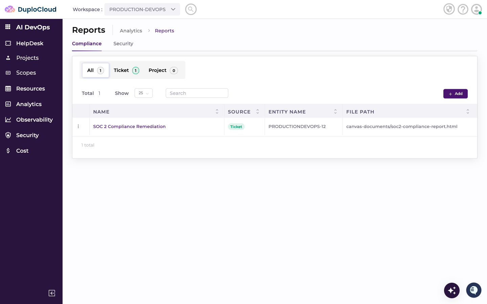

The list shows every registered report. Use the **Compliance** and **Security** tabs at the top to filter by category. Each row shows the report name, its source, the entity (ticket) it came from, and the file path on disk.

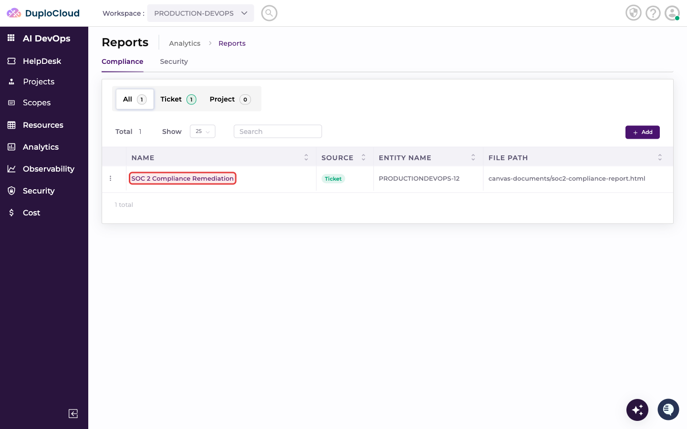

Click any report name to open a full inline preview.

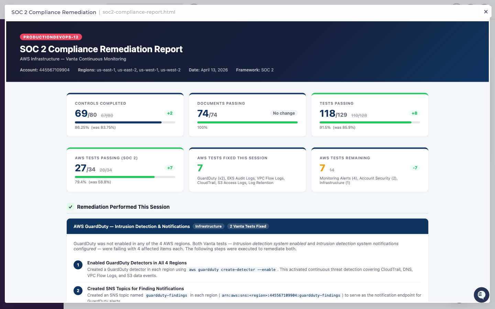

## Adding a Report

Reports are sourced from files that an agent deposited into a ticket during its work. To register a file as a report:

### 1. Click Add

Click the **Add** button in the top-right corner of the Reports list.

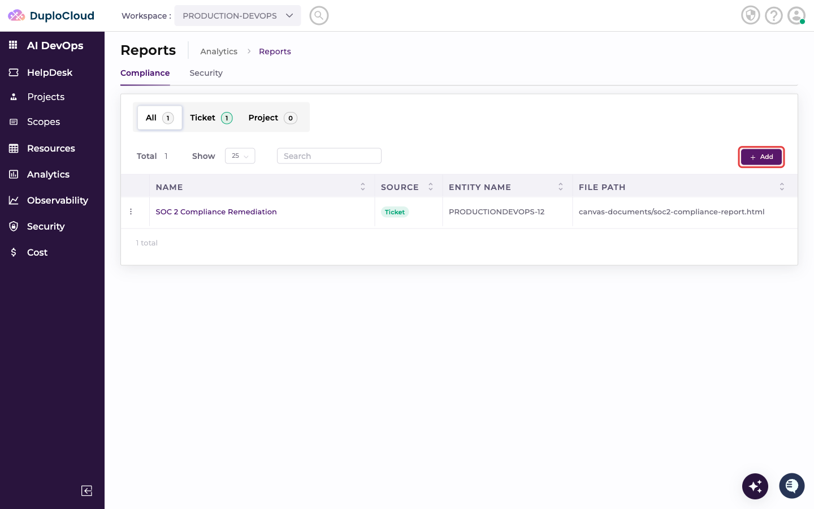

The **Add Report Files** modal opens. The **Source** field defaults to **Ticket**.

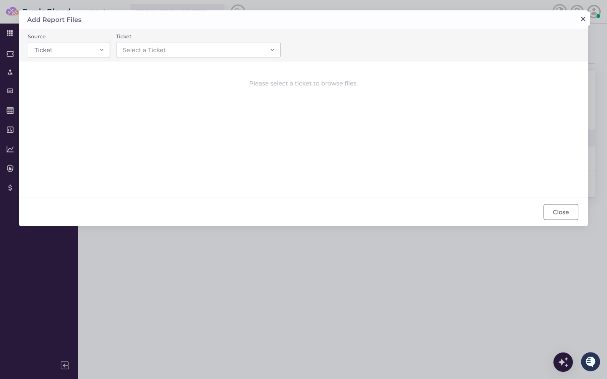

### 2. Select the ticket

Click the **Ticket** dropdown and type part of the ticket name to search. Select the ticket whose files you want to browse.

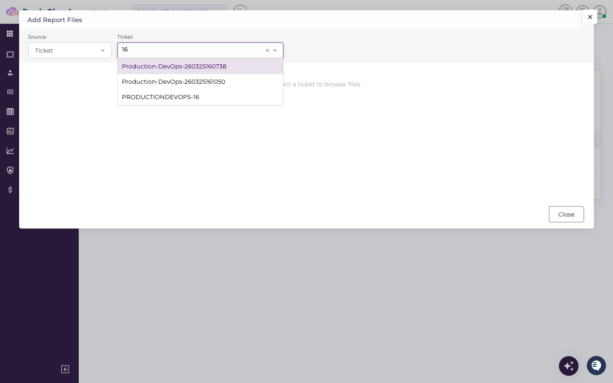

### 3. Browse files

Once a ticket is selected, the modal displays the agent's working directory. Expand folders to navigate to the file you want to add. The **Report** column shows a badge on any file that has already been registered as a report.

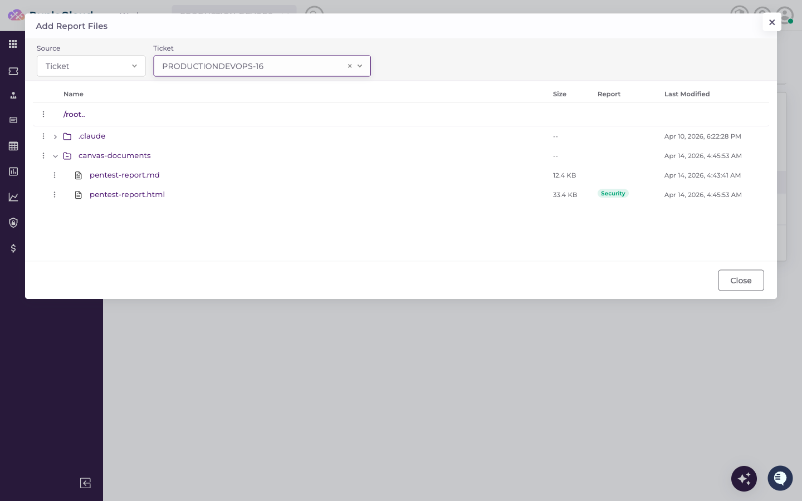

### 4. Open the file menu

Click the **⋮** icon on the row of the file you want to add, then select **Add to Reports**.

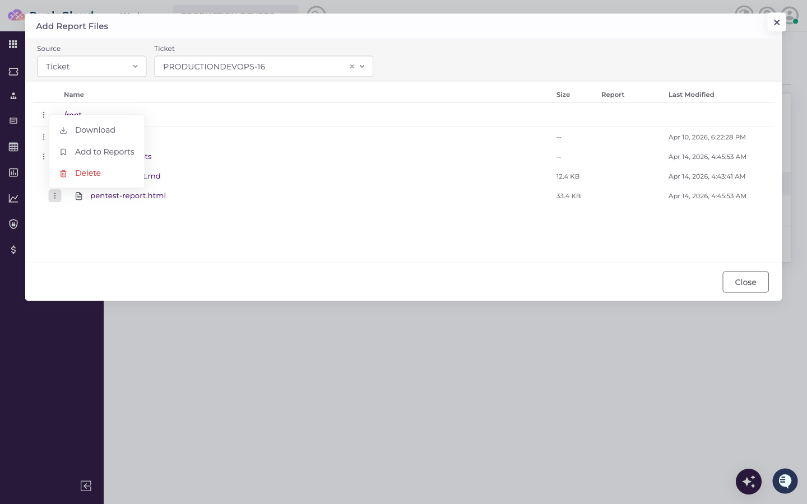

### 5. Enter report details

The **Add to Reports** dialog appears, pre-filled with the selected file name. Enter a **Name** for the report and, optionally, a **Category**. The category determines which tab the report appears under on the Reports list.

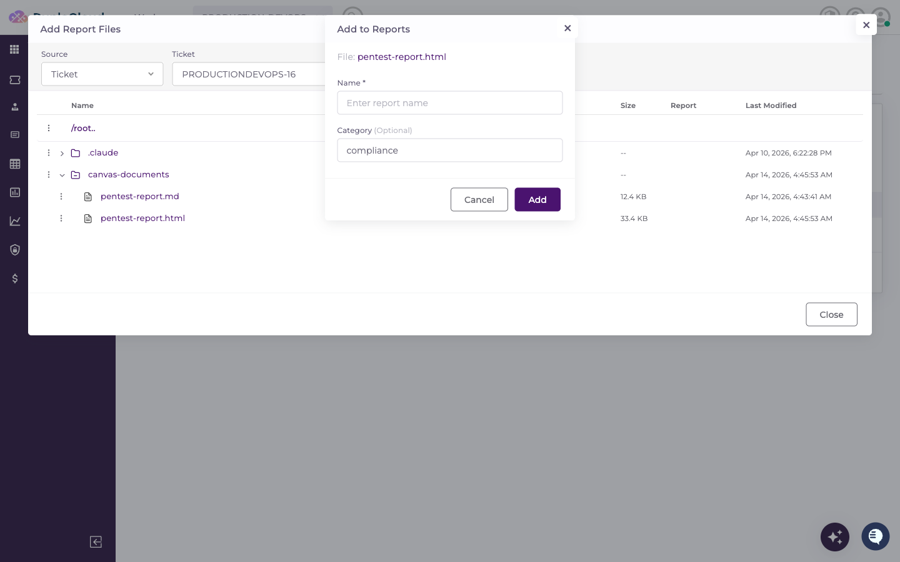

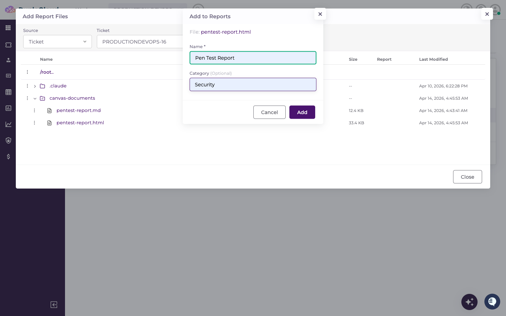

Click **Add** to save the report.

## Viewing the New Report

After saving, the report is immediately available in the Reports list. Click the tab that matches the category you entered to filter the view.

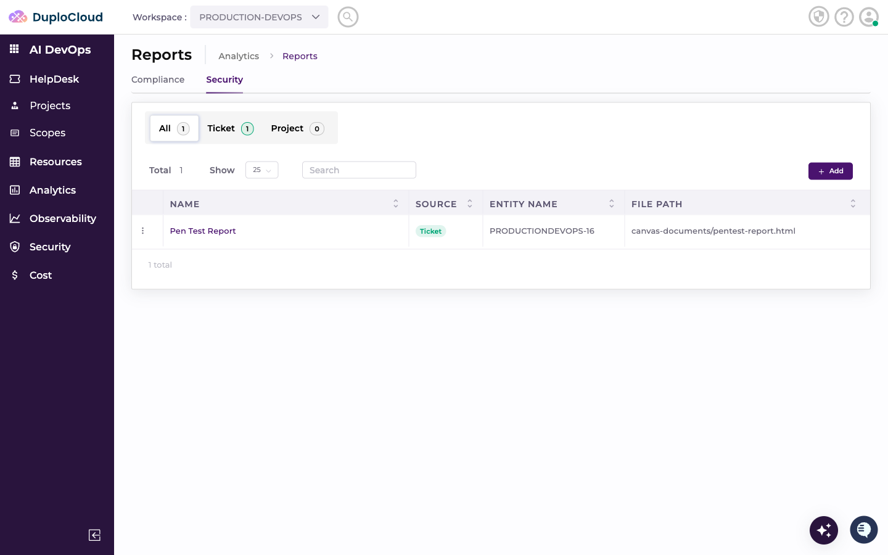

The new report appears in the list.

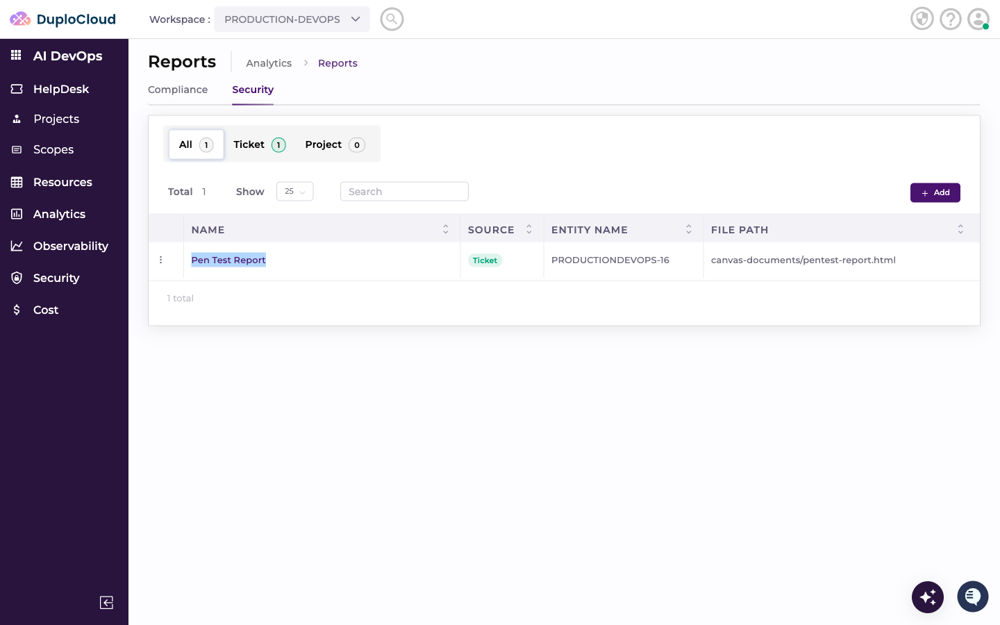

Click the report name to open the inline preview.

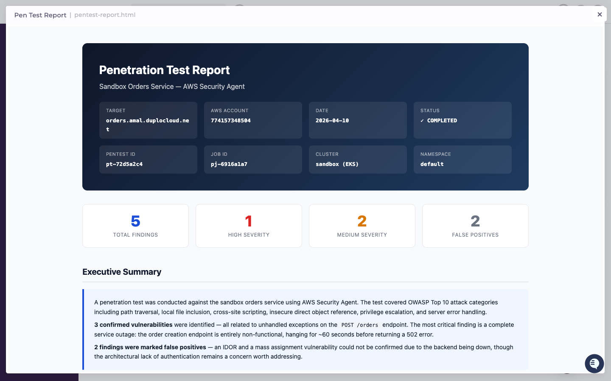
