# Resources

The Resources section gives you a unified view of infrastructure resources managed across your cloud providers. From the left navigation sidebar, expand **Resources** to access provider sub-sections.

When a cloud **Provider** is configured, its resources are automatically discovered and displayed here. For example, DuploCloud AI Suite supports viewing AWS resources (EC2, RDS, S3, and more) and Kubernetes resources (Pods, Deployments, Services, and more).

---

## AWS Resources

Selecting **AWS** under Resources opens the AWS resource browser, displaying resources from the currently selected scope.

### EC2 Instances

The default view shows **EC2 Instances** — virtual machines running in your cloud environment. The table displays each instance's name, instance ID, type, state, availability zone, private and public IP addresses, and VPC.

---

### Switching Scopes

The **Scope** selector at the top right of the page shows the current cloud account and tenant being viewed. Click it to open a dropdown listing all available scopes you have access to.

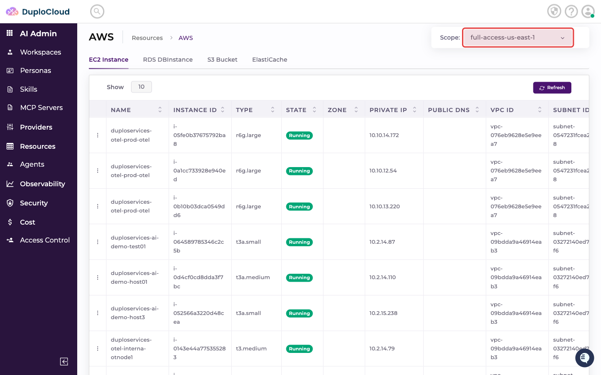

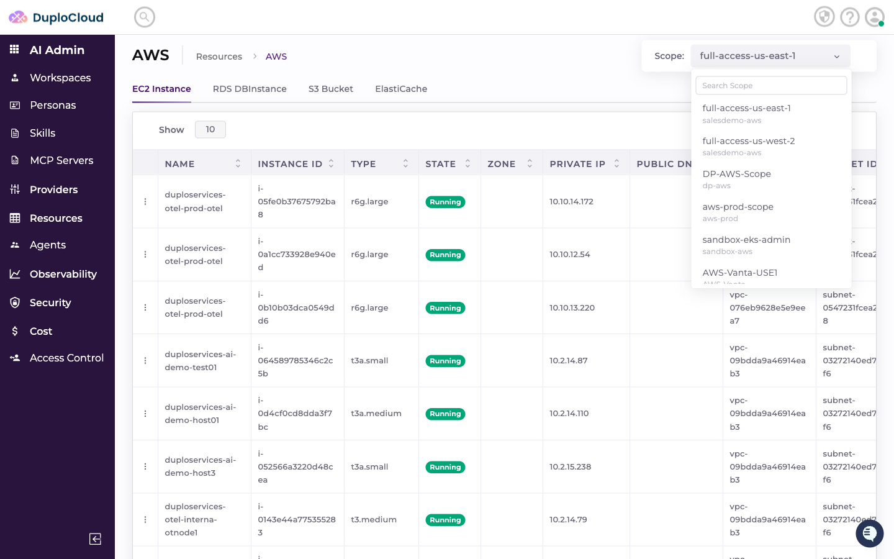

Select a different scope to view resources in that environment. The table immediately updates to show resources belonging to the selected scope.

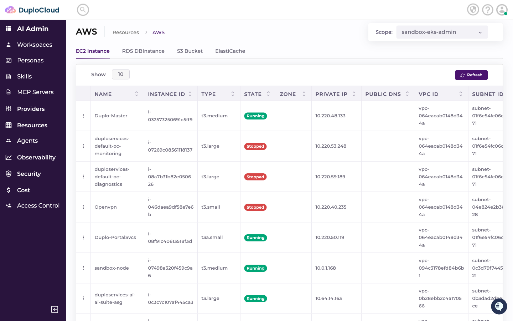

---

### RDS Databases

Click the **RDS DBInstance** tab to view managed relational database instances. The table shows each database's name, role, engine type, endpoint, status, and instance size.

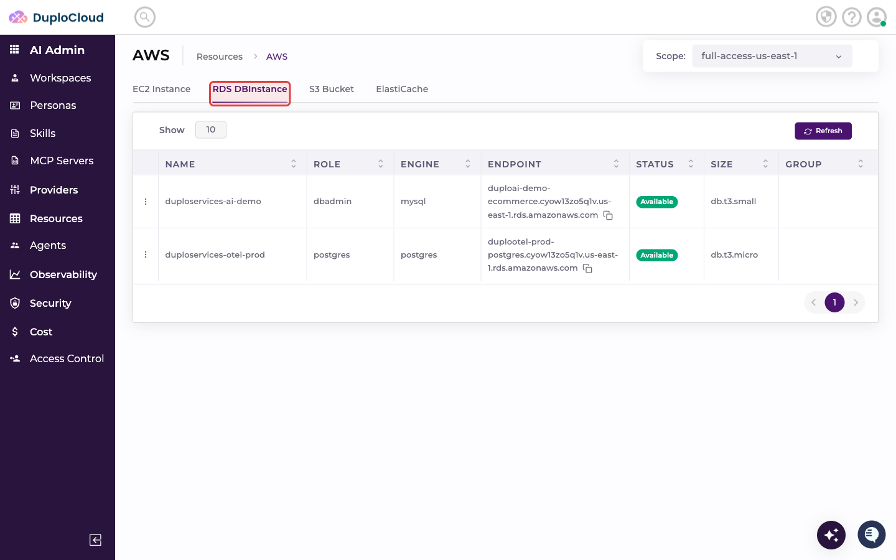

---

### S3 Buckets

Click the **S3 Bucket** tab to view object storage buckets. The table shows each bucket's name and ARN.

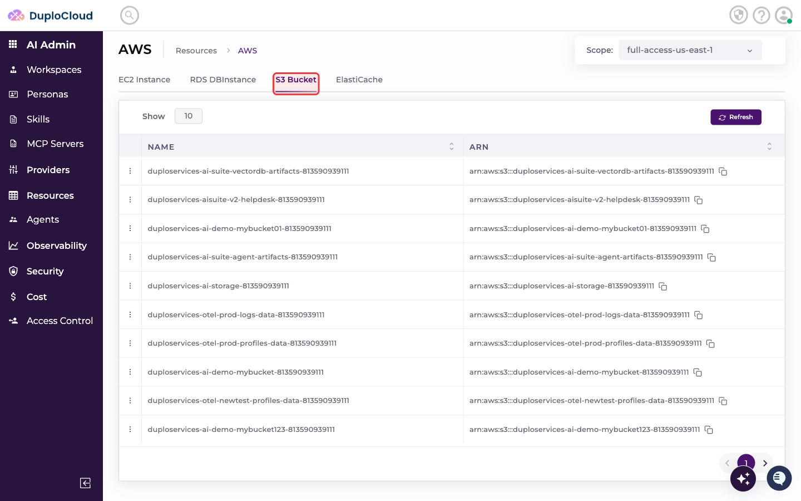

---

## Kubernetes Resources

Selecting **Kubernetes** under Resources opens the Kubernetes resource browser. The tab bar at the top lets you switch between resource types: Pods, Deployments, DaemonSets, StatefulSets, Jobs, CronJobs, Services, and more.

### Pods

The default Kubernetes view shows **Pods** — the basic unit of deployment in Kubernetes. The table displays each pod's name, namespace, containers, restart count, controlling resource, node, QoS class, and status.

---

### Switching Scope and Namespace

The Kubernetes resource view provides two selectors in the page header:

- **Scope** — selects the Kubernetes cluster or environment to inspect
- **Namespace** — filters resources to a specific Kubernetes namespace within that scope

#### Changing the Scope

Click the **Scope** badge in the header to open the scope dropdown, which lists all Kubernetes clusters you have access to.

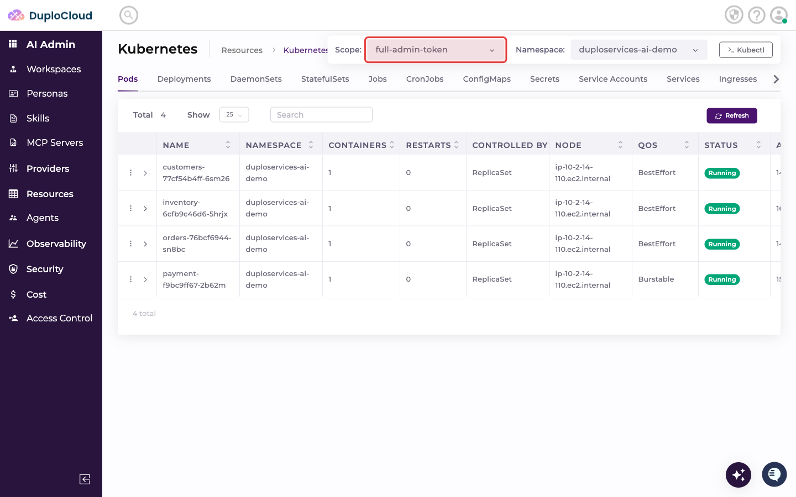

Select the desired scope. The resource list updates immediately to show resources in the selected cluster.

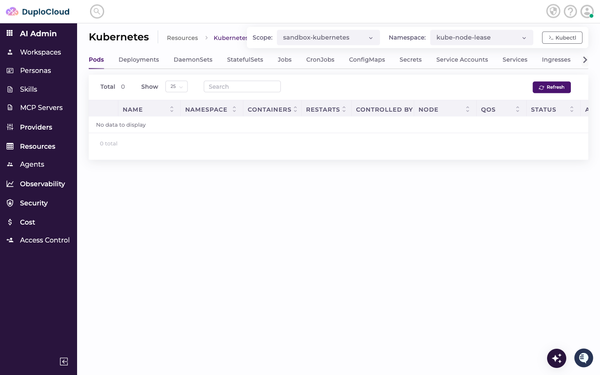

#### Changing the Namespace

Click the **Namespace** badge next to the scope to open the namespace dropdown, which lists all namespaces available within the current scope.

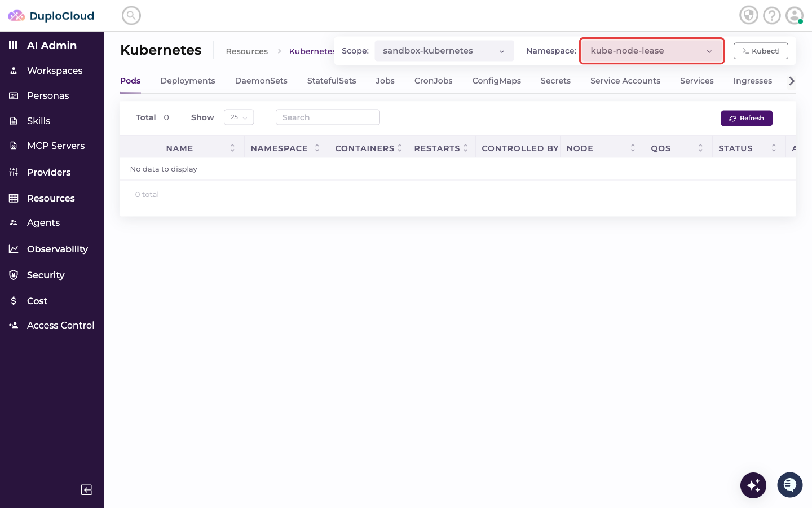

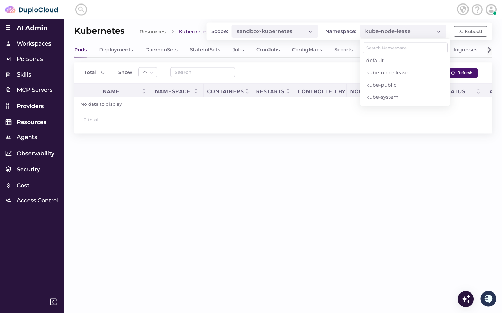

Select a namespace to filter the displayed resources.

---

### Deployments

Click the **Deployments** tab to view Kubernetes Deployments. The table shows each deployment's name, namespace, pod count, replica count, status, and age.

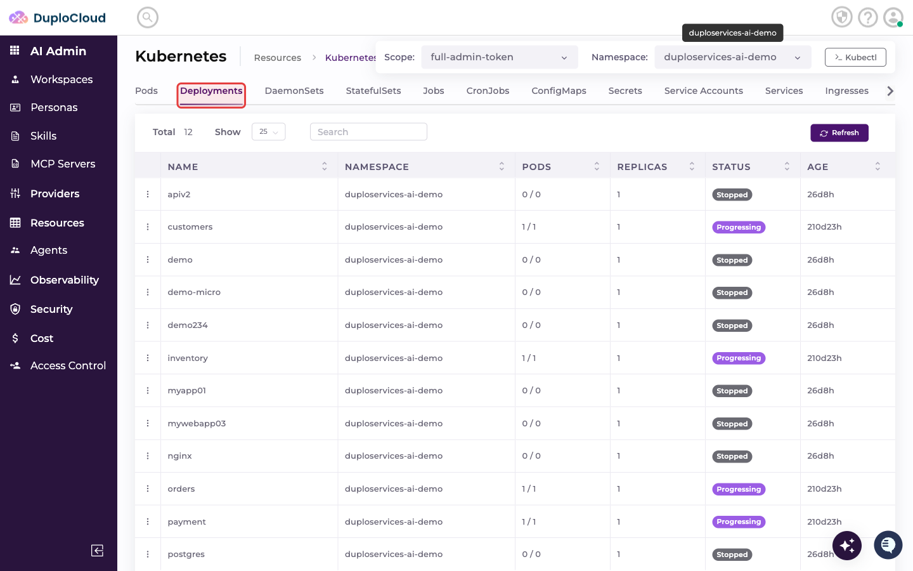

---

### Services

Click the **Services** tab to view Kubernetes Services. The table shows each service's name, namespace, type, cluster IP, ports, external IP, status, and age.

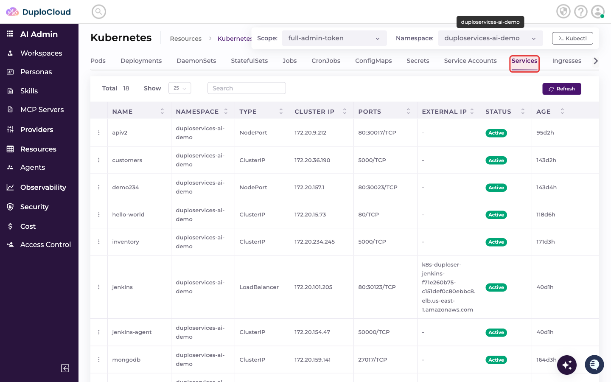
