# Using the DuploCloud AI Bot in Slack

The DuploCloud AI bot lets you interact with DuploCloud directly from Slack — ask questions, run queries, and manage resources without leaving your workspace. The bot creates a ticket in DuploCloud HelpDesk on your behalf and returns the results back in the same Slack thread.

---

## Step 1 — Message the Bot in Your Channel

In your DuploCloud-connected Slack channel, type your request and mention the bot (e.g. `@DuploCloud AI Devops`). The bot responds in a thread confirming it is ready to help and prompts you to create a ticket with your request details.

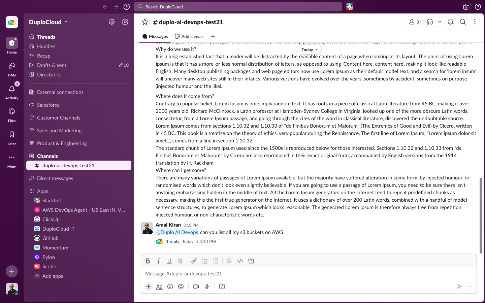

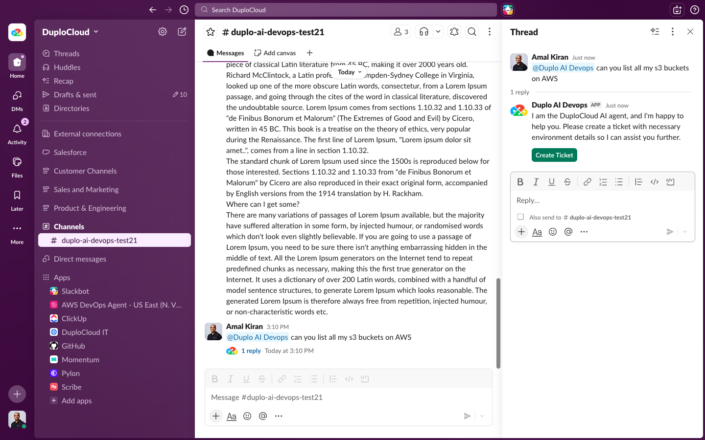

---

## Step 2 — Create a Ticket

Click **Create Ticket** in the bot's thread response. A modal appears with the following fields:

- **HelpDesk** — the DuploCloud HelpDesk instance to submit the ticket to
- **Workspace** — the DuploCloud workspace the agent should operate in
- **Agent** — the agent to handle the request (e.g. `generic-agent`)
- **Scopes** — select the scope that grants the agent the permissions it needs (e.g. `full-access`, `cluster-admin`)

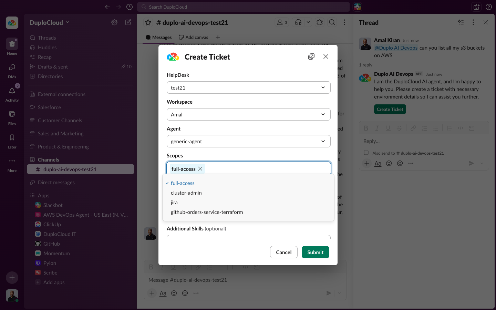

Expand **Advanced** to set optional parameters:

- **Personas** — assign personas to shape how the agent responds
- **Additional Skills** — add specific skills for the agent to use
- **Auto Approve Commands** — check this to skip manual approval prompts for agent commands

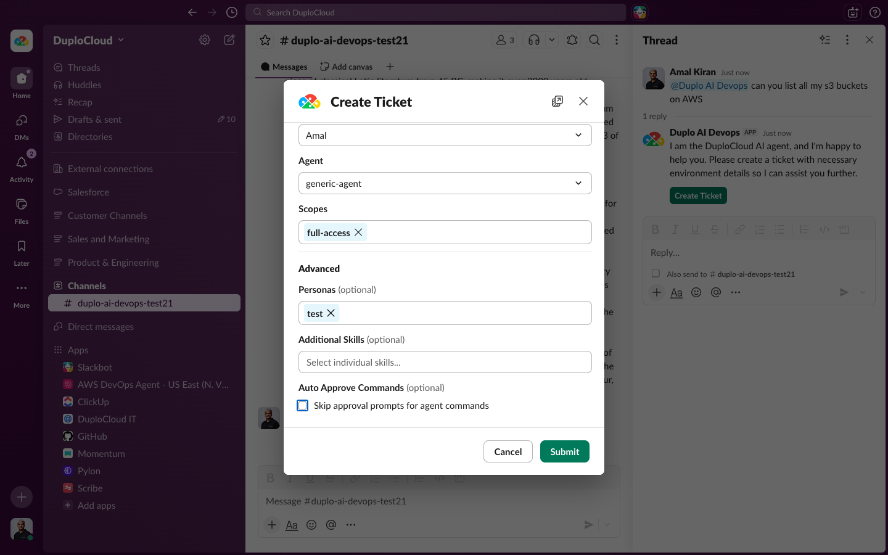

Click **Submit**.

---

## Step 3 — Ticket Confirmation

The bot confirms the ticket was created in the thread and shows a summary of the ticket details — HelpDesk, Workspace, Agent, and Scopes selected.

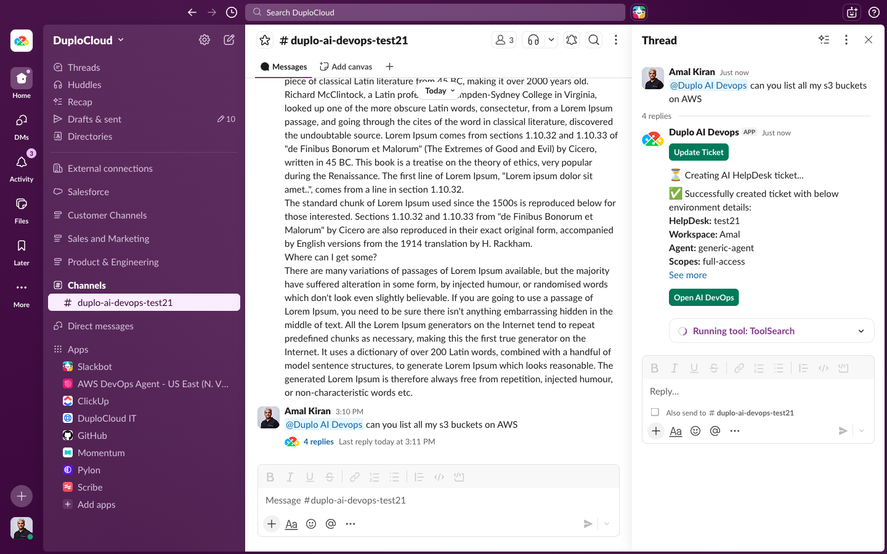

---

## Step 4 — Agent Processes the Request

The agent begins working. The thread updates in real time showing the tools being run. If Auto Approve is not enabled, the bot will ask you to approve commands before executing them.

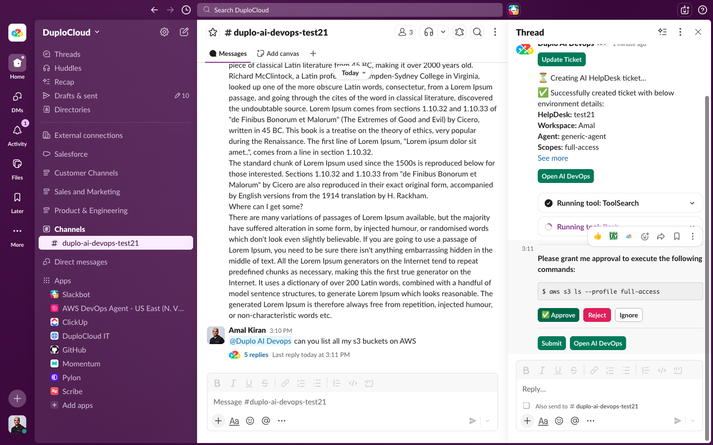

---

## Step 5 — Results Returned in Slack

Once complete, the agent posts the results directly in the thread — structured data, summaries, and any relevant details from your request.

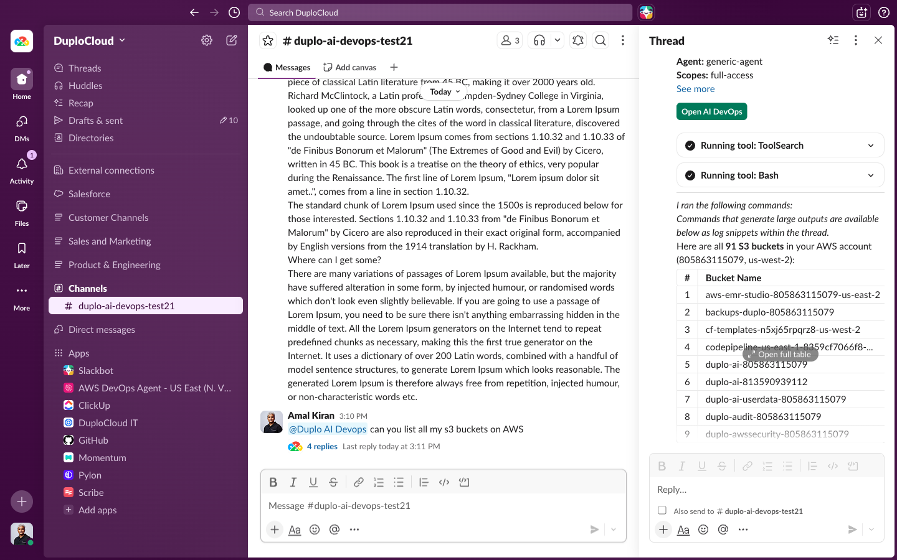

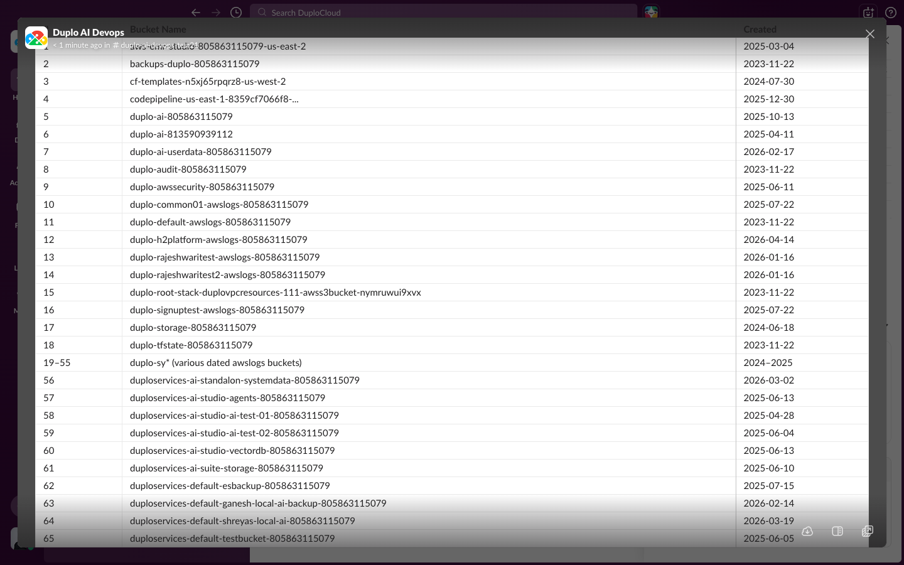

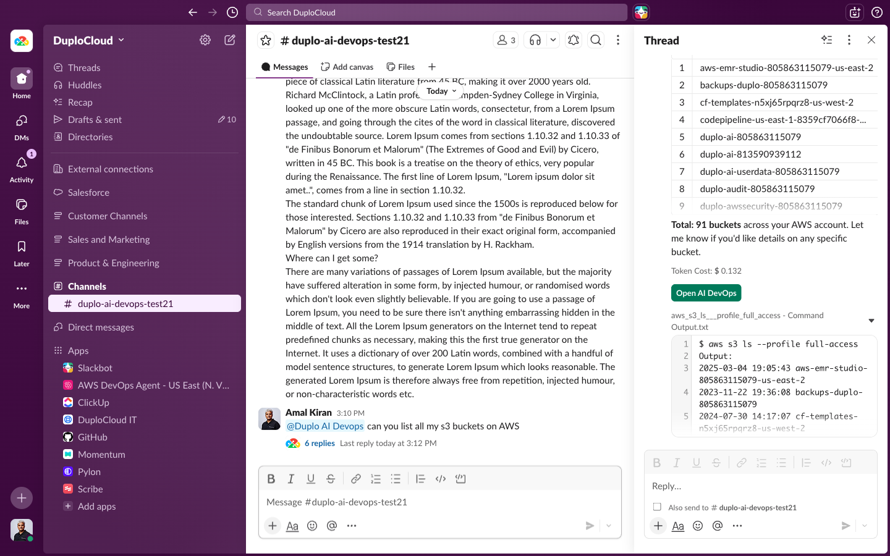

---

## Viewing the Ticket in DuploCloud

Every ticket created from Slack is also fully visible and interactive in the DuploCloud HelpDesk. You can track progress, view the full command history, and continue the conversation from the DuploCloud UI.

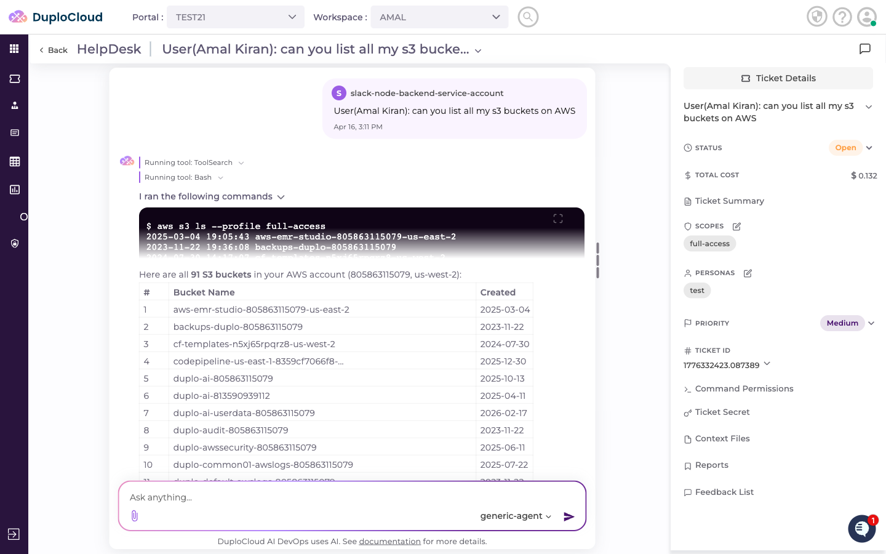

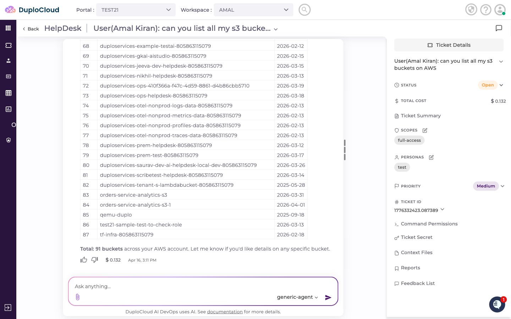
