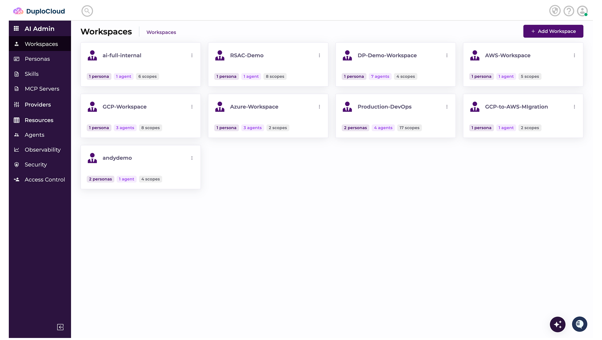
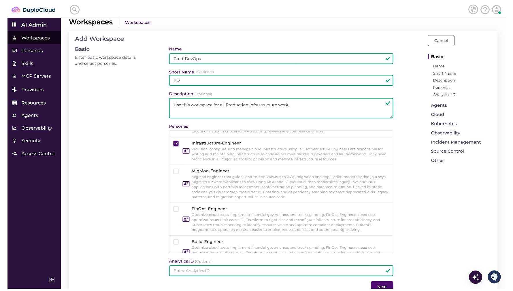
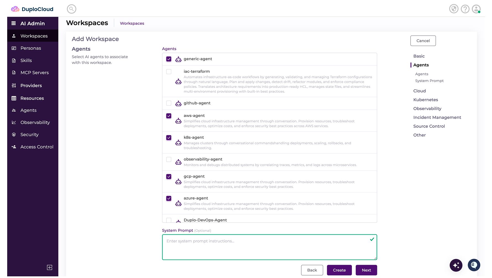
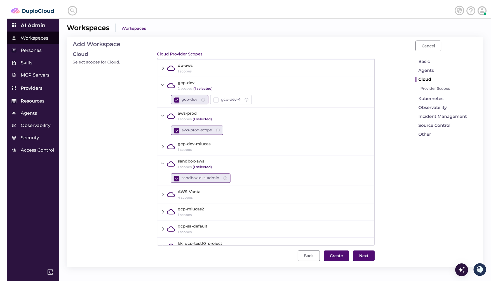

# Workspaces

A Workspace is the central entity that ties everything together — attach any number of Scopes and Personas to it. You can create multiple Workspaces and invite users to each one, enabling clear separation of responsibilities across your organization.

## Creating a Workspace

1. Navigate to **Workspaces** and click **Add Workspace**.

<figure><figcaption></figcaption></figure>

2. Give the Workspace a **Name** and **Description**.
3. Select the **Persona(s)** to include in the Workspace, and click **Next**.

<figure><figcaption></figcaption></figure>

3. Select the **Agent(s)** that do the work in this Workspace, and click **Next**.

<figure><figcaption></figcaption></figure>

4. For each **Provider** screen, select the **Scopes** to include in the Workspace, then click **Next** until you have reviewed them all.

<figure><figcaption></figcaption></figure>

5. Click **Create**.

**Congratulations!** Your Workspace is now ready to receive assignments, interpret goals, break down work, and provide a transparent audit trail—all with human oversight and control.
