# HelpDesk

The AI HelpDesk is where your AI-assisted DevOps work lives. It is the backend service that tracks and manages all of your tickets — whether standalone tasks or tickets that belong to a larger project — and acts as the central system of intelligence.

Tickets are the core unit of work in the HelpDesk. Each ticket represents a discrete task or request that the AI Agent works on alongside you. Through an intuitive interface, you can open tickets, interact with the Agent, visualize operations through a shared browser, and maintain oversight of AI-executed commands in production environments.

Because everything is ticket-based, the HelpDesk also serves as a collaboration layer — team members can work in parallel, hand off context between sessions, and maintain a complete audit trail. The result is a platform that enhances productivity, reduces operational overhead, and maintains the security and compliance standards intrinsic to DuploCloud.

It is accessible from the **HelpDesk** item in the left navigation sidebar, which expands to reveal two options: **Add Ticket** and **History**.

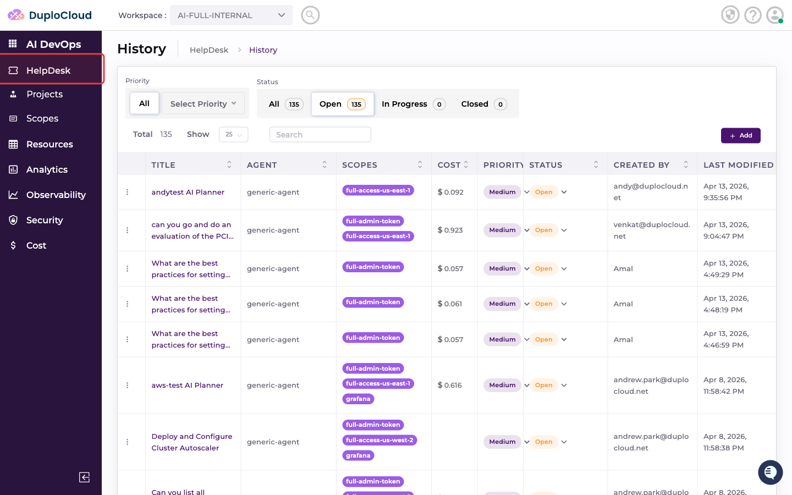

---

## Add Ticket

Click **Add Ticket** in the sidebar to open the ticket creation form.

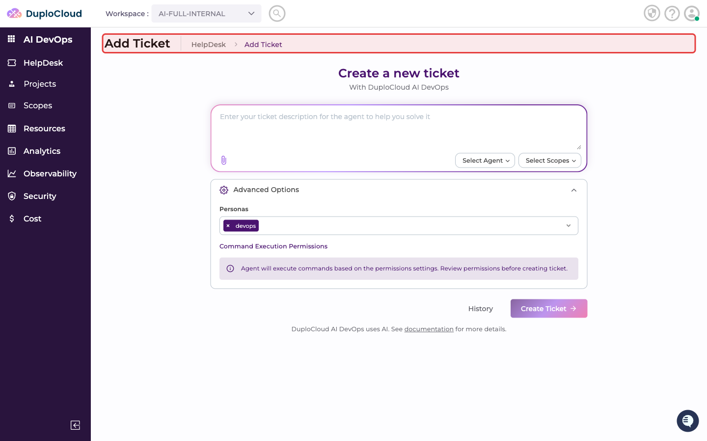

The Add Ticket page lets you create a new AI DevOps request — selecting an agent, scopes, personas, and describing the task you want the AI to perform.

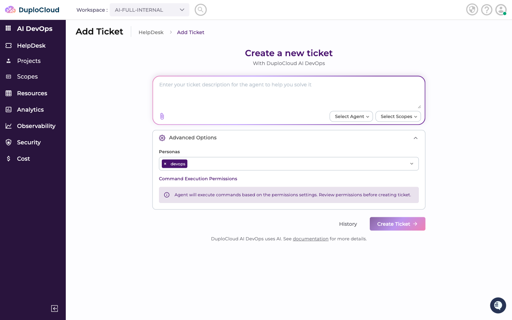

For a full walkthrough of creating a ticket, see the **Tickets** section.

---

## History

Click **History** in the sidebar to view all tickets that have been created in this workspace.

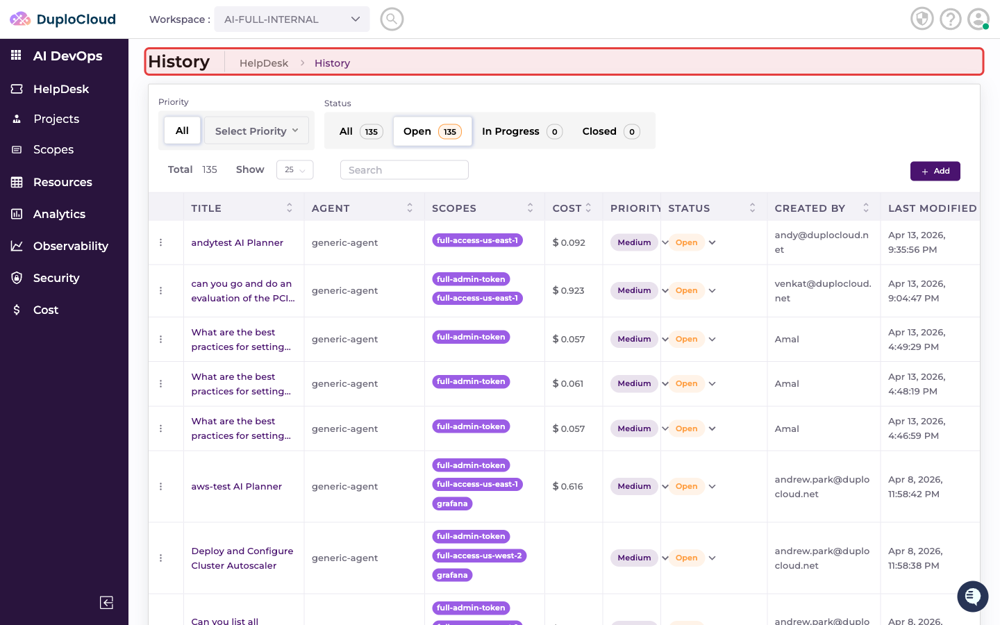

The History page displays a table of all tickets with the following columns:

- **Title** — the question or task submitted to the AI
- **Agent** — the AI agent assigned to the ticket
- **Scopes** — the cloud scopes the agent has access to
- **Cost** — total cost accumulated by the AI agent for this ticket
- **Priority** — the ticket priority (Low, Medium, High, Critical)
- **Status** — current state (Open, In Progress, or Closed)
- **Created By** — the user who submitted the ticket
- **Last Modified** — when the ticket was last updated

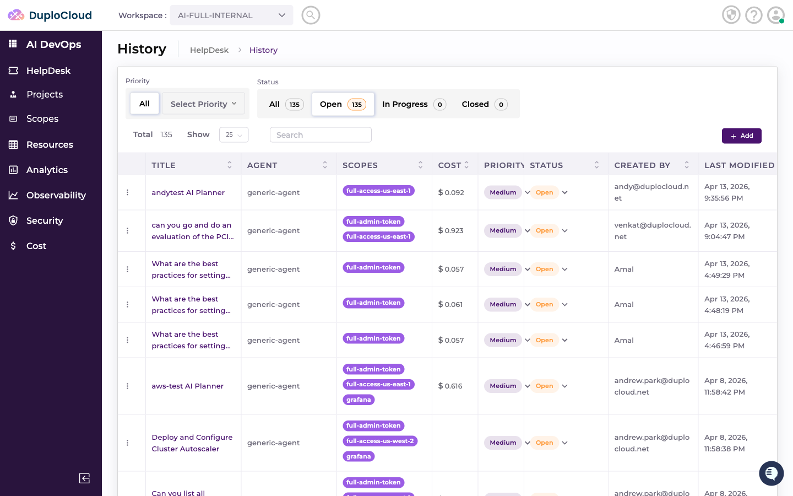

### Switching workspaces

The **workspace selector** at the top of the page controls which workspace's tickets are shown. Click it to open a dropdown listing all workspaces you have access to.

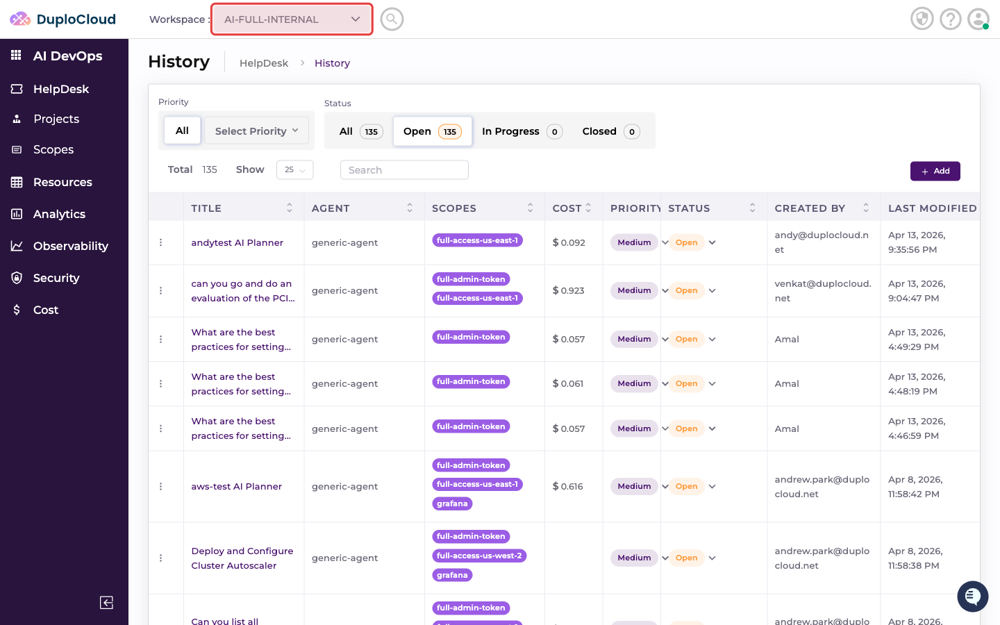

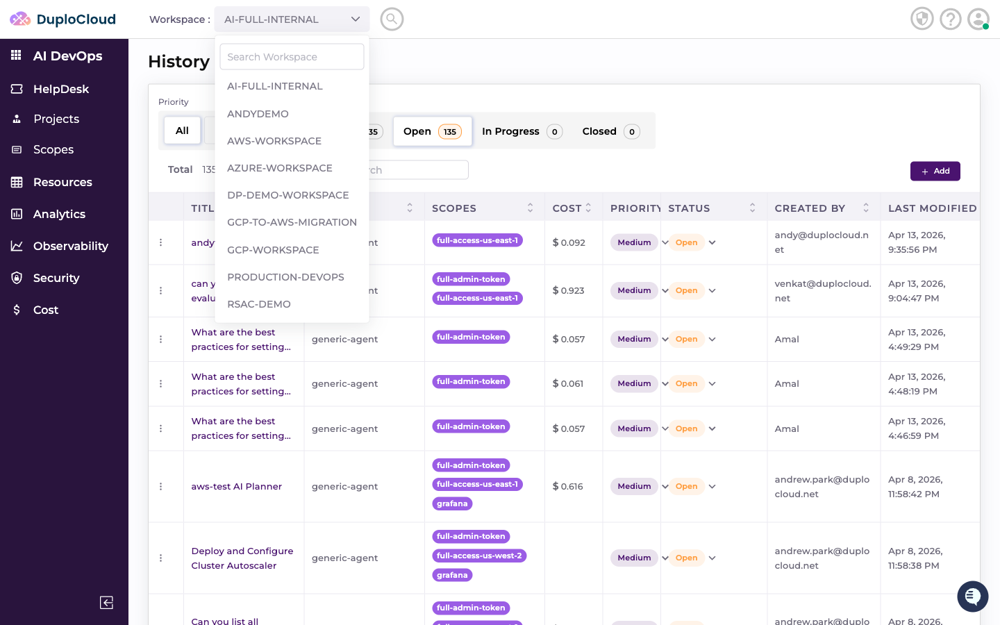

Select a workspace to switch to it. The History table immediately refreshes to show only the tickets belonging to that workspace.

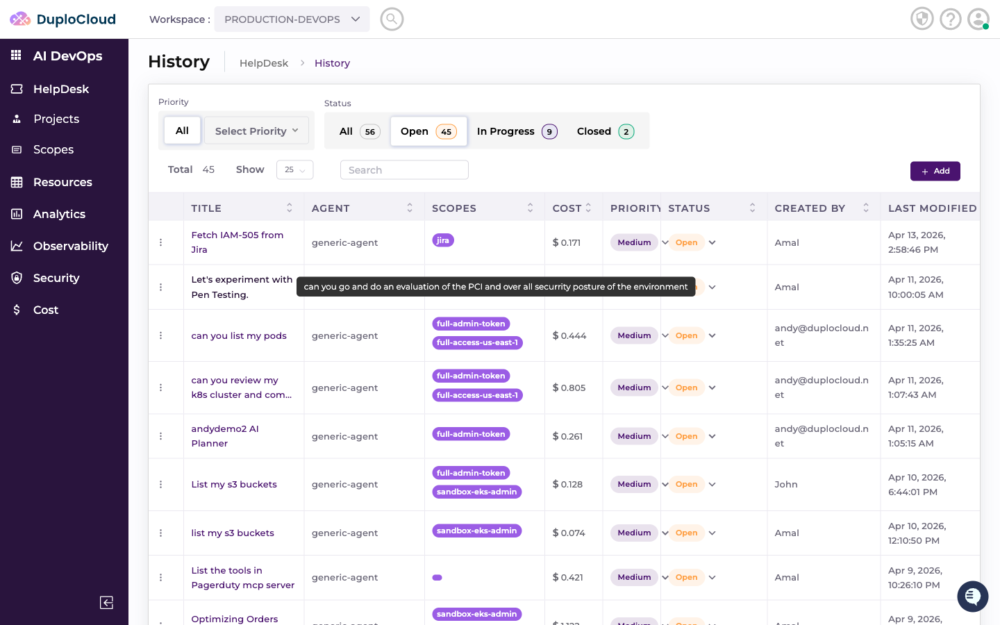

### Filtering tickets

Use the **Priority** and **Status** filters at the top of the table to narrow down the list. The status tabs — **All**, **Open**, **In Progress**, and **Closed** — let you quickly focus on tickets at a particular stage.

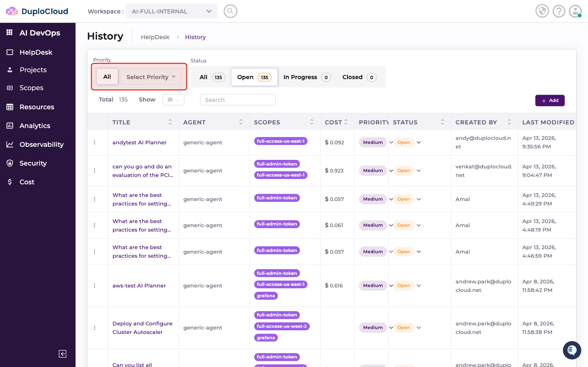

### Resuming a ticket

Click any ticket title in the list to open that ticket and continue where you left off.

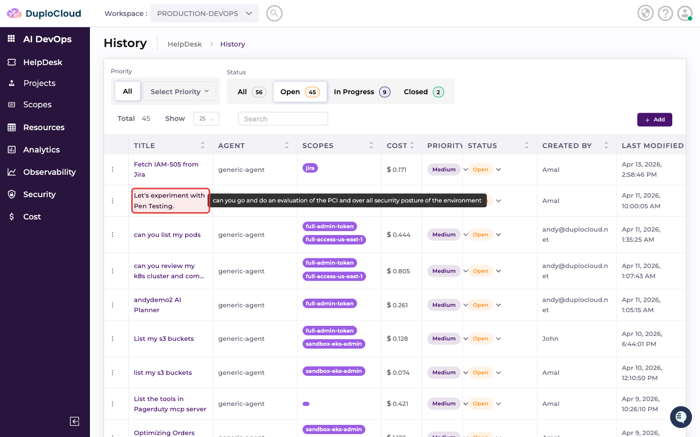

The full conversation history with the AI agent is preserved. Scroll to the bottom to see where the agent left off, then type in the **Ask anything...** input to continue the conversation, ask follow-up questions, or direct the agent to pick up the next task.

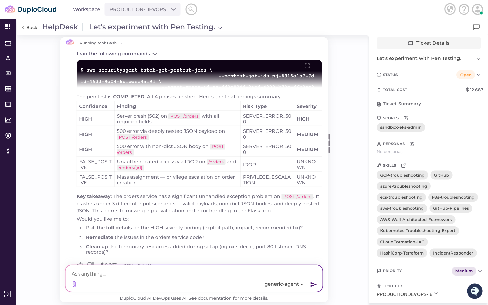

### Creating a new ticket from History

The **Add** button in the top right of the table takes you directly to the Add Ticket page.

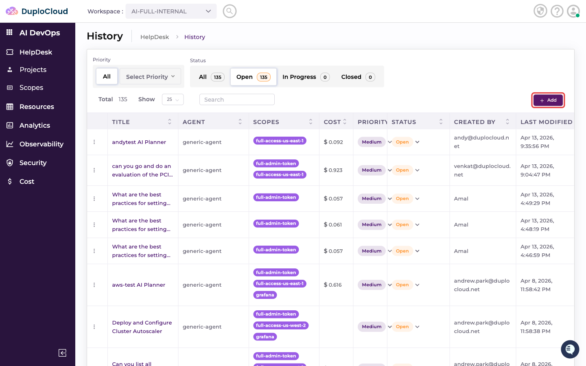

