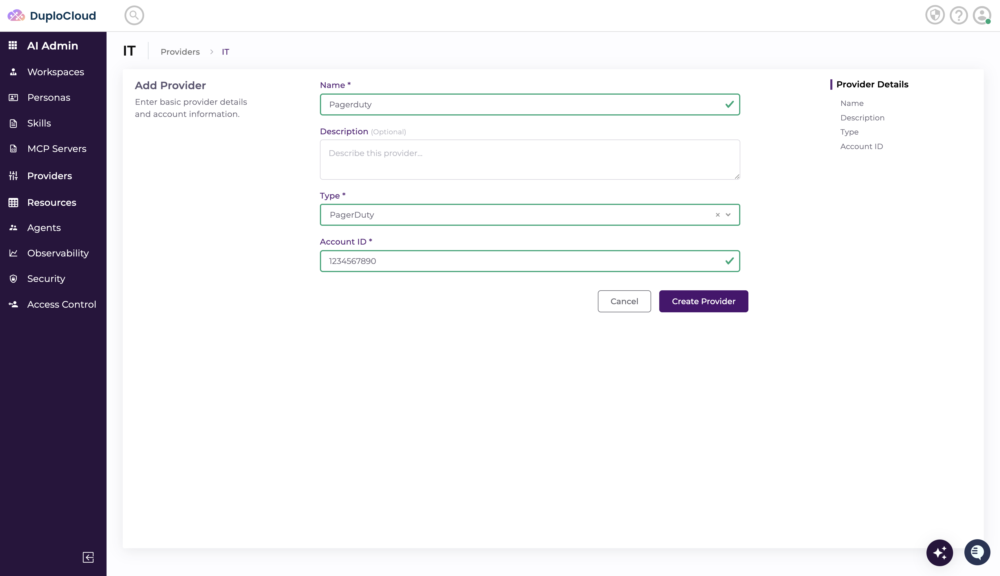

# MCP Servers

MCP Servers provide access to essential external systems and tools that aren't directly part of cloud infrastructure or code repositories. This includes observability platforms (Prometheus, Grafana, Datadog), SIEM tools, ticketing systems, communication platforms, knowledge bases, and specialized DuploCloud integrations.

## Adding MCP Servers and defining scopes

1. Navigate to **MCP Servers** and click **Add Server**.

<figure><figcaption></figcaption></figure>

2. Enter the details required to connect the MCP Server and click **Create**.&#x20;

<figure><figcaption></figcaption></figure>

3. Next, go to the **Providers** section, select the right provider type and click **Add**. If the provider type is not present, you can choose the "**Other**" provider type.&#x20;

<figure><figcaption></figcaption></figure>

4. Create the **credentials** for this Provider, if one is needed.&#x20;

<figure><figcaption></figcaption></figure>

5. Create the **Scope** to connect the Credentials to the **MCP server** and define any permission boundaries.&#x20;

<figure><figcaption></figcaption></figure>

You are all set to use your MCP servers.&#x20;
