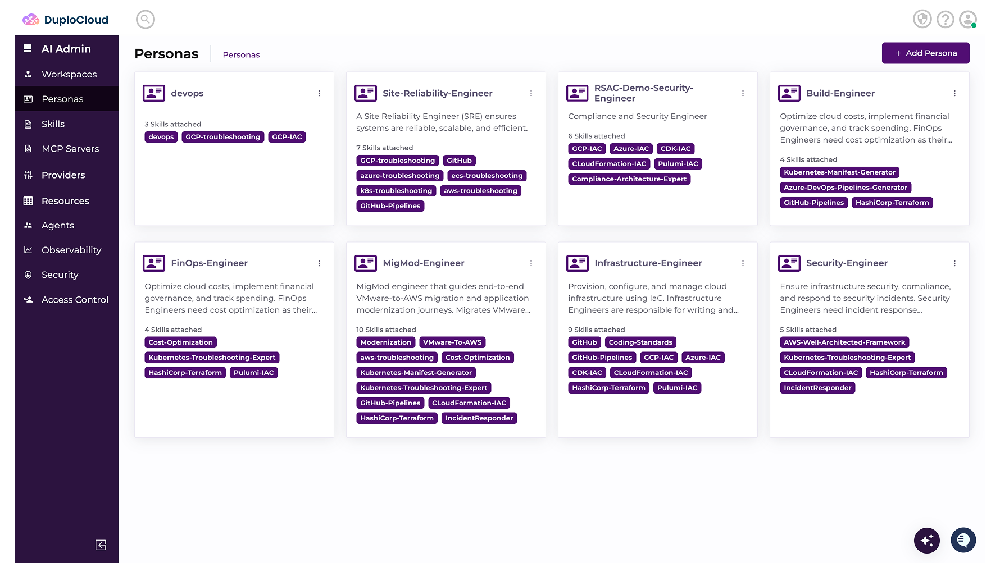
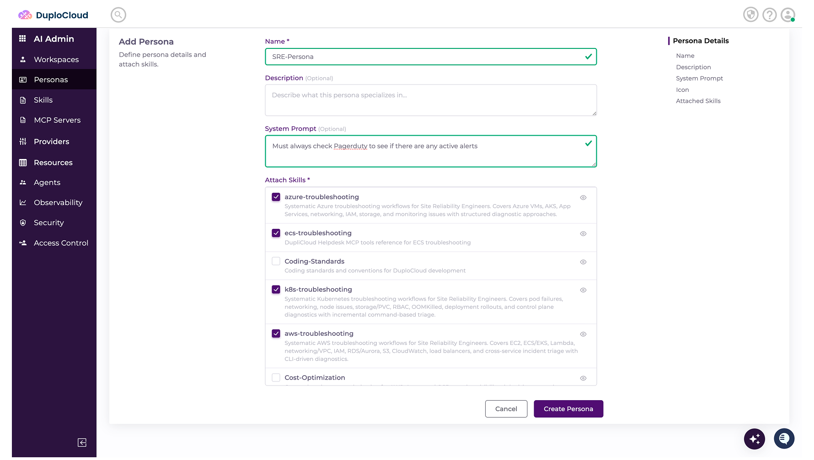

# Personas

A Persona is a logical container that groups related Skills by role or function. For example, an SRE Persona combines troubleshooting, monitoring, and incident response skills, a Provisioning Persona bundles Terraform and Kubernetes deployment skills, and a Security Persona groups compliance and security scanning skills.

## Creating a Persona&#x20;

1. Select **Personas** and click **Add Persona**.&#x20;

<figure><figcaption></figcaption></figure>

2. Give the Persona a **Name.**
3. Add an optional **Description.**
4. Add **System Prompts** that apply to all the Skills in this collection. These instructions will automatically be inherited by all the Skills within this Persona. This is optional.&#x20;
5. Select the relevant **Skills** to include in the Persona.

<figure><figcaption></figcaption></figure>

6. Click **Create Persona**.
