# Projects

## Projects

### Projects

A Project is the primary unit of planned work in DuploCloud. It brings together everything needed to take a goal from idea to completion — a spec, an implementation plan, and a series of tickets that the AI Engineer executes.

**Structure of a Project**

Every Project consists of three building blocks:

**Spec** — A detailed description of what needs to be accomplished. The spec is drafted collaboratively with the AI Engineer and approved before any implementation begins. It captures requirements across areas such as infrastructure, CI/CD, workloads, observability, compliance, security, and cost.

**Plan** — A step-by-step implementation plan derived from the approved spec. The plan is broken down into discrete tasks, organized into stages, and approved before execution starts.

**Tickets** — The individual units of work that the AI Engineer executes. Each ticket corresponds to a task in the plan and tracks everything that happens during execution — commands run, decisions made, context carried forward.

**Stages and Parallel Execution**

Tasks in a plan are grouped into stages. Each stage contains tickets that are independent of one another — they have no dependencies on other tickets within the same stage, which means all tickets in a stage can be executed in parallel. Stages are completed in sequence: the next stage begins once all tickets in the current stage are done.

This structure gives you both predictability (stages enforce order where it matters) and speed (parallelism within each stage).

**Scope**

Projects can optionally define their own Scope as a subset of the assigned Engineer's Scope. If no custom Scope is set, the Project defaults to the Engineer's full Scope — controlling exactly which cloud environments, clusters, and resources the AI Engineer can access when executing work for that Project.

**Creating a Project**

Projects are created from the DuploCloud platform UI. Once a project exists, you can take all subsequent actions — drafting the spec, writing the plan, and executing tickets — directly from your IDE or terminal using the DuploCloud plugin.

***

### Projects Tutorial

Projects in AI DevOps help you organize multi-stage engineering work. Each project contains an AI-generated specification, a phased plan, and a set of executable tasks — all managed through an AI Planner conversation and tracked across an Execution view.

***

### Step 1 — Navigate to Projects

In the left sidebar, click **Projects** under the **AI DevOps** section.


The Projects page displays all existing projects in a table. Each row shows the project's name, description, priority, progress percentage, accumulated cost, assigned scopes, start date, creator, and last modified date.


***

### Step 2 — Create a Project

Click the **Add** button in the top right corner of the table.


The **Add Project** panel slides open.


Fill in the project details:

**Name** — give the project a clear, descriptive name.


**Description** _(optional)_ — briefly describe the project goal.


**Scopes** — select one or more scopes to grant the AI agents the cloud access they need.


**Skills** _(optional)_ — select one or more skills to attach to the project (e.g. `duplocloud`). Skills extend what the AI agent can do when working on tickets inside this project.

**Priority** _(optional)_ — set a priority level: Low, Medium, High, or Critical.


**Start Date / End Date** _(optional)_ — set the intended project timeline.


> **AI-Powered Workflow** — after creating the project, you can use the AI Planner to generate a specification, a phased plan, and a full set of actionable execution tasks through a conversation with the AI.


When ready, click **Create**.


The new project appears in the list. You can now open it to begin the AI planning workflow.

***

### Step 3 — Open a Project

Click a project name in the list to open it.


The project detail page opens. It has two tabs — **Project Overview** and **Execution** — along with an **Open AI Planner** button and a right sidebar showing project metadata.


The **Project Overview** tab shows the full task board across all phases.


The **Execution** tab shows the same phases and tasks, filterable by status: All, Open, In Progress, or Closed.


Use **Generate Summary** to get a plain-language status update from the AI across all tasks.


The right sidebar shows metadata (scopes, total cost, priority, dates) and links to the project's **Specs**, **Plan**, and **Execution** artifacts.


***

### Step 4 — Open the AI Planner

Click **Open AI Planner** to launch the AI planning conversation for the project.


The AI Planner opens as a conversation interface. During initial setup, the AI ran discovery against your environment and generated a specification, a phased plan, and an execution task set. All three are accessible as artifact blocks in the conversation.


***

### Step 5 — Review and Save the Spec

Scroll up in the AI Planner conversation to find the **spec.md** artifact block — the project specification the AI generated from your initial prompt.


Click the **spec.md** block to open the specification. The spec documents your environment's current state, goals, and constraints that the plan and tasks are built against.


Click **Save Spec** to persist this version of the specification to the project.


***

### Step 6 — Review and Save the Plan

Navigate back to the AI Planner and click the **plan.md** artifact block to view the phased plan.


The plan breaks the project into named phases, each with specific tasks, acceptance criteria, and an implementation approach.


Click **Save Plan** to save it to the project.


***

### Step 7 — Review and Save the Execution Tasks

Navigate back to the AI Planner and click the **execution\_tasks.json** artifact block to view the full execution task set.


The execution tasks view shows all phases and their tasks in structured form. Each task includes a title, description, acceptance criteria, and phase assignment.


Click **Save Execution Tasks** to write these tasks to the project. Saving populates the Execution tab with the complete task breakdown, organised by phase.


***

### Step 8 — Track Execution

Navigate back to the project and click the **Execution** tab to see all tasks organised by phase.


Each phase lists its tasks with their current status. The phase header shows the task count and a short summary of that phase's goal.


The phases progress sequentially — earlier phases typically cover observability or baseline work that must complete before later phases begin.


Tasks that have been linked to AI tickets show the ticket ID next to the task name.


***

### Step 9 — Open a Task Ticket

Click a task's ticket ID to open the AI conversation that executed that task.


The ticket shows the full AI agent conversation for the task — including tool calls made, command output returned, and the agent's step-by-step reasoning. The right sidebar shows ticket metadata: status, scopes, skills, priority, total cost, and the ticket ID.


Each task ticket is a self-contained record of exactly what the AI did to complete that unit of work, making it auditable and resumable.

***

## VSCode Integration

The DuploCloud Claude plugin lets you work on projects entirely from your local VSCode session. All work — specifications, plans, execution tasks, and ticket conversations — is automatically synced back to the DuploCloud platform for full team visibility.

**Prerequisites:**

* Visual Studio Code is installed.
* Claude Code CLI is available in your terminal.
* The DuploCloud Claude plugin is installed and configured. See the [duplo-claude-plugin](https://github.com/duplocloud/duplo-claude-plugin) repo for installation instructions.
* Your project codebase is available locally.

***

### Step 1 — Connect to the Project from VSCode

Open VSCode in your project directory and launch Claude with the DuploCloud plugin:

```bash
claude
```

Claude greets you and lists all available Workspaces.

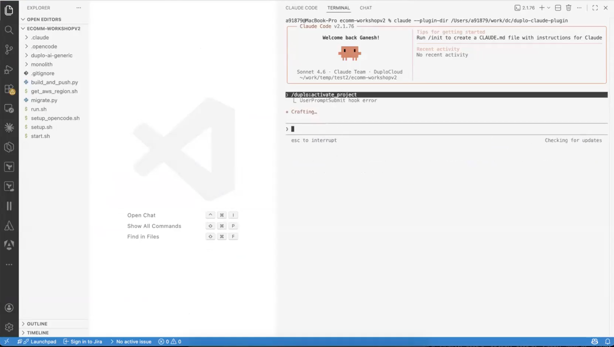

Enter the number of your workspace.

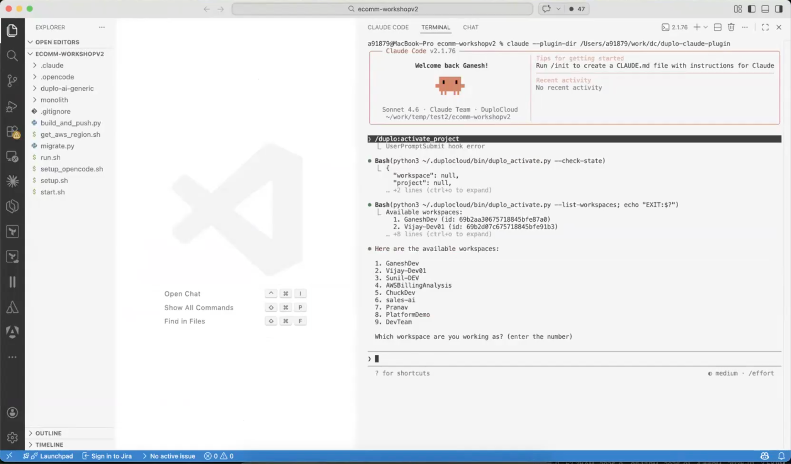

Claude lists the available projects in that workspace. Enter the number of your project.

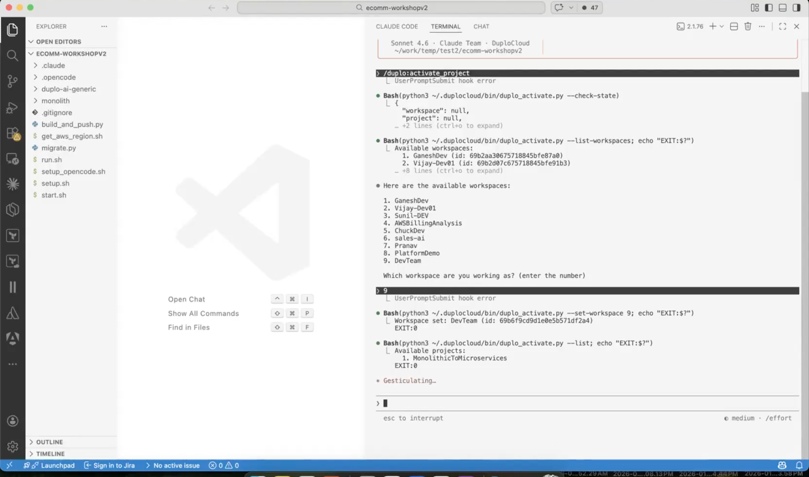

Claude activates the project and displays a status table showing the current state of the Spec, Plan, and Execution artifacts. If the project is new, all three will show as empty and ready to begin.

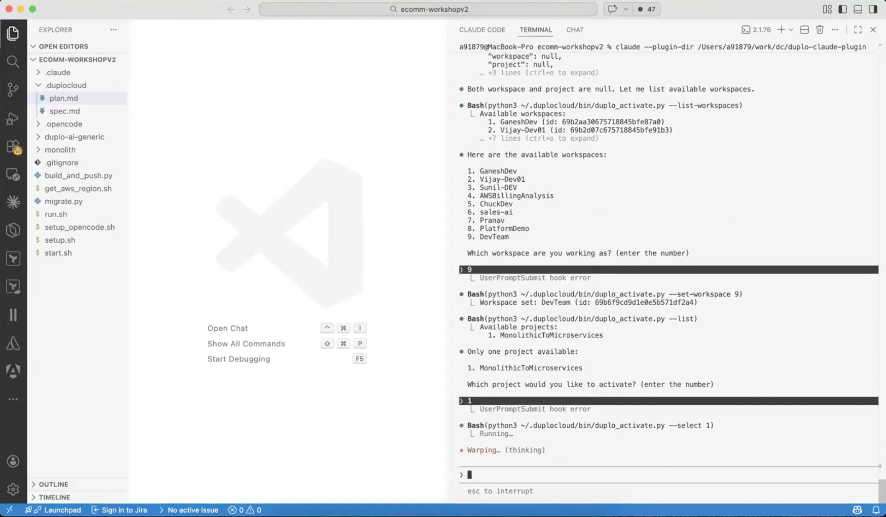

> **Authentication:** When prompted, provide your DuploCloud platform URL and user access token: `authenticate to duplo using url: https://<helpdesk-url> and token: <user-access-token>`

***

### Step 2 — Write the Specification from VSCode

The Specification defines the goals, requirements, scope, and success criteria for the project. Claude helps you write and refine it through a conversational interview.

#### Activate the Spec Ticket

When the project is first activated with no Spec or Plan, Claude prompts you to activate the Spec ticket. Type `yes` to proceed. Claude creates the Spec Creation Ticket, sets it to In Progress, and asks what you'd like to do — choose option 1 to start writing the spec.

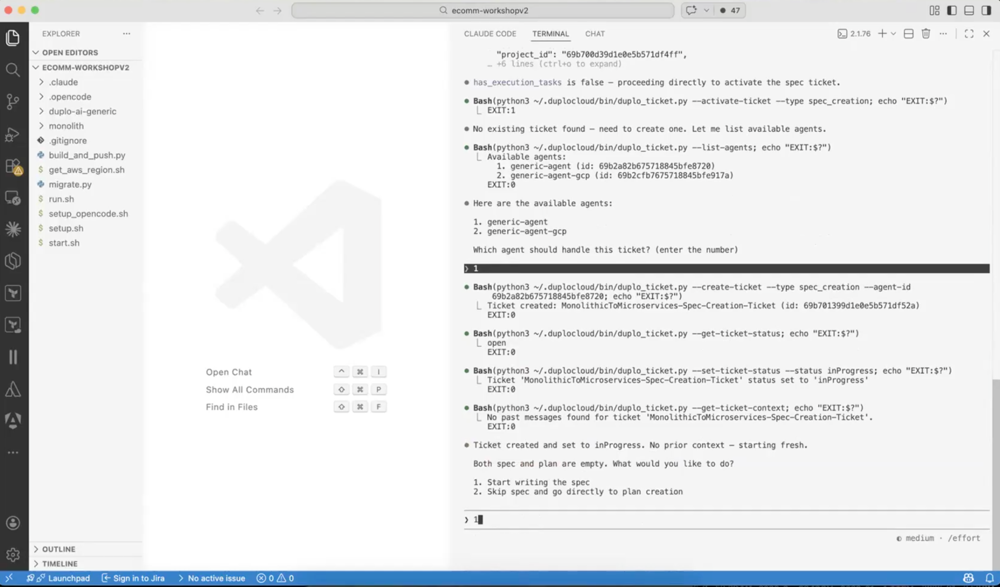

#### Describe Your Requirements

Describe the project goal in plain language. Claude will explore your codebase and ask clarifying questions about domain boundaries, stakeholders, database constraints, and scope limits.

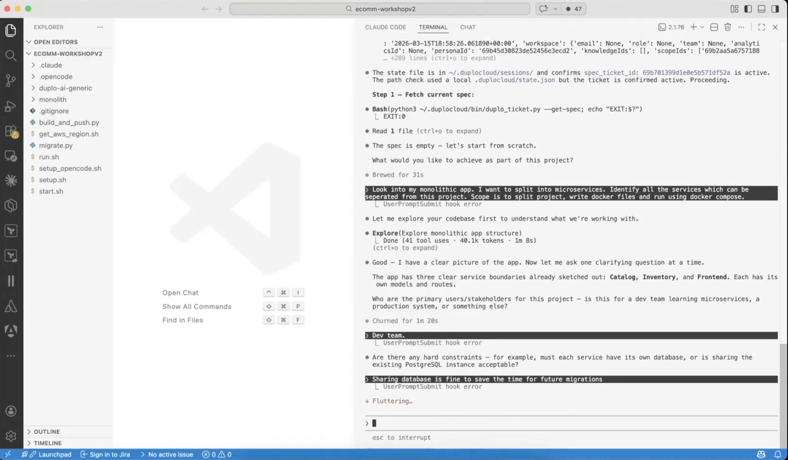

#### Review and Approve the Spec

Once Claude has enough information it drafts the full specification and presents it for review. You can ask for changes, or confirm it looks good. Claude then asks how to save:

* **Save** — push to the platform in Draft status
* **Save and Approve** — push to the platform and mark as Approved
* **Cancel** — keep the local draft only

Choose **Save and Approve** to mark the spec as approved and move to planning.

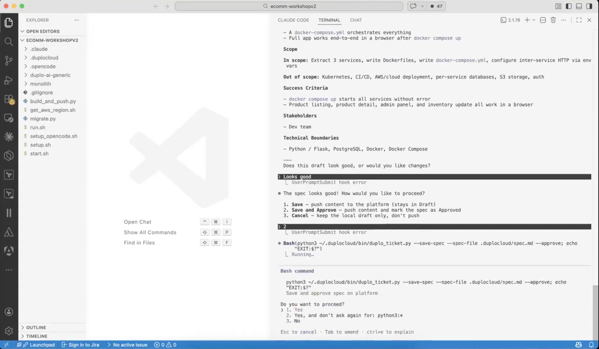

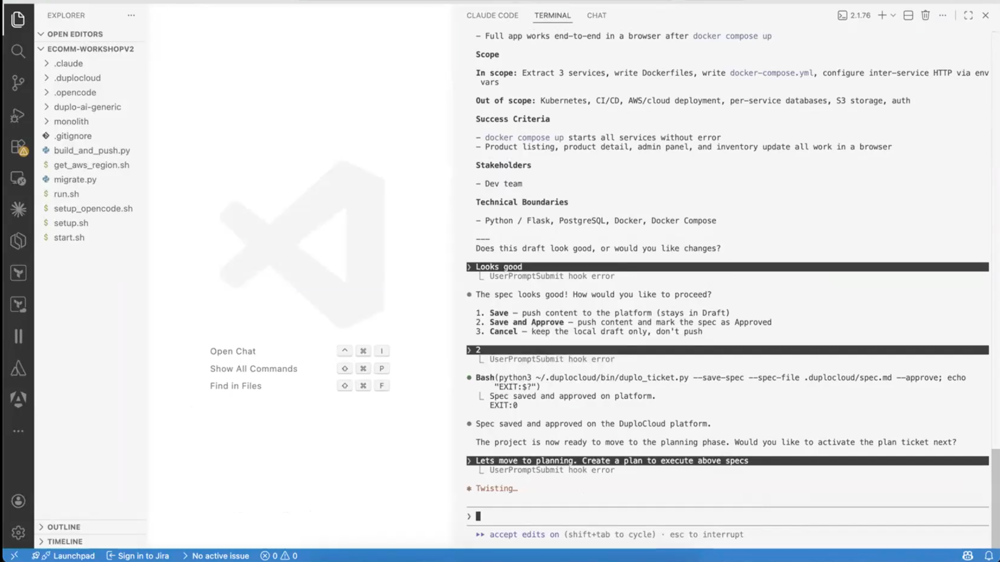

#### View the Spec on DuploCloud

Once saved, the spec is immediately visible on the DuploCloud platform under the project's **Project Overview** tab.

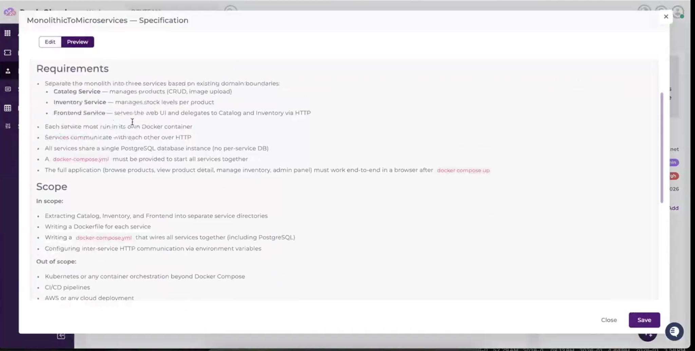

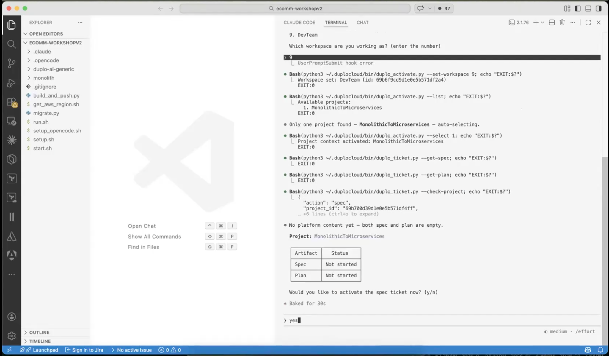

> All conversation messages from your local VSCode Claude session are automatically mirrored to the corresponding ticket on the DuploCloud platform in real time once saved.

***

### Step 3 — Create the Implementation Plan from VSCode

With the spec approved, Claude moves to the planning phase. The plan converts the specification into a detailed, phased implementation roadmap.

#### Generate the Plan

After the spec is approved, Claude automatically moves to planning. It loads the `create_plan` skill, reads the approved spec, and begins drafting the plan. Claude may ask additional clarifying questions (e.g. about inter-service communication patterns). The plan covers goals, architecture overview, tech stack, numbered tasks with file lists, and shell commands.

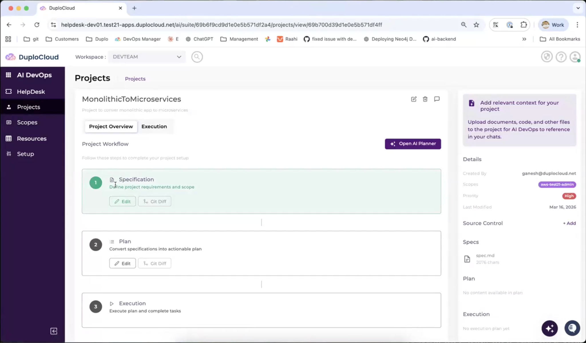

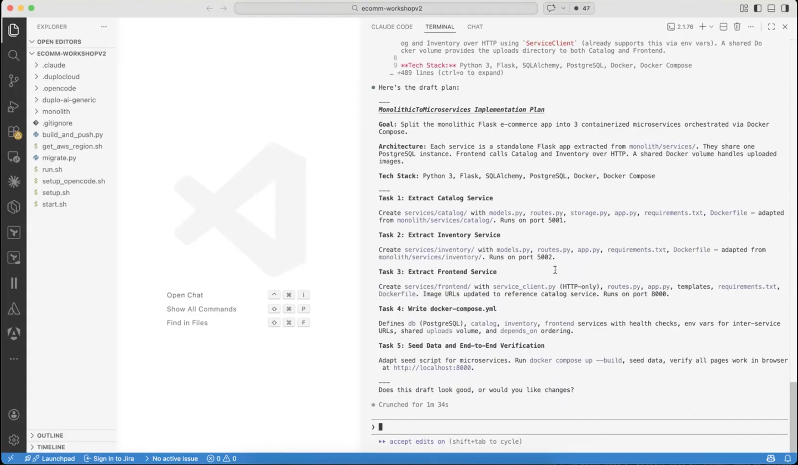

#### Review and Approve the Plan

Claude opens `plan.md` in the VSCode editor for easy reading alongside the terminal conversation.

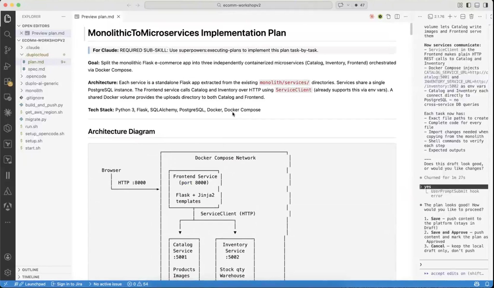

Provide feedback or confirm the plan looks good, then choose **Save and Approve** to push it to the DuploCloud platform.

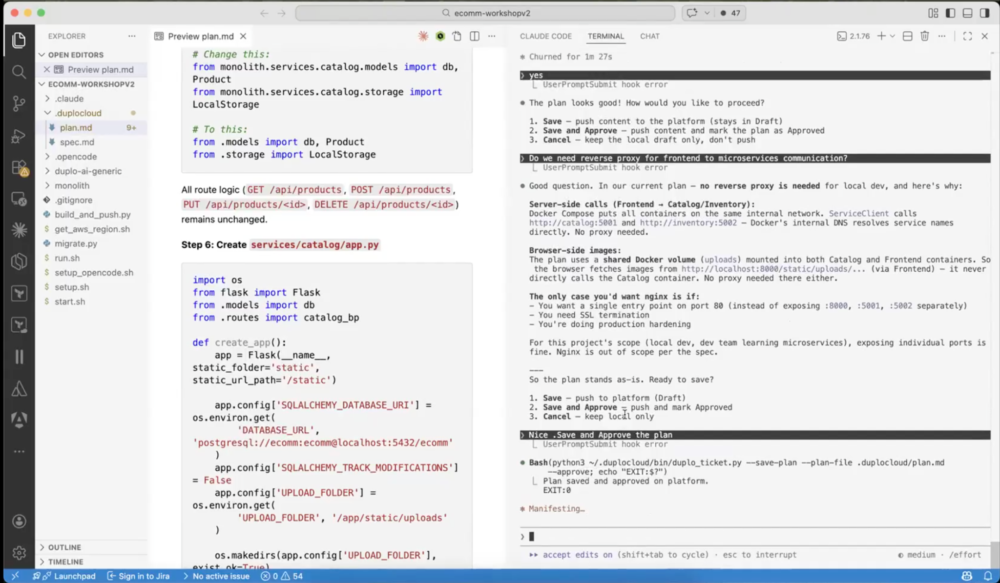

***

### Step 4 — Generate and Create Execution Tasks

With both spec and plan approved, Claude can break the plan into granular, actionable execution tasks organised into stages.

#### Request Execution Tasks

Ask Claude to create execution tasks: `Can you create execution tasks?` Claude processes the plan and generates a hierarchical breakdown of stages and tasks. You can watch the tasks populate in real time on the DuploCloud platform.

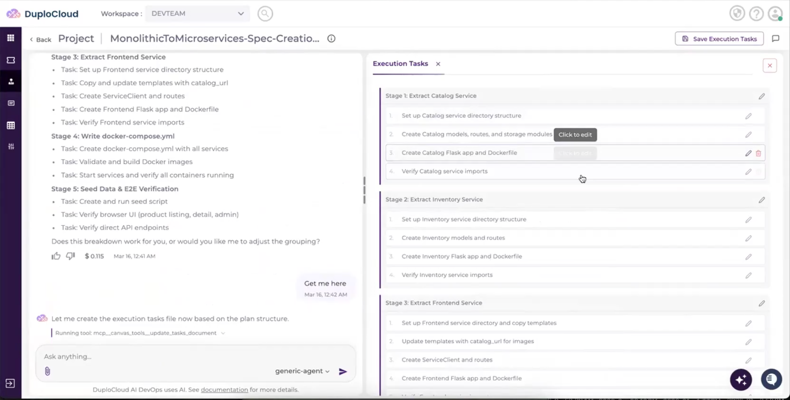

#### Create Tickets

Once the execution tasks are saved, navigate to the project's **Execution** tab in DuploCloud and click **Create Tickets**. DuploCloud creates a dedicated ticket for each task with an Open status, visible to the whole team.

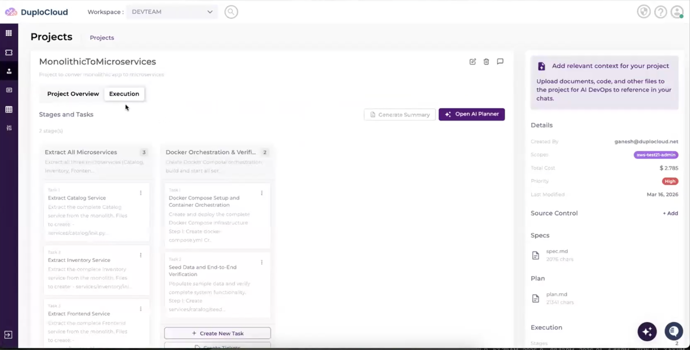

> You can add or edit tasks manually on the Execution tab before creating tickets if you need to adjust the AI-generated breakdown.

***

### Step 5 — Work on Individual Tickets from VSCode

Once tickets are created, developers pick them up one by one and complete the work within their local VSCode Claude session. The plugin automatically loads the ticket context and syncs progress back to the platform.

#### Select a Task

Start a new Claude Code session with the DuploCloud plugin and select your workspace and project. Claude displays the current project status and lists all execution tasks with their ticket status. Enter the task number to begin.

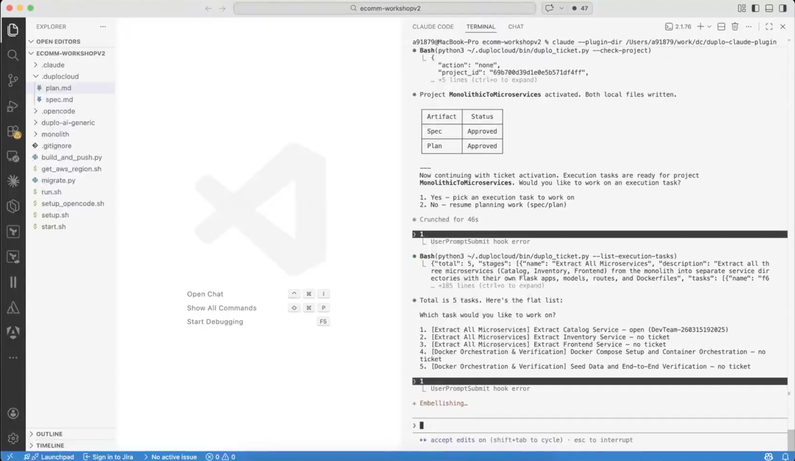

#### Execute the Task

Claude loads the ticket context (task description, spec, plan) and begins executing autonomously — reading existing code, creating new files, and verifying the output in your local working directory. Claude presents a verification summary when complete.

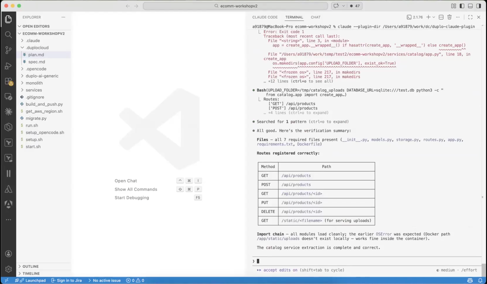

#### Close the Ticket and Move to the Next Task

Once the output looks good, Claude saves a summary to the ticket and asks if you are ready to close it. Confirm to close — Claude sets the ticket status to Closed/Resolved on the platform and immediately prompts you with the next task in the sequence.

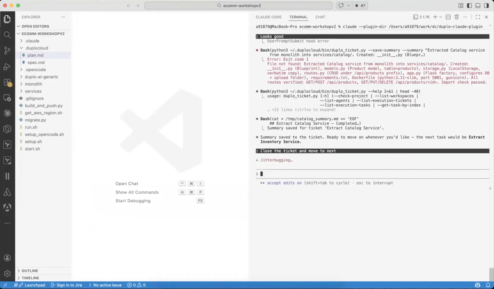

***

### Step 6 — Team Collaboration: Conversation Mirroring

Every conversation you have in your local VSCode Claude session is automatically mirrored to the corresponding ticket on the DuploCloud platform when saved. This provides full transparency and enables effective team collaboration.

**What gets mirrored:**

* Specification writing conversations → Spec-Creation ticket
* Plan generation conversations → Plan-Creation ticket
* Execution task conversations → Individual task tickets

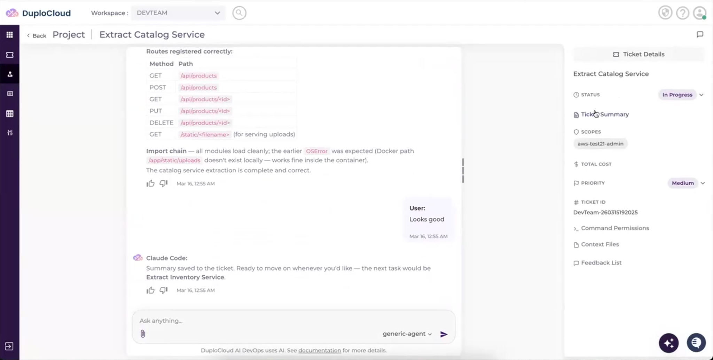

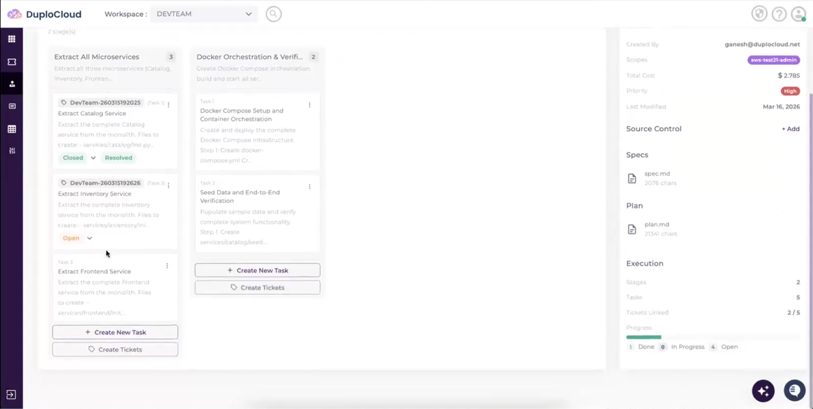

Team leads can review AI-generated specs and plans directly in DuploCloud without needing access to individual developer machines. All decisions and rationale are captured in the ticket conversation history.
