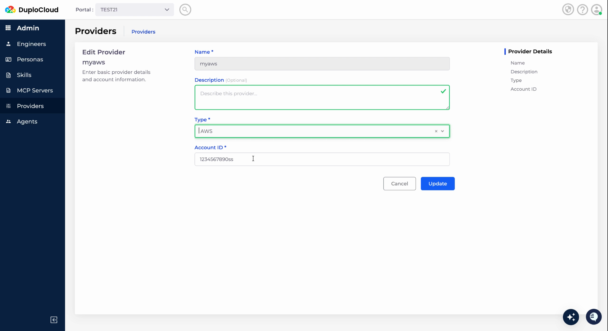

# Providers

Providers store credentials for connecting to cloud accounts, Kubernetes namespaces, incident tools, and other services. After adding providers, you create scopes that define what resources can be accessed. Permissions are then granted by assigning these scopes to engineers when creating or editing them.

Let's go through this one step at a time.&#x20;

**Step 1:** Go to Providers and select the provider type you are trying to add from the top menu. Ex: Cloud, Kubernetes, etc.&#x20;

<figure><figcaption></figcaption></figure>

Currently, these provider types are supported:&#x20;

* Cloud providers
  * AWS
  * GCP
  * Azure
* Kubernetes
  * EKS
  * AKS
  * GKE
  * RHOS
* Observability
  * OTEL
  * Datadog
  * NewRelic
  * Sentry
* Incident Management
  * Grafana Alert Manager
  * Datadog
  * NewRelic
  * Sentry
  * Pagerduty
  * Incident.io
* Git Repositories
  * GitHub
  * GitLab
  * BitBucket

If you would like to add a provider type that is not in this list, please write to us on Slack/ support@duplocloud.net

**Step 2:** Click on Add. The provider setup screen appears, showing the relevant inputs required for connecting that provider type. Complete the form based on on-screen instructions.&#x20;

<figure><figcaption></figcaption></figure>

**Step 3:** Click update to finish granting access. This will return you to that provider’s screen.&#x20;

<figure><figcaption></figcaption></figure>

**Step 4:** Click on credentials and click Add. Enter the credentials and click update. This will return you to that provider’s screen.&#x20;

<figure><figcaption></figcaption></figure>

**Step 5:** Now click on Scope and click Add Scope. Give the scope a suitable name, description, select one of the credentials added and (optionally) MCP servers. Enter the resource map in Key:Values format and hit Create.

<figure><figcaption></figcaption></figure>

Now, let's move on to creating access for MCP Servers for our Engineers.  
