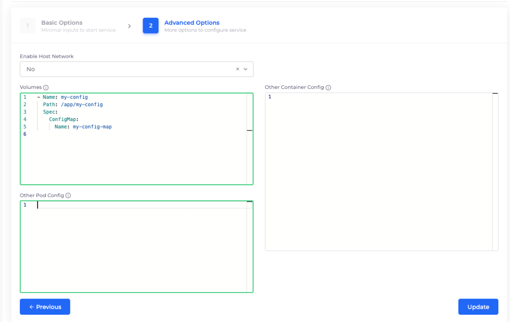

# Mounting ConfigMaps and Secrets as files

In Kubernetes, you can mount ConfigMap or Secret data as files into a container, allowing your workloads to read configuration values at runtime without hardcoding them into images or code.

## Prerequisites

Before you can mount a ConfigMap or Secret as a file in a container, complete the following setup:

* **Create a DuploCloud Service.**\
  The Service defines the container into which the ConfigMap or Secret will be mounted.\
  You can create a Service by navigating to **Kubernetes** → **Services** in the DuploCloud Portal.
* **Create the ConfigMap or Secret.**
  * To create a ConfigMap, see [Creating a Kubernetes ConfigMap](mounting-config-as-files.md#creating-a-kubernetes-configmap).
  * To create a Secret, see [Creating a Kubernetes Secret](mounting-config-as-files.md#creating-a-kubernetes-secret).

Each ConfigMap or Secret should include the file data you want to mount, using key/value pairs where the key is the filename and the value is the file’s contents.

## Mounting a Kubernetes ConfigMap as a Volume

1. In the DuploCloud Portal, navigate to **Kubernetes** -> **Services**.
2. Select the Service you want to modify from the **Name** column.
3. Click the **Actions** menu and select **Edit**.

4) Click **Next**. The **Advanced Options** page displays.
5) In the **Volumes** field on the **Advanced Options** page, enter the appropriate YAML configuration to define the volume mount. See examples below.

**Example: Mounting a ConfigMap as a Volume**

To mount a ConfigMap named `my-config-map` to a directory named `/app/my-config`, use the following configuration:

```yaml
- Name: my-config
  Path: /app/my-config
  Spec:
    ConfigMap:
      Name: my-config-map
```

<figure><figcaption><p>The <strong>nginx Service</strong> <strong>Advanced Options</strong> page in the DuploCloud Portal</p></figcaption></figure>

**Example: Mounting an Individual File from a ConfigMap**

To mount an individual file (e.g., `my-file-name`) from the ConfigMap to a specific location (e.g., `/app/my-config/config-file`), use the following configuration:

```yaml
  Path: /app/my-config
  Spec:
    ConfigMap:
      Name: my-config-map
      Items:
      - Key: my-file-name
        Path: config-file
```

6. Select **Update** to save the configuration. The ConfigMap will now be mounted into the container at runtime.

## Mounting a Kubernetes Secret as a Volume

1. In the DuploCloud Portal, navigate to **Kubernetes** -> **Services**.
2. Select the Service you want to modify from the **Name** column.
3. Click the **Actions** menu and select **Edit**.
4.  Click **Next**. The **Advanced Options** page displays.\


    
5. In the **Volumes** field on the **Advanced Options** page, enter the appropriate YAML configuration to define the volume mount. See examples below.

**Example: Mounting a Secret as a Volume**

To mount a Secret named `my-secret-files` to a directory named `/app/my-config`, use the following configuration:

```yaml
- Name: my-config
  Path: /app/my-config
  Spec:
    Secret:
      SecretName: my-secret-files
```

**Example: Mounting an Individual Secret Item**

If you want to select individual Secret items (e.g., `secret-file`) and specify the subpath for mounting (e.g., `/app/my-config/config-file`) use the following configuration:

```yaml
- Name: my-config
  Path: /app/my-config
  Spec:
    Secret:
      SecretName: my-secret-files
      Items:
      - Key: secret-file
        Path: config-file
```

6. Select **Update** to save the configuration. The Secret will now be mounted into the container at runtime.
