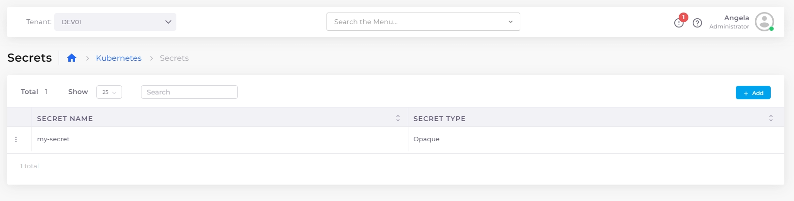

# Setting Kubernetes Secrets

Kubernetes Secrets securely store sensitive data such as passwords, tokens, and keys outside application code.

To securely manage Kubernetes secrets, follow these best practices:

* **Utilize Centralized Secret Management Tools** to streamline storage, versioning, and access control.
* **Implement Access Controls** to ensure only authorized users and workloads can access or modify secrets.
* **Regularly Rotate Secrets** to limit exposure if a secret is compromised.
* **Audit Access Logs** to monitor for unauthorized access or anomalies.

Using these strategies with DuploCloud's Kubernetes Secrets interface helps keep secret management secure and maintainable across your environments.

## Creating a Kubernetes Secret

1. In the DuploCloud Portal, navigate to **Kubernetes** -> **Secrets**.
2.  Click **Add**. The **Add Kubernetes Secret** pane displays. 

    

3. Complete these fields:

<table data-header-hidden><thead><tr><th width="163.33331298828125"></th><th></th></tr></thead><tbody><tr><td><strong>Secret Name</strong></td><td>A unique name for the secret.</td></tr><tr><td><strong>Secret Type</strong></td><td>Enter the Kubernetes secret type (e.g., <code>Opaque</code>, <code>kubernetes.io/dockerconfigjson</code>, etc.). Choose <code>Opaque</code> for generic key/value pairs.</td></tr><tr><td><strong>Secret Details</strong></td><td>Enter the key/value pairs that make up the secret. Use the format <code>key: value</code> per line, where the key is the filename and the value is its contents.</td></tr><tr><td><strong>Skip Encoding Secret (if already encoded)</strong></td><td>Select this option if your secret value is already base64-encoded. DuploCloud will store it as provided without performing additional encoding.</td></tr></tbody></table>

4. Optionally, select **Advanced Options** and configure the following fields as needed:

<table data-header-hidden><thead><tr><th width="196.88885498046875"></th><th></th></tr></thead><tbody><tr><td><strong>Secret Labels</strong></td><td>Enter one or more key-value pairs to categorize the secret. For example, you can assign an app name using <code>app.duplocloud.net/app-name: "&#x3C;app name>"</code> to enable filtering K8s resources by app in the DuploCloud Portal.</td></tr><tr><td><strong>Secret Annotations</strong></td><td>Enter one or more key-value pairs to add custom metadata to the secret. Use annotations to attach descriptive or operational information that can be referenced by Kubernetes or other tools.</td></tr></tbody></table>

5. Click **Add** to create the secret.

To use this Secret in your application, [mount it as a volume in a container](../../automation-platform/kubernetes-overview/configs-and-secrets/mounting-config-as-files.md#mounting-a-kubernetes-secret-as-a-volume).

## Creating a multi-line Kubernetes Secret

1.  Follow the steps in [creating a Kubernetes Secret](setting-kubernetes-secrets.md#creating-a-kubernetes-secret). In the **Secret Details** field, define a key such as `PRIVATE_KEY_FILENAME`, as shown below. 

    

2. Click **Add** to create the multi-line secret.

To use this Secret in your application, [mount it as a volume in a container](../../automation-platform/kubernetes-overview/configs-and-secrets/mounting-config-as-files.md#mounting-a-kubernetes-secret-as-a-volume).

<figure><figcaption>
The <strong>Kubernetes Secrets</strong> page in the DuploCloud Portal
</figcaption></figure>

## Editing a Kubernetes Secret

1. In the DuploCloud Portal, navigate to **Kubernetes** → **Secrets**.
2. Locate the Secret you want to edit and click the menu icon ().
3. Select **Edit**.
4. Update the Secret values as needed.

<figure><figcaption></figcaption></figure>

5. To review your changes before saving, click **View Diff**. The **View Differences** pane displays the original and updated Secret side by side so you can easily review the changes.

<figure><figcaption></figcaption></figure>

6. Click **Close** to close the **View Differences** pane.
7. To apply the changes, click **Update**.

## Troubleshooting Secret Format Issues

When entering a Kubernetes Secret that includes a private key in DuploCloud, format the data as key/value pairs and ensure all keys and values are strings. If you encounter format errors, the cause is usually a non-string value or incorrect multiline formatting. Use the `|` character to indicate multiline strings, and split a single-line private key into multiple lines if needed. Comparing your input with an existing working Secret can also help resolve formatting issues.
