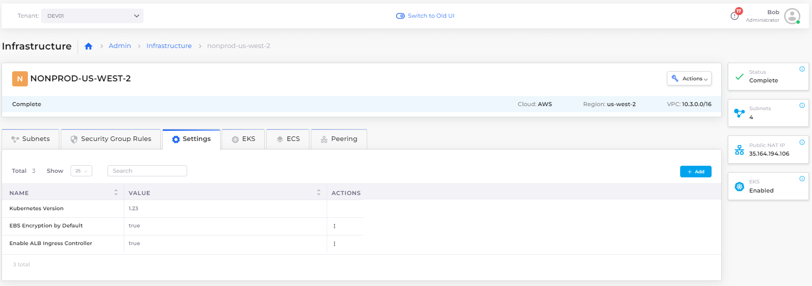
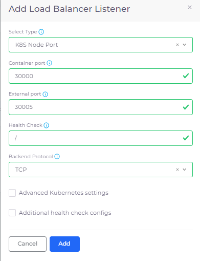
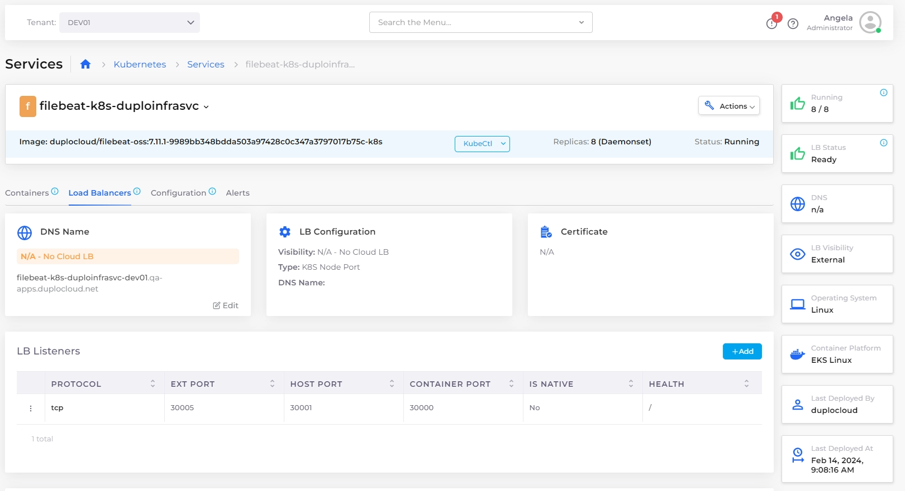
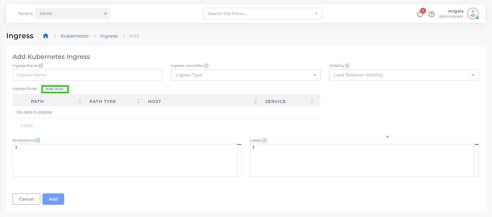
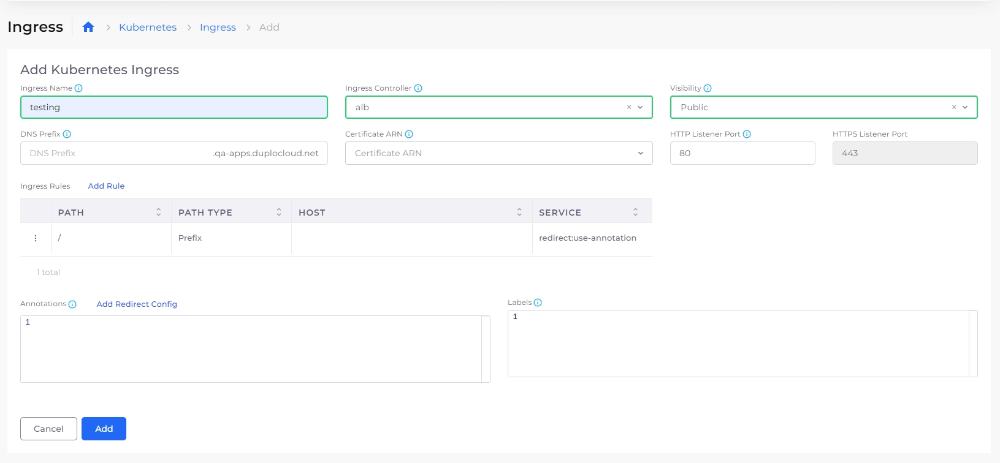
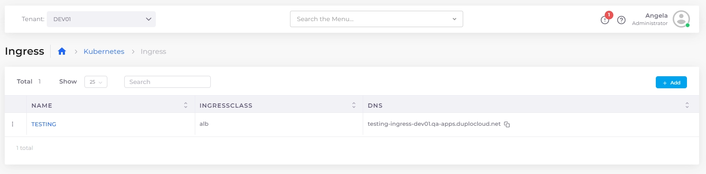
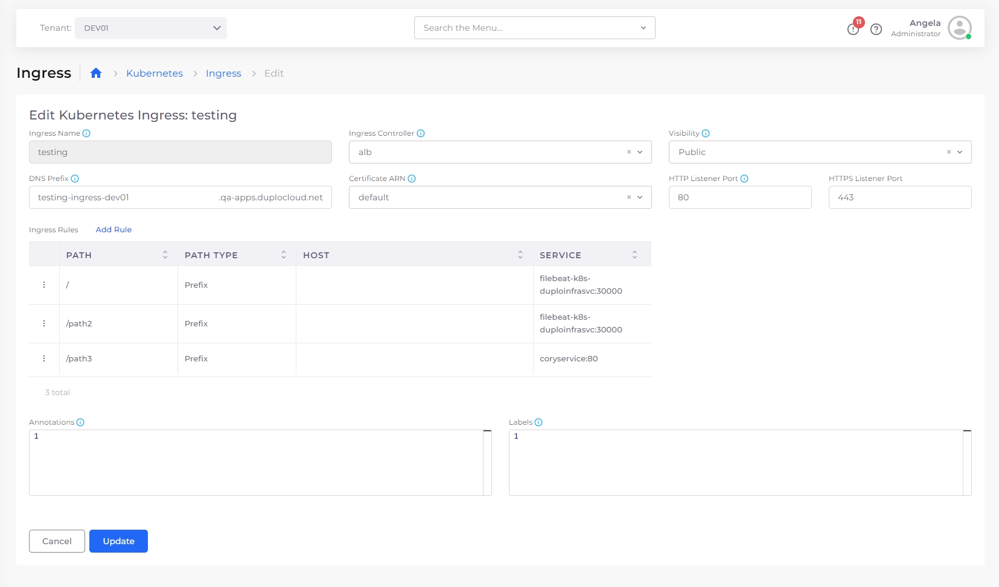
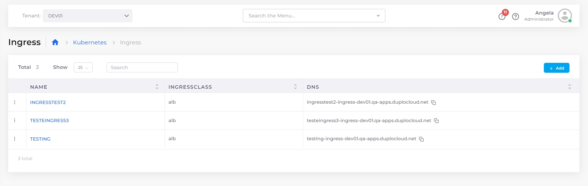

# EKS Ingress

## Creating a Kubernetes Ingress and Load Balancer

Ingress controllers abstract the complexity of routed Kubernetes application traffic, providing a bridge between Kubernetes services and services that you define.

### Creating Tenants, Hosts, and Services with EKS

See the [Containers ](../../overview/aws-services/containers/)topic for steps on how to create [Tenants](../../welcome-to-duplocloud/application-focussed-interface/duplocloud-common-components/tenant.md), Hosts, and [Services](../../welcome-to-duplocloud/application-focussed-interface/duplocloud-common-components/app-service-and-cloud-services.md).

Once your service is deployed, you can add and configure Kubernetes Ingress by [enabling the AWS Application Load Balancer](adding-ingress.md#enabling-the-aws-application-load-balancer).

### Enabling the AWS Application Load Balancer&#x20;

Your administrator needs to enable the AWS Application Load Balancer controller for your infrastructure before you can use Ingress.

1. In the DuploCloud Portal, navigate to **Administrator ->** **Infrastructure** and select the Infrastructure name from the **NAME** column. Select the **Settings** tab.
2. Click **Add**. The **Infra - Custom Data** pane displays.
3. From the **Setting Name** list box, select **Enable ALB Ingress Controller**.
4. Select **Enable**.
5. Click **Set**. In the Settings tab, the **Enable ALB Ingress Controller** setting displays a value of **true**.&#x20;

<figure><figcaption>
<strong>Settings</strong> tab on the <strong>Infrastructure</strong> page
</figcaption></figure>

### Adding a Load Balancer with Kubernetes NodePort

Add a Load Balancer listener that uses Kubernetes (K8s) NodePort. Kubernetes Health Check and Probes are enabled by default. To specifically configure the settings for Health Check, select **Additional Health Check configs** when you add the Load Balancer.

1. In the DuploCloud Portal, navigate **Kubernetes** -> **Services**.
2. On the **Services** page, select the Service name in the **Name** column.
3. Click the **Load Balancers** tab.
4.  Click **Configure Load Balancer**. The **Add Load Balancer Listener** pane appears.\

    

    <figure><figcaption>
<strong>Add Load Balancer LIstener</strong> pane
</figcaption></figure>

    

5. In the **Select Type** field, select **K8S Node Port**.&#x20;
6. Complete the other required fields in the **Add Load Balancer Listener** pane and click **Add**. The Load Balancer displays in the **Load Balancers** tab.

<figure><figcaption>
<strong>Load Balancers</strong> tab for <strong>filebeat-k8s-duploinfrasvc</strong>
</figcaption></figure>

### Add Kubernetes Ingress

Once Services are deployed, add Ingress:

1. Select **Kubernetes** -> **Ingress** from the navigation pane.
2. Click **Add**. The **Add Kubernetes Ingress** page displays.


To add a Kubernetes Ingress, you must define rules. [Continue to the next section to add rules](adding-ingress.md#add-rules-to-kubernetes-ingress-and-complete-ingress-setup) to Kubernetes Ingress and complete the setup.&#x20;


<figure><figcaption>
<strong>Add Kubernetes Ingress</strong> page with highlighted <strong>Add Rule</strong> option
</figcaption></figure>

### Configure Ingress with redirect config and annotations

1. In the **Add Kubernetes Ingress** page, configure Ingress by clicking **Add Rule**. The **Add** or **Edit Ingress Rule pane** displays.&#x20;

<figure><figcaption></figcaption></figure>

2. Specify the **Path** (**/** in the example above).
3. To use a container port name (optional), use the toggle switch to enable **Use Container Port Name**.
4. If you enabled **Use Container Port Name** in step 3., type a Service name in the Service Name field (**redirect:use-annotation** in the example) and a container port name in the **Container Port** field (**use-annotation** in the example). &#x20;
5. If you did not enable **Use Container Port Name** in Step 3., select the Service exposed through the K8S Node Port from the **Service Name** list box. The **Container Port** field is completed automatically.
6. Optionally, complete **Path Type** and **Host**. In this example, we specify a **Path Type** of **Exact**. Clicking the Info Tip icon (  ) provides more information for these optional fields.
7.  Click **Add Rule**. The rule will be displayed on the **Add Kubernetes Ingress** page. Repeat the preceding steps to add additional rules.\

    <figure><figcaption>
The <strong>Add Ingress</strong> page
</figcaption></figure>
8. On the **Add Kubernetes Ingress** page, specify the **Ingress Name**.
9. From the **Ingress Controller** list box, select the [Ingress Controller that you defined previously](adding-ingress.md#enabling-the-aws-application-load-balancer).
10. From the **Visibility** list box, select either **Internal Only** or **Public**.&#x20;
11. From the **Certificate ARN** list box, select the appropriate ARN.
12. To expose your services over HTTP or HTTPS, enter the listener ports in the **HTTP Listener Port** and **HTTPS Listener Port** fields.&#x20;
13. In the **Target Type** field, specify how you want to route traffic to Pods. You can choose between **Instance (Worker Nodes)** or **IP (Pod IPs)**. \

    * **Instance (Worker Nodes)** routes traffic to all EC2 instances within the cluster on the NodePort opened for your Service. To use the Instance target type, the Service must be **NodePort** or **LoadBalancer** type.
    *   **IP (Pod IPs)** routes traffic directly to the Pod IP. The network plugin must use secondary IP addresses on ENI (e.g., amazon-vpc-cni-k8s) for the Pod IP to use IP mode. The Service can be of any type (like ClusterIP, NodePort, or LoadBalancer). IP mode is required for sticky sessions to work with Application Load Balancers.\

        

        <figure><figcaption></figcaption></figure>

        

14. Click **Add Redirect Config**. The **Add Redirect Config** pane displays.\

    

    <figure><figcaption>
The <strong>Add Redirect Config</strong> pane
</figcaption></figure>

    

15. Fill in the fields as shown in the example above.&#x20;
16. Click **Add** to add the Kubernetes Ingress with defined rules. The Ingress you added displays in the **K8S Ingress** tab.\

    <figure><figcaption>
 <strong>The Ingress</strong> page displaying the added Ingress
</figcaption></figure>


DuploCloud Platform supports defining multiple paths in Ingress. For example, you could define an Ingress rule with an **Exact Path Type** to route requests to `/path1/`for **js-service1** and add a rule with a **Prefix Path Type** to route requests to `/path2/` for **testsvc2.** Additionally, you could add a rule with a **Prefix Path Type** to route requests via a [BYOH Host](../../extras-overview/byoh.md) (Bring-Your-Own-Host) named **example.com** for a third service, **testsvc3**.


<figure><figcaption>
Multiple paths defined for an <strong>Ingress</strong> in the DuploCloud Portal
</figcaption></figure>

## Viewing Ingress

When Ingress is configured, you can access Services based on the rules for each **DNS**, displayed on the **Kubernetes** -> **Ingress** page.&#x20;

In this example, we display the output for three services with **Path Type** rules and different DNS names. See the [previous example](adding-ingress.md#add-rules-to-kubernetes-ingress-and-complete-ingress-setup) for detailed steps to create Ingress rules.

<figure><figcaption>
 <strong>Ingress</strong> page with multiple Ingresses for specific DNS names.
</figcaption></figure>

By executing `curl` commands, you can see the difference in the output for each service in this example. Configured services are accessed based on the DNS name specified in the DuploCloud Portal and the paths you specified when adding Ingress rules.

> `>curl http://ig-nev-ingress-ing-t2-1-duplopoc.net/`_`path-x`_`/`\
> `this is service1`\
> \
> `>curl http://ing-doc-ingress-ing-t2-1-duplopoc.net/`_`path-y`_`/`\
> `this is service2`
>
> \
> `>curl http://ing-public-ingress-ing-t2.1.duplopoc.net/`_`path-z`_`/`
>
> `this is ING2-PUBLIC`

