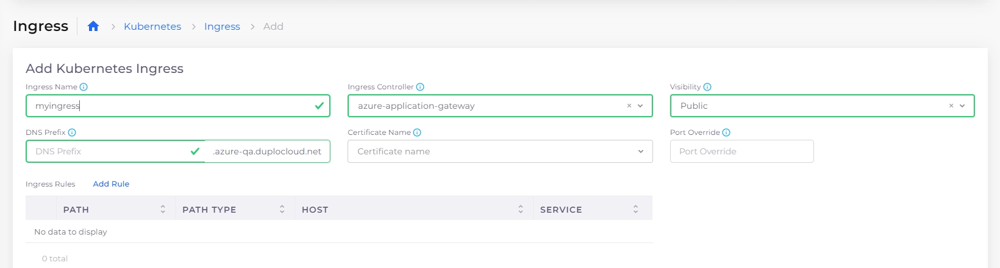

# AKS Ingress

Ingress controllers abstract the complexity of routed Kubernetes application traffic, providing a bridge between Kubernetes services and services that you define.


To add an SSL certificate to a service using Kubernetes Ingress, see the DuploCloud documentation for [using SSL certificates with Ingress](https://docs.duplocloud.com/docs/overview-2/prerequisites/import-ssl-certificates).


## Prerequisites

### Creating Services

To run the load balancers, you must create one or more Services. To add a service, follow the steps in the [Services](https://docs.duplocloud.com/docs/overview-2/azure-services/containers-and-services) topic. In this example, we created two Services named **s1-alb** and **s4-nlb**.&#x20;

<figure><figcaption>
The <strong>Kubernetes Services</strong> page showing two Services running 
</figcaption></figure>

### Enabling the Ingress Controller

Before you add an Ingress rule, you need to enable the Ingress Controller for the application gateway.

1. In the DuploCloud Portal, navigate to **Administrator** -> **Infrastructure**.
2. Select the Infrastructure from the **NAME** column.
3. Click the **Settings** tab.
4. Click **Add**. The **Infra-Set Custom Data** pane displays.
5. In the **Setting Name** field, select **Enable App Gateway Ingress Controller**. Click **Enable** and **Set**. In the **Settings** tab, the **Enable App Gateway Ingress Controller** setting contains the **true** value.

<figure><figcaption>
<strong>Enable App Gateway Ingress Controller</strong> configured with <strong>true</strong> value
</figcaption></figure>

### Adding a Load Balancer Listener using the K8S NodePort

Add a load balancer listener that uses the Kubernetes NodePort (K8S NodePort).

1. In the DuploCloud Portal, navigate **Kubernetes** -> **Services**.
2. On the **Services** page, click on the name of the Service you created.
3. Click the **Load Balancers** tab.
4.  Click **Configure Load Balancer**. The **Add Load Balancer Listener** pane appears.\

    <figure><figcaption>
The <strong>Load Balancer</strong> tab on the s1-alb Service details page
</figcaption></figure>
5. In the **Select Type** field, select **K8S Node Port**.&#x20;
6. In the **Health Check** field, add the Kubernetes Health Check URL for this container.&#x20;
7. Complete the other fields in the **Add Load Balancer Listener** and click **Add**.


Using Kubernetes Health Check allows AKS's Application Load Balancer to determine whether your service is running properly.&#x20;


## Adding Kubernetes Ingress

Add an Ingress rule to listen on port 80 (in this example) using both Load Balancers.

1. In the DuploCloud Portal, navigate to **Kubernetes** -> **Ingress**.
2. Click **Add**. The **Add Kubernetes Ingress** page displays.
3.  Supply the **Ingress Name**, select the Ingress Controller (in this example, **azure-application-gateway**), and set **Visibility** to **Public**.\

    <figure><figcaption>
<strong>Add Kubernetes Ingress</strong> page
</figcaption></figure>
4. In the **DNS Prefix** field, provide the DNS prefix to expose services using the Route53 domain.
5. From the **Certificate ARN** list box, select the certificate ARN to expose services over HTTPS.
6. In the **Port Override** field, select the port to override. This field allows configuring frontend listeners to use different ports other than 80/443 for HTTP/HTTPS. If you use a port other than 80, you must define an additional Security Group rule for that port. See [this section](./#adding-a-security-group-rule-for-a-port-value-other-than-80) for more information.

### Configuring Kubernetes Ingress rules

1. On the **Add Kubernetes Ingress** page, click **Add Rule**. The **Add Ingress Rule** pane displays. Specify a unique **Path** identifier.
2.  In the **Service Name** field, select the Service (**s1-alb:80** in this example). Click **Add Rule** to add the Ingress rule.\

    

    <figure><figcaption>
<strong>Add Ingress Rule</strong> pane
</figcaption></figure>

    

3. Repeat the previous steps to add additional rules. In this example, we added a second rule for Service **s4-nlb:80**.
4. On the **Add Kubernetes Ingress** page, click **Add** to create the Ingress.


The DuploCloud Platform supports defining multiple paths in Ingress.


### Adding a Security Group Rule


Port **80** is configured by default when adding Ingress. If you want to use a custom port number other than **80**, add an additional security group rule for the custom port using this procedure.&#x20;


1. In the DuploCloud Portal, navigate to **Administrator** -> **Infrastructure**.
2. Select the Infrastructure from the **Name** column.
3. Click the **Security Group Rules** tab.&#x20;
4.  Click **Add**. The **Add Infrastructure Security** pane displays.\

    

    <figure><figcaption>
<strong>Add Infrastructure Security</strong> pane
</figcaption></figure>

    

5. Define the rule and click **Add**. The rule is added to the **Security Group Rules** list.

<figure><figcaption>
<strong>Security Group Rules</strong> tab showing a rule for ports <strong>1-81</strong>
</figcaption></figure>

## Viewing Ingress

When Ingress is configured, you can access Services based on the rules for each **DNS**, displayed on the **Kubernetes** -> **Ingress** page.&#x20;

The image below shows the output for three Services with **Path Type** rules and different DNS names. See the detailed steps to [create Ingress rules](./#configuring-kubernetes-ingress-rules).

<figure><figcaption>
The <strong>Kubernetes Ingress</strong> page showing three Ingresses
</figcaption></figure>

By executing `curl` commands, you can see the difference in the output for each Service. Services are accessed based on the DNS name specified in the DuploCloud Portal and the paths that you configured when you added Ingress rules:

> `>curl http://ig-nev-ingress-ing-t2-1.duplopoc.net/`
>
> `this is IG-NEV`\
> \
> `>curl http://ing-doc-ingress-ing-t2-1.duplopoc.net/`
>
> `this is ING-DOC`
>
> \
> `>curl http://ing-public-ingress-ing-t2.1.duplopoc.net/`
>
> `this is ING2-PUBLIC`
