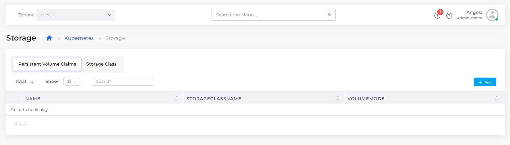
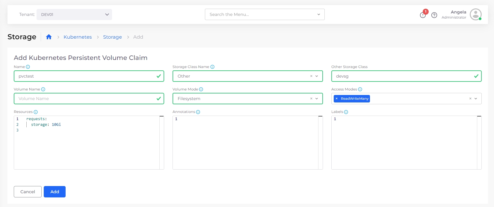
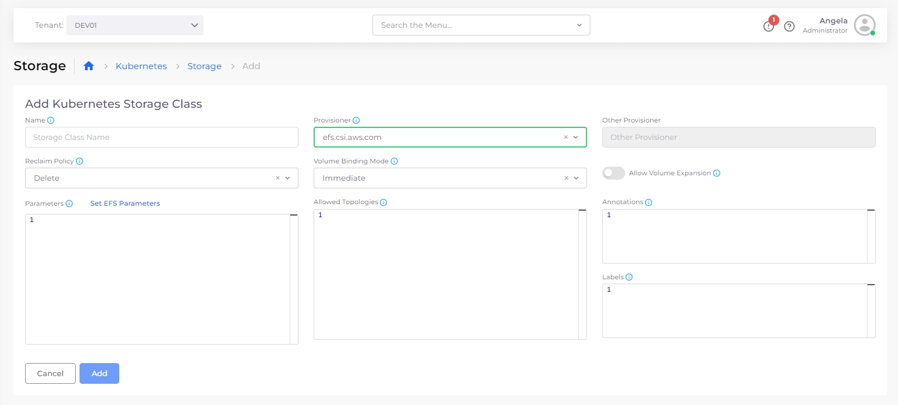

# Kubernetes StorageClass and PVC

## Configuring Kubernetes Storage

You can configure the Storage Class and Persistent Volume Claims (PVCs) from the DuploCloud Portal.&#x20;

1.  In the DuploCloud Portal, navigate to **Kubernetes** -> **Storage**. The **Kubernetes Storage** page displays. From this page, you define your Kubernetes [**Persistent Volume Claims**](https://kubernetes.io/docs/concepts/storage/persistent-volumes/) and [**Storage Classes**](https://kubernetes.io/docs/concepts/storage/storage-classes/). The **Persistent Volume Claims** option is selected by default.\

    <figure><figcaption>
The <strong>Persistent Volume Claims</strong> option on the <strong>Kubernetes Storage</strong> page
</figcaption></figure>
2. Click **Add**. The **Add Kubernetes Persistent Volume Claim** page displays.

<figure><figcaption>
The <strong>Add Kubernetes Persistent Volume Claim</strong> page
</figcaption></figure>

3. Define the PVC **Name**, **Storage Class Name**, **Volume Name**, **Volume Mode**, and other details such as volume **Access Modes**.
4. Click **Add**.
5. On the **Kubernetes Storage** page, select the **Storage Class** option.&#x20;
6.  Click **Add**. The **Add Kubernetes Storage Class** page displays.\

    <figure><figcaption>
The <strong>Add Kubernetes Storage Class</strong> page
</figcaption></figure>
7. Define the Storage Class **Name**, **Provisioner**, **Reclaim Policy**, and **Volume Binding Mode.** Select other options, such as whether to **Allow Volume Expansion**.
8. Click **Add**.

## Creating a Storage Class

1. In the DuploCloud Portal, navigate to **Kubernetes** -> **Storage**.
2. Click **Add**. The **Add Kubernetes Storage Class** page displays.
3. Create a Storage Class, as in the example below.

<figure><figcaption>
<strong>Add Kubernetes Storage Class</strong> page 
</figcaption></figure>


For information on using Native Azure StorageClasses, [see this section](storage-options.md).

