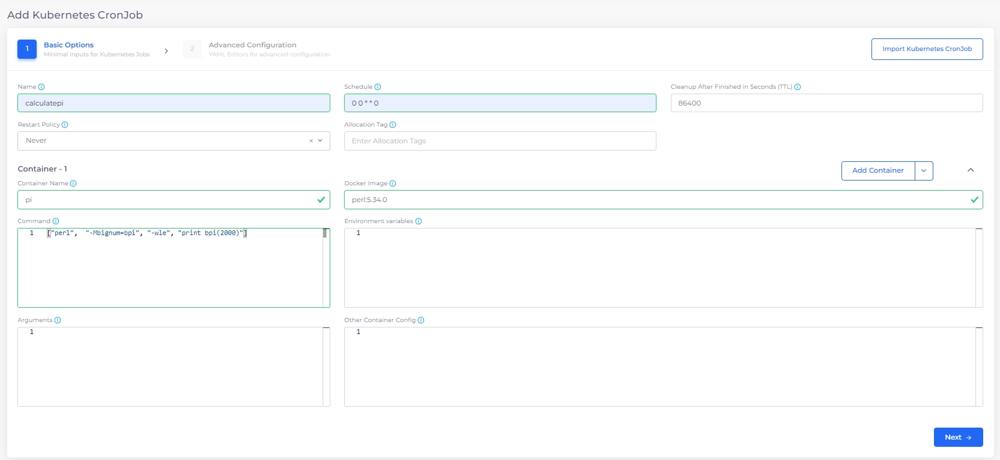
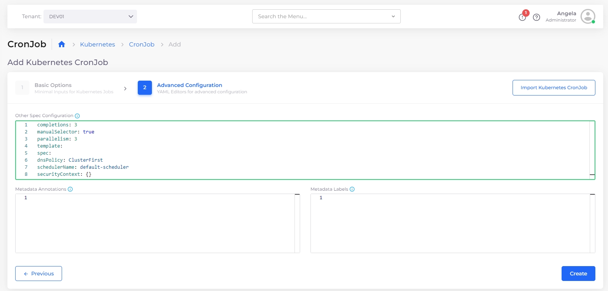
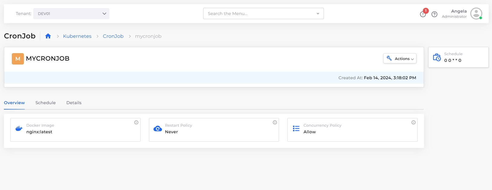
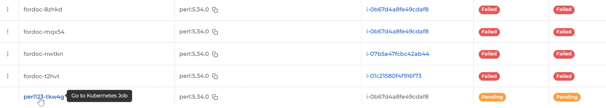

# CronJobs

A [Kubernetes ](https://kubernetes.io/)CronJob is a variant of a [Kubernetes Job](jobs.md), with the exception that you can schedule a Kubernetes CronJob to run at periodic intervals.

See the Kubernetes [CronJob](https://kubernetes.io/docs/concepts/workloads/controllers/cron-jobs/) documentation for more information.

## Creating a Kubernetes CronJob in the DuploCloud portal

1. In the DuploCloud Portal, navigate to **Kubernetes** -> **CronJob**.
2. Click **Add**. The **Add Kubernetes CronJob** page displays.
3. In the **Basic Options** step, specify the Kubernetes CronJob **Name**.
4. In the **Schedule** field, specify the Cron Schedule in Cron Format. Click the Info Tip icon for examples. When specifying a **Schedule** in Cron Format, ensure you separate each value with a space. For example, `0 0 * * 0` is a valid Cron Format input; `00**0` is not. See the [Kubernetes documentation](https://kubernetes.io/docs/concepts/workloads/controllers/cron-jobs/#writing-a-cronjob-spec) for detailed information about Cron Format.
5. In the **Container - 1** area, specify the **Container Name** and associated **Docker Image**.

<figure><figcaption>
The <strong>Add Kubernetes CronJob</strong> page with <strong>Container Nam</strong>e and <strong>Docker image</strong> fields filled.
</figcaption></figure>

6. In the **Command** field, specify the command attributes for **Container - 1**. Click the Info Tip icon for examples. Select and **Copy** commands as needed.

<figure><figcaption>
The <strong>Add Kubernetes CronJob</strong> page with the <strong>Command</strong> options window open.
</figcaption></figure>

<figure><figcaption>
The <strong>Add Kubernetes CronJob</strong> page with the <strong>Command</strong> field for <strong>Container - 1</strong> filled<strong>.</strong>
</figcaption></figure>

7. To run the Kubernetes CronJob to completion, you must specify a Kubernetes [Init Container](https://kubernetes.io/docs/concepts/workloads/pods/init-containers/).  Click the **Add Container**  button and select the **Add Init Container** option. The **Init Container - 1** area displays.

<figure><figcaption>
<strong>Add Init Container</strong> area.
</figcaption></figure>

8. In the **Init Container - 1** area, specify the **Container Name** and associated **Docker Image**.
9. Click **Next** to open the **Advanced Configuration** step.
10. In the **Other Spec Configuration** field, specify the job spec (in YAML) for **Init Container - 1**. Click the Info Tip icon (  ) for examples. Select and **Copy** commands as needed

<figure><figcaption>
The <strong>Other Spec Configuration</strong> window on the <strong>Add Kubernetes CronJob, Advanced Configuration</strong> page<strong>.</strong>
</figcaption></figure>

<figure><figcaption>
The <strong>Add Kubernetes CronJob</strong> page with the <strong>Other Spec Configuration</strong> field completed<strong>.</strong>
</figcaption></figure>

11. Click **Create**. The Kubernetes CronJob is created and displayed on the **CronJob** page and will run according to your specified schedule.&#x20;

<figure><figcaption>
<strong>K8s CronJob</strong> tab displaying Kubernetes Job <strong>CALCULATEPI.</strong>
</figcaption></figure>

## **Running a Kubernetes CronJob immediately**

You can enable a Kubernetes CronJob to run immediately (as a Job) instead of following the specified schedule.

1. In the DuploCloud Portal, navigate to **Kubernetes** -> **CronJob**.
2.  Click on the **menu icon** (  ) icon to the left of the CronJob name and select **Run Now**.\

    <figure><figcaption>
The Kubernetes <strong>CronJob</strong> page showing the action menu with the <strong>Run now</strong> option highlighted.
</figcaption></figure>

## Viewing a Kubernetes CronJob&#x20;

1. In the DuploCloud Portal, navigate to **Kubernetes** -> **CronJob**.
2. Select the Kubernetes CronJob you want to view and click the **Overview, Schedule**, and **Details** tabs for more information about the job schedule and job history.&#x20;

You can also view details of a Kubernetes CronJob by clicking on the **menu icon** (  ) icon to the left of the job name and selecting **View**.

<figure><figcaption>
<strong>Overview</strong> tab for Kubernetes Job <strong>MYCRONJOB.</strong>
</figcaption></figure>

<figure><figcaption>
CronJob options menu with <strong>View</strong> option highlighted.
</figcaption></figure>

### Using the Container page to view linked Kubernetes CronJobs

You can also view Kubernetes CronJobs linked to containers by clicking the container **Name** on the **Containers** page (**Kubernetes** -> **Containers**). \

<figure><figcaption>
Clicking the Container <strong>Name</strong> on the <strong>Containers</strong> page to view a linked K8s CronJob
</figcaption></figure>

You can filter container names by using the search field at the top of the page, as in this example:

<figure><figcaption>
Highlighted search field on the <strong>Containers</strong> page 
</figcaption></figure>

## Editing a Kubernetes CronJob

1. In the DuploCloud Portal, navigate to **Kubernetes** -> **CronJob**.
2. Select the Kubernetes CronJob you want to edit.&#x20;
3. Click the **options menu** (  ) icon to the left of the Kubernetes CronJob name and select **Edit**.

You can edit a Kubernetes Job in the DuploCloud Portal and modify the following fields:

* **Cleanup After Finished in Seconds**
* **Other Spec Configuration**
* **Metadata Annotations**
* **Labels**

<figure><figcaption>
CronJob options menu with <strong>Edit</strong> option highlighted
</figcaption></figure>

## Deleting a Kubernetes CronJob

1. In the DuploCloud Portal, navigate to **Kubernetes** -> **CronJob.**
2. Select the Kubernetes CronJob you want to delete.&#x20;
3. Click the Job Options Menu () icon to the left of the Job name and select **Delete**.

<figure><figcaption>
Job options menu with <strong>Delete</strong> option highlighted
</figcaption></figure>

