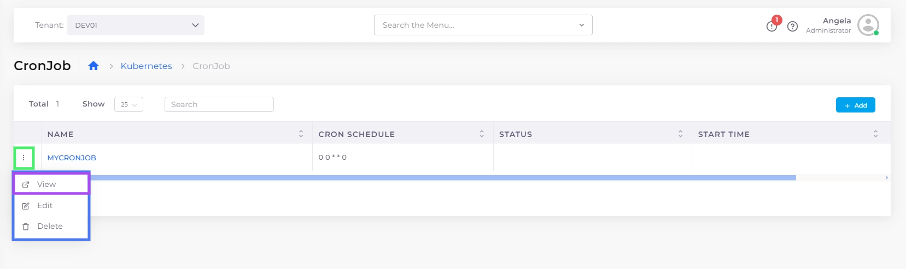

# CronJobs

A [Kubernetes ](https://kubernetes.io/)CronJob is a variant of a [Kubernetes Job](jobs.md), except that you can schedule a Kubernetes CronJob to run at periodic intervals.

See the Kubernetes documentation on [CronJobs](https://kubernetes.io/docs/concepts/workloads/controllers/cron-jobs/) for more information.

## Creating a Kubernetes CronJob in the DuploCloud portal

1. In the DuploCloud Portal, navigate to **Kubernetes** -> **CronJobs**.
2. Click **Add**. The **Add Kubernetes CronJob** page displays.
3. In the **Basic Options** step, specify the Kubernetes CronJob **Name**.
4. In the **Schedule** field, specify the Cron Schedule in Cron Format. Click the Info Tip icon for examples. When specifying a **Schedule** in Cron Format, ensure you separate each value with a space. For example, `0 0 * * 0` is a valid Cron Format input; `00**0` is not. See the [Kubernetes documentation](https://kubernetes.io/docs/concepts/workloads/controllers/cron-jobs/#writing-a-cronjob-spec) for detailed information about Cron Format.
5. Optionally, update the **Cleanup After Finished in Seconds (TTL)** field and the **Restart Policy**, and add **Allocation Tags**. See below for more information about using Allocation Tags with Kubernetes Jobs and Cronjobs.&#x20;
6. In the **Container - 1** area, specify the **Container Name** and associated **Docker Image**.

<figure><figcaption><p>The <strong>Add Kubernetes CronJobs</strong> page with <strong>Container Nam</strong>e and <strong>Docker image</strong> fields filled.</p></figcaption></figure>

7. In the **Command** field, specify the command attributes for **Container - 1**. Click the Info Tip icon for examples. Select and **Copy** commands as needed.

<figure><figcaption><p>The <strong>Add Kubernetes CronJobs</strong> page with the <strong>Command</strong> options window open.</p></figcaption></figure>

<figure><figcaption><p>The <strong>Add Kubernetes CronJob</strong> page with the <strong>Command</strong> field for <strong>Container - 1</strong> filled<strong>.</strong></p></figcaption></figure>

8. To run the CronJob to completion, you must specify a Kubernetes [Init Container](https://kubernetes.io/docs/concepts/workloads/pods/init-containers/).  Click the **Add Container** button and select the **Add Init Container** option. The **Init Container - 1** area displays.

<figure><figcaption><p><strong>Add Init Container</strong> area.</p></figcaption></figure>

9. In the **Init Container - 1** area, specify the **Container Name** and associated **Docker Image**.
10. Click **Next** to open the **Advanced Configuration** step.
11. In the **Other Spec Configuration** field, specify the job spec (in YAML) for **Init Container - 1**. Click the Info Tip icon (  ) for examples. Select and **Copy** commands as needed.

<figure><figcaption><p>The <strong>Other Spec Configuration</strong> window on the <strong>Add Kubernetes CronJob, Advanced Configuration</strong> page<strong>.</strong></p></figcaption></figure>

<figure><figcaption><p>The <strong>Add Kubernetes CronJob</strong> page with the <strong>Other Spec Configuration</strong> field completed<strong>.</strong></p></figcaption></figure>

12. Click **Create**. The K8s CronJob is created and displayed on the **CronJob** page and will run according to your specified schedule.&#x20;

<figure><figcaption><p><strong>K8s CronJob</strong> tab displaying Kubernetes Job <strong>CALCULATEPI.</strong></p></figcaption></figure>

### Using Allocation Tags with Kubernetes CronJobs

Allocation tags for Kubernetes CronJobs help manage resources in a Kubernetes environment. They can be useful for:&#x20;

* **Resource Organization**
* **Scheduling and Affinity Rules**
* **Resource Quotas and Limits**
* **Monitoring and Logging**
* **Cost Allocation and Billing**

You can add allocation tags in the Allocation Tag field when creating Kubernetes Cronjobs. Allocation tags in Kubernetes CronJobs typically use features like `nodeSelector`, `tolerations`, and `affinity` to control where Jobs are executed in the Kubernetes cluster.

In the YAML below, the following act as allocation tags:

* **`nodeSelector`** ensures that the Kubernetes Job is scheduled on nodes with a specific label (in this case, nodes labeled `role: backup`).
* **`tolerations`** allow the Kubernetes Job to be scheduled on nodes with a particular taint. In this case, it tolerates nodes with the `maintenance` taint.
* **`affinity`** controls how the Kubernetes Job is scheduled based on certain conditions. Here, the `nodeAffinity` specifies that the Kubernetes Job should only be scheduled on nodes within the `us-west-1` zone.

```
          nodeSelector:
            role: backup  
          tolerations:
          - key: "maintenance"
            operator: "Exists"
            effect: "NoSchedule" 
          affinity:
            nodeAffinity:
              requiredDuringSchedulingIgnoredDuringExecution:
                nodeSelectorTerms:
                - matchExpressions:
                  - key: "zone"
                    operator: "In"
                    values:
                    - "us-west-1" 
```

To learn more about allocation tags for Kubernetes Cronjobs, see the Kubernetes documentation on [labels and selectors](https://kubernetes.io/docs/concepts/overview/working-with-objects/labels/) and [node selectors and node affinity](https://kubernetes.io/docs/concepts/scheduling-eviction/assign-pod-node/#nodeselector).

## Viewing a Kubernetes CronJob&#x20;

1. In the DuploCloud Portal, navigate to **Kubernetes** -> **CronJobs**.
2. Select the Kubernetes CronJob you want to view and click the **Overview, Schedule**, and **Details** tabs for more information about its schedule and history.&#x20;

You can also view details of a Kubernetes CronJob by clicking on the **menu icon** (  ) icon to the left of the Kubernetes Job name and selecting **View**.


<figure><figcaption><p><strong>Overview</strong> tab for Kubernetes Job <strong>MYCRONJOB.</strong></p></figcaption></figure>

<figure><figcaption><p>CronJob options menu with <strong>View</strong> option highlighted.</p></figcaption></figure>

### Using the Container page to view linked Kubernetes CronJobs

You can also view CronJobs linked to containers by clicking the container **Name** on the **Containers** page (**Kubernetes** -> **Containers**). \


<div align="left">

<figure><figcaption><p>Clicking the Container <strong>Name</strong> on the <strong>Containers</strong> page to view a linked K8s CronJob</p></figcaption></figure>

</div>

You can filter container names by using the search field at the top of the page, as in this example:


<figure><figcaption><p>Highlighted search field on the <strong>Containers</strong> page </p></figcaption></figure>

## Editing a Kubernetes CronJob

1. In the DuploCloud Portal, navigate to **Kubernetes** -> **CronJob**.
2. Select the K8s CronJob you want to edit.&#x20;
3. Click the **options menu** (  ) icon to the left of the CronJob name and select **Edit**.

You can edit a Kubernetes Job in the DuploCloud Portal and modify the following fields:

* **Cleanup After Finished in Seconds**
* **Other Spec Configuration**
* **Metadata Annotations**
* **Labels**

<figure><figcaption><p>CronJob options menu with <strong>Edit</strong> option highlighted</p></figcaption></figure>

## Deleting a Kubernetes CronJob

1. In the DuploCloud Portal, navigate to **Kubernetes** -> **CronJob.**
2. Select the K8s CronJob you want to delete.&#x20;
3. Click the Job Options Menu (  ) icon to the left of the Job name and select **Delete**.

<figure><figcaption><p>Job options menu with <strong>Delete</strong> option highlighted</p></figcaption></figure>

