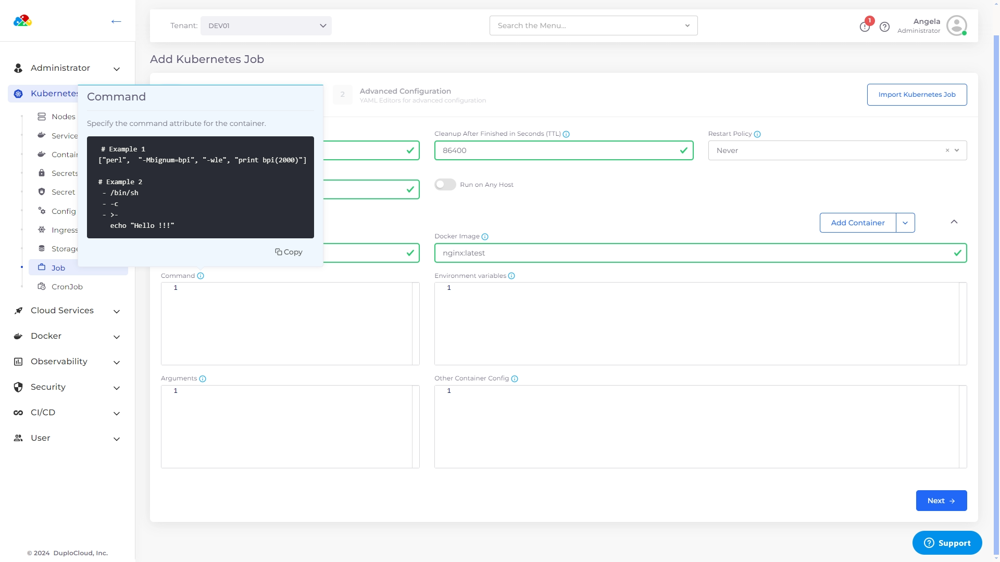
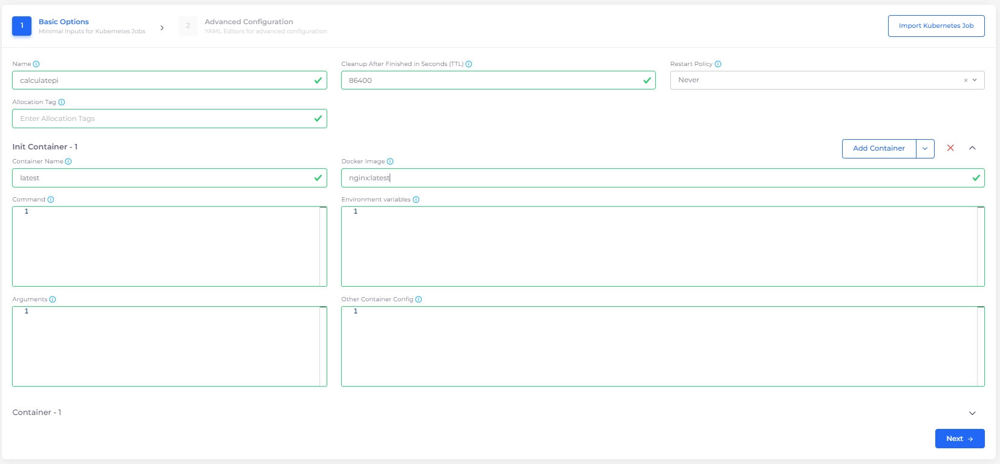
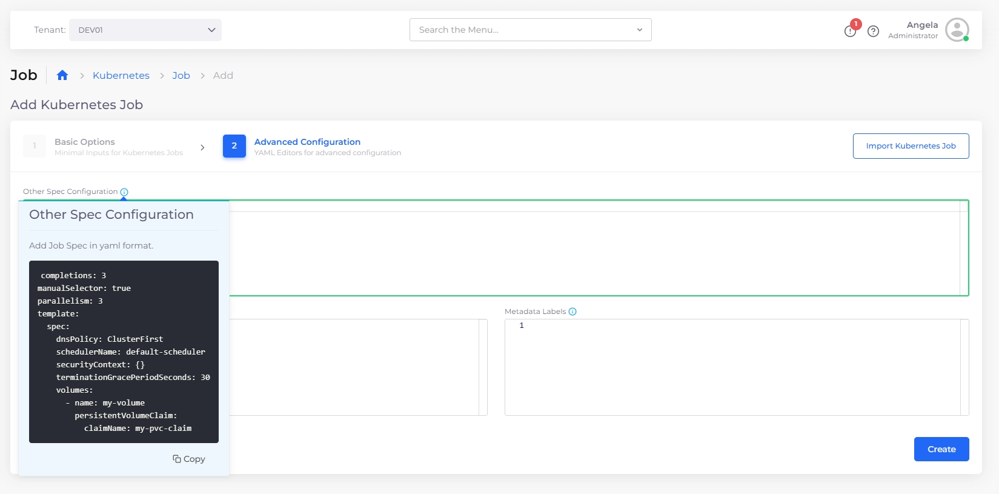
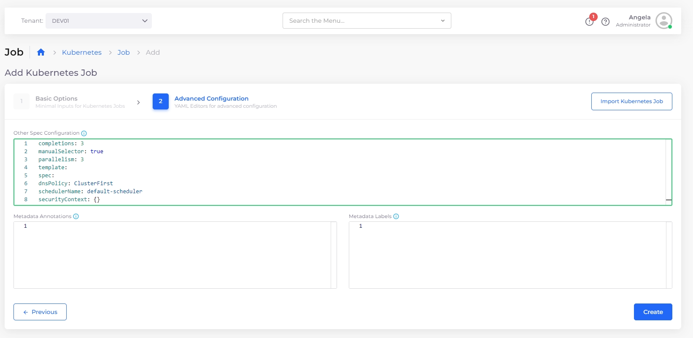
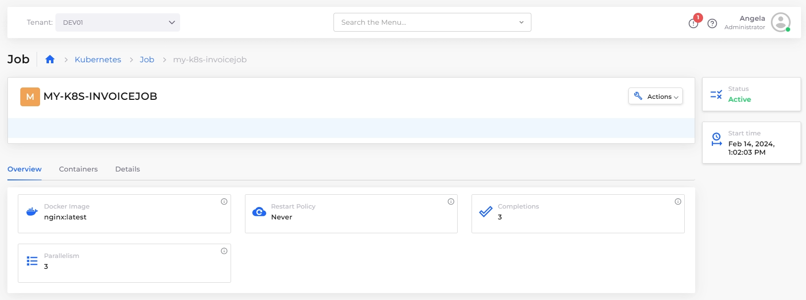
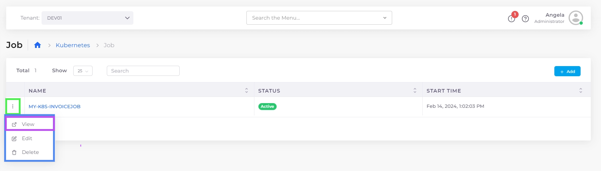
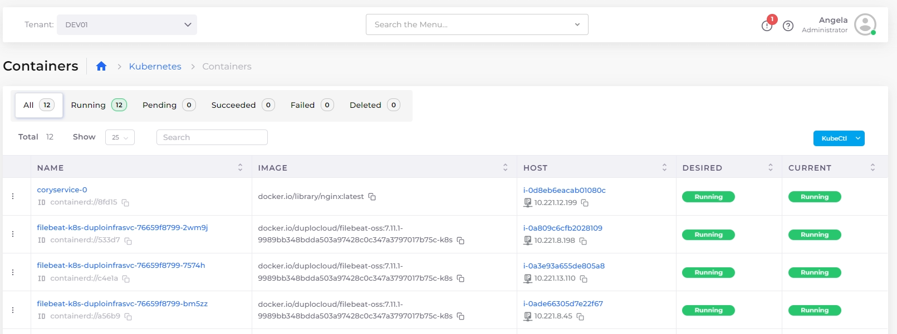
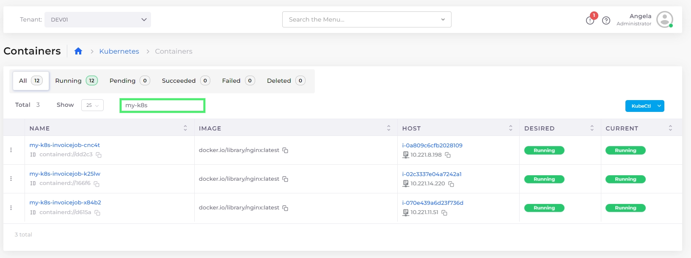
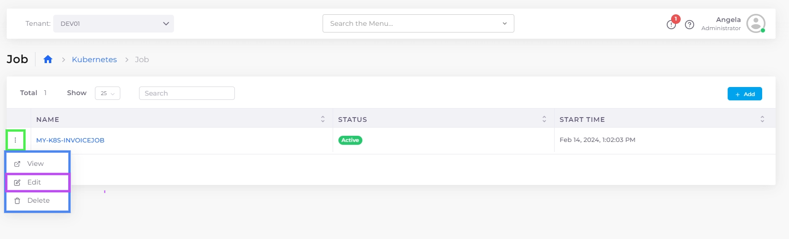
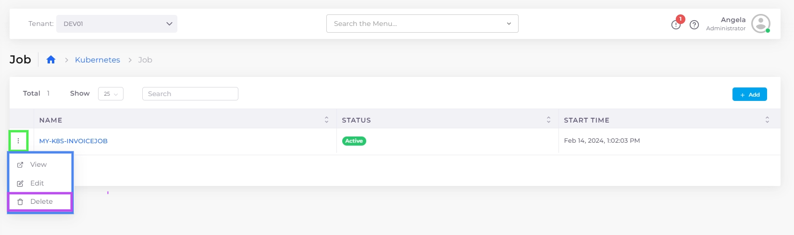

# Jobs

In Kubernetes, a [Job ](https://kubernetes.io/docs/concepts/workloads/controllers/job/)is a controller object representing a task or a set of tasks that runs until successful completion. It is designed to manage short-lived batch workloads in a Kubernetes cluster. You use a Job when you need to run a task or a set of tasks once, to completion, rather than continuously, as in other types of controllers such as [Deployments](https://kubernetes.io/docs/concepts/workloads/controllers/deployment/).

Refer to the Kubernetes [Job ](https://kubernetes.io/docs/concepts/workloads/controllers/job/)documentation for use cases and examples of when to use Jobs.

## Using Kubernetes Jobs for Pod management

Pods are the smallest deployable computing units that you can create and manage in Kubernetes. A Pod is a group of one or more containers with shared storage and network resources, including a specification that dictates how to run the containers. A Pod's contents are always co-located and co-scheduled and run in a shared context. A Pod models an application-specific "logical host": it contains one or more tightly coupled application containers.&#x20;

In the DuploCloud Portal, you can create K8s Jobs to create one or more Pods. The Job continues to retry execution of the Pods until a specified number of them are successfully terminated. K8s Jobs tracks the successful terminations. When the specified number of successful terminations is completed, the Job is marked as `completed` in Kubernetes. Deleting a Job cleans up the Pods that the Job created. Suspending a Job deletes the Job's active Pods until it is resumed again.

You typically create one Kubernetes Job object to reliably run one Pod to completion. The Job object starts a new Pod if the first Pod fails or is deleted (for example, in case of a node hardware failure or a node reboot).

You can also use a Kubernetes Job to run multiple Pods in [parallel](https://kubernetes.io/docs/tasks/job/parallel-processing-expansion/). If you want to run a Kubernetes Job (either a single task or several in parallel) on a schedule, see [CronJobs](cronjobs.md).

## Creating a Kubernetes Job in the DuploCloud portal

1. In the DuploCloud Portal, select the Tenant you are working with from the Tenant list box at the top-left of the DuploCloud Portal.&#x20;
2. Navigate to **Kubernetes** -> **Jobs**.
3. Click **Add**. The **Add Kubernetes Job** page displays.
4. In the **Basic Options** step, specify the Kubernetes Job **Name**.
5. Optionally, update the **Cleanup After Finished in Seconds (TTL)** field and the **Restart Policy**, and add **Allocation Tags**. See below for more information about using Allocation Tags with Kubernetes Jobs and Cronjobs.&#x20;
6. In the **Container - 1** area, specify the **Container Name** and associated **Docker Image**.

<figure><figcaption><p>The <strong>Add Kubernetes Job</strong> page</p></figcaption></figure>

7. In the **Command** field, specify the command attributes for **Container - 1**. Click the Info Tip icon for examples. Select and **Copy** commands as needed.

<figure><figcaption><p>The <strong>Add Kubernetes Jobs</strong> page with the <strong>Command</strong> info window open.<br></p></figcaption></figure>

<figure><figcaption><p>The <strong>Add Kubernetes Jobs</strong> page with <strong>Container - 1</strong> details added.<br></p></figcaption></figure>

8. To run the Kubernetes Job to completion, you must specify a Kubernetes [Init Container](https://kubernetes.io/docs/concepts/workloads/pods/init-containers/).  Click the **Add Container** button and select the **Add Init Container** option. The **Init Container - 1** area displays.
9.  In the **Init Container - 1** area, specify the **Container Name** and associated **Docker Image**.\


    <figure><figcaption><p>The <strong>Add Kubernetes Job</strong> page with <strong>Init Container</strong> added.</p></figcaption></figure>
10. Click **Next** to open the **Advanced Configuration** step.
11. In the **Other Spec Configuration** field, specify the Kubernetes Job spec (in YAML) for **Init Container - 1**. Click the Info Tip icon for examples. Select and **Copy** commands as needed.\


    <figure><figcaption><p>Info Tip examples for the <strong>Other Spec Configuration</strong> field<strong>.</strong><br></p></figcaption></figure>

    <figure><figcaption><p><strong>Add Kubernetes Job</strong> page with completed <strong>Other Spec Configuration</strong> field<strong>.</strong> </p></figcaption></figure>
12. Click **Create**. The job is created and displayed on the **Job** page with a status of **Active**.&#x20;

<figure><figcaption><p><strong>K8s Job</strong> tab showin<strong>g</strong> the Active <strong>CALCULATEPI</strong> Job.</p></figcaption></figure>

### Using Allocation Tags with Kubernetes Jobs

Allocation tags for Kubernetes Jobs (labels, node selectors, or node affinity) help manage resources in a Kubernetes environment. They can be useful for:&#x20;

* **Resource Organization**
* **Scheduling and Affinity Rules**
* **Resource Quotas and Limits**
* **Monitoring and Logging**
* **Cost Allocation and Billing**

You can add allocation tags in the Allocation Tag field when creating Kubernetes Jobs.&#x20;

In the YAML below, the following act as allocation tags:

* **`labels`** are key-value pairs used to organize, categorize, and identify resources such as Pods, Nodes, Jobs, and more. The`compliance: HIPAA` label applied in the example indicates that the Kubernetes Job is associated with a HIPAA compliance context.
* **`nodeSelector`** specifies that the Kubernetes Job should be scheduled on specific nodes. In this example, it will be scheduled on nodes with the label `security-level: high.`

```yaml
  labels:
    compliance: HIPAA
spec:
  template:
    spec:
      nodeSelector:
        security-level: high
```

To learn more about allocation tags for Kubernetes Jobs, see the Kubernetes documentation on [labels and selectors](https://kubernetes.io/docs/concepts/overview/working-with-objects/labels/) and [node selectors and node affinity](https://kubernetes.io/docs/concepts/scheduling-eviction/assign-pod-node/#nodeselector).

## Viewing a Kubernetes Job&#x20;

1. In the DuploCloud Portal, navigate to **Kubernetes** -> **Job**.
2. Select the Kubernetes Job you want to view and click the **Overview**, **Containers**, and **Details** tabs for more information about its status and history.&#x20;

You can also view a Kubernetes Job's details by clicking the menu icon  (  )  to the left of the Job name and selecting **View**.

<figure><figcaption><p><strong>Overview and Details</strong> tabs for a Kubernetes Job<strong>.</strong></p></figcaption></figure>

<figure><figcaption><p>Job option menu with <strong>View</strong> option highlighted.</p></figcaption></figure>

### Using the Containers page to view linked Kubernetes Jobs

You can view K8s Jobs linked to Containers by clicking the Container **Name** on the **Containers** page (**Kubernetes** -> **Containers**).&#x20;

<figure><figcaption><p>Clicking the Container <strong>Name</strong> on the <strong>Containers</strong> page to view a linked K8s job</p></figcaption></figure>

You can filter Container names by using the search field at the top of the page, as in this example:

<figure><figcaption><p>Highlighted search field on the <strong>Containers</strong> page.</p></figcaption></figure>

## Editing a Kubernetes Job

1. In the DuploCloud Portal, navigate to **Kubernetes** -> **Job**.
2. Select the K8s job you want to edit.&#x20;
3. Click the options menu (  ) icon to the left of the job you want to edit and select **Edit**.

You can edit a job in the DuploCloud Portal and modify the following fields:

* **Cleanup After Finished in Seconds**
* **Other Spec Configuration**
* **Metadata Annotations**
* **Labels**

<figure><figcaption><p><strong>Job</strong> page options menu with <strong>Edit</strong> option highlighted.</p></figcaption></figure>

## Deleting a Kubernetes Job

1. In the DuploCloud Portal, navigate to **Kubernetes** -> **Job**.
2. Select the K8s job you want to delete.&#x20;
3. Click the job options menu (  ) icon to the left of the job name and select **Delete**.

<figure><figcaption><p>Job options menu with <strong>Delete</strong> option highlighted</p></figcaption></figure>
