# Jobs

In Kubernetes, a [Job ](https://kubernetes.io/docs/concepts/workloads/controllers/job/)is a controller object that represents a task or a set of tasks that runs until successful completion. It is designed to manage short-lived, batch workloads in a Kubernetes cluster. You use a Job when you need to run a task or a set of tasks once, to completion, rather than continuously, as in other types of controllers such as [Deployments](https://kubernetes.io/docs/concepts/workloads/controllers/deployment/).

Refer to the Kubernetes [Job ](https://kubernetes.io/docs/concepts/workloads/controllers/job/)documentation for use cases and examples of when to use jobs.

## Using Kubernetes Jobs for Pod Management

Pods are the smallest deployable units of computing that you can create and manage in Kubernetes. A Pod is a group of one or more [containers](https://kubernetes.io/docs/concepts/containers/), with shared storage and network resources, including a specification that dictates how to run the containers. A Pod's contents are always co-located and co-scheduled, and run in a shared context. A Pod models an application-specific "logical host": it contains one or more application containers that are tightly coupled.&#x20;

In the DuploCloud Portal, you can create K8s Jobs to create one or more Pods. The Job continues to retry execution of the Pods until a specified number of them successfully terminate. The K8s Jobs tracks the successful terminations. When the specified number of successful terminations completes, the Job is marked as `completed` in Kubernetes. Deleting a Job cleans up the Pods that the job created. Suspending a Job delete the Job's active Pods until the Job is resumed again.

You typically create one Job object to reliably run one Pod to completion. The Job object starts a new Pod if the first Pod fails or is deleted (for example, in case of a node hardware failure or a node reboot).

You can also use a Job to run multiple Pods in [parallel](https://kubernetes.io/docs/tasks/job/parallel-processing-expansion/). If you want to run a Job (either a single task, or several in parallel) on a schedule, see [CronJobs](cronjobs.md).

## Creating a Kubernetes Job in the DuploCloud Portal

1. In the DuploCloud Portal, select the Tenant you are working with from the Tenant list box at the top-left of the DuploCloud Portal.&#x20;
2. Navigate to **DevOps** -> **Containers** -> **EKS/Native**.
3. Click the **K8s Job** tab.
4. Click **Add**. The **Add Kubernetes Job** page displays.
5. In the **Basic Options** step, specify the Kubernetes Job **Name**.
6.  In the **Container - 1** area, specify the **Container Name** and associated **Docker Image**.\

    <figure><figcaption>
Add Kubernetes Job page
</figcaption></figure>

7.  In the **Command** field, specify the command attributes for **Container - 1**. Click the Info Tip icon for examples. Select and **Copy** commands as needed.\

    

    <figure>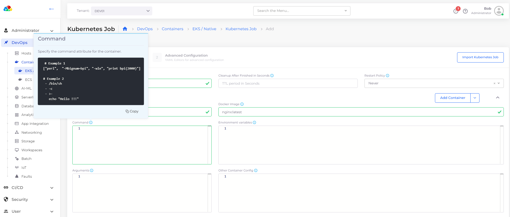<figcaption>
Examples for <strong>Command</strong> field in <strong>Container - 1</strong> area of <strong>Add Kubernetes Job</strong> page 
</figcaption></figure>

    

    

    <figure><figcaption>
Completed <strong>Command</strong> field for <strong>Container - 1</strong> 
</figcaption></figure>

    

8. To run the Job to completion, you must specify a Kubernetes [Init Container](https://kubernetes.io/docs/concepts/workloads/pods/init-containers/).  Click the **Add Container** button and select the **Add Init Container** option. The **Init Container - 1** area displays.
9.  In the **Init Container - 1** area, specify the **Container Name** and associated **Docker Image**.\

    

    <figure>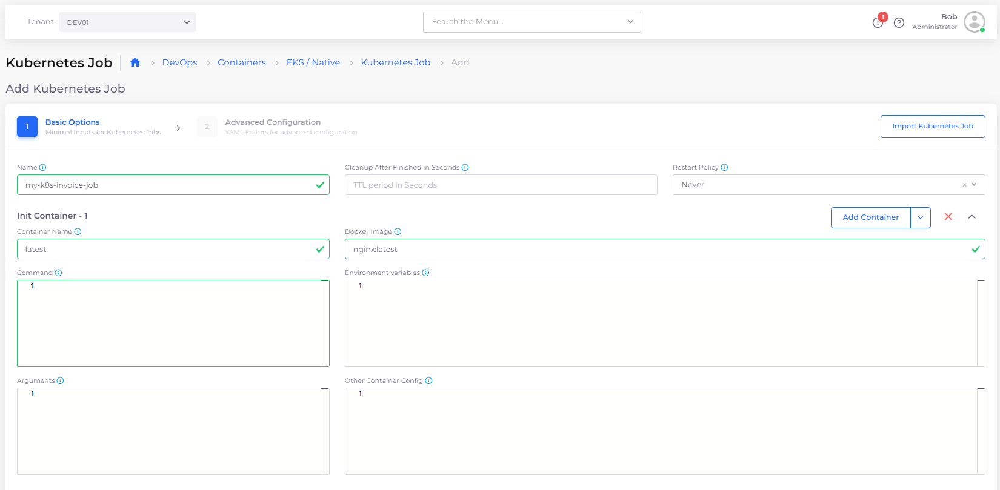<figcaption>
<strong>Add Init Container</strong> option on <strong>Add Container</strong> button in <strong>Container - 1</strong> area
</figcaption></figure>

    

10. Click **Next** to open the **Advanced Configuration** step.
11. In the **Other Spec Configuration** field, specify the Job spec (in YAML) for **Init Container - 1**. Click the Info Tip icon for examples. Select and **Copy** commands as needed.\

    

    <figure>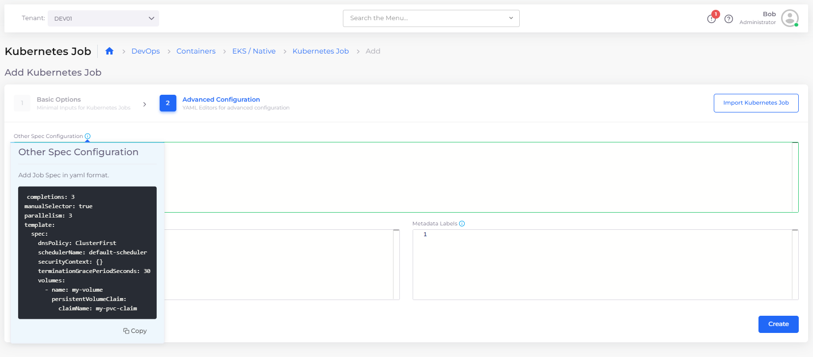<figcaption>
Info Tip examples for <strong>Other Spec Configuration</strong> field in <strong>Advanced Configuration</strong> step for <strong>Init Container - 1</strong> 
</figcaption></figure>

    

    

    <figure>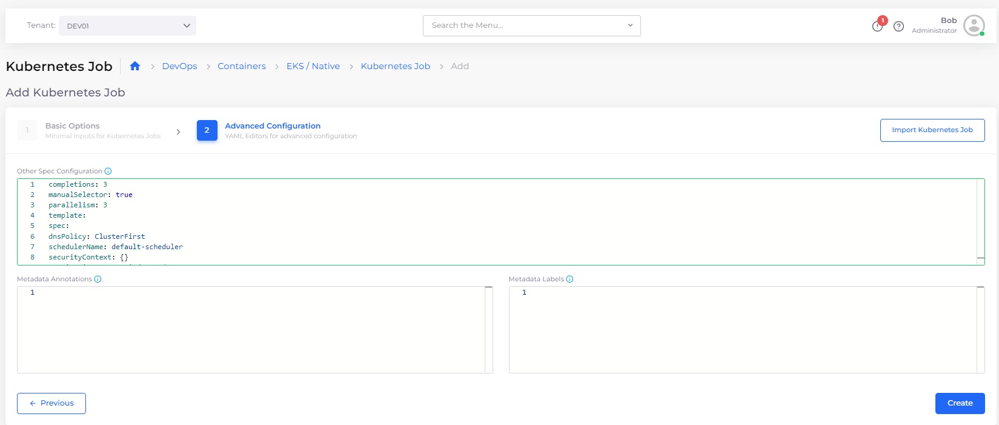<figcaption>
Completed <strong>Other Spec Configuration</strong> field for <strong>Init Container - 1</strong>  
</figcaption></figure>

    

12. Click **Create**. The K8s Job is created and displayed in the **K8s Job** tab with a status of **Active**.&#x20;

<figure>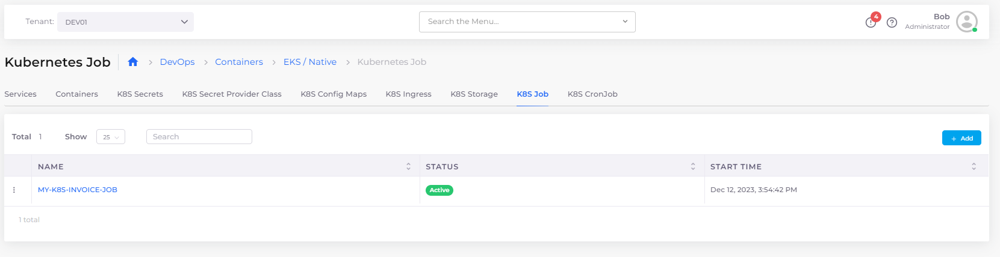<figcaption>
<strong>K8S Job</strong> tab displaying Kubernetes Job <strong>MY-K8S-INVOICE-JOB</strong> with <strong>Active Status</strong>
</figcaption></figure>

## Viewing a Kubernetes Job&#x20;

1. In the DuploCloud Portal, navigate to **DevOps** -> **Containers** -> **EKS/Native**.
2. Click the **K8s Job** tab.
3. Select the K8s Job you want to view and click the **Overview** and **Details** tabs for more information about the job status and job history.&#x20;

You can also view details of a Kubernetes Job by clicking the Job Menu Icon (  ) icon to the left of the Job name and selecting **View**.

<figure>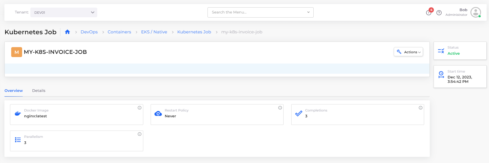<figcaption>
<strong>Overview and Details</strong> tabs for Kubernetes Job <strong>MY-K8S-INVOICE-JOB</strong>
</figcaption></figure>

<figure>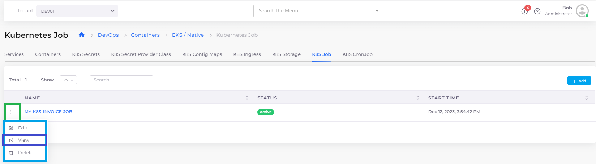<figcaption>
Job Option Menu with <strong>View</strong> option highlighted
</figcaption></figure>

### Using the Container page to view linked Kubernetes Jobs

You can also view K8s Job **Overview** and **Details** by clicking the Container **Name** in the **Containers** tab (**DevOps** -> **Containers** -> **EKS/Native** -> **Containers**).&#x20;

<figure>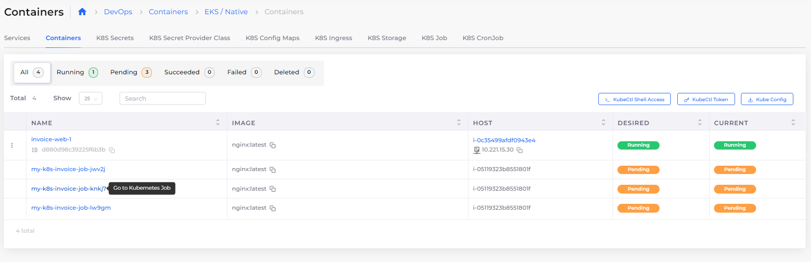<figcaption>
Clicking the Container <strong>Name</strong> on the <strong>Containers</strong> page to view a linked K8s Job
</figcaption></figure>

You can filter Container Names by using the search field at the top of the page, as in this example:

<figure>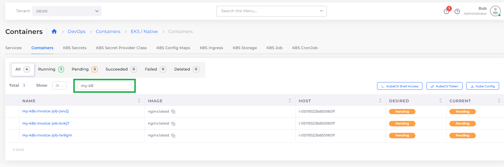<figcaption>
Highlighted search field on the <strong>Containers</strong> page 
</figcaption></figure>

## Editing a Kubernetes Job

1. In the DuploCloud Portal, navigate to **DevOps** -> **Containers** -> **EKS/Native**.
2. Click the **K8s Job** tab.
3. Select the K8s Job you want to edit.&#x20;
4. Click the Job Options Menu (  ) icon to the left of the Job name and select **Edit**.

You can edit a Kubernetes Job in the DuploCloud Portal and modify the following fields:

* **Cleanup After Finished in Seconds**
* **Other Spec Configuration**
* **Metadata Annotations**
* **Labels**

<figure>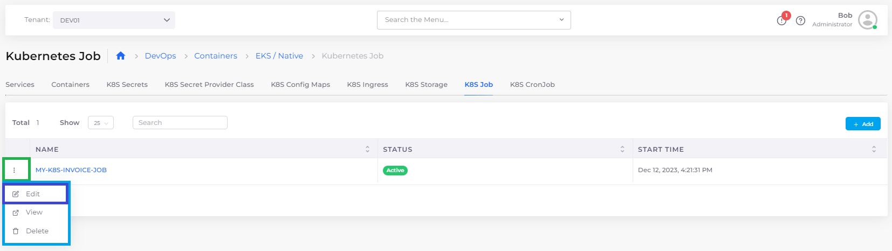<figcaption>
Job Option Menu with <strong>Edit</strong> option highlighted
</figcaption></figure>

## Deleting a Kubernetes Job

1. In the DuploCloud Portal, navigate to **DevOps** -> **Containers** -> **EKS/Native**.
2. Click the **K8s Job** tab.
3. Select the K8s Job you want to delete.&#x20;
4. Click the Job Options Menu (  ) icon to the left of the Job name and select **Delete**.

<figure>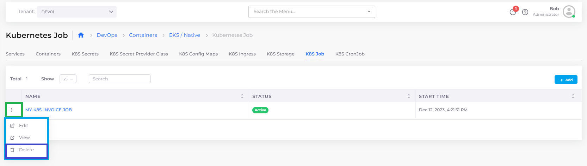<figcaption>
Job Option Menu with <strong>Delete</strong> option highlighted
</figcaption></figure>
