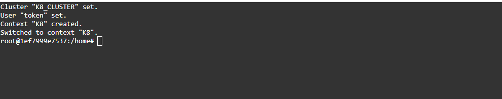

# Kubernetes KubeCtl Token

## Downloading the KubeCtl token and setting up KubeCtl

DuploCloud provides a way to connect directly to the Cluster namespace using the `kubectl` token.&#x20;


If you attempt to start a **KubeCtl Shell** instance and receive a **503** in your web browser, ensure that the **duplo-shell** service in the **Default** Tenant is running and that the Hosts which support it are running, as well.


1. In the DuploCloud Portal, navigate to **DevOps** -> **Containers** -> _**CONTAINER\_TYPE**_, where _**CONTAINER\_TYPE**_ is **EKS/Native**, **AKS/Native** or **GKE/Native**.
2.  Click **KubeCtl Token.** The **Token** window displays. **Copy** the contents to your clipboard.\

    

    <figure><figcaption>
<strong>Services</strong> page with <strong>KubeCtl Token</strong> button 
</figcaption></figure>

    

    

    

    

3.  Click **KubeCtl Shell**. A Bash shell instance opens. \

    <figure><figcaption>
Bash shell for entering copied <code>kubectl</code> commands
</figcaption></figure>
4. Paste the commands into the shell to create the `kubectl` token.&#x20;

`kubectl` is now configured to access the Kubernetes cluster for your Tenant namespace.
