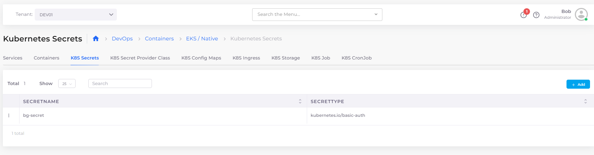

# Kubernetes Configs and Secrets

Set and reference Kubernetes secrets in your deployment by configuring the secrets in the DuploCloud Portal.

1. In the DuploCloud Portal, navigate to **DevOps** -> **Containers** -> _**CONTAINER\_TYPE**_, where _**CONTAINER\_TYPE**_ is **EKS/Native**, **AKS/Native** or **GKE/Native**.
2. Select the Service from the **Name** column.
3. Click the **K8S Secrets** tab. The **Kubernetes Secrets** page displays.

<figure><figcaption>
<strong>Kubernetes Secrets</strong> page
</figcaption></figure>
