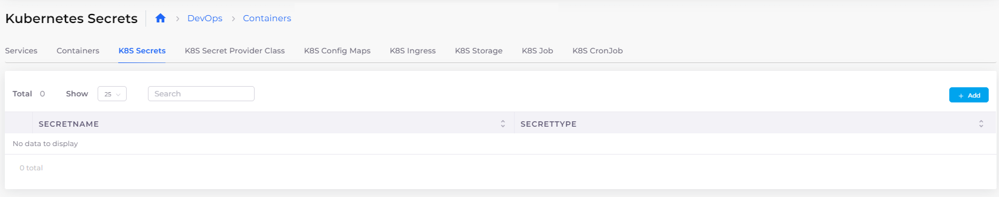

# Setting Kubernetes Secrets

### Setting Kubernetes Secrets

Optionally, set and reference Kubernetes secrets in your deployment by configuring the secrets with the **GKE/Native** option.&#x20;

1. In the DuploCloud Portal, navigate to **DevOps** -> **Containers** -> **GKE/Native**.&#x20;
2. Select the Service from the **Name** column.
3. Click the **K8S Secrets** tab. The **Kubernetes Secrets** page displays.

<figure><figcaption>
<strong>Kubernetes Secrets</strong> page (<strong>K8S Secrets</strong> tab)
</figcaption></figure>
