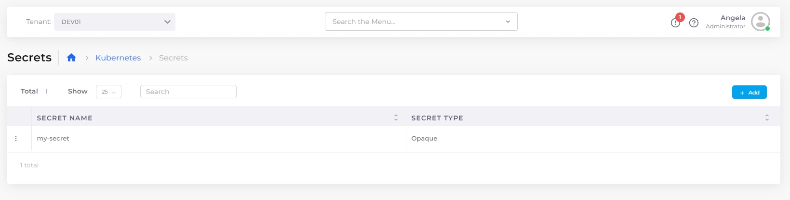

# Setting Kubernetes Secrets

### Setting Kubernetes Secrets

Set and reference Kubernetes secrets in your deployment by configuring the secrets.&#x20;

1. In the DuploCloud Portal, navigate to **Kubernetes** -> **Secrets**. The **Kubernetes Secrets** page displays.
2. Click **Add**.&#x20;
3. Fill in the fields (**Secret Name, Secret Type, Secret Details, Secret Labels**, and **Secret Annotations**).
4. Click **Add**. The Kubernetes Secret is set.

<figure><figcaption>
<strong>Kubernetes Secrets</strong> page.
</figcaption></figure>
