# Kubernetes CronJobs

A [Kubernetes ](https://kubernetes.io/)CronJob is a variant of a [Kubernetes Job](kubernetes-jobs.md), with the exception that you can schedule a CronJob to run at periodic intervals.

See the Kubernetes documentation on [CronJobs](https://kubernetes.io/docs/concepts/workloads/controllers/cron-jobs/) for more information.

## Creating a Kubernetes CronJob in the DuploCloud Portal

1. In the DuploCloud Portal, navigate to **DevOps** -> **Containers** -> **EKS/Native**.
2. Click the **K8s CronJob** tab.
3. Click **Add**. The **Add Kubernetes CronJob** page displays.
4. In the **Basic Options** step, specify the Kubernetes CronJob **Name**.
5. In the **Schedule** field, specify the Cron Schedule in Cron Format. Click the Info Tip icon       (  ) for examples. When specifying a **Schedule** in Cron Format, ensure you separate each value with a space. For example, `0 0 * * 0` is a valid Cron Format input; `00**0` is not. See the [Kubernetes documentation](https://kubernetes.io/docs/concepts/workloads/controllers/cron-jobs/#writing-a-cronjob-spec) for detailed information about Cron Format.
6.  In the **Container - 1** area, specify the **Container Name** and associated **Docker Image**.\

    <figure>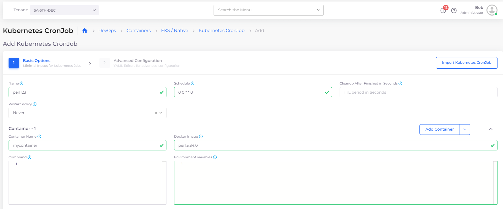<figcaption>
Add Kubernetes CronJob page
</figcaption></figure>

7.  In the **Command** field, specify the command attributes for **Container - 1**. Click the Info Tip icon       (  ) for examples. Select and **Copy** commands as needed.\

    

    <figure>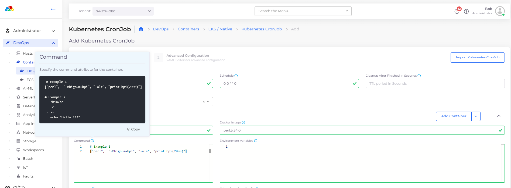<figcaption>
Examples for <strong>Command</strong> field in <strong>Container - 1</strong> area of <strong>Add Kubernetes CronJob</strong> page 
</figcaption></figure>

    

    

    <figure><figcaption>
Completed <strong>Command</strong> field for <strong>Container - 1</strong> 
</figcaption></figure>

    

8.  To run the Job to completion, you must specify a Kubernetes [Init Container](https://kubernetes.io/docs/concepts/workloads/pods/init-containers/).  Click the **Add Container** button and select the **Add Init Container** option. The **Init Container - 1** area displays.\

    

    <figure>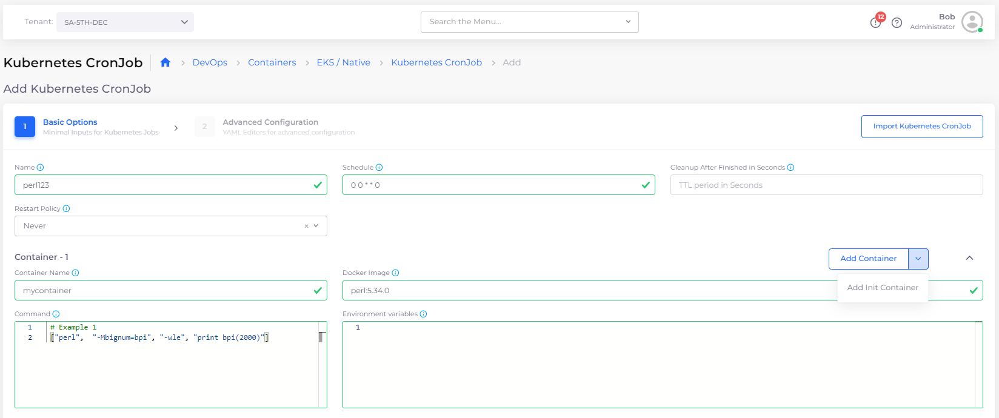<figcaption>
<strong>Add Init Container</strong> option on <strong>Add Container</strong> button in <strong>Container - 1</strong> area
</figcaption></figure>

    

    <figure>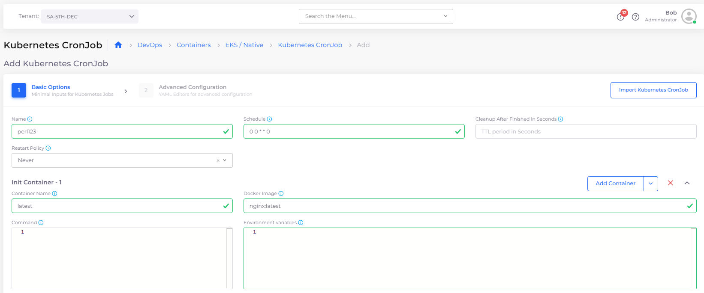<figcaption>
<strong>Init Container - 1</strong> area
</figcaption></figure>

9. In the **Init Container - 1** area, specify the **Container Name** and associated **Docker Image**.
10. Click **Next** to open the **Advanced Configuration** step.
11. In the **Other Spec Configuration** field, specify the Job spec (in YAML) for **Init Container - 1**. Click the Info Tip icon       (  ) for examples. Select and **Copy** commands as needed.\

    

    <figure>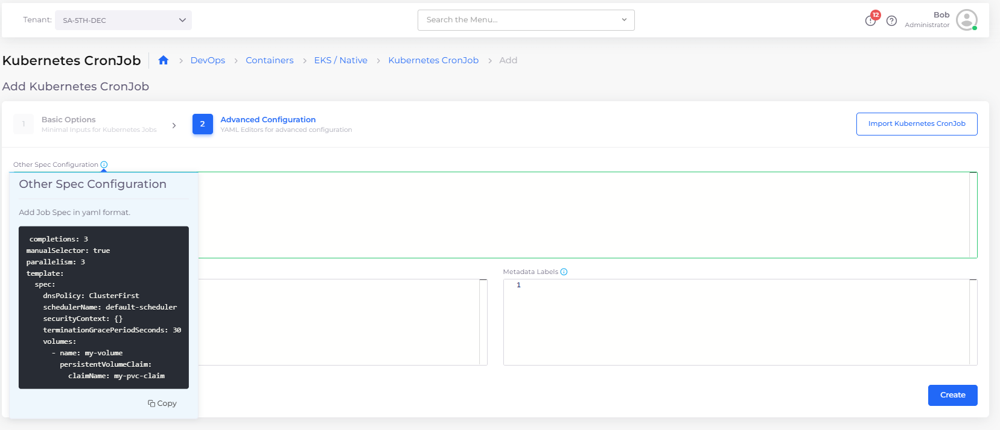<figcaption>
Examples for <strong>Other Spec Configuration</strong> field in <strong>Advanced Configuration</strong> step for <strong>Init Container - 1</strong> 
</figcaption></figure>

    

    

    <figure>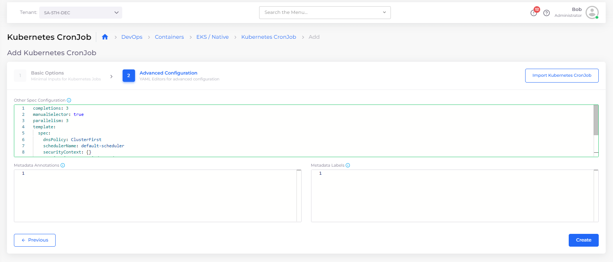<figcaption>
Completed <strong>Other Spec Configuration</strong> field for <strong>Init Container - 1</strong>  
</figcaption></figure>

    

12. Click **Create**. The K8s CronJob is created and displayed in the **K8s CronJob** tab and will be run according to the Schedule you specified.&#x20;

<figure>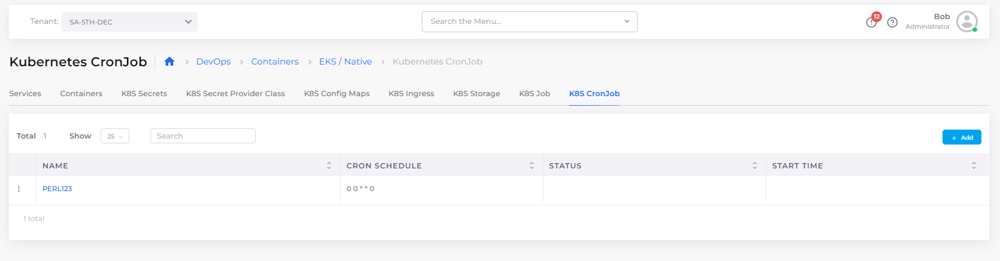<figcaption>
<strong>K8s CronJob</strong> tab displaying Kubernetes Job <strong>PERL123</strong> 
</figcaption></figure>

## Viewing a Kubernetes CronJob&#x20;

1. In the DuploCloud Portal, navigate to **DevOps** -> **Containers** -> **EKS/Native**.
2. Click the **K8s CronJob** tab.
3. Select the K8s Job you want to view and click the **Overview, Schedule**, and **Details** tabs for more information about the job schedule and job history.&#x20;

You can also view details of a Kubernetes Job by clicking the Job Menu Icon (  ) icon to the left of the Job name and selecting **View**.

<figure>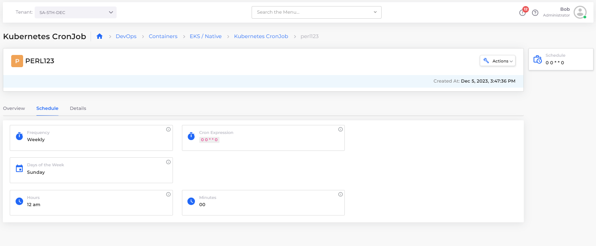<figcaption>
<strong>Schedule</strong> tab for Kubernetes Job <strong>PERL123</strong>
</figcaption></figure>

<figure>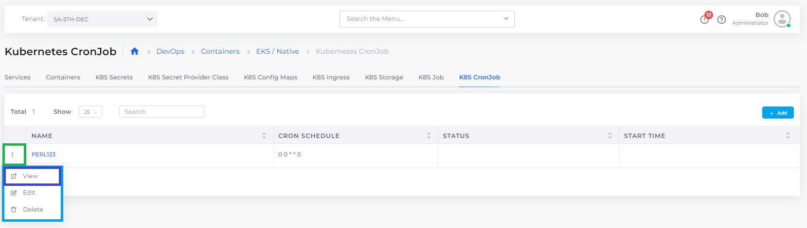<figcaption>
Job Option Menu with <strong>View</strong> option highlighted
</figcaption></figure>

### Using the Container page to view linked Kubernetes Jobs

You can also view K8s Job **Overview** and **Details** by clicking the Container **Name** in the **Containers** tab (**DevOps** -> **Containers** -> **EKS/Native** -> **Containers**). \

<figure><figcaption>
Clicking the Container <strong>Name</strong> on the <strong>Containers</strong> page to view a linked K8s CronJob
</figcaption></figure>

You can filter Container Names by using the search field at the top of the page, as in this example:

<figure>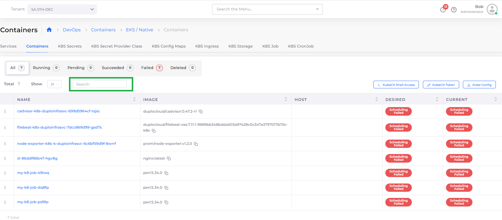<figcaption>
Highlighted search field on the <strong>Containers</strong> page 
</figcaption></figure>

## Editing a Kubernetes Job

1. In the DuploCloud Portal, navigate to **DevOps** -> **Containers** -> **EKS/Native**.
2. Click the **K8s Job** tab.
3. Select the K8s Job you want to edit.&#x20;
4. Click the Job Options Menu (  ) icon to the left of the Job name and select **Edit**.

You can Edit a Kubernetes Job in the DuploCloud Portal and modify the following fields:

* Cleanup After Finished in Seconds
* Other Spec Configuration
* Metadata Annotations
* Labels

<figure>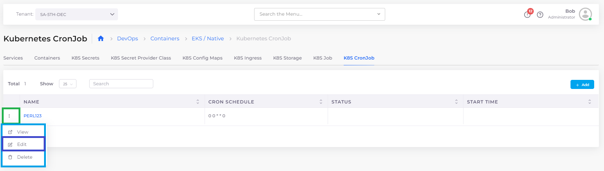<figcaption>
Job Option Menu with <strong>Edit</strong> option highlighted
</figcaption></figure>

## Deleting a Kubernetes Job

1. In the DuploCloud Portal, navigate to **DevOps** -> **Containers** -> **EKS/Native**.
2. Click the **K8s Job** tab.
3. Select the K8s Job you want to edit.&#x20;
4. Click the Job Options Menu (  ) icon to the left of the Job name and select **Delete**.

<figure>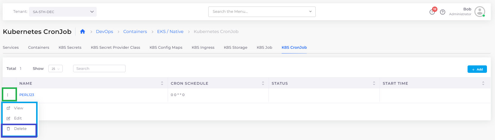<figcaption>
Job Option Menu with <strong>Delete</strong> option highlighted
</figcaption></figure>

