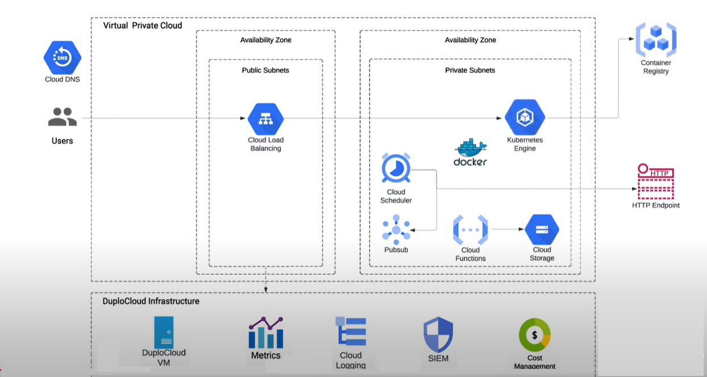

# GCP User Guide

The DuploCloud platform installs a Virtual Machine resource within your GCP Project. It can be accessed using a web interface, API, and a Terraform provider. Log in to the DuploCloud portal via SSO through your GSuite or O365 login.&#x20;


Read through the [DuploCloud Platform Overview](../) and are familiar with DuploCloud terms such as [Infrastructure](../welcome-to-duplocloud/duplocloud-common-components/infrastructure.md), [Plan](../welcome-to-duplocloud/duplocloud-common-components/plan.md), and [Tenant](../welcome-to-duplocloud/duplocloud-common-components/tenant.md).


## Prerequisites

Before you begin, ensure that:

* DuploCloud Portal has been set up and you have access to it.
* You have access to your individual Slack or Teams channel for 24x7 support from the DuploCloud team.

Behind the scenes, a topology is created similar to the following low-level configuration in GCP.

<figure><figcaption>
DuploCloud Sample Architecture for GCP
</figcaption></figure>
