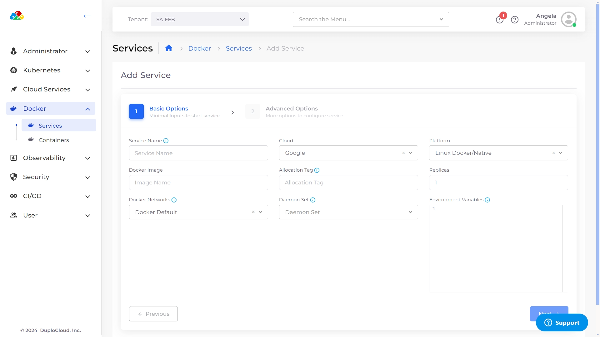
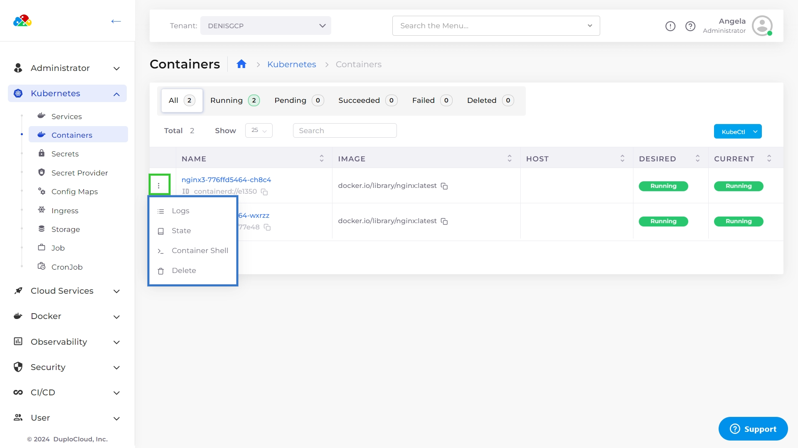

# Containers and Services

Using the **Services** pages (**Kubernetes** -> **Services** or **Docker** -> **Services**) in the DuploCloud Portal, you can display and manage the Services you have defined.

## Adding Services

### Docker Containers 

You can deploy any native Docker container in a virtual machine (VM) with the DuploCloud platform.&#x20;

1. In the DuploCloud Portal, select **Docker** -> **Services** from the navigation pane.&#x20;
2. Click **Add**. The **Add Service** page displays.
3. Complete the fields on the page, including **Service Name**, **Docker Image** **name**, and number of **Replicas**. Use **Allocation Tags** to deploy the container in a specific set of hosts.&#x20;


Do not use spaces when creating Service or Docker image names.

The number of Replicas defined must be less than or equal to the number of hosts in the fleet.


<figure><figcaption>
The <strong>Add Service</strong> page.
</figcaption></figure>

## Kubernetes Containers

In the DuploCloud Portal, you can display and manage the containers you have defined.

Select the Tenant from the **Tenan**t list box in the upper left, and navigate to **Kubernetes** -> **Containers.**

Use the Options Menu (  ) in each container row to display **Logs**, **State**, **Container Shell**, **Host Shell,** and **Delete** options.&#x20;

<table><thead><tr><th width="374">Option</th><th>Functionality</th></tr></thead><tbody><tr><td><strong>Logs</strong></td><td>Displays container logs.</td></tr><tr><td><strong>State</strong></td><td>Displays container state configuration, in YAML code, in a separate window.</td></tr><tr><td><strong>Container Shell</strong></td><td>Accesses the Container Shell. To access the <strong>Container Shell</strong> option, you must first set up <a href="../../prerequisites/shell-access-for-docker.md">Shell access for Docker</a>.</td></tr><tr><td><strong>Host Shell</strong></td><td>Accesses the Host Shell.</td></tr><tr><td><strong>Delete</strong></td><td>Deletes the container.</td></tr></tbody></table>

<figure><figcaption>
The <strong>Kubernetes Containers</strong> page with the menu options highlighted.
</figcaption></figure>

