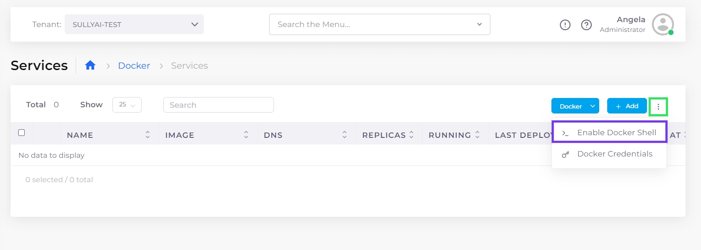
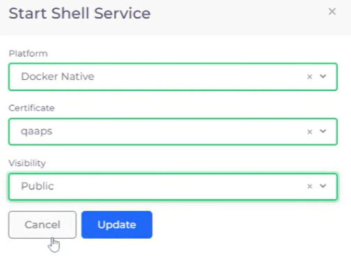

# Shell Access for Docker

DuploCloud allows shell access into the deployed containers.&#x20;

### Access to the Docker Native container shell

1. In the DuploCloud Portal, navigate to **Docker -> Services**, displaying the **Services** page.
2. Click the Options Menu (  ) on the top row of the Services page, as in the example below. Select  **Enable Docker Shell**. The **Start Shell Service** pane displays.

<figure><figcaption>
<strong>Enable Docker Shell</strong> option in the Options Menu for the <strong>Services</strong> page
</figcaption></figure>

3. From the **Platform** list box, select **Docker Native**.\

<figure><figcaption>
<strong>Start Shell Service</strong> pane with <strong>Docker Native</strong> selected for <strong>Platform</strong>
</figcaption></figure>

4. From the **Certificate** list box, select a certificate name.
5. From the **Visibility** list box, select **Public**.&#x20;
6. Click **Update**.

A provisioned service named **dockerservices-shell** is created, enabling you to access the Service containers using SSH.
