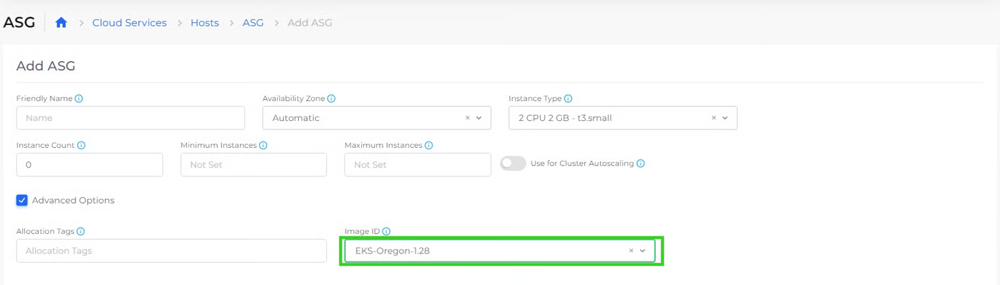

# Enable kubectl Shell

Enabling DuploCloud shell access in GCP is part of a one-time DuploCloud portal setup process.&#x20;

## Step 1: Create a DuploCloud Service

Go under the tools tenant, create a node pool and create a new DuploCloud Service called kubectl.

1.  To create a node pool, select the Tools tenant at the top drop down and then navigate to Kubernetes --> Nodes --> Node Pool\


    <figure><figcaption></figcaption></figure>

Under the GCP VM Tab you will soon see VM running\


<figure><figcaption></figcaption></figure>

1. Next navigate to **Kubernetes** -> **Services** on the left nav bar.
2. Click **Add**. The **Add Service** page displays.&#x20;
3. From the table below, enter the values that correspond to the fields on the **Add Service** page. Accept all other default values for fields not specified.&#x20;

| Add Service page field  | Value                                    |
| ----------------------- | ---------------------------------------- |
| **Name**                | _**kubectl**_                            |
| **Cloud**               | `Google`                                 |
| **Platform**            | `GKE Linux`                              |
| **Docker Image**        | `duplocloud/shell:terraform_kubectl_v15` |

4. In the **Environment Variables** field, enter the following YAML. Replace the flask app secret (b33d13ab-5b46-443d-a19d-asdfsd443 in this example) with a string of random numbers and letters in the same format and replace _**CUSTOMER\_PREFIX**_ with your customer URL prefix.                                                                                                    &#x20;

```yaml
- Name: FLASK_APP_SECRET
 Value: b33d13ab-5b46-443d-a19d-asdfsd443
- Name: DUPLO_AUTH_URL
 Value: https://<CUSTOMER_PREFIX>.duplocloud.net
```

4. Click **Next**. The **Advanced Options** page displays.&#x20;
5. Click **Create**. The Service is created.&#x20;

## Step 2: Create a LoadBalancer of type Cluster IP

Click on the service name under Kubernetes --> Services page and you will see under the containers tab that the container is in running state.\
\
Then click on the load balancer tab and add a new one of type Cluster IP; external and container port should be 80. Backend protocol as TCP and health check as /duplo\_auth. Click on the Advanced Kuberentes settings and check box "Set HealthCheck annotations for Ingress" Follow the steps on the GKE Ingress page to [add Kubernetes Ingress](../../../kubernetes-overview/ingress-loadbalancer/gke-ingress.md#add-kubernetes-ingress), substituting the following values in the **Name** and **Annotations** fields:

* **Name**: **duplo-shell**
* **Annotations**: enter the following, replacing _**CERTIFICATE\_NAME**_ with your certificate name.&#x20;

```yaml
//ingress.gcp.kubernetes.io/pre-shared-cert: <CERTIFICATE_NAME> kubernetes.io/ingress.allow-http:'false'
```

## Step 3: Add the DNS name to System Settings

1. From the DuploCloud portal, navigate to **Kubernetes** -> **Ingress**.
2. Click on **duplo-shell** in the **NAME** column. The **duplo-shell Ingress** details page displays.&#x20;
3. Select the **Configuration** tab.
4.  From the **DNS** box, copy the **DNS**.\


    <div align="left">

    <figure><figcaption><p>The <strong>Ingress</strong> details page with the <strong>DNS</strong> box highlighted</p></figcaption></figure>

    </div>
5. Navigate to **Administrator** -> **Systems Settings**.&#x20;
6. Select the **System Config** tab, and click **Add**.&#x20;
7. From the **Config Type** list box, select **AppConfig**.
8. From the **Key** list box, select **Other**.&#x20;
9. In the second **Key** field, enter **DuploShellfqdn**
10. In the **Value** field, paste the **DNS** you copied from the Ingress details page.&#x20;

<div align="left">

<figure><figcaption><p>The <strong>Add Config</strong> pane</p></figcaption></figure>

</div>

11. Click **Submit**. DuploCloud shell access is enabled in GCP.&#x20;
