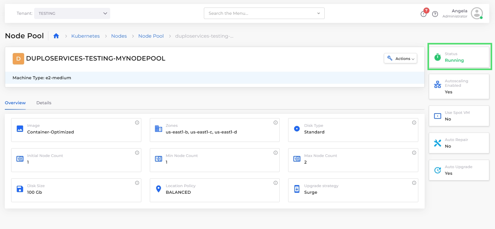

# Step 3: Create a Node Pool

A Node Pool is a group of Compute Engine VM instances within a GKE cluster that have the same configuration and provide the compute resources for running Kubernetes workloads. Node Pools allow you to customize and manage subsets of nodes within your GKE cluster to meet the requirements of your applications.

_Estimated time to complete Step 3: 10 minutes._

## Prerequisites

Before creating a Service, verify that you accomplished the tasks in the previous tutorial steps. Using the DuploCloud Portal, confirm that:

* An [Infrastructure and Plan](../step-1-infrastructure.md) exist, both with the name that you chose.
* The Infrastructure has [GKE **Enabled**](../step-1-infrastructure.md).
* A Tenant with the [name you chose has been created](../step-2-tenant.md).

### Select the Tenant you created

In the **Tenant** list box, on the upper-left side of the DuploCloud Portal, select the Tenant that you created.

## Creating a Node Pool

1. From the DuploCloud portal, navigate to **Kubernetes** -> **Node Pools**.&#x20;
2. Click on the **Node Pool** tab and then click **Add**. The **Add Node Pool** page displays.

<figure><figcaption>
The <strong>Add Node Pool</strong> page
</figcaption></figure>

3. In the **Name** field, enter a unique name for your GCE Virtual Machine.&#x20;
4. Complete the following fields:
   * **Initial Node Count (per AZ)**: **1**
   * **Min Node Count (per AZ)**: **1**.
   * **Max Node Count (per AZ)**: 2
5. Accept the default values for all remaining fields, and click **Create**.&#x20;

## Checking your work

1. Navigate to **Kubernetes** -> **Nodes**, and click on the **Node Pool** tab.
2. Click on the name of the **Node Pool** that you created.&#x20;
3. Verify that the **Status** is **Running**.

<figure><figcaption>
The details page for <strong>mynodepool</strong> Node Pool with <strong>Status Running</strong>. 
</figcaption></figure>

## Advanced node pool functions

For more advanced node pool functions, see the [DuploCloud node pool documentation](../../gcp-services/node-pools.md).&#x20;
