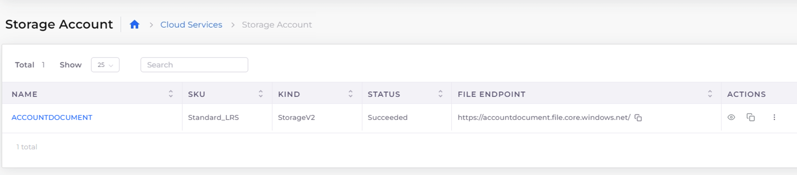

# Storage Account

DuploCloud Azure Portal provides the ability to create Storage Accounts, File Shares, and generate Shared Access Signatures (SAS). Storage Accounts with a SKU Type `Standard_LRS` are created. Users can view additional details of File Share endpoints from the Portal.

## Creating a Storage Account

Navigate to **Cloud Services** -> **Storage Account** to create Storage Account.

Provide unique name to create Storage Account.

## Adding a Data Storage Source (**Container, File Share, Queue, Table, Private Endpoint, Alerts**)

1. Navigate to **Cloud Services** -> **Storage Account**&#x20;
2. **From the NAME column, select the Storage Account where you want to add a data source.**
3. Select the tab for the type of data storage you want to add (**Container, File Share, Queue, Table, Private Endpoint, Alerts**). Click Add.
4. Enter a name for your data source, and additional information, if needed. Click **Add**/**Submit**/**Create**. The data storage source is added to the Storage Account. &#x20;

<figure><figcaption>
The <strong>Container</strong> tab on the <strong>Storage Accoun</strong>t page
</figcaption></figure>

## Viewing a Storage Account

You can view Storage Account Details once created. You can view Endpoint details in the Storage Account table view.\
Click on the  icons under the Actions Column to view and copy the keys of the Storage Account.

<figure><figcaption></figcaption></figure>

## Generate Shared Access Signature (SAS)

Click on **Actions** -> **Shared Access Signature**. Provide access details in the screen below. Review and generate Shared Access Signature(SAS) tokens.

Once Signature Tokens are generated, Azure user can copy paste the token and URL's in a secure location. They'll only be displayed once and cannot be retrieved once the window is closed.

## Block Public Access to Storage Accounts

You can configure the **Tenant** to block public network access to **Storage Accounts.**

1. From the DuploCloud Portal navigation, select **Administrator** -> **Tenants**.&#x20;
2. Select your **Tenant** name from the list.&#x20;
3. In the **Settings** tab, click **Add**. The **Add Tenant Feature** pane displays.&#x20;
4. From the **Select Feature** item list, select **Other**.&#x20;
5.  In the **Configuration** field, enter **block\_public\_network\_to\_azure\_storage**. \

    

    <figure><figcaption>
The <strong>Update Tenant Feature</strong> window filled to block public access to Azure <strong>Storage Accounts.</strong> 
</figcaption></figure>

    

6. In the empty field, enter "**True**".&#x20;
7.  Click **Add**. Public access to storage accounts is blocked. \

    

    <figure><figcaption>
The <strong>Settings</strong> tab showing public access to <strong>Storage Accounts</strong> blocked.
</figcaption></figure>

    

## Create a Private Endpoint

Private endpoints let you access your Azure services over a private IP address within your virtual network, effectively securing the connection and ensuring that traffic does not go over the public internet. See the Microsoft documentation to learn more about private endpoints for Storage Accounts.

Configure a private endpoint in the DuploCloud Portal:

1. From the DuploCloud Portal, navigate to **Cloud Services** -> **Storage Account**.
2. From the **NAME** column, select your Storage Account.&#x20;
3.  Select the **Private Endpoint** tab, and click **Add**. The **Add Private Endpoint** pane displays.\

    

    <figure><figcaption>
The <strong>Add Private Endpoint</strong> pane in the DuploCloud Portal
</figcaption></figure>

    

4. Enter a name for the endpoint in the **Name** field.&#x20;
5. From the **Subnet** item list, select your subnet.&#x20;
6. From the **Storage Type** item list, select your storage type (**Blob** or **File**).
7. Click **Submit**. The private endpoint is created.&#x20;
