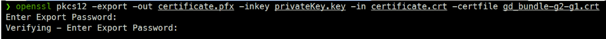
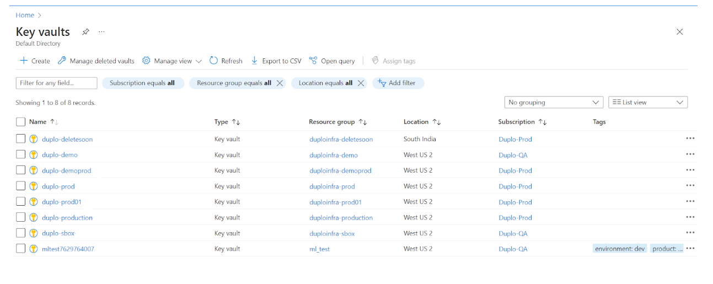
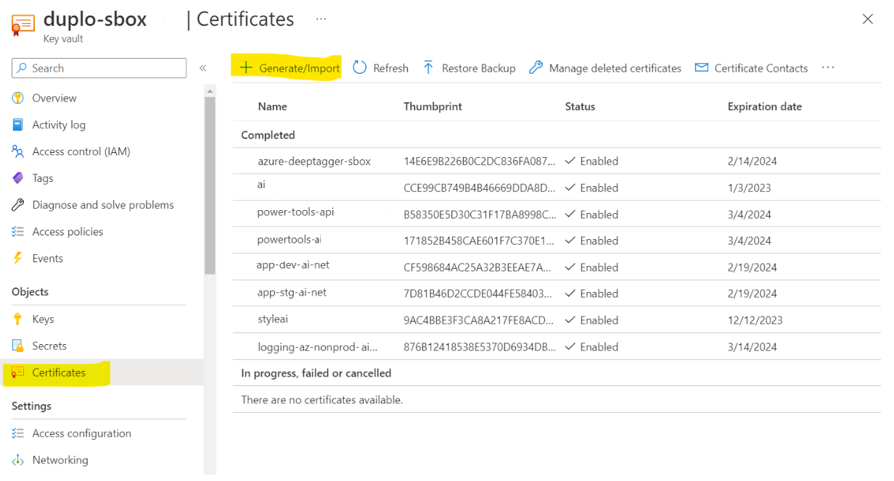
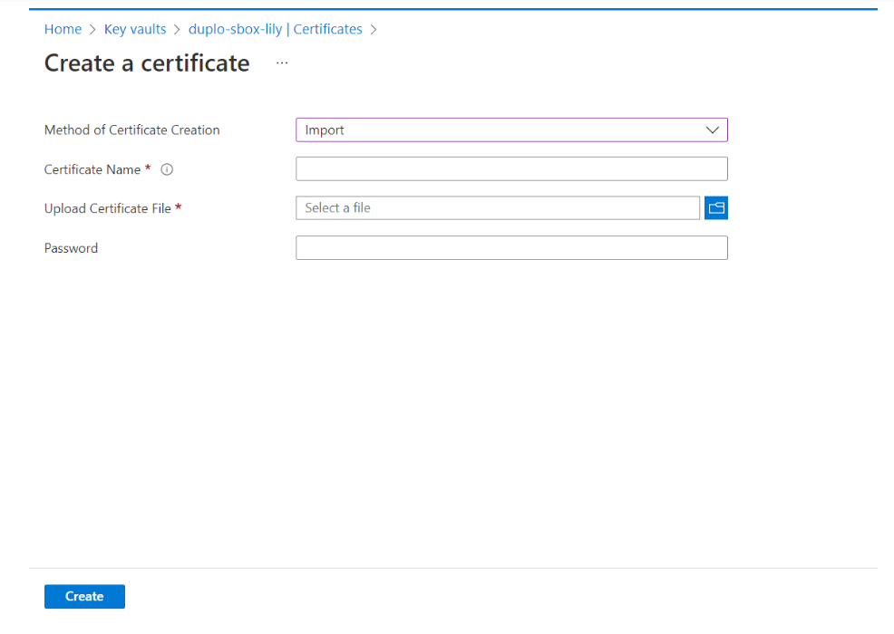
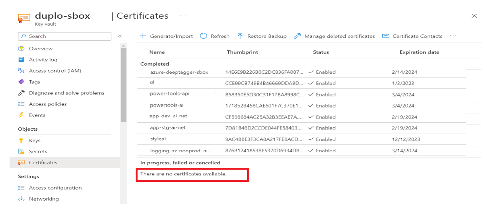
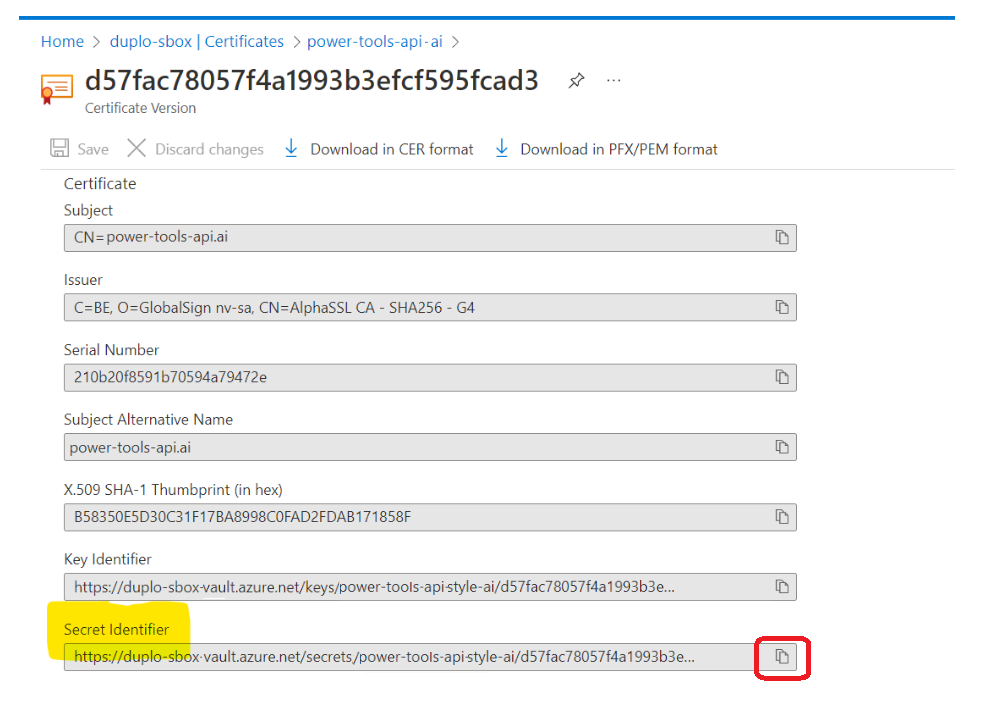
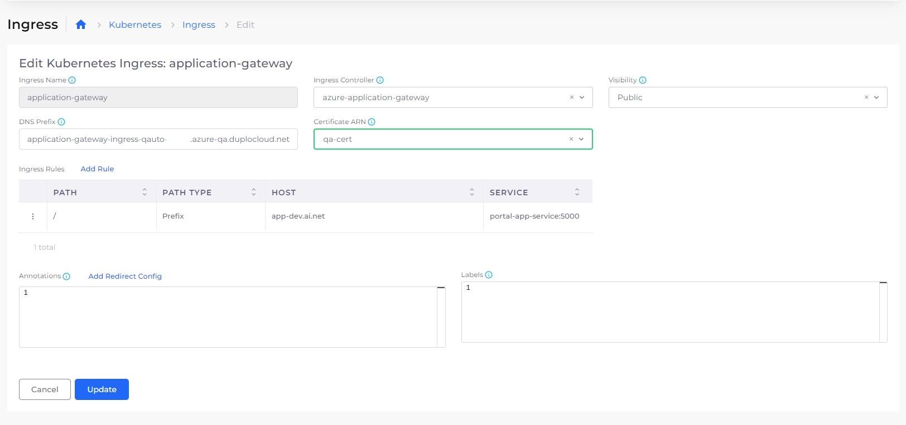

# Import SSL Certificates

Establish secure access to the DuploCloud portal by importing SSL certificates and configuring them within DuploCloud.


If you haven't already done so, contact the DuploCloud support staff via email or by using your private Slack channel. They will provide you with everything you need to accomplish this task and assist you with other needed prerequisites to set up DuploCloud for Azure.


## Prerequisites

* **Contact DuploCloud support**: Contact DuploCloud staff via email or your private Slack channel to request the following for SSL certificate setup and configuration:&#x20;
  * Security Certificate (`.crt`) file&#x20;
  * Certificate Private Key
  * Certificate Bundle (`.crt`) containing the Intermediate and Root Certificates. You can download the Certificate Bundle from [https://support.globalsign.com/ca-certificates/intermediate-certificates/alphassl-intermediate-certificates](https://support.globalsign.com/ca-certificates/intermediate-certificates/alphassl-intermediate-certificates).

## 1. Generating the PFX File

Because Azure supports only PFX files for SSL certificates, you must convert the CRT file that DuploCloud provides you to PFX format.

To do this, enter the following using the command line:

```bash
openssl pkcs12 -export -out certificate.pfx -inkey <CERTIFICATE_PRIVATE_KEY>.key -in <SECURITY_CERTIFICATE_FILE>.crt -certfile <CERTIFICATE_BUNDLE>.crt

```


When running this command, you will be prompted to create a password. Save it securely; you'll need it when importing the certificate to Azure KeyVault.


<figure><figcaption><p>Password prompt when converting CRT file to PFX format</p></figcaption></figure>

## 2. Importing SSL Certificates to Azure Key Vault

After you generate the PFX file, import it to Azure Key Vault:

1. Sign in to the Azure Portal and access Azure Key Vault.&#x20;
2.  Select the respective Azure Key Vault for your environment (for example, production versus test) to import the PFX file as shown below.\


    <div align="left"><figure><figcaption><p>Azure Key Vaults in the Azure Portal</p></figcaption></figure></div>
3.  In Azure Key Vault, navigate to **Objects** -> **Certificates**.\


    <div align="left"><figure><figcaption><p><strong>Generate/Import</strong> option in Azure Key Vault</p></figcaption></figure></div>
4. Click **Generate/Import**. The **Create a Certificate** form displays.&#x20;
5. In the **Method of Certificate Creation** field, select **Import**.
6. Name the Certificate in the **Certificate Name** field.
7. Upload the PFX file using the **Upload Certificate File** field.
8.  In the **Password** field, enter the password you set when you [generated the PFX file](import-ssl-certificates.md#id-1.-generating-the-pfx-file).\


    <div align="left"><figure><figcaption><p><strong>Create a Certificate</strong> form in Azure Key Vault</p></figcaption></figure></div>
9.  Click **Create**. The certificate is created, but not yet available for use, as indicated by the message: **There are no certificates available** message. In the remaining steps, we will complete the import by copying the certificate’s Secret Identifier ARN and configuring it in DuploCloud.\


    <div align="left"><figure><figcaption><p><strong>There are no certificates available</strong> message in Azure Key Vault</p></figcaption></figure></div>
10. On the **Certificates** page, select the certificate and open its **current version**.\


    <div align="left"><figure><figcaption><p>CURRENT VERSION of certificate </p></figcaption></figure></div>
11. Copy the **Secret Identifier** using the Copy Icon (.png>)). You will paste it when you [configure the certificate in DuploCloud](import-ssl-certificates.md#configuring-the-certificate-in-duplocloud) in the next step.

<figure><figcaption><p><strong>Certificate Version</strong> form with <strong>Secret Identifier</strong> field and copy icon highlighted</p></figcaption></figure>

## 3. Configuring the SSL Certificate in DuploCloud

With the Secret Identifier copied to your clipboard, you are ready to configure the certificate in the DuploCloud Portal:

1. In the DuploCloud Portal, navigate to **Administrator** -> **Plans**.
2. Select the Plan to which you want to add the certificate from the **NAME** column. The **Plan** details page displays.
3.  Select the **Certificates** tab.\


    <figure><figcaption><p><strong>Certificates</strong> tab on the <strong>Plan</strong> page</p></figcaption></figure>
4.  Click **Add**. The **Add a Certificate** pane displays.\


    <div align="left"><figure><figcaption><p><strong>Add a Certificate</strong> pane</p></figcaption></figure></div>
5. Enter a **Name** for the certificate.
6. Paste the Secret Identifier you copied from the Azure Portal into the **Certificate ARN** field.
7. Click **Create**.&#x20;

## 4. Using the SSL Certificate for Ingress in DuploCloud (Optional)

Before attaching SSL certificates to a Kubernetes Ingress resource in DuploCloud, ensure an [Azure Application Gateway](../../kubernetes-overview/ingress-loadbalancer/aks-ingress/using-an-azure-application-gateway-ssl-policy-with-ingress.md) is already created and configured.

Once the Application Gateway is set up, you can attach the certificate to an Ingress resource:

1. In the DuploCloud Portal, navigate to **Kubernetes** -> **Ingress**.
2. Locate the Ingress associated with the Azure Application Gateway. Click the menu icon () on that row and select **Edit**. The **Edit Kubernetes Ingress** pane displays.&#x20;
3. Select the certificate from the **Certificate ARN** dropdown.

<figure><figcaption></figcaption></figure>

5. Click **Update**.

The SSL certificate is now attached to the Ingress and will be used by the Application Gateway for HTTPS traffic.
