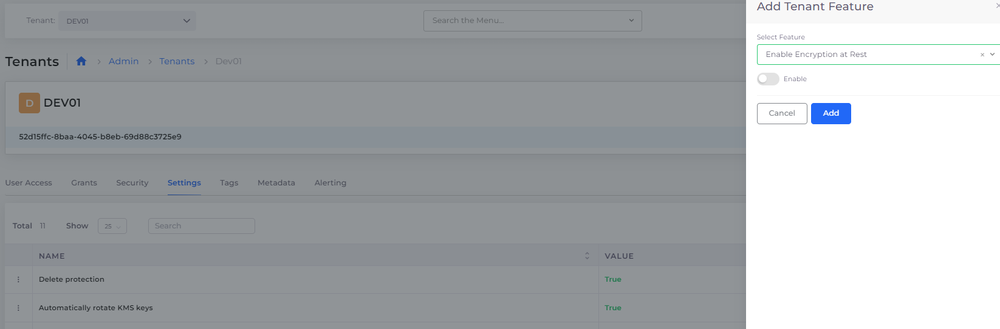

# Tenant Security Settings

## Configuring Security settings at the Tenant Level

Configure these settings (properties) by navigating to **Administrator** -> **Tenants** in the DuploCloud Portal. Select the Tenant for which you want to configure the settings listed below and click the **Settings** tab. The Tenant Feature Properties are listed in the **Name** column in the **Settings** tab.

To edit or remove an existing property, click the menu () icon to the left of the property **Name** and select **Edit Setting** or **Remove Setting**. To add any of these settings, click **Add.** Select and **Enable** the feature using the **Add Tenant Feature** pane.

<figure><figcaption>
<strong>Add Tenant Feature</strong> pane for configuring Tenant settings
</figcaption></figure>

### Tenant Security Settings

| Setting Name                                                    | Description                                                                                                |
| --------------------------------------------------------------- | ---------------------------------------------------------------------------------------------------------- |
| **Enable Azure MSSQL Server Audit**                             | Enables the SQL Server audit feature in Azure.                                                             |
| **Enable Azure MSSQL Database Audit**                           | Enables the SQL Database audit feature in Azure.                                                           |
| **Enable Azure MSSQL Transparent Data Encryption (TDE)**        | Encrypts data at rest in Azure MSSQL databases to protect sensitive information.                           |
| **enable\_sqlserver\_defender**                                 | Enables SQLServer Cloud Defender.                                                                          |
| **Enable Azure MSSQL SQL Server Vulnerability Settings**        | Configures security settings to mitigate vulnerabilities in Azure MSSQL SQL Server.                        |
| **Enable Azure MSSQL SQL Database Vulnerability Settings**      | Applies security measures to minimize risks and vulnerabilities in Azure MSSQL SQL Databases.              |
| **Enable Azure VM Antimalware Extension**                       | Enables antimalware protection on Azure Virtual Machines to safeguard against malicious software.          |
| **Enable Azure VM Qualys Extension**                            | Enables the Qualys vulnerability management extension on Azure VMs for continuous security scanning.       |
| **Enable Azure VM Dependency Agent Extension**                  | Enables the Dependency Agent to monitor and track the dependencies between Azure VMs and other resources.  |
| **Enable Azure VM Diagnostic Agent Extension**                  | Enables the Diagnostic Agent to collect monitoring data and troubleshoot issues on Azure Virtual Machines. |
| **Enable Azure Storage Account Secure Transfer**                | Enables Azure Storage Account Secure transfer.                                                             |
| **Allow Public Network Access for Databases and Cache Servers** | Permits public network access to Azure databases and cache servers for external connections.               |
| **block\_public\_network\_to\_azure\_storage**                  | Restricts public network access to Azure Storage                                                           |
| **disable\_public\_lb**                                         | Restricts public network access to Azure Application Gateway                                               |

