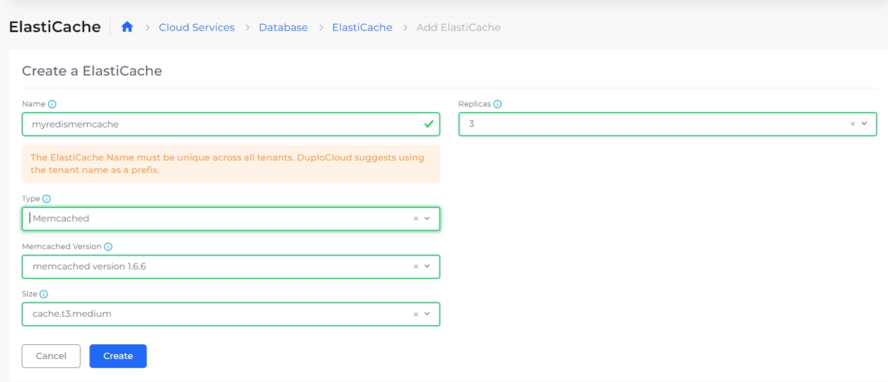

# AWS ElastiCache

[Amazon ElastiCache](https://aws.amazon.com/elasticache/features/) is a serverless caching service delivering real-time, cost-optimized performance for modern applications. DuploCloud supports Memcached, Redis, and Valkey ElastiCache instances.

## Creating a Memcached ElastiCache Instance

1. In the DuploCloud Portal, navigate to **Cloud Services** -> **Database.**
2.  Select the **ElastiCache** tab, and click **Add**. The **Create a ElastiCache** page displays.\

    
<figure><figcaption>
The <strong>Create an ElastiCache</strong> page in the DuploCloud Portal
</figcaption></figure>

3. Enter a database **Name**.
4. Specify the number of **Replicas**.&#x20;
5. In the **Type** list box, select **Memcached.**
6. Select the **Memcached Version**.&#x20;
7. Select the node size in the **Size** list box.
8. Click **Create**. The Memcached ElastiCache instance is created.


Pass the cache endpoint to your application through the [Environment Variables](../containers/passing-config-and-secrets.md) via the AWS Service.


## Creating a Redis or Valkey ElastiCache Instance

1. In the DuploCloud Portal, navigate to **Cloud Services** -> **Database**.
2. Select the **ElastiCache** tab, and click **Add**. The **Create an ElastiCache** page displays.

<figure><figcaption>
The <strong>Create</strong> <strong>an ElastiCache</strong> page in the DuploCloud Portal
</figcaption></figure>

3. Enter a database **Name**.
4. Specify the number of **Replicas**.
5. Optionally, enable **Automatic Failover**: if the primary node in the cluster fails, one of the read replicas is automatically promoted. This setting requires at least two replicas.
6. Optionally, enable **Cluster Mode** and specify the **No Of Shards**.&#x20;
7. In the **Type** field, select **Redis** or **Valkey**.
8. In the **Size** list box, select the node size.
9. Optionally, complete the following fields:
   * **Redis Version** or **Valkey Version**: Select the version number of the cache engine to be used. If not set, defaults to the latest version.
   * **Parameter Group Name**: Specify the name of the parameter group to associate with this cache cluster.
   * **KMS**: Select the KMS key.
   * **Encryption At Transit**: Select if Encryption At Transit is needed.
10. Optionally, complete the snapshot fields to configure backup:&#x20;
    * **Snapshot Name:** Select the snapshot/backup you want to use for creating Redis/Valkey.
    * **Snapshot ARNs**: Specify the ARN of a Redis RDB snapshot file stored in Amazon S3. Example- `arn:aws:s3:::s3-backup-foldername/backupobject.rdb`
    * **Snapshot Retention Limit:** Specify retention limit in days. Accepted values - 1-35.
    * **Snapshot Window Start Time**: The time when your automated snapshot process will begin.
    * **Snapshot Window Duration in hours**: The length of time allowed for taking the snapshots automatically.

<figure><figcaption>
The Snapshot fields on the <strong>Create an ElastiCache</strong> pane
</figcaption></figure>

11. Optionally, click the **CloudWatch** link above the **Log Delivery Configuration** field to enable exporting engine logs and slow logs to Amazon CloudWatch Logs.&#x20;
    * Complete the fields to configure CloudWatch:&#x20;
      * **Log Format**&#x20;
      * **Log Type**&#x20;
      * **Log Group**
    * Click **Add Config**. The configuration is added to the **Log Delivery Configuration** field.

<figure><figcaption>
The <strong>Add CloudWatch Logs: Log Delivery Configuration</strong> pane
</figcaption></figure>

12. Click **Create**. The Redis or Valkey database instance is created.

## Creating an ElastiCache Global Datastore

DuploCloud supports ElastiCache Global Datastores, which allow you to replicate a Redis cluster across AWS regions.&#x20;

### Creating a Global Datastore

When you create a Global Datastore in DuploCloud, a primary Redis cluster, in the current Tenant, and a secondary cluster in a different region are created automatically as part of the process. You can then add additional secondary clusters in other regions as necessary.

1. Navigate to to **Cloud Services** → **Database** → **ElastiCache** → **Global Datastores**.
2.  Click **Add**. The **Create a Global Datastore** pane displays.\

    
<figure><figcaption>
<strong>Create a Global Datastore</strong> pane 
</figcaption></figure>

3. Complete the fields, as required for your configuration:

<table data-header-hidden><thead><tr><th width="218.22222900390625"></th><th></th></tr></thead><tbody><tr><td><strong>Name</strong></td><td>Enter a unique name for the datastore. We recommend using the Tenant name as a prefix.</td></tr><tr><td><strong>Redis Version</strong></td><td>Select the Redis version to deploy.</td></tr><tr><td><strong>Size</strong></td><td>Select a node size. Only Large or larger nodes are supported, and burstable types (t-class) are not allowed.</td></tr><tr><td><strong>Global Replication Group</strong></td><td>Enter a name for the replication group.</td></tr><tr><td><strong>Global Replication Group Description</strong></td><td>Optionally, enter a description for the replication group.</td></tr><tr><td><strong>Secondary Cluster Region</strong></td><td>Select the Tenant/region where you want the secondary cluster to reside.</td></tr><tr><td><strong>Log Delivery Configuration</strong>  </td><td>Configure a log destination to capture Redis logs for monitoring and troubleshooting.</td></tr><tr><td><strong>Parameter Group Name</strong></td><td>Select the parameter group name for log delivery.</td></tr><tr><td><strong>Replicas</strong></td><td>Enter the number of replicas.</td></tr><tr><td><strong>No of Shards</strong></td><td>Specify the number of shards for the cluster.</td></tr><tr><td><strong>KMS (Optional)</strong></td><td>Select a KMS key to enable server-side encryption for the Global Datastore.</td></tr><tr><td><strong>Encryption in Transit</strong></td><td>
Enable or disable in-transit encryption.
<ul><li>When enabled, enter the password clients will use to authenticate to the cluster in the <strong>Auth Token (Optional)</strong> field.</li></ul></td></tr><tr><td><strong>Secondary Cluster KMS</strong></td><td>Select a KMS key to enable server-side encryption for any secondary clusters you add.</td></tr><tr><td><strong>Snapshot Retention Limit</strong></td><td>Enter retention period in days.</td></tr><tr><td><strong>Snapshot Window Start Time</strong></td><td>Enter the start time for the snapshot window.</td></tr><tr><td><strong>Snapshot Window Duration in Hours</strong></td><td>Enter the duration of the snapshot window in hours.</td></tr></tbody></table>

5. Click **Create** to provision the ElastiCache Global Datastore.

### Adding Regional Clusters

After creating a Global Datastore, you can add secondary clusters (regional clusters) to replicate the primary Redis cluster across other AWS regions.

1. Navigate to **Cloud Services** → **Databases** → **ElastiCache** → **Global Datastores**.
2. Select the **Regional Clusters** tab.
3.  Click **Add**. The **Add Secondary Cluster** pane displays.\

    
<figure><figcaption>
<strong>Add Secondary Cluster</strong> pane
</figcaption></figure>

4. Complete the following fields:

<table data-header-hidden><thead><tr><th width="177.3333740234375"></th><th></th></tr></thead><tbody><tr><td><strong>Name</strong></td><td>Enter a unique name for the secondary cluster.</td></tr><tr><td><strong>Description</strong></td><td>Optionally, enter a description for the cluster.</td></tr><tr><td><strong>Tenant</strong></td><td>Select the Tenant that will own this secondary cluster.</td></tr><tr><td><strong>KMS</strong> (Optional)</td><td>If a KMS key was selected when creating the Global Datastore, select the same KMS key to enable server-side encryption for the secondary cluster.</td></tr><tr><td><strong>Auth Token</strong> (Optional)</td><td>If a KMS key was selected when creating the Global Datastore, enter the authentication token for client connections.</td></tr></tbody></table>

5. Click **Create** to provision the secondary cluster.


Each regional cluster added becomes a read replica of the primary Redis cluster. You can retrieve the primary or secondary cluster endpoint directly from the **Redis Cluster** tab to connect your application.


### Viewing Cluster Details

To view cluster details, including connection endpoints for a Global Datastore:

1. Navigate to **Cloud Services** → **Database** → **ElastiCache** → **Global Datastores**.
2. Select the name of the Global Datastore.
3. Select the **Regional Clusters** tab. A list of clusters in the Global Datastore displays.
4. Click the name of the cluster you want to view details for.
5. Use the tabs to explore cluster details:&#x20;

<table data-header-hidden><thead><tr><th width="143.77777099609375">Tab</th><th>Description</th></tr></thead><tbody><tr><td><strong>Redis Cluster</strong></td><td>Displays cluster details, including the endpoint. </td></tr><tr><td><strong>Details</strong></td><td>Shows a JSON representation of the cluster configuration and status.</td></tr><tr><td><strong>Alerts</strong></td><td>Displays any alerts related to the cluster.</td></tr><tr><td><strong>Snapshots</strong></td><td>Lists available snapshots and backup information for the cluster.</td></tr></tbody></table>


Each cluster provides a single endpoint. The primary endpoint handles **write operations**, and the secondary endpoint handles **read operations**.&#x20;


<figure><figcaption>
Cluster detail page with <strong>Redis Cluster</strong>, <strong>Details</strong>, <strong>Alerts</strong>, and <strong>Snapshots</strong> tabs.
</figcaption></figure>

### Removing Clusters

To remove a cluster from a Global Datastore:

1. Navigate to **Cloud Services** → **Database** → **ElastiCache** → **Global Datastores**.
2. Select the name of the Global Datastore.
3. Select the **Regional Clusters** tab
4. Click the menu icon () in the row of the cluster you want to remove.
5. Select **Remove**.


**Important:**

* Secondary clusters must be removed **before** the primary cluster.
* Once all secondary clusters are removed, the primary cluster can be removed.
* Any removed cluster becomes a **standalone cluster**.


## Troubleshooting Redis Connection Issues in AWS

When a Redis instance in an AWS environment is experiencing connection issues, ensure the Security Group (SG) configuration allows VPN traffic to port `6379`. Then, using the `nc` command, verify the Redis instance's accessibility.

If you encounter local DNS resolution problems, consider changing your DNS provider or connecting directly using the Redis instance's IP address, which can be obtained via the `dig` command.&#x20;

For persistent DNS issues, resetting your router or using external DNS query tools may help. If other troubleshooting steps fail, exploring [AWS network interfaces](https://docs.aws.amazon.com/AWSEC2/latest/UserGuide/using-eni.html) can offer additional insights.
