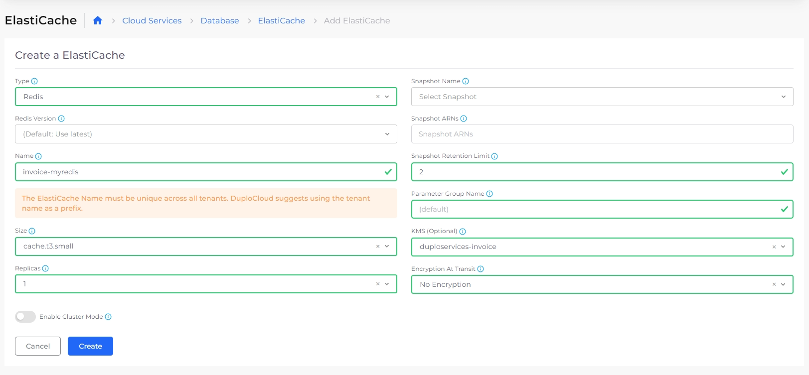

# Amazon ElastiCache

[Amazon ElastiCache](https://aws.amazon.com/elasticache/features/) is a serverless, Redis- and Memcached-compatible caching service delivering real-time, cost-optimized performance for modern applications.

## Creating an ElastiCache in the DuploCloud Portal

1. In the DuploCloud Portal, navigate to **Cloud Services** -> **Database.**
2. Click the **ElastiCache** tab.
3. Click **Add**. The **Create a ElastiCache** page displays.
4. Select the ElastiCache **Type** and complete the required fields based on your type selection.
5. Optionally, select **Enable Cluster Mode** to scale the ElastiCache instance for performance.
6. Click **Create**.

<figure><figcaption>
<strong>Create an ElastiCache</strong> page in the DuploCloud Portal
</figcaption></figure>


Pass the cache endpoint to your application through the [Environment Variables](../containers/passing-config-and-secrets.md) via the AWS Service.


### Troubleshooting Redis Connection Issues in the AWS Environment

When a Redis instance in an AWS environment is experiencing connection issues, ensure the Security Group (SG) configuration allows VPN traffic to port `6379`. Then, using the `nc` command, verify the Redis instance's accessibility.

If you encounter local DNS resolution problems, consider changing your DNS provider or connecting directly using the Redis instance's IP address, which can be obtained via the `dig` command.&#x20;

For persistent DNS issues, resetting your router or using external DNS query tools may help. If other troubleshooting steps fail, exploring [AWS network interfaces](https://docs.aws.amazon.com/AWSEC2/latest/UserGuide/using-eni.html) can offer additional insights.
